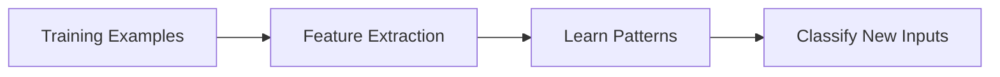
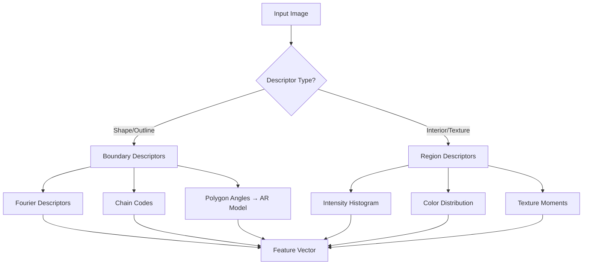
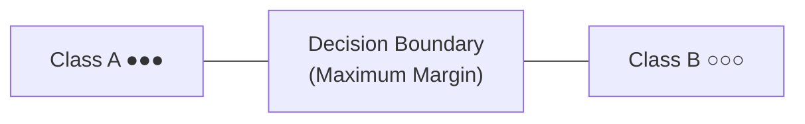
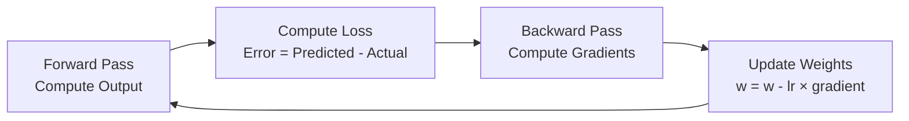
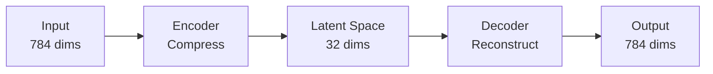
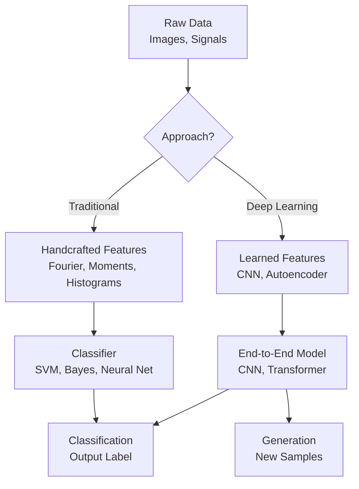

# Lecture 01: Introduction to Artificial Intelligence

**Course**: AI for Industrial Cyber-Physical Systems (AI4ICPS) — IIT Kharagpur  
**Duration**: 1:16:14  
**Source**: ai4icps-upskilling.in  

---

## Overview

This introductory lecture covers the fundamental concepts of AI — from how natural intelligence inspires machine learning, through classical feature extraction and classifiers, to modern deep neural networks and generative models.

---

## 1. Natural Intelligence & Pattern Recognition `[0:00 – 3:00]`

The lecture begins by drawing parallels between human learning and machine learning.

**Key idea**: Humans learn to classify objects (letter A, letter B) through repeated examples — seeing many variations of 'A' until we internalize the abstract pattern. Machine learning does the same thing with data.



> **Jargon**: *Pattern Recognition* — The field of detecting regularities/structures in data and using them to categorize new, unseen inputs.

---

## 2. Feature Vectors & Descriptors `[3:00 – 12:00]`

### 2.1 What is a Feature Vector? `[4:46 – 7:00]`

A **feature vector** is a numerical representation of an object — think of it as converting an image/signal into a list of numbers that a computer can compare.

| Concept | Meaning | Example |
|---------|---------|---------|
| Feature | A measurable property | Edge count, color histogram |
| Feature Vector | Array of features | `[0.3, 0.8, 0.1, ...]` |
| Feature Space | N-dimensional space where vectors live | 2D plot of height vs. width |

> **Math Note**: A feature vector **x** ∈ ℝⁿ means a vector with *n* real-valued components. Each component is one measured property of the input.

### 2.2 Types of Descriptors `[7:00 – 12:00]`

**Boundary descriptors** — describe the *outline/shape* of an object:
- Fourier Descriptors
- Chain Codes
- Polygon Approximation + Autoregressive Model

**Region descriptors** — describe the *interior* of an object:
- Intensity histograms
- Color distributions (R, G, B planes)
- Texture features

> **Jargon**: *Fourier Descriptors* — Represent a 2D shape boundary as a sum of sine/cosine waves at different frequencies. Low frequencies capture the coarse overall shape; high frequencies capture fine detail and noise. By keeping only the first *k* frequency components, you get a compact shape representation that's also robust to noise. Two similar shapes will have similar Fourier coefficients.

> **Jargon**: *Chain Code* — A way to encode a boundary by recording the direction you move at each pixel step as you trace the outline. Using 4-connectivity (up/down/left/right) or 8-connectivity (including diagonals), the boundary becomes a sequence like `[0, 0, 7, 6, 6, 5, ...]` where each number is a direction. Compact representation of shape boundaries.

> **Jargon**: *Polygon Approximation* — Simplifying a curved boundary into a polygon (sequence of straight-line segments). Algorithms like Ramer-Douglas-Peucker reduce a complex boundary to its essential vertices. The internal angles of this polygon then serve as a shape descriptor.



The lecture uses the example of distinguishing a horse from a zebra — boundary alone isn't enough (similar silhouettes), but adding region features (zebra has black/white stripes, horse doesn't) makes classification possible.

---

## 3. Autoregressive Model on Boundary Shape `[10:00 – 15:00]`

### 3.1 Polygon Internal Angles as a Sequence `[10:00 – 11:30]`

Given a curved boundary:
1. Approximate it with a polygon (n vertices)
2. Measure internal angles: α₁, α₂, α₃, ..., αₙ (scanned clockwise or anticlockwise)
3. Treat this angle sequence as a "time series"

### 3.2 The Autoregressive (AR) Model `[11:18 – 12:30]`

Fit a **p-th order autoregressive model** to the angle sequence:

$$\alpha_i = \sum_{k=1}^{p} \beta_k \cdot \alpha_{i-k}$$

```python
# Pseudocode: predict angle[i] from previous p angles
angle[i] = beta[1]*angle[i-1] + beta[2]*angle[i-2] + ... + beta[p]*angle[i-p]
```

> *Reads as*: "Each angle equals a weighted combination of the *p* angles that came before it. The weights (betas) are what we solve for — they become the feature vector."

> *Example*: If p=2 and angles = [120°, 90°, 135°, 110°, ...], and we learn β₁=0.6, β₂=0.3:  
> angle[3] = 0.6 × 135° + 0.3 × 90° = 81° + 27° = 108° (predicted)

Each angle αᵢ is predicted as a linear combination of the *p* previous angles. This gives *n* equations (one per vertex), solved simultaneously for the *p* coefficients β₁, β₂, ..., βₚ.

**These AR coefficients become the feature vector** — different shapes produce different coefficients.

> **Jargon**: *Autoregressive (AR) Model* — A model where each value in a sequence is predicted from a weighted sum of previous values. "Auto" = self, "regressive" = predicting from past. Common in time-series, speech processing, and here creatively applied to shape sequences. The order *p* controls how many past values influence the prediction.

> **Math Note**: This is NOT polynomial regression (y = β₀ + β₁x + ...). The key difference: in an AR model, the inputs are *previous values of the same sequence* (α_{i-1}, α_{i-2}, ...), not independent x values. It captures sequential dependencies — how one angle relates to those before it.

### 3.3 Adding Statistical Moments `[12:34 – 15:15]`

For finer detail, each polygon segment is also analyzed:
1. Normalize the curved segment between two polygon vertices so area under it = 1
2. This turns it into a probability density function P(R) vs R
3. Compute statistical moments of this distribution:

| Moment Order | Name | What It Captures |
|-------------|------|-----------------|
| 2nd | Variance | Spread of the curve deviation |
| 3rd | Skewness | Left/right asymmetry of the curve |
| 4th | Kurtosis | How peaked or flat the curve is |

The final feature vector concatenates AR coefficients + statistical moments → a richer shape descriptor.

> **Jargon**: *Statistical Moments* — Numerical summaries of a distribution's shape. The mean (1st moment) is the center, variance (2nd) is the spread, skewness (3rd) tells you if it leans left or right, kurtosis (4th) tells you if it's pointy or flat compared to a Gaussian. Higher moments capture increasingly fine shape details.

> **Jargon**: *Zernike Moments* — A set of orthogonal moments computed over a circular region, used as rotation-invariant shape descriptors. Unlike raw statistical moments, they're designed so that rotating the object doesn't change the descriptor values (important for recognizing rotated objects).

---

## 4. Region Descriptors: Histograms & Statistical Moments `[15:17 – 20:00]`

For region-based features (what's *inside* the boundary):

### 4.1 Intensity Histogram as PDF `[15:22 – 16:30]`

1. Compute the intensity histogram of the grayscale image
2. Normalize it (all bins sum to 1) → it becomes a probability density function
3. Extract statistical moments from this PDF → these are the region features

### 4.2 Color Features `[16:15 – 17:00]`

Color images have 3 channels (R, G, B). Compute separate histograms for each channel → 3× more features.

### 4.3 Moments as Features

| Moment | What It Tells You | Shape Intuition |
|--------|-------------------|-----------------|
| Mean (μ) | Average brightness | Center of the histogram |
| Variance (σ²) | Contrast/spread | How wide the histogram is |
| Skewness | Asymmetry | Does it lean left or right? |
| Kurtosis | Peakedness | Sharp peak or flat top? |

> **Jargon**: *Probability Density Function (PDF)* — A function where the area under any interval gives the probability of a value falling in that range. Total area = 1. When we normalize a histogram (divide by total count), we turn raw frequencies into probabilities — same shape, but now it's a proper PDF we can compute moments from.

---

## 5. Distance Metrics & Similarity `[20:00 – 25:00]`

To classify, you need to measure how "close" two feature vectors are:

- **Euclidean distance**: $d = \sqrt{\sum_{i=1}^n (x_i - y_i)^2}$ — straight-line distance
- **Manhattan distance**: $d = \sum_{i=1}^n |x_i - y_i|$ — grid-walking distance
- **Mahalanobis distance**: Accounts for correlations between features (scales by covariance)

```python
# Pseudocode
euclidean  = sqrt(sum((x[i] - y[i])**2 for i in range(n)))
manhattan  = sum(abs(x[i] - y[i]) for i in range(n))
```

> *Reads as*: "Euclidean = square root of summed squared differences (Pythagoras in N dimensions). Manhattan = sum of absolute differences (like counting city blocks)."

> *Example*: x = [3, 4], y = [0, 0]  
> Euclidean = √(9 + 16) = √25 = 5  
> Manhattan = |3| + |4| = 7

**Principle**: If the distance between two feature vectors is *small*, they belong to the same class; if *large*, different classes.

> **Jargon**: *Mahalanobis Distance* — A distance measure that accounts for correlations in the data. Unlike Euclidean distance (which treats all dimensions equally), it scales by how spread out data is in each direction. Think of it as measuring distance in "standard deviations" rather than raw units.

---

## 6. Classical Classifiers `[25:00 – 32:00]`

### 6.1 Bayesian Classifier `[6:44 – 7:00]` (concept) / `[25:00 – 32:00]` (detail)

Uses Bayes' theorem to assign class labels:

$$P(\text{class} | \mathbf{x}) = \frac{P(\mathbf{x} | \text{class}) \cdot P(\text{class})}{P(\mathbf{x})}$$

```python
# Pseudocode
posterior = (likelihood * prior) / evidence
# i.e.
prob_bird_given_x = (prob_x_given_bird * prob_bird) / prob_x
prob_dog_given_x  = (prob_x_given_dog  * prob_dog)  / prob_x
predicted_class = "bird" if prob_bird_given_x > prob_dog_given_x else "dog"
```

> *Reads as*: "The probability that this object is a bird, given its features x, equals: how likely these features are IF it's a bird × how common birds are overall ÷ how likely these features are in general."

Classify by picking the class with highest posterior probability.

> **Jargon**: *Bayes' Theorem* — A formula for updating beliefs. Given prior knowledge about class proportions (P(class)) and how likely the observed features are for each class (P(x|class)), compute the probability of each class given the observation. It's the mathematical foundation of spam filters, medical diagnosis, etc.

### 6.2 Support Vector Machines (SVM) `[31:14 – 33:00]`

Find the **optimal hyperplane** that separates classes with maximum margin.



> **Jargon**: *Hyperplane* — A flat surface that divides N-dimensional space into two halves. In 2D it's a line, in 3D it's a plane, in higher dimensions it's a hyperplane. *Margin* = the gap between the boundary and the nearest data points (support vectors).

---

## 7. Neural Networks Fundamentals `[32:00 – 45:00]`

### 7.1 The Artificial Neuron `[32:57 – 35:00]`

A single neuron computes a weighted sum of inputs, adds a bias, and passes through an activation function:

$$\text{output} = f\left(\sum_{i=1}^n w_i x_i + b\right)$$

```python
# Pseudocode: one neuron
weighted_sum = sum(w[i] * x[i] for i in range(n)) + bias
output = activation_function(weighted_sum)
```

> *Reads as*: "Multiply each input by its weight, add them all up, add the bias, then squash through an activation function."

> *Example*: inputs = [0.5, 0.8], weights = [0.3, 0.7], bias = -0.1  
> weighted_sum = 0.5×0.3 + 0.8×0.7 + (-0.1) = 0.15 + 0.56 - 0.1 = 0.61  
> output = sigmoid(0.61) = 1/(1+e⁻⁰·⁶¹) ≈ 0.65

| Component | Role |
|-----------|------|
| Weights (wᵢ) | Importance of each input |
| Bias (b) | Shift the activation threshold |
| Activation f() | Non-linear transformation |

### 7.2 Activation Functions `[34:12 – 36:00]`

| Function | Formula | Use Case |
|----------|---------|----------|
| Sigmoid | $\sigma(x) = \frac{1}{1+e^{-x}}$ | Binary classification output |
| ReLU | $f(x) = \max(0, x)$ | Hidden layers (modern default) |
| tanh | $f(x) = \frac{e^x - e^{-x}}{e^x + e^{-x}}$ | Zero-centered output |

```python
# Pseudocode
sigmoid = lambda x: 1 / (1 + math.exp(-x))   # squashes any value to (0, 1)
relu    = lambda x: max(0, x)                  # kills negatives, keeps positives
tanh    = lambda x: math.tanh(x)               # squashes to (-1, 1)
```

> *Reads as*: Sigmoid → "map anything to a 0-1 probability." ReLU → "if negative, output 0; if positive, pass through unchanged." Tanh → "like sigmoid but centered at 0, output range is -1 to +1."

> **Jargon**: *Activation Function* — Introduces non-linearity into the network. Without it, stacking layers would just be matrix multiplication (still linear). Non-linearity lets networks learn complex, curved decision boundaries.

### 7.3 The XOR Problem `[39:57 – 44:00]`

A single neuron (perceptron) can only learn **linearly separable** functions (AND, OR). XOR requires a non-linear boundary — this needs **multiple layers**.

```
XOR Truth Table:        Why it's not linearly separable:
A B | Out                    B
0 0 |  0               1  ●       ○
0 1 |  1               
1 0 |  1               0  ○       ●
1 1 |  0                   0       1  A
                       (no single line separates ● from ○)
```

**Solution**: Multi-layer perceptron (MLP) — add a hidden layer that creates intermediate representations where the data becomes linearly separable.

---

## 8. Backpropagation `[23:45 – 25:00]` / `[40:00 – 43:00]`

The algorithm for training neural networks:



> **Jargon**: *Backpropagation* — Short for "backward propagation of errors." Uses the chain rule of calculus to compute how much each weight contributed to the error, then adjusts weights accordingly. The *learning rate* (lr) controls step size — too large = unstable, too small = slow.

> **Math Note**: *Gradient* — The vector of partial derivatives pointing in the direction of steepest increase. To minimize loss, you go in the *opposite* direction (gradient descent). Think of it as a ball rolling downhill in a landscape of possible weight values.

---

## 9. From Handcrafted Features to Deep Learning `[43:45 – 50:00]`

### 9.1 The Paradigm Shift

| Traditional ML | Deep Learning |
|---------------|---------------|
| Human designs features | Network learns features |
| Domain expertise needed | Data-driven |
| Limited by human intuition | Scales with data + compute |
| Feature engineering is the bottleneck | Architecture design is the bottleneck |

### 9.2 Autoencoders `[45:30 – 48:00]`

A neural network that learns to compress data into a lower-dimensional representation and then reconstruct it.



> **Jargon**: *Latent Space* — The compressed, learned representation. Each dimension in latent space captures some abstract feature the network discovered. Similar inputs have similar latent vectors. Think of it as the network's internal "summary" of the input.

### 9.3 Convolutional Neural Networks (CNN) `[50:43 – 55:00]`

CNNs use **kernels** (small weight matrices) that slide over the input, detecting local patterns (edges, textures, shapes):

```
Input Image → [Conv + ReLU] → [Pool] → [Conv + ReLU] → [Pool] → [FC] → Output
              (detect edges)   (shrink)  (detect shapes)  (shrink)  (classify)
```

| Term | Meaning |
|------|---------|
| Kernel/Filter | Small matrix (e.g. 3×3) that detects a pattern |
| Feature Map | Output of applying one kernel across the image |
| Pooling | Downsampling to reduce spatial size (max pooling = take largest value in a window) |
| Stride | How many pixels the kernel moves each step |

> **Jargon**: *Convolution* — Mathematically, sliding a filter over an input and computing the dot product at each position. Intuitively: "does this local region match the pattern this filter detects?" Each filter specializes in detecting one type of pattern.

---

## 10. Generative vs. Discriminative Models `[54:19 – 1:00:00]`

| Aspect | Discriminative | Generative |
|--------|---------------|------------|
| Goal | Learn boundary between classes | Learn the distribution of data |
| Output | P(class\|input) | P(input\|class) or new samples |
| Examples | SVM, Logistic Regression, CNN classifiers | GANs, VAEs, Diffusion Models |
| Analogy | "Which side of the fence?" | "What does a cat look like?" |

> **Jargon**: *Generative Model* — A model that learns the underlying data distribution and can *generate* new samples from it. After training on millions of cat photos, it can produce new, realistic cat images that never existed. Key types: GANs (two networks compete), VAEs (probabilistic encoding), Diffusion (iterative denoising).

---

## 11. Bias Term & Augmented Vectors `[59:00 – 1:01:00]`

The lecture shows how the bias simplifies math by augmenting the feature vector:

**Without bias**: The decision boundary equation is `ax₁ + bx₂ + c = 0` (3 parameters)

**With augmented vector**: Prepend a 1 to the feature vector:

$$\mathbf{x}' = \begin{pmatrix} 1 \\ x_1 \\ x_2 \end{pmatrix}, \quad \mathbf{w} = \begin{pmatrix} c \\ a \\ b \end{pmatrix}$$

Now the boundary is simply: $\mathbf{w}^T \mathbf{x}' = 0$

```python
# Pseudocode: absorb bias into the weight vector
x_augmented = [1] + x          # e.g. [1, x1, x2]
w = [bias, w1, w2]             # e.g. [c, a, b]
decision = dot(w, x_augmented)  # = c*1 + a*x1 + b*x2
# boundary: decision == 0
# class A: decision > 0
# class B: decision < 0
```

> *Reads as*: "By sticking a 1 at the front of the input vector, we can write `bias + w1*x1 + w2*x2` as a single dot product `w · x'`. One operation instead of separate weight-sum + bias-add."

This trick absorbs the bias into the weight vector, making the math (and backpropagation) cleaner.

> **Jargon**: *Bias Term* — A constant added to the weighted sum in a neuron. Without it, all decision boundaries must pass through the origin. The bias shifts the boundary to where the data actually is. By appending a 1 to the input, we fold the bias into the weight vector for cleaner notation.

> **Math Note**: *Augmented Vector* — Adding a 1 as the first element of the feature vector so that `wᵀx = w₀·1 + w₁x₁ + w₂x₂ + ...` = weighted sum + bias in a single dot product. This is a notational convenience used throughout ML literature.

---

## 12. Bayesian Classification Revisited `[1:06:00 – 1:16:14]`

Given an unknown feature vector **x**, classify using the class-conditional probability density:

### The Multivariate Gaussian Class-Conditional PDF

$$P(\mathbf{x} | \omega_i) = \frac{1}{(2\pi)^{d/2} |\Sigma_i|^{1/2}} \exp\left(-\frac{1}{2}(\mathbf{x} - \boldsymbol{\mu}_i)^T \Sigma_i^{-1} (\mathbf{x} - \boldsymbol{\mu}_i)\right)$$

```python
# Pseudocode: probability of observing features x, assuming class i
import numpy as np

def class_conditional_prob(x, mean_i, cov_i):
    d = len(x)
    diff = x - mean_i                                    # how far x is from class center
    exponent = -0.5 * diff.T @ np.linalg.inv(cov_i) @ diff  # scaled distance
    normalization = 1 / (((2 * np.pi) ** (d/2)) * np.sqrt(np.linalg.det(cov_i)))
    return normalization * np.exp(exponent)
```

> *Reads as*: "How likely is it to see feature vector x if it came from class i? Measure the distance from x to the class center (accounting for the class's shape/spread via covariance), then convert that distance to a probability. Closer to center = higher probability."

> *Example*: If bird features cluster around mean=[2,3] with tight spread, and x=[2.1, 3.2] — that's close, so P(x|bird) will be high. If x=[8, 1] — that's far away, so P(x|bird) will be near zero.

| Symbol | Meaning |
|--------|---------|
| **x** | Unknown feature vector (d-dimensional) |
| ωᵢ | Class i (e.g., "bird" or "dog") |
| μᵢ | Mean vector of class i (computed from training data) |
| Σᵢ | Covariance matrix of class i (computed from training data) |
| d | Number of dimensions in feature vector |

### Classification Rule

1. Compute P(bird | **x**) and P(dog | **x**) using Bayes' theorem
2. Assign **x** to whichever class has higher posterior probability

> **Jargon**: *Class-Conditional Probability* P(x|ωᵢ) — "How likely would I observe these features if this object were actually a bird?" Computed using the multivariate Gaussian formula above, where each class has its own mean and covariance learned from labeled training examples.

> **Math Note**: *Multivariate Gaussian* — The generalization of the bell curve to multiple dimensions. Instead of one mean and one variance, you have a mean vector (center in N-D space) and a covariance matrix (shape of the elliptical contours). The exponent term (x - μ)ᵀΣ⁻¹(x - μ) is the *Mahalanobis distance* — measuring how far x is from the class center, accounting for the shape of the class distribution.

---

## Quick Reference: Key Jargon Glossary

| Term | One-Line Definition |
|------|-------------------|
| Feature Vector | Numeric array representing an object's properties |
| Classifier | Algorithm that assigns a category label to an input |
| Autoregressive Model | Predicts next value from weighted sum of previous values in a sequence |
| Chain Code | Boundary encoded as direction sequence (0-7) at each pixel step |
| Polygon Approximation | Reducing a curved boundary to straight-line segments |
| Fourier Descriptors | Shape encoded as frequency components of boundary oscillation |
| Zernike Moments | Rotation-invariant shape descriptors using orthogonal polynomials |
| Hyperplane | Flat decision surface in N-dimensional space |
| Gradient Descent | Iteratively adjust parameters to minimize loss |
| Loss Function | Measures how wrong predictions are (lower = better) |
| Kernel (CNN) | Small weight matrix that detects local patterns |
| Latent Space | Compressed internal representation learned by a network |
| Backpropagation | Algorithm computing per-weight error contributions via chain rule |
| SVM | Classifier maximizing margin between classes |
| Activation Function | Non-linear function enabling complex decision boundaries |
| Multivariate Gaussian | Bell curve generalized to N dimensions (mean vector + covariance matrix) |
| Augmented Vector | Feature vector with 1 prepended to absorb bias into weight vector |

---

## Summary



**Key Takeaway**: AI/ML is fundamentally about *extracting meaningful numerical representations* from raw data and *learning decision boundaries* in that representation space. Deep learning automates the feature extraction step that previously required domain expertise.

---

*Notes generated from SRT transcript with timestamps. whisper.cpp (small model, Metal GPU). Enhanced with AI expert annotations.*
