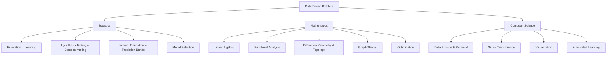
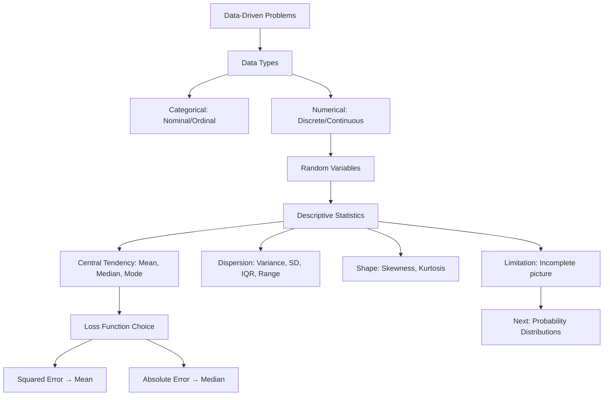

# Lecture 02: Math Foundations AI ML I Part 1

**Course**: AI for Industrial Cyber-Physical Systems (AI4ICPS) — IIT Kharagpur  
**Duration**: 1:03:30  
**Source**: ai4icps-upskilling.in  

---

## Overview

This lecture establishes the mathematical and statistical foundations required for AI/ML. It covers data types, descriptive statistics (mean, median, mode, variance), and introduces the concept of random variables — framing ML as fundamentally a statistical estimation problem operating on structured mathematical spaces.

---

## 1. Data-Driven Problems & The Three Pillars `[00:00 – 11:00]`

The lecture opens by connecting real-world AI/ML applications to three foundational disciplines.

**Applications covered**: spam detection, product recommendation, medical diagnosis, predictive maintenance, speech/image recognition, NLP (ChatGPT, DeepSeek), gaming.

### 1.1 Problem Categories `[04:05 – 04:28]`

All data-driven problems fall into three broad types:

| Category | What It Does | Example |
|----------|-------------|---------|
| Clustering | Group similar items | Customer segmentation |
| Classification | Assign labels | Spam vs. not-spam |
| Regression/Prediction | Predict continuous values | Stock price forecasting |

### 1.2 The Three Pillars `[04:28 – 11:00]`



> **Jargon**: *Parametric inference* — Statistical methods where you assume the data follows a known distribution family (e.g., Gaussian) and estimate its parameters. Like choosing a class template and filling in the fields.

> **Jargon**: *Non-parametric methods* — Methods that make fewer distributional assumptions, offering more flexibility but sometimes less accuracy. Like using duck typing instead of strict interfaces.

> **Jargon**: *Bayesian paradigm* — A statistical approach where you place probability distributions over parameters themselves, encoding prior beliefs that get updated with data. Like initializing weights with prior knowledge before training.

**Key insight**: "The machine does not learn — we have to tell the machine how to learn. That is the estimation problem."

---

## 2. Data Types `[22:26 – 33:44]`

### 2.1 Categorical Data `[24:48 – 29:24]`

| Type | Definition | Example | Has Ordering? | Has Magnitude? |
|------|-----------|---------|--------------|----------------|
| Nominal | Names/labels only | {cow, dog, cat}, {Asian, European} | No | No |
| Ordinal | Labels with order | {mild, moderate, severe} pain | Yes | No |

> **Jargon**: *Nominal data* — Categories with no inherent order. Think of an enum where the numeric values are arbitrary (e.g., `enum Color { RED=0, BLUE=1 }` — the numbers don't imply RED < BLUE).

> **Jargon**: *Ordinal data* — Categories with a meaningful order but no fixed numerical distance between them. Like HTTP status code classes (1xx < 2xx < 3xx) but the gap between them isn't quantified.

### 2.2 Numerical Data `[29:24 – 33:44]`

| Type | Values | Example |
|------|--------|---------|
| Countable (Discrete) | Integers or functions of integers | Spam emails/hour, YouTube likes |
| Uncountable (Continuous) | Real numbers over an interval | Time until first viewer, temperature |

> **Jargon**: *Discretization* — Converting continuous data into categorical bins. Convenient for storage/analysis but always loses information. Like quantizing a float32 to int8.

---

## 3. Random Variables `[33:44 – 40:05]`

A **random variable** is a function that maps outcomes from a sample space to real numbers (or categories).

### 3.1 Example: Indian Population `[35:13 – 40:05]`

For a randomly chosen individual ω from the population:

| Variable | Notation | Range | Type |
|----------|----------|-------|------|
| Weight | X₁(ω) | (0, ∞) | Continuous |
| Monthly Income | X₂(ω) | (-∞, ∞) | Continuous |
| Number of Siblings | X₃(ω) | {0, 1, 2, ...} | Discrete |
| Hair Color | X₄(ω) | {black, brown, grey, ...} | Categorical |

> **Jargon**: *Random variable* — A function that assigns a numerical value to each outcome of a random experiment. In code terms: a function `f: SampleSpace -> Number` where the input is stochastic.

> **Jargon**: *Random vector* — Multiple random variables considered jointly. Like a struct/tuple of random variables: `(X₁, X₂, X₃, X₄)`. Needed when analyzing relationships between variables.

---

## 4. Descriptive Statistics: Measures of Central Tendency `[41:00 – 53:03]`

### 4.1 Mean (Sample Mean) `[42:30 – 48:52]`

$$\bar{x} = \frac{1}{n} \sum_{i=1}^{n} x_i$$

```python
def mean(data):
    return sum(data) / len(data)
```

> *Reads as*: "The mean equals the sum of all observations divided by the number of observations."

> *Example*: data = [1.2, 3.9, 7.8, 9.7] → mean = (1.2+3.9+7.8+9.7)/4 = 22.6/4 = 5.65

**Important property**: Mean is highly sensitive to outliers/extreme values. A single data entry error (e.g., missing decimal point: 0.23 → 23) can drastically shift the mean.

### 4.2 Median `[44:54 – 47:01]`

The middle value of sorted data.

$$\text{Median} = \begin{cases} x_{(k+1)} & \text{if } n = 2k+1 \text{ (odd)} \\ \text{any value in } [x_{(k)}, x_{(k+1)}] & \text{if } n = 2k \text{ (even)} \end{cases}$$

```python
def median(data):
    sorted_data = sorted(data)
    n = len(sorted_data)
    mid = n // 2
    if n % 2 == 1:
        return sorted_data[mid]
    return (sorted_data[mid - 1] + sorted_data[mid]) / 2
```

> *Reads as*: "Sort the data; the median is the middle value (odd n) or the average of the two middle values (even n)."

**Key property**: Median is **robust** — not affected by extreme values. This is why it's preferred for skewed distributions (e.g., income data).

### 4.3 Mode `[47:01 – 49:05]`

The value with the highest frequency. For continuous data, use the midpoint of the histogram bin with maximum frequency.

```python
from collections import Counter
def mode(data):
    counts = Counter(data)
    return counts.most_common(1)[0][0]
```

---

## 5. Measures of Dispersion `[49:05 – 57:06]`

### 5.1 Variance: Two Interpretations `[49:46 – 55:11]`

**Interpretation 1 — Minimized squared error:**

If we replace all data points with a single value A, the total squared error is:

$$S(A) = \sum_{i=1}^{n} (x_i - A)^2$$

Minimizing w.r.t. A gives $\hat{A} = \bar{x}$ (the mean). The minimum average squared error **is** the variance:

$$s^2 = \frac{1}{n} \sum_{i=1}^{n} (x_i - \bar{x})^2$$

```python
def variance(data):
    mu = mean(data)
    return sum((x - mu)**2 for x in data) / len(data)
```

> *Reads as*: "Variance is the average of squared deviations from the mean."

**Interpretation 2 — Pairwise scatter:**

$$s^2 = \frac{1}{2n^2} \sum_{i=1}^{n} \sum_{j=1}^{n} (x_i - x_j)^2$$

> *Reads as*: "Variance equals the average squared distance between all pairs of data points, divided by 2."

> **Jargon**: *Variance* — A measure of how spread out data is around the mean. Higher variance = more scattered data. In ML, high-variance models overfit (memorize noise); low-variance models underfit.

### 5.2 Mean vs. Median as Optimal Representatives `[55:11 – 56:27]`

| Loss Function | Minimizer | Robustness |
|--------------|-----------|------------|
| Squared error: $\sum(x_i - A)^2$ | Mean | Low (sensitive to outliers) |
| Absolute error: $\sum|x_i - B|$ | Median | High (robust to outliers) |

> **Jargon**: *Loss function* — A function that measures how "wrong" a prediction is. Choosing different loss functions leads to different optimal solutions. In ML: MSE loss → mean prediction; MAE loss → median prediction.

### 5.3 Standard Deviation & Range `[57:06 – 57:10]`

$$\text{SD} = \sqrt{s^2} = \sqrt{\frac{1}{n}\sum(x_i - \bar{x})^2}$$

$$\text{Range} = x_{(n)} - x_{(1)} = \max - \min$$

---

## 6. Shape of Distributions `[58:53 – 1:03:09]`

### 6.1 Skewness `[58:53 – 59:19]`

| Skew | Tail Direction | Relationship |
|------|---------------|--------------|
| Positive (right-skewed) | Longer tail on right | Mean > Median > Mode |
| Negative (left-skewed) | Longer tail on left | Mean < Median < Mode |
| Symmetric | Equal tails | Mean = Median = Mode |

> **Jargon**: *Skewness* — A measure of asymmetry in a distribution. Positive skew means a long right tail (e.g., income distribution). Relevant in ML for feature engineering and choosing appropriate models.

### 6.2 Kurtosis `[59:44 – 1:00:18]`

Measures the "peakedness" or tail-heaviness of a distribution relative to a normal distribution (kurtosis = 3 for standard normal).

| Type | Kurtosis | Shape | Behavior |
|------|----------|-------|----------|
| Leptokurtic | > 3 | Sharp peak, heavy tails | Harder to predict; extreme events more likely |
| Mesokurtic | = 3 | Normal-like | Standard behavior |
| Platykurtic | < 3 | Flat peak, thin tails | Data concentrated, more predictable |

> **Jargon**: *Kurtosis* — Measures tail-heaviness. High kurtosis means more outliers/extreme values. Important for risk modeling and understanding when Gaussian assumptions break.

### 6.3 Quartiles and IQR `[1:01:06 – 1:02:07]`

$$\text{IQR} = Q_3 - Q_1$$

| Quartile | Definition |
|----------|-----------|
| Q₁ (25th percentile) | 25% of data below this value |
| Q₂ (Median, 50th percentile) | 50% of data below |
| Q₃ (75th percentile) | 75% of data below |

> **Jargon**: *Interquartile Range (IQR)* — The range of the middle 50% of data (Q3−Q1). Used in box plots and outlier detection: points beyond Q1−1.5×IQR or Q3+1.5×IQR are considered outliers.

---

## Quick Reference: Key Jargon Glossary

| Term | One-Line Definition |
|------|-------------------|
| Parametric inference | Statistical estimation assuming a known distribution family |
| Non-parametric methods | Distribution-free methods with fewer assumptions |
| Bayesian paradigm | Statistics with prior distributions over parameters |
| Nominal data | Categorical data with no ordering |
| Ordinal data | Categorical data with order but no fixed magnitude |
| Discretization | Binning continuous data into categories (lossy) |
| Random variable | Function mapping sample space outcomes to numbers |
| Random vector | Tuple of jointly-considered random variables |
| Variance | Average squared deviation from the mean |
| Loss function | Function measuring prediction error |
| Skewness | Measure of distribution asymmetry |
| Kurtosis | Measure of tail-heaviness relative to normal |
| IQR | Middle 50% range (Q3−Q1); robust dispersion measure |
| Descriptive statistics | Summary measures (center, spread, shape) of data |
| Model selection | Choosing the best statistical model for given data |

---

## Concept Map



**Key Takeaway**: Descriptive statistics are necessary but insufficient — they summarize data but cannot capture its full probabilistic structure. The choice of loss function (squared vs. absolute error) fundamentally determines which summary statistic is optimal, a principle that directly extends to ML model training.

---

*Notes generated from SRT transcript with timestamps. whisper.cpp (small model, Metal GPU). Enhanced with AI expert annotations.*
