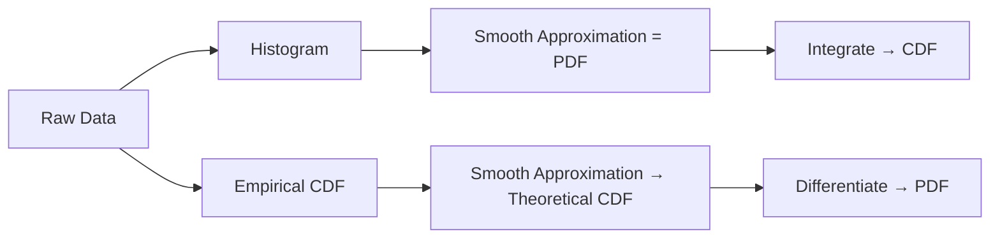
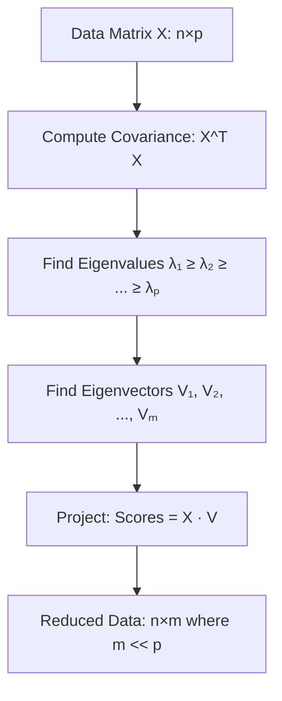
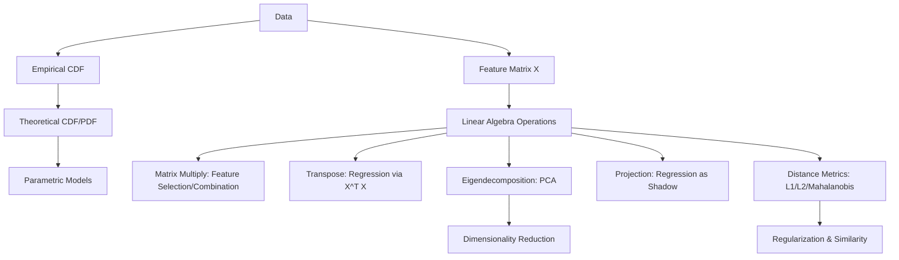

# Lecture 03: Math Foundations AI ML I Part 2

**Course**: AI for Industrial Cyber-Physical Systems (AI4ICPS) — IIT Kharagpur  
**Duration**: 1:14:05  
**Source**: ai4icps-upskilling.in  

---

## Overview

This lecture continues the mathematical foundations, moving from descriptive statistics to probabilistic characterization via empirical/cumulative distribution functions (CDF/PDF). The second half covers essential linear algebra: vectors, matrices, eigenvalues/eigenvectors, PCA, projections, and distance metrics — all framed through their ML applications.

---

## 1. Empirical Distribution Function (EDF) `[00:00 – 05:01]`

The EDF bridges raw data and theoretical probability distributions. It captures the **full** probabilistic structure of a dataset (unlike descriptive stats which only summarize).

### 1.1 Definition & Construction `[00:40 – 02:42]`

$$F_n(t) = \frac{1}{n} \sum_{i=1}^{n} \mathbf{1}(x_i \leq t)$$

```python
def empirical_cdf(data, t):
    return sum(1 for x in data if x <= t) / len(data)
```

> *Reads as*: "The empirical CDF at point t equals the fraction of observations less than or equal to t."

> *Example*: data = [1, 3, 5, 7, 9], t = 4 → F₅(4) = 2/5 = 0.4

> **Jargon**: *Indicator function* $\mathbf{1}(x_i \leq t)$ — Returns 1 if the condition is true, 0 otherwise. Like a boolean cast to int: `int(x <= t)`.

**Properties**:
- Always between 0 and 1
- Non-decreasing step function
- Jumps of size 1/n at each data point
- As n → ∞, converges to the true CDF (Glivenko-Cantelli theorem)

### 1.2 Convergence with Sample Size `[02:42 – 05:01]`

| Sample Size | EDF Appearance | Jump Size |
|-------------|---------------|-----------|
| n = 10 | Coarse steps | 0.1 |
| n = 100 | Finer steps | 0.01 |
| n = 10,000 | Nearly smooth, overlaps true CDF | 0.0001 |

**Limitation**: The EDF requires storing all data points — it doesn't compress information. This motivates parametric distribution fitting.

---

## 2. From EDF to Probability Distributions `[05:01 – 15:06]`

### 2.1 CDF (Cumulative Distribution Function) `[08:41 – 09:22]`

$$F(x) = P(X \leq x), \quad x \in \mathbb{R}$$

```python
# Theoretical CDF: maps any real number to probability [0, 1]
# For standard normal: scipy.stats.norm.cdf(x)
```

> **Jargon**: *CDF (Cumulative Distribution Function)* — A function giving the probability that a random variable takes a value ≤ x. It goes from 0 (at -∞) to 1 (at +∞). Think of it as `sorted_data.percentile_rank(x) / 100`.

### 2.2 PMF and PDF `[10:13 – 14:15]`

| Concept | Discrete (PMF) | Continuous (PDF) |
|---------|---------------|-----------------|
| Definition | P(X = x) | f(x) = dF(x)/dx |
| Relationship to CDF | F(x) = Σ P(X = k) for k ≤ x | F(x) = ∫₋∞ˣ f(t) dt |
| Constraint | Σ P(X = k) = 1 | ∫₋∞^∞ f(x) dx = 1 |
| Non-negativity | P(X = k) ≥ 0 | f(x) ≥ 0 |

> **Jargon**: *PMF (Probability Mass Function)* — Gives the probability of a discrete random variable taking exactly each value. Like a histogram normalized to sum to 1.

> **Jargon**: *PDF (Probability Density Function)* — The derivative of the CDF for continuous variables. The area under the curve between two points gives probability. Note: f(x) itself is NOT a probability (can exceed 1).

### 2.3 How Distributions Are Born `[14:15 – 15:06]`



**Key insight**: All textbook distributions (Normal, Gamma, Weibull, Log-Normal) originated from approximating real data histograms with known, integrable functions.

---

## 3. Linear Algebra: Vectors & Operations `[15:54 – 21:09]`

### 3.1 Vector Operations `[17:03 – 19:07]`

A vector has **magnitude** and **direction**. Key operations:

| Operation | Formula | ML Application |
|-----------|---------|----------------|
| Scalar multiplication | αu | Feature scaling |
| Vector addition | u + v | Combining features |
| Linear combination | αu + βv | Weighted averages, feature engineering |

> **Jargon**: *Linear combination* — A sum of vectors each multiplied by a scalar: α₁v₁ + α₂v₂ + ... + αₖvₖ. This is the fundamental operation behind weighted averages, neural network layers, and PCA projections.

### 3.2 Vector Notation for Statistics `[19:55 – 21:09]`

Sum using dot product:

$$\sum_{i=1}^n x_i = \mathbf{1}^T \mathbf{x}$$

Sample mean:

$$\bar{x} = \frac{1}{n} \mathbf{1}^T \mathbf{x}$$

```python
import numpy as np
ones = np.ones(n)
total = ones @ x        # dot product = sum
mean = (1/n) * ones @ x # scalar * dot product = mean
```

---

## 4. Matrix Operations & Applications `[21:09 – 35:07]`

### 4.1 Feature Selection via Matrix Multiplication `[21:09 – 24:12]`

To select columns 1 and 3 from an n×3 matrix, multiply by a 3×2 selector:

$$X_{n \times 3} \cdot \begin{bmatrix} 1 & 0 \\ 0 & 0 \\ 0 & 1 \end{bmatrix} = X_{\text{selected}}$$

```python
selector = np.array([[1, 0], [0, 0], [0, 1]])  # Select cols 1, 3
X_selected = X @ selector
```

> **Jargon**: *Feature selection* — Choosing a subset of input variables for model training. Reduces dimensionality, noise, and overfitting. Matrix multiplication provides the algebraic framework.

### 4.2 Transpose & Regression `[27:29 – 29:50]`

In linear regression Y = Xβ + ε:
- X is n × (k+1), rectangular (n >> k)
- Cannot invert X directly
- But X^T X is (k+1) × (k+1) — **square and potentially invertible**

$$\hat{\beta} = (X^T X)^{-1} X^T Y$$

```python
beta_hat = np.linalg.inv(X.T @ X) @ X.T @ y
# Or more numerically stable:
beta_hat = np.linalg.lstsq(X, y, rcond=None)[0]
```

### 4.3 Trace `[30:03 – 33:53]`

$$\text{tr}(A) = \sum_{i=1}^n a_{ii}$$

**Key properties** (used constantly in statistical derivations):

| Property | Formula |
|----------|---------|
| Symmetry | tr(A) = tr(A^T) |
| Linearity | tr(A + B) = tr(A) + tr(B) |
| Cyclic | tr(AB) = tr(BA) |
| Scalar | tr(scalar) = scalar |

> **Jargon**: *Trace* — Sum of diagonal elements of a square matrix. In statistics, the trace of the covariance matrix equals the total variance of the system. Think of it as the "total energy" in all dimensions.

**Classic example**: tr(1·1^T) = tr(11^T) = n (an n×n matrix of all 1s has trace n)

### 4.4 Matrix Inverse & Sherman-Morrison `[33:53 – 39:02]`

**Socks-and-shoes rule**: $(AB)^{-1} = B^{-1}A^{-1}$

**Leave-One-Out (LOO) via rank-1 update** `[35:48 – 37:10]`:

$$(X^TX - x_i x_i^T)^{-1}$$

can be computed from $(X^TX)^{-1}$ without refitting the model — enabling efficient cross-validation.

> **Jargon**: *Leave-One-Out (LOO) / Jackknife* — A cross-validation method where you train on n−1 samples and test on the left-out one, repeating n times. The Sherman-Morrison formula makes this O(1) per fold for linear models instead of O(n).

---

## 5. Eigenvalues & Eigenvectors `[40:19 – 46:50]`

### 5.1 Definition `[40:19 – 42:00]`

$$A\mathbf{v} = \lambda\mathbf{v}$$

> *Reads as*: "Matrix A acting on vector v merely scales it by λ — it doesn't change direction."

Found by solving the **characteristic equation**:

$$\det(A - \lambda I) = 0$$

```python
eigenvalues, eigenvectors = np.linalg.eig(A)
```

> **Jargon**: *Eigenvalue (λ)* — A scalar indicating how much the eigenvector is stretched by the matrix transformation. In PCA, eigenvalues represent the amount of variance explained along each principal component.

> **Jargon**: *Eigenvector (v)* — A direction that remains unchanged (only scaled) under the matrix transformation. In PCA, eigenvectors define the new coordinate axes.

### 5.2 Key Properties `[40:34 – 41:11]`

| Property | Formula |
|----------|---------|
| Trace = sum of eigenvalues | tr(A) = Σλᵢ |
| Determinant = product of eigenvalues | det(A) = Πλᵢ |
| Power transfer | eigenvalues of A^k = λᵢ^k |
| Inverse | eigenvalues of A⁻¹ = 1/λᵢ (if all λᵢ ≠ 0) |

**Invertibility condition**: A matrix is invertible iff all eigenvalues are non-zero (i.e., det ≠ 0).

### 5.3 Worked Example `[41:42 – 46:08]`

For A = [[1, 4], [3, 2]]:

$$\det\begin{pmatrix} 1-\lambda & 4 \\ 3 & 2-\lambda \end{pmatrix} = 0$$

$$(1-\lambda)(2-\lambda) - 12 = 0 \implies \lambda^2 - 3\lambda - 10 = 0$$

Solutions: λ₁ = 5, λ₂ = -2

Eigenvectors: v₁ = [1, 1]^T (for λ=5), v₂ = [4, -3]^T (for λ=-2)

**Verification**: A·[1,1]^T = [5, 5]^T = 5·[1,1]^T ✓

---

## 6. Principal Component Analysis (PCA) `[46:50 – 50:24]`

### 6.1 The PCA Pipeline `[46:50 – 49:25]`



```python
from sklearn.decomposition import PCA
pca = PCA(n_components=m)
scores = pca.fit_transform(X)  # X @ eigenvectors[:, :m]
```

> **Jargon**: *PCA (Principal Component Analysis)* — Dimensionality reduction by projecting data onto directions of maximum variance (eigenvectors of covariance matrix). Like finding the best camera angles that capture most of the 3D scene in 2D photos.

### 6.2 Why It Works `[49:25 – 50:24]`

- Eigenvectors form an **orthogonal** basis (uncorrelated directions)
- Eigenvalues rank directions by variance explained
- Projection onto top-m eigenvectors captures most information in fewer dimensions

---

## 7. Projection Matrices `[50:24 – 54:03]`

### 7.1 Geometric Intuition `[50:24 – 51:59]`

Projection = "casting a shadow" onto a lower-dimensional subspace. Projecting a vector already in the subspace returns itself.

### 7.2 Idempotent Property `[52:09 – 54:03]`

$$P^2 = P \quad \text{(projecting twice = projecting once)}$$

> **Jargon**: *Idempotent matrix* — A matrix P where P² = P. Eigenvalues are only 0 or 1. In regression, the hat matrix H = X(X^TX)⁻¹X^T is idempotent — it projects Y onto the column space of X.

**Regression as projection**: Linear regression projects the response vector Y onto the space spanned by predictor columns X. The predicted values Ŷ = HY are this projection.

---

## 8. Distance Metrics & Quadratic Forms `[54:35 – 59:46]`

### 8.1 Lₚ Norms `[54:35 – 57:00]`

$$\|x - y\|_p = \left(\sum_{i=1}^n |x_i - y_i|^p\right)^{1/p}$$

| Norm | Name | Geometric Meaning | ML Use |
|------|------|-------------------|--------|
| L1 | Manhattan/Taxicab | Grid distance | Lasso regularization, sparse solutions |
| L2 | Euclidean | Straight-line distance | Ridge regularization, k-NN default |
| L∞ | Chebyshev | Max component difference | Minimax problems |

```python
from numpy.linalg import norm
l1_dist = norm(x - y, ord=1)    # Manhattan
l2_dist = norm(x - y, ord=2)    # Euclidean
```

> **Jargon**: *Lₚ norm* — A family of distance measures parameterized by p. L1 encourages sparsity, L2 encourages small weights. The choice of norm in your loss function fundamentally shapes what the model learns.

### 8.2 Mahalanobis Distance (Quadratic Form) `[55:30 – 59:46]`

When features have different scales/units, the Euclidean distance is misleading:

$$d_M(\mathbf{a}) = \sqrt{\mathbf{a}^T M \mathbf{a}} = \sqrt{\sum_{i,j} a_i \cdot m_{ij} \cdot a_j}$$

```python
# Mahalanobis distance using inverse covariance
M = np.linalg.inv(cov_matrix)
d = np.sqrt(a.T @ M @ a)
```

> *Reads as*: "The Mahalanobis distance scales each dimension by the inverse variance, making it unit-free."

> **Jargon**: *Quadratic form* — An expression a^T M a where M is a symmetric positive-definite matrix. It generalizes squared Euclidean distance by accounting for correlations and scale differences between variables.

> **Jargon**: *Mahalanobis distance* — A scale-invariant distance that accounts for correlations between features. Like measuring "how many standard deviations away" in a multivariate sense.

---

## 9. Orthogonal Matrices & Rotations `[1:00:07 – 1:03:07]`

$$A^T A = A A^T = I \implies A^T = A^{-1}$$

**Properties**:
- det(A) = ±1
- Preserves Euclidean distances (isometric)
- Eigenvalues of orthogonal eigenvectors form the rotation basis in PCA

> **Jargon**: *Orthogonal matrix* — A square matrix whose transpose equals its inverse. Represents rotations/reflections that preserve distances. In PCA, the eigenvector matrix is orthogonal, so projecting data is a rotation to a new coordinate system.

**PCA connection**: Eigenvectors V₁, ..., Vₖ form an orthogonal matrix → transformed variables are **uncorrelated** → simplifies downstream analysis.

---

## Quick Reference: Key Jargon Glossary

| Term | One-Line Definition |
|------|-------------------|
| Empirical CDF (EDF) | Step function estimating P(X ≤ t) from data |
| Indicator function | Returns 1 if condition true, 0 otherwise |
| CDF | F(x) = P(X ≤ x); goes from 0 to 1 |
| PMF | Probability of each discrete value (sums to 1) |
| PDF | Density function; area under curve = probability |
| Linear combination | Weighted sum of vectors: Σαᵢvᵢ |
| Feature selection | Choosing a subset of input variables |
| Trace | Sum of diagonal elements; equals total variance for covariance matrices |
| Leave-One-Out (LOO) | Cross-validation training on n−1 points, testing on the remaining one |
| Eigenvalue | Scaling factor λ in Av = λv |
| Eigenvector | Direction unchanged (only scaled) by matrix multiplication |
| PCA | Dimensionality reduction via projection onto max-variance directions |
| Idempotent matrix | P² = P; projection matrices have this property |
| Lₚ norm | Family of distance metrics parameterized by p |
| Quadratic form | a^T M a; generalized distance accounting for scale/correlation |
| Mahalanobis distance | Scale-invariant distance using inverse covariance |
| Orthogonal matrix | A^T = A⁻¹; preserves distances, represents rotations |

---

## Concept Map



**Key Takeaway**: The EDF→CDF→PDF pipeline gives us compact probabilistic models of data, while linear algebra (matrix multiplication, eigendecomposition, projections) provides the computational machinery to manipulate high-dimensional data — PCA, regression, and feature engineering are all matrix operations at their core.

---

*Notes generated from SRT transcript with timestamps. whisper.cpp (small model, Metal GPU). Enhanced with AI expert annotations.*
