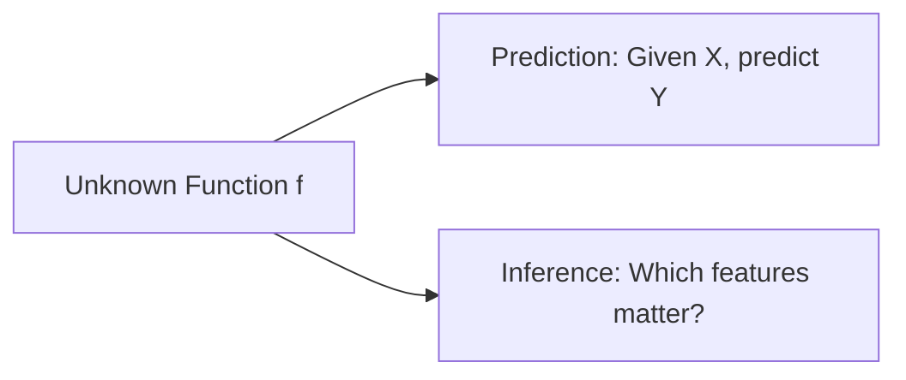
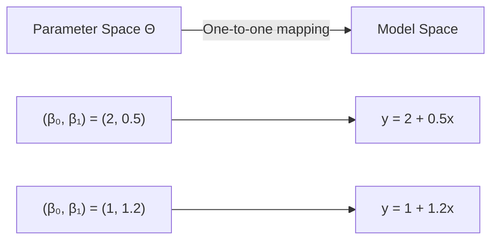
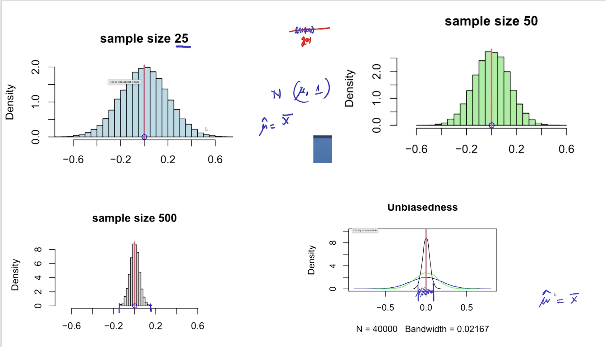
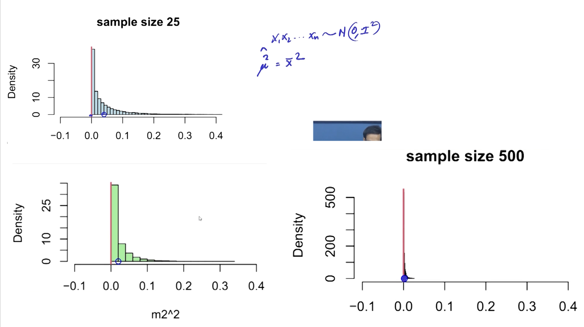
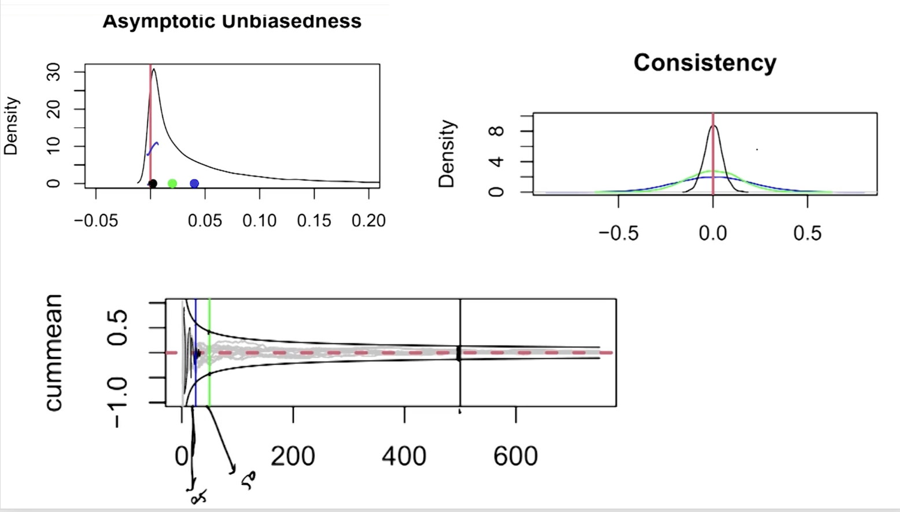
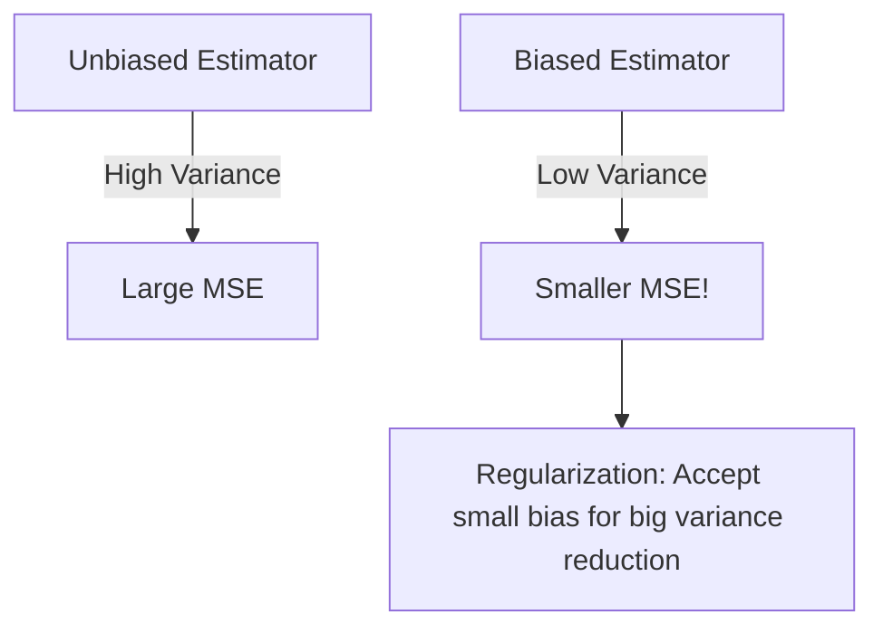
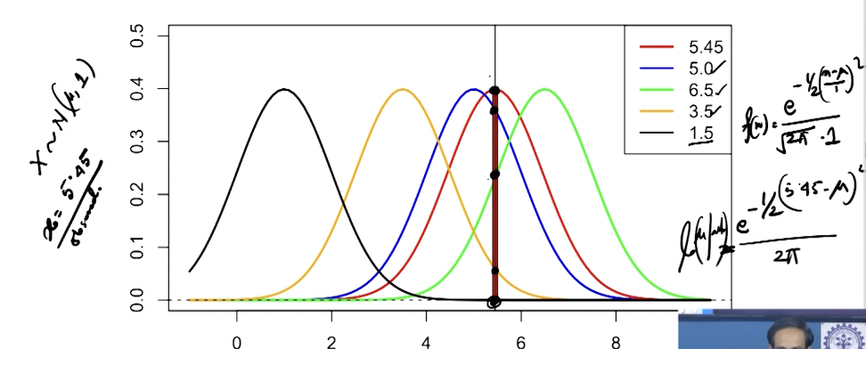
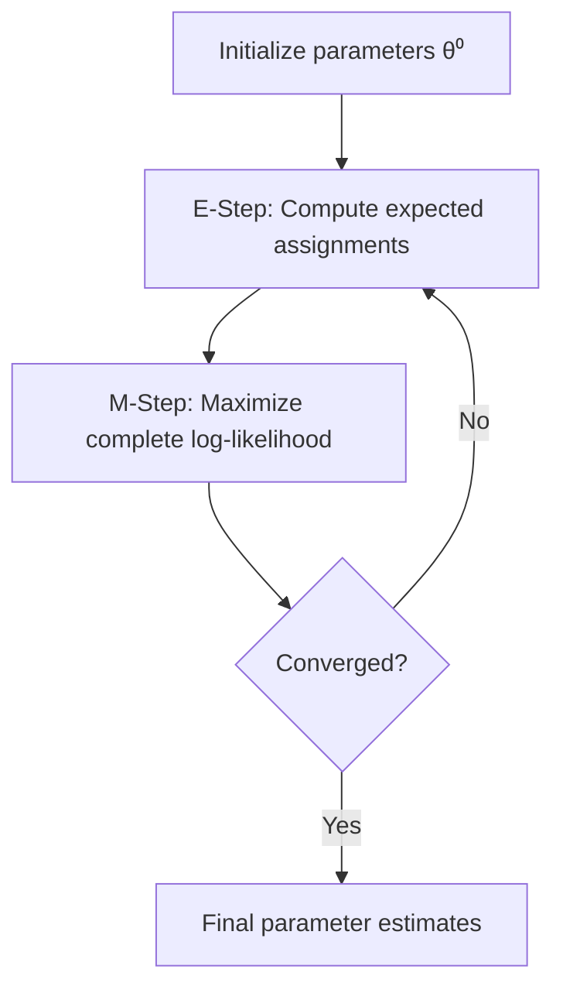
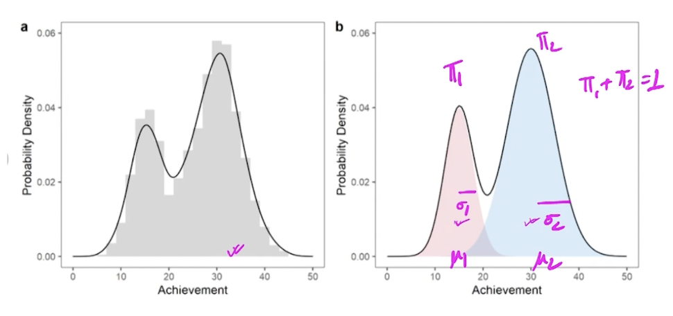

# Lecture 04: Math Foundations AI ML II

**Course**: AI for Industrial Cyber-Physical Systems (AI4ICPS) — IIT Kharagpur  
**Duration**: 1:44:05  
**Source**: ai4icps-upskilling.in  

---

## Overview

This lecture bridges statistics and machine learning by formalizing the estimation (learning) process. It covers estimator properties (unbiasedness, consistency), the bias-variance tradeoff, and three core estimation methods: Method of Moments, Maximum Likelihood Estimation (MLE), and Least Squares — establishing that all ML model training is fundamentally parameter optimization.

---

## 1. Statistical Learning: Types & Terminology `[02:55 – 09:03]`

### 1.1 Learning Paradigms `[03:50 – 08:48]`

| Paradigm | Description | Statistical Analog |
|----------|-------------|-------------------|
| Supervised | Labels present; learn input→output mapping | Classification, Regression |
| Unsupervised | No labels; discover structure | Clustering |
| Active | Model queries for informative labels | Sequential experiment design |
| Passive | Learn from fixed dataset | Standard inference |
| Online | Data arrives sequentially; model updates | Surveillance/sequential analysis |
| Batch | All data available upfront | Retrospective study |
| Teacher-Student | Large model guides smaller model | Knowledge distillation |

> **Jargon**: *Supervised learning* — Learning from labeled examples (input-output pairs). Like training with an answer key.

> **Jargon**: *Unsupervised learning* — Finding patterns in data without labels. Like clustering customers without predefined categories.

> **Jargon**: *Online learning* — Updating the model as new data arrives sequentially, producing dynamic conclusions. Contrast with batch learning where all data is processed at once.

### 1.2 The Essence of Statistical Learning `[09:03 – 11:58]`

What Is Statistical Learning?
In essence, statistical learning refers to a set of approaches for estimat-ng some unknown function f. Such learning has two major purposes
• Prediction → Based on the model predict me raisable given the other s
• Inference  -> Specification of the model parameter


The goal is to estimate some unknown function **f** for two purposes:



> **Jargon**: *Prediction* — Using the estimated model to forecast unknown values given new inputs.

> **Jargon**: *Inference* — Determining which model parameters/features are statistically significant — deciding what to include or exclude from the model.

---

## 2. Parametric vs. Non-Parametric Methods `[11:58 – 14:36]`

How Do We Estimate the unknown function f?
- Parametric
- Non-parametric Methods


| Aspect | Parametric | Non-Parametric |
|--------|-----------|---------------|
| Assumptions | Known distribution family f(θ) | f is continuous, smooth (mild assumptions) |
| Flexibility | Lower | Higher |
| Precision (if assumptions correct) | Higher | Lower |
| Data requirement | Smaller samples OK | Often needs large n |
| Example | Linear regression, Gaussian models | Kernel density estimation, k-NN |


**Example** :  Parametric vs Non-Parametric — Regression vs Trees

| Aspect              | Regression (Parametric)          | Trees (Non-Parametric)              |
|---------------------|-----------------------------------|--------------------------------------|
| Assumption          | Linear relationship               | None — just splits on data           |
| Flexibility         | Low (misses curves)               | High (captures any shape)            |
| Small data          | Works well                        | Prone to overfit                     |
| Grows with data?    | No — always same # coefficients   | Yes — deeper/more splits             |

**Intuition:** Regression is like fitting a **ruler** to your points (fixed shape, 2 numbers: slope + intercept). A tree is like **drawing boxes** around clusters of similar points — the more data, the more/smaller boxes it can draw.


> **Jargon**: *Parametric model* — A model fully specified by a finite set of parameters θ. Like a class with fixed fields — you just need to fill in the values.

> **Jargon**: *Non-parametric model* — A model not constrained to a fixed parameter set. Like a dynamically-sized data structure that grows with the data.

**Explanation**

*Regression (Parametric)*:

- Assumes a fixed form: y = β0 + β1x1 + β2x2 + ... + ε
- Model = just the β coefficients. Learn them (e.g., via OLS), and you’re done — fixed number of parameters no matter how much data you have.
- Rigid: if the real relationship is curved/non-linear, the straight-line assumption is just wrong, no matter how much data you feed it (high bias).
- Data-efficient: works fine with small n, precise if the linear assumption holds.

*Tree-based methods (Non-Parametric)*:

- No assumed formula. The tree just keeps splitting the data based on feature thresholds (e.g., age < 30, income > 50k) until regions are pure/homogeneous.
- Model complexity grows with the data — more data → deeper trees, more splits, more “parameters” (split rules). Not fixed in advance.
- Flexible: can capture non-linear patterns, interactions, weird shapes automatically — no need to guess the right formula.
- Needs more data: with few samples, trees overfit easily (memorize noise instead of a pattern) — high variance.


---

## 3. Parameter Space ↔ Model Space `[14:36 – 20:00]`



**Key principle**: Converging to the true parameter ⟹ converging to the true model. This is why estimation theory = learning theory.

---

## 4. Estimators: Definitions & Properties `[20:00 – 46:54]`

### 4.1 Statistic vs. Estimator `[21:40 – 24:76]`

| Concept | Definition | Requirement |
|---------|-----------|-------------|
| Statistic | Any function of data T(X) | Must NOT contain unknown parameters |
| Estimator | A statistic used to estimate g(θ) | Must be computable from data alone |

> **Jargon**: *Statistic* — A function of the observed data only (no unknown parameters). When viewed as a function of random variables, it's itself a random variable with a distribution.

> **Jargon**: *Estimator* — A statistic used to approximate an unknown parameter or function of parameters. Like a function that computes a "best guess" from data.

- Definition of an estimator
- Good properties of an estimator
- Methods of estimation (e.g.MME, MLE, Least square) (M-Estimator:MLE, Least square -> Minimization/Maximization)

```txt
-------------Explanation--------------------
```
# Statistic vs. Estimator

## The core intuition

Before diving into formulas, the key question this lecture answers is:

> **"Can I actually compute this number just from my data — or do I need to secretly know the true population value first?"**

- If you can compute it **using only the data you observed** → it's a **statistic**.
- If computing it requires you to **know the true (unknown) parameter** (like the real population mean μ) → it's **not a statistic** — it's just a theoretical quantity you could never actually calculate in real life.

An **estimator** is simply a *statistic that has been assigned a job*: to guess the value of some unknown population parameter (like μ or σ²).

---

## Background you need first

- **Population parameter (θ)**: A fixed but *unknown* number describing the whole population (e.g., true mean μ, true variance σ²). You never observe it directly.
- **Random sample X₁, X₂, ..., Xₙ**: n observations drawn from a distribution — here, a Normal distribution N(μ, σ²), meaning bell-curve-shaped data with mean μ and spread (variance) σ².
- **Random variable**: A quantity whose value depends on chance/the sample drawn. Since your data X₁...Xₙ are random, *any function built from them* is also random — it would come out differently if you re-sampled.

---

## Definition 1: Statistic

| Term | Meaning |
|---|---|
| **Statistic** | Any function T(**X**) of the random variables (data) that does **NOT** contain any unknown parameter. |
| Why it matters | Because it's built only from data, you can always compute its value once you have the data — nothing "secret" is needed. |
| Bonus fact | Since it's a function of random data, a statistic is *itself* a random variable — it has its own distribution, and would take a different value if you drew a new sample. |

**Notation:**
- **T(X)** — statistic as a function of the *random variables* X (before you collect data). This is the random-variable version.
- **T(x)** — same function but evaluated at the *actual observed numbers* x (after data collection). This is one fixed, realized number.

---

## Definition 2: Estimator

| Term | Meaning |
|---|---|
| **Estimator** | A statistic T(**X**) that is *specifically used* to approximate/guess an unknown parametric function g(θ) (e.g., g(θ) = μ, or g(θ) = σ²). |
| **Estimate** | The actual realized *number* you get when you plug in your observed data x into the estimator: T(**x**). It's one specific value, not a random variable. |

**Notation shortcut (used loosely, but know the difference):**
- ĝ(θ) = T(**x**) → the **estimate** (a specific number, e.g., "3.2") — for a *particular sample*.
- ĝ(θ) = T(**X**) → the **estimator** (a random variable, a recipe/formula) — before data is plugged in.

The "hat" (^) symbol always means *"our best guess of..."* — e.g., σ̂² means "our estimate of σ²".

---

## Worked Example (from the lecture)

Say X₁, ..., Xₙ are random samples from N(μ, σ²) — μ and σ² are the true, unknown mean and variance.

**Case A — IS a statistic ✅**

$$
\hat{\sigma}^2 = \frac{1}{n}\sum_{i=1}^{n}(X_i - \bar{X})^2
$$

- Here **X̄** = sample mean = (1/n)ΣXᵢ — computed *entirely from your data*.
- Nothing in this formula requires knowing the true μ or σ².
- ✅ You can calculate this the moment you have your n data points.
- Since it's a valid statistic *and* it's being used to guess σ², it also qualifies as an **estimator** of σ².

**Case B — NOT a statistic ❌**

$$
\frac{1}{n}\sum_{i=1}^{n}(X_i - \mu)^2
$$

- This formula uses **μ**, the *true population mean* — which is unknown in real life.
- ❌ You cannot compute this in practice because you don't know μ.
- So this is **not a statistic** (it's sometimes called a "quasi-statistic" or theoretical quantity) — **unless μ happens to be known** (a special case).
- **Special case called out in the notes**: *if μ is known* (rare, but possible in some problems), then this formula suddenly becomes computable, and can be used as an **estimator of σ²**.

**Key contrast:** Same-looking formula, one small swap (X̄ vs μ) — determines whether it's a real-world-usable statistic or just a theoretical construct.

---

## Quick comparison table

| | Statistic | Estimator |
|---|---|---|
| Definition | Function of data only, no unknown parameters | A statistic *used* to estimate g(θ) |
| Can always compute from data? | Yes | Yes (it's a type of statistic) |
| Is it random? | Yes (has a distribution) | Yes (same reason) |
| Purpose | General building block | Specifically aimed at guessing a parameter |
| Example | X̄ (sample mean) | X̄ used to estimate μ |

> Every estimator is a statistic, but not every statistic is deliberately being used as an estimator (though most are, in inference contexts).

---

## Analogy

Think of a **statistic** as any tool you can build using only materials you actually have in your garage (your data). A formula that needs μ is like a blueprint that requires a part you don't own — you can draw it, but you can't build it. An **estimator** is just a statistic-tool that you've decided to use for a specific purpose: measuring something you can't directly see (the true parameter).

---

**Memory hook:** *A statistic is what you CAN compute from data alone; an estimator is that same computable thing used to GUESS the parameter you can't see.*


```txt
--------------Explanation----------------------
```


### 4.2 Unbiasedness `[27:49 – 32:22]`

$$E[T(X)] = g(\theta) \quad \forall \theta \in \Theta$$

```python
# An estimator T is unbiased if its expected value equals the true parameter
# for ALL possible parameter values
def is_unbiased(estimator_expectations, true_values):
    return all(abs(e - t) < epsilon for e, t in zip(estimator_expectations, true_values))
```

> *Reads as*: "The estimator T is unbiased if its average value (over many samples) equals the true parameter value, for every possible true parameter."

> **Jargon**: *Unbiasedness* — An estimator's expected value equals the true parameter. Like a dart that, on average, hits the bullseye — individual throws scatter, but the center of the cluster is on target.

**Important caveat**: $\frac{1}{n}\sum x_i^2$ is NOT an unbiased estimator of σ² when μ is unknown (bias = μ²).

### 4.3 Consistency `[33:12 – 46:02]`

$$T_n \xrightarrow{P} g(\theta) \quad \text{as } n \to \infty$$

> *Reads as*: "As sample size grows, the estimator converges in probability to the true value."

```python
# Consistency: estimator gets arbitrarily close to truth with enough data
# Demonstrated by shrinking variance of sampling distribution as n increases
```

> **Jargon**: *Consistency* — An estimator that converges to the true parameter as sample size → ∞. This is the **minimum requirement** for any useful estimator. Unbiasedness is "nice to have"; consistency is "must have."

**Critical insight from the lecturer**: "Unbiasedness is a fairy tale — we often cannot attain it for real-life problems. But consistency is a demand we must maintain."

```txt
--------------------Explanation-----------------------
```
# Unbiasedness & Consistency of Estimators

## First, the basic intuition

You have data, and you compute some number from it to estimate an unknown truth (e.g., you estimate the population mean μ using the sample mean). That "number-computing recipe" is called an **estimator**. Two natural questions about any estimator:

1. **Unbiasedness** — If I repeated this experiment infinitely many times, would the *average* of my estimates land exactly on the true value?
2. **Consistency** — As I collect *more and more data* (n → ∞), does my estimate get closer and closer to the true value?

These are two *different* properties — an estimator can have one without the other.

---

## Setup / notation used throughout

| Symbol | Meaning |
|---|---|
| $X_1, X_2, \dots, X_n$ | your random sample (data points) — think of them as random *before* you observe them |
| $\theta$ | the true, unknown parameter you're trying to estimate (could be a single number or a vector) |
| $\Theta$ | the set of all values $\theta$ could possibly take |
| $g(\theta)$ | some function of the parameter you want to estimate (often just $\theta$ itself, e.g. $g(\theta)=\sigma^2$) |
| $T(\mathbf{X})$ or $T_n$ | the **estimator** — a formula/statistic built from the data, e.g. $T(\mathbf{X}) = \frac{1}{n}\sum X_i$ |
| $E[\cdot]$ | expectation — the theoretical "long-run average" if you repeated the sampling infinitely |
| $\xrightarrow{P}$ | "converges in probability to" — gets arbitrarily close, with probability → 1, as n grows |

**A statistic** = any quantity computed purely from the data (no unknown parameters inside it). E.g. $\frac{1}{n}\sum X_i^2$ is a statistic — you can calculate it the moment you have data.

---

## ⚠️ Critical clarification: TWO different histograms

### Histogram A — raw data histogram (NOT what the lecture plots)
- Draw **one** sample of n=10 values: `1, 2, 3, 5, 6, 6, 7, 4, 5, 3`
- Plot each raw value on x-axis, its frequency on y-axis.
- This approximates the **population distribution** $N(\mu,\sigma^2)$ itself — as n→∞, it converges to the population's bell curve.
- Built from **one** sample.

### Histogram B — sampling distribution of the estimator (what the lecture actually plots, e.g. "sample size 25/50/500")
Built via **repeated sampling**, not from raw values:





| Step | Action |
|---|---|
| 1 | Draw a sample of size n=25 from $N(\mu,1)$ → get 25 numbers |
| 2 | Compute **one number** from it: $\bar X = $ mean of those 25 |
| 3 | Throw away the 25 raw values — keep only $\bar X$ |
| 4 | **Repeat** steps 1–3 many times (e.g. 40,000 times — this is the "N = 40000" you see on the density plots) |
| 5 | Histogram those thousands of $\bar X$ values (x-axis = value of $\bar X$, y-axis = density) |

**Mini worked example (n=3, only 5 repeats, for intuition):**

| Repeat # | Sample drawn | $\bar X$ kept |
|---|---|---|
| 1 | 1, 3, 2 | 2.00 |
| 2 | 4, 2, 3 | 3.00 |
| 3 | 2, 2, 5 | 3.00 |
| 4 | 1, 1, 4 | 2.00 |
| 5 | 3, 5, 2 | 3.33 |

The lecture's histograms plot `{2.00, 3.00, 3.00, 2.00, 3.33, ...}` — the **outcomes of the estimator across repeated experiments** — not individual data points from one draw. Only Histogram B can show unbiasedness or consistency.

### How each property is read off Histogram B

| | What you build | What you check | Need multiple n's? |
|---|---|---|---|
| **Unbiasedness** | Fix n (e.g. n=10), repeat many times → histogram of the means | Is the **center** (average of all those means) = true population mean? | **No** — checked *at* one fixed n, independently. |
| **Consistency** | Repeat the same construction at **increasing n's**: 10, 25, 100, 500... | Does the **spread shrink to 0** as n grows, *while staying centered* at the true value? | **Yes** — must compare across a growing sequence of n. |

---

## 1. Unbiasedness

### Definition
$$E[T(\mathbf{X})] = g(\theta) \quad \forall\, \theta \in \Theta$$

**In words:** Take your estimator, imagine repeating the sampling experiment over and over (same n), average all those estimates — that average should equal the true value $g(\theta)$, for **every possible** true value.

> **Dart analogy:** unbiased = throws scatter around the bullseye but their *center* is exactly the bullseye. A single throw can miss badly — it's the *average* that must be dead-on.

**Remark:** Unbiasedness does **not** require $T(\mathbf{x}) = g(\theta)$ to hold exactly, or even most of the time — it could hold with probability zero for any single sample. It's purely a statement about the *long-run average*.

### Worked example: Is $\frac{1}{n}\sum X_i^2$ unbiased for $\sigma^2$?

Let $X_1,\dots,X_n \sim N(\mu, \sigma^2)$.

$$E\left[\frac{1}{n}\sum X_i^2\right] = \frac{1}{n}\sum E[X_i^2] = \frac{1}{n}\sum(\mu^2+\sigma^2) = \mu^2+\sigma^2$$

(using $E[X_i^2] = \text{Var}(X_i) + (E[X_i])^2 = \sigma^2+\mu^2$)

**Verdict:** Equals $\sigma^2$ only if $\mu=0$. Since unbiasedness demands equality for **every** $\theta\in\Theta$, this estimator ($T_1$) is **not unbiased** for $\sigma^2$ in general — bias = exactly $\mu^2$.

---

## 2. Consistency

### Definition
$$T_n \xrightarrow{P} g(\theta) \quad \text{i.e.} \quad \lim_{n\to\infty} P\big(|T_n - g(\theta)| < \epsilon\big) = 1 \quad \forall\,\theta\in\Theta,\ \epsilon>0$$

**In words:** Pick any tiny tolerance ε. As n→∞, the probability that the estimator lands within ε of the truth goes to 100%.

**Key fact: consistency is not a per-n property.** You cannot say "consistency holds at n=10." It is a single verdict about the **entire limiting trend** of the sequence $T_{10}, T_{100}, T_{1000},\dots$ as $n\to\infty$ — never something present or absent at one fixed n.

---

## 3. Three related-but-different labels — don't conflate them

This is the piece most often mixed up, so isolate it clearly:

| Term | What it means | Checked how | Example |
|---|---|---|---|
| **Exactly unbiased** | bias $= 0$ at **every** fixed n | pick any single n, check $E[T_n]=g(\theta)$ | $\bar X$ for $\mu$: bias is 0 whether n=10 or n=1000 |
| **Asymptotically unbiased** | bias $\to 0$ **only** as $n\to\infty$ (can be nonzero at every finite n) | look at the trend of bias across increasing n | $\bar X^2$ for $\mu^2$: bias $=\sigma^2/n$, nonzero at every finite n, but $\to 0$ |
| **Consistent** | the *whole distribution* of $T_n$ collapses onto the truth as $n\to\infty$ | requires **both** bias→0 (exact or asymptotic) **and** variance→0 | both $\bar X$ and $\bar X^2$ above are consistent |

**Worked contrast:**

| Estimator | Bias @ n=10 | Bias @ n=1000 | Exactly unbiased? | Consistent? |
|---|---|---|---|---|
| $\bar X$ for $\mu$ | 0 | 0 | ✅ yes, at every n | ✅ yes |
| $\bar X^2$ for $\mu^2$ | $\sigma^2/10$ | $\sigma^2/1000$ | ❌ no — biased at every finite n | ✅ yes — bias and variance both → 0 |

So: an estimator can be **biased at every single finite n** and still be perfectly **consistent** — bias shrinking to 0 in the limit is enough, it doesn't need to be exactly 0 to begin with. Conversely, "unbiased" alone (a fixed-n statement) tells you nothing about what happens as n grows — you need consistency, checked separately, for that guarantee.

> **Corrected version of the common student mix-up:** *"As n→∞, bias shrinks toward 0 (whether the estimator was exactly unbiased all along, or only asymptotically unbiased) and variance shrinks toward 0 → together this makes the estimator consistent."* This is a statement about a **trend across the whole sequence**, not something that "turns on" only when n reaches infinity, and not something checked at one n at a time like unbiasedness is.

### Peak density shrinks as n grows — worked example
For $\bar X \sim N(\mu, \frac1n)$, error $\bar X-\mu \sim N(0,\frac1n)$, peak density at center:
$$f(0) = \sqrt{\frac{n}{2\pi}}$$

| n | Std dev $(1/\sqrt n)$ | Peak density | Shape |
|---|---|---|---|
| 25 | 0.20 | ≈ 2.0 | wider, shorter |
| 50 | 0.141 | ≈ 2.82 | narrower, taller |

### Regression example
In OLS regression, as n grows, $\hat\beta_n \to \beta_{\text{true}}$ — the fitted line visually converges onto the true population line. Same consistency concept, applied to regression coefficients instead of a single mean.

### The key hierarchy (lecturer's own words)
> "Unbiasedness is a fairy tale — we often cannot attain it for real-life problems. But consistency is a demand we must maintain."

| Property | Requirement level | What it guarantees |
|---|---|---|
| Unbiasedness | "Nice to have" | Average estimate = truth, at **any fixed** sample size |
| Consistency | **Minimum requirement / must-have** | Estimate → truth as data → ∞ |

---

**Memory hook:** *Unbiased = correct on average at any n (nice-to-have, often unattainable); Consistent = correct in the limit as n→∞ (the non-negotiable minimum).consistency requires both bias→0 and variance→0*

Example: in regression, as n grows, $\hat\beta_n \to \beta_{\text{true}}$, so the fitted line converges onto the true population line — same consistency idea, applied to a vector of parameters instead of a single number.

```txt
--------------------Explanation-----------------------
```
---

## 5. Bias-Variance Decomposition `[46:54 – 59:49]`

### 5.1 Mean Squared Error (MSE) `[49:06 – 51:26]`

$$\text{MSE}(T) = E[(T(X) - g(\theta))^2]$$

### 5.2 The Decomposition `[51:26 – 55:00]`

$$\boxed{\text{MSE} = \text{Variance}(T) + \text{Bias}^2(T)}$$

```python
def mse_decomposition(estimator_values, true_value):
    bias = np.mean(estimator_values) - true_value
    variance = np.var(estimator_values)
    mse = variance + bias**2
    return mse, variance, bias
```

> *Reads as*: "Total error = how much the estimator scatters (variance) + how far its center is from truth (bias squared)."

> **Jargon**: *Bias-variance tradeoff* — Reducing bias often increases variance and vice versa. High bias = underfitting (too simple). High variance = overfitting (too complex). MSE captures both.

### 5.3 Why MSE Matters `[52:08 – 55:00]`

1. **Easy to compute**
2. **MSE → 0 implies consistency** (both bias → 0 and variance → 0)
3. Captures both accuracy (bias) and precision (variance)

### 5.4 Biased Can Beat Unbiased `[58:01 – 59:49]`

A biased estimator with low variance can have **lower MSE** than an unbiased one with high variance. This is the foundation of:
- **Ridge regression** (adds bias via regularization to dramatically reduce variance)
- **Lasso regression**
- **All regularized models in ML**



---
```txt
-------------------Explanation-----------------------
```
# Bias-Variance Decomposition & Mean Squared Error (MSE)

## Basic intuition first

An estimator can be "wrong" in **two completely different ways**, and MSE is the single number that combines both:

- **Bias** — is my estimator's average *aim* off-target? (accuracy problem)
- **Variance** — do my estimates *scatter* wildly from sample to sample, even if aimed correctly on average? (precision problem)

> **Archery analogy:** Bias = your arrows cluster consistently to the left of the bullseye (your aim itself is off). Variance = your arrows land all over the target, sometimes left, sometimes right, sometimes high (your aim is inconsistent). You can have either problem alone, or both — MSE measures the *total* damage from both combined.

---

## Definitions (building on Bias, from Definition 3/5)

**Definition 5 — Bias:** the bias of an estimator $T(\mathbf X)$ for a target $g(\theta)$ is
$$B_{g(\theta)}(T(\mathbf X)) = E(T(\mathbf X)) - g(\theta) \quad \forall\theta\in\Theta$$
— literally "average value of the estimator, minus the truth." Zero bias = unbiased (covered earlier).

**Definition 6 — Mean Squared Error (MSE):**
$$MSE_{g(\theta)}(T(\mathbf X)) = E\big[(T(\mathbf X) - g(\theta))^2\big] \quad \forall\theta\in\Theta$$
This is the average **squared** distance between your estimate and the truth — it penalizes big misses much more heavily than small ones (squaring a distance of 10 gives 100, but squaring a distance of 1 gives just 1).

### The decomposition (Remark 2)

$$MSE_{g(\theta)}(T(\mathbf X)) = \text{Var}(T(\mathbf X)) + B^2_{g(\theta)}(T(\mathbf X))$$

**Reads as:** *"Total error = how much the estimator scatters (variance) + how far its center is from the truth, squared (bias²)."*

| Term | What it measures |
|---|---|
| $\text{Var}(T(\mathbf X))$ | spread of the estimator around **its own average** — precision |
| $B^2_{g(\theta)}(T(\mathbf X))$ | how far **that average** sits from the truth, squared — accuracy |

**Why the cross term vanishes — plain-language version:**

Take any list of numbers and their average:

Numbers: 2, 4, 6 Average = 4
Deviations from average: -2, 0, 2 → these always sum to zero. Always.

That's just what "average" *means* — deviations above and below it cancel out by construction, for **any** set of numbers.

Now, $E[T]-g(\theta)$ (the bias) is **not random** — it's one fixed number once you know your estimator and the true value. So the cross term in the derivation is just:
$$\text{(a fixed number)} \times \text{(deviations that sum to zero)} = \text{fixed number} \times 0 = 0$$
No deeper magic — deviations from the average always cancel out, and a fixed number times zero is still zero.

*(Full algebraic version, if useful: $E[(T-g)^2] = E[(T-E[T])+(E[T]-g)]^2 = \text{Var}(T) + (E[T]-g)^2 + 2(E[T]-g)\underbrace{E[T-E[T]]}_{=0}$.)*

---
---

### Remark 3 — MSE → 0 implies consistency

> **Remark 3.** If $MSE_{g(\theta)}(T_n(\mathbf X)) \downarrow 0$ as $n \uparrow \infty$, then $(T_n(\mathbf X))$ is a **consistent** estimator.

**Why:** MSE→0 forces *both* bias→0 and variance→0 simultaneously (since $MSE = \text{Var} + \text{Bias}^2$, and both terms are non-negative — the only way their sum goes to 0 is if each one individually goes to 0). This gives a one-shot shortcut to prove consistency, via **Chebyshev's inequality**:
$$P(|T_n-\theta|>\epsilon) \le \frac{E[(T_n-\theta)^2]}{\epsilon^2} = \frac{MSE}{\epsilon^2}$$
If MSE→0, the right-hand side →0, forcing the probability of a big miss →0 — that *is* the definition of consistency. So instead of separately proving bias→0 and variance→0, showing MSE→0 alone is enough.

---

## Why MSE matters

- Easy to compute (just one expectation).
- **MSE → 0 as n→∞ implies consistency** (Remark 3, above).
- Captures **both** accuracy (bias) and precision (variance) in a single number — useful when comparing estimators that trade one for the other.


### A subtle technical note (Remark 4)

| Property | Based on | What that means |
|---|---|---|
| Asymptotic unbiasedness, Consistency | **L1 norm** (absolute deviation, $\lvert T_n-\theta\rvert$) | measures distance the "straightforward" way — treats all deviations proportionally |
| MSE | **L2 norm** (squared/Euclidean deviation, $(T-\theta)^2$) | squares the distance — heavily penalizes large errors relative to small ones |

MSE (L2-based) going to 0 *implies* consistency (L1-based) via Chebyshev's inequality bridging the two norms — not a coincidence.

---

## Bias-variance tradeoff (the jargon)

> **Bias-variance tradeoff:** Reducing bias often increases variance, and vice versa — you rarely get to minimize both at once.

| High... | Means | ML term |
|---|---|---|
| **Bias** | model/estimator is systematically off, too simplistic | **underfitting** |
| **Variance** | model/estimator swings wildly depending on the sample it saw | **overfitting** |


This is the whole point: **a biased estimator with low variance can beat an unbiased one with high variance**, if the variance drop outweighs the (squared) bias added.

---


---

## Ridge/Lasso — the same shrinkage trick, concrete numbers

Estimate one regression coefficient (e.g., "effect of square footage on price") from 4 different random samples. Plain OLS (unbiased) gives wild estimates on noisy data:

OLS estimates across 4 samples: 8, -3, 15, 2 (average ≈ 5.5 — high variance)

Apply **ridge shrinkage**: multiply every estimate by 0.5 (pull it halfway toward 0):

Ridge estimates: 4, -1.5, 7.5, 1 (average ≈ 2.75 — much less spread)

- **Bias** introduced: average moved from 5.5 → 2.75 (probably now off from the true coefficient).
- **Variance** cut dramatically: 8-to-15 swings shrink to 1-to-7.5 swings.
- If the true coefficient is closer to 0 than 5.5 anyway (common with noisy/high-dimensional data, where many predictors barely matter), the variance cut outweighs the small bias — **net lower MSE**. Same mechanism as $S_1^2 \to S_2^2$ above: shrink by a constant factor < 1.

This is the mathematical foundation of:
- **Ridge regression** — shrinks coefficients toward 0 (adds bias) to dramatically cut variance, often reducing MSE on new/test data versus unbiased OLS.
- **Lasso regression** — same idea with an L1 penalty (also induces sparsity, i.e. some coefficients become exactly 0).
- **All regularized ML models** — general principle: accept a small, controlled bias for a much bigger variance cut, especially valuable with noisy or high-dimensional data.

---

## Relating this to the other book's framework — these are TWO different decompositions, don't merge them

| | **Bias-Variance decomposition** (this note) | **SST = SSR + SSE** (regression fit) |
|---|---|---|
| Question it answers | "How wrong is my estimator, on average, across repeated sampling?" | "Of the total spread in my *observed* data, how much did my fitted line explain vs. leave as residual?" |
| Formula | $MSE = \text{Var}(T) + \text{Bias}^2(T)$ | $\sum(Y_i-\bar Y)^2 = \sum(\hat Y_i - \bar Y)^2 + \sum(Y_i-\hat Y_i)^2$ |
| Used for | Comparing estimators (unbiased vs. biased-but-lower-variance) | Computing $R^2 = SSR/SST$ — "% of variance explained" |
| Randomness source | Repeated sampling (imagine redoing the experiment many times) | One fixed dataset — just an algebraic split of the observed numbers |

**They're unrelated formulas that happen to both use the word "variance."** There's no valid mapping like SSE→Bias² — don't force one.

**The ML-book excerpt on Bias-Variance IS the same idea as this note, just extended for prediction.** Direct mapping:

| Statistics version (this note) | ML/book version |
|---|---|
| $\theta$ / $g(\theta)$ (true parameter) | $f(x)$ (true function value) |
| $T(\mathbf X)$ (estimator) | $\hat f(x)$ — the model's prediction |
| $MSE = \text{Var}(T) + \text{Bias}^2(T)$ | same, **plus one new term** |

**The new term — irreducible error:** the book's setup is $y = f(x) + w$ — even the *true* $y$ has built-in random noise $w$. You're not estimating a fixed number anymore; you're predicting a moving target with inherent randomness. Full decomposition becomes:

$$E[(y-\hat f(x))^2] = \underbrace{\text{Bias}^2(\hat f(x))}_{\text{model too simple/off}} + \underbrace{\text{Var}(\hat f(x))}_{\text{model swings across training sets}} + \underbrace{\text{Var}(w)}_{\text{irreducible noise — nothing fixes this}}$$

The book's linear regression (high bias/low variance) vs. neural network (low bias/high variance) example is exactly this note's tradeoff in disguise.

---

**Memory hook:** *MSE = Variance + Bias² — a biased-but-low-variance estimator (like regularized models) can beat an unbiased-but-high-variance one, because total error cares about the sum, not purity of unbiasedness; SST/SSR/SSE is a separate, unrelated decomposition of observed data variance, not another form of this.*
```txt
-------------------Explanation-----------------------
```

## 6. Method of Moments Estimation `[1:00:18 – 1:08:13]`

### 6.1 The Approach `[1:00:28 – 1:05:08]`

Match theoretical moments to sample moments:

$$E[X^k] = \frac{1}{n}\sum_{i=1}^n x_i^k \quad \text{for } k = 1, 2, ..., p$$

```python
# For Normal(μ, σ²): solve 2 equations
# E[X] = μ → μ_hat = x_bar
# Var(X) = σ² → σ²_hat = (1/n) Σ(xi - x_bar)²

# For Gamma(α, λ): solve 2 equations
# E[Y] = α/λ → α_hat/λ_hat = y_bar
# Var(Y) = α/λ² → α_hat/λ_hat² = s²
```

> **Jargon**: *Method of Moments (MoM)* — Estimate parameters by equating theoretical population moments (mean, variance, etc.) with their sample counterparts. Simple and intuitive but not always most efficient.

**Limitation**: Fails when moments don't exist (e.g., Cauchy distribution has no finite mean).

```txt
--------------------------Explanation-----------------------
```

# Method of Moments Estimation (MME)

## The Basic Idea (Intuition First)

You have data, and you believe it came from some known family of distributions (Normal, Gamma, etc.) but you don't know the exact parameters (like the mean or variance) that generated it.

**Core trick:** A probability distribution has "moments" — mathematical summaries like the mean (1st moment) and variance (spread, related to 2nd moment). MME says:

> Whatever the *theoretical* moments are (formulas involving unknown parameters), just set them equal to the *moments you actually computed from your data*, then solve for the parameters.

That's it. No fancy optimization — just algebra.

---

## Key Terms (as they appear)

| Term | Meaning |
|---|---|
| **Moment** | A summary number describing a distribution's shape — 1st moment = mean, 2nd moment relates to variance, etc. |
| **Theoretical moment** | The moment *formula* derived from the distribution's pdf (probability density function), written in terms of unknown parameters θ. |
| **Empirical / sample moment** | The moment computed directly from your observed data (e.g., sample average). |
| **i.i.d.** | "independent and identically distributed" — each data point is drawn independently from the same distribution. |
| **θ ∈ Θ** | θ is "the parameter(s)", and Θ is the set of all values it's allowed to take (parameter space). |
| **p.d.f. (f_θ)** | Probability density function — the formula describing how likely different values are, given parameter θ. |

---

## The 4-Step Recipe

1. **Step 1:** Compute theoretical moments from the pdf (formulas like E[X], Var(X) in terms of unknown parameters).
2. **Step 2:** Compute empirical moments from the actual data (sample mean, sample variance).
3. **Step 3:** If you have *k* unknown parameters, you need *k* equations — so use the 1st moment, 2nd moment, etc., until you have enough equations.
4. **Step 4:** Solve the system of equations for the parameters.

**General formula shown in lecture:**

$$E[X^k] = \frac{1}{n}\sum_{i=1}^n x_i^k \quad \text{for } k = 1, 2, \dots, p$$

- Left side = theoretical k-th moment (from the pdf, depends on parameters).
- Right side = empirical k-th moment (average of data raised to power k).
- `p` = number of unknown parameters → you need `p` such equations.

---

## Worked Example 1: Normal Distribution — $X_i \sim N(\mu, \sigma^2)$

Two unknown parameters: mean **μ** and variance **σ²** → need 2 equations.

| Step | Equation | Meaning |
|---|---|---|
| Theoretical moment 1 | $E(X) = \mu$ | Population mean equals μ |
| Empirical moment 1 | $\bar{x} = \frac{1}{n}\sum_{i=1}^n x_i$ | Sample average |
| **Match →** | $\hat{\mu} = \bar{x}$ | Estimate μ by the sample mean |
| Theoretical moment 2 | $V(X) = \sigma^2$ | Population variance |
| Empirical moment 2 | $s^2 = \frac{1}{n}\sum_{i=1}^n (x_i - \bar{x})^2$ | Sample variance |
| **Match →** | $\hat{\sigma}^2 = s^2$ | Estimate σ² by the sample variance |

This is the simplest, most intuitive case — for the Normal distribution, MME estimates are exactly "use the sample mean and sample variance," which is what you'd naturally do anyway.

**Sanity check from the lecture's R output:**
- True mean = 1.3 → estimated mean = 1.265115 ✅ (close)
- True sigma = 2 → estimated sigma = 1.925403 ✅ (close)

The CDF (cumulative distribution function — probability that X is ≤ some value) plot and histogram overlay in the slides show the true curve (black) and estimated curve (pink/red) nearly overlapping — visual proof that MME gave a good fit even though the estimate isn't *exactly* the true value (that's expected — it's an estimate from a *finite sample*, not the whole population).


## Important Limitation: When MME Fails

> **You need the theoretical moments to actually *exist*.** If a distribution's mean/variance is undefined, MME has nothing to match against.

*Remark 6*: **MME cannot be used to estimate Cauchy's parameters.**

This is a good contrast to the Normal/Gamma cases above — MME isn't universally applicable; it silently assumes the moments you're trying to match are mathematically well-defined.


**Memory hook:** *MME = set "distribution's promised average" equal to "data's actual average" and solve for the unknowns — but this only works if that promised average actually exists (fails for Cauchy).*

```txt
--------------------------Explanation Ends-----------------------
```
---

## 7. Maximum Likelihood Estimation (MLE) `[1:08:25 – 1:27:03]`

### 7.1 Core Idea `[1:09:52 – 1:13:03]`

**Assumption**: We observed this data because it was the *most likely* data to occur.

**Goal**: Find the parameter θ that maximizes the probability of observing our data.

$$\hat{\theta}_{MLE} = \arg\max_{\theta} L(\theta | \text{data}) = \arg\max_{\theta} \prod_{i=1}^n f(x_i; \theta)$$

### 7.2 Log-Likelihood `[1:16:41 – 1:18:15]`

Taking log converts products to sums (easier to differentiate):

$$\ell(\theta) = \log L(\theta) = \sum_{i=1}^n \log f(x_i; \theta)$$

```python
def log_likelihood_normal(data, mu, sigma):
    n = len(data)
    ll = -n/2 * np.log(2*np.pi*sigma**2) - sum((x - mu)**2 for x in data) / (2*sigma**2)
    return ll

# MLE: find mu, sigma that maximize this
from scipy.optimize import minimize
result = minimize(lambda params: -log_likelihood_normal(data, *params), x0=[0, 1])
```

> **Jargon**: *Likelihood function* — The joint density of the data, viewed as a function of the parameter (with data fixed). NOT a probability of the parameter — it's "how likely is this data given this parameter value?"

> **Jargon**: *MLE (Maximum Likelihood Estimator)* — The parameter value that makes the observed data most probable. The workhorse of statistical estimation — always consistent, asymptotically efficient.

### 7.3 MLE Properties `[1:18:15 – 1:19:20]`

| Property | Status |
|----------|--------|
| Always unbiased? | **No** (e.g., MLE of σ² is biased) |
| Always unique? | **No** (e.g., Laplace/double-exponential → median, which may not be unique) |
| Always consistent? | **Yes** (under regularity conditions) |
| Asymptotically normal? | **Yes** (under regularity conditions) |
| Asymptotically efficient? | **Yes** (achieves lowest possible variance) |

---
```txt
-------------------------Explanation Starts---------------------------------
```
Maximum Likelihood Estimation (MLE) — Notes (Binomial-Focused)
1. Basic Intuition — Choosing Between Two Known Distributions
Simplest possible version (textbook warm-up — easier to follow than jumping straight to calculus):

Suppose $X$ can only come from one of two known distributions:

$x$	0	1	2	3	4
Distribution 1: $f(x)$	0.0625	0.2500	0.3750	0.2500	0.0625
Distribution 2: $f(x)$	0.2401	0.4116	0.2646	0.0756	0.0081
(Distribution 1 = Binomial with $p=0.5$; Distribution 2 = Binomial with $p=0.3$.)

You observe $X=3$. Which distribution actually generated it?

Under Distribution 1: $P[X=3]=0.2500$
Under Distribution 2: $P[X=3]=0.0756$
Rule: pick whichever candidate gives the higher probability to what you actually observed. Since $0.25 > 0.0756$, you conclude Distribution 1 produced the data. (If you’d instead observed $X=1$, you’d flip your answer to Distribution 2, since $0.4116 > 0.25$.)

Terminology note: Once you’re comparing candidates after the data is already known, this comparison is called likelihood, not probability. Same numbers, different name — because the roles are reversed: probability asks “given a fixed distribution, how likely is the data?”; likelihood asks “given the fixed data I already have, how well does each candidate distribution explain it?”

2. From “Pick One of Two” to “Pick Any Value of $p$” (the Binomial case)
Now stop assuming only two possible distributions. Assume $X$ is Binomial with $n=4$ trials, but the true success probability $p$ is completely unknown ($0\le p\le1$):
$$P[X=x] = \binom{4}{x}p^x(1-p)^{4-x}$$

You observe $X=3$. Substitute that into the formula:
$$L(p) = \binom{4}{3}p^3(1-p)^{4-3} = 4p^3(1-p), \qquad 0\le p\le1$$

This is now a curve — one likelihood value for every possible $p$ between 0 and 1 (this is the “$L(p)$” hump-shaped curve peaking around $p\approx0.75$, same shape idea as the R-generated likelihood curve in the lecture).

Solve using calculus — set the derivative to zero:
$$\frac{d}{dp}\Big[4p^3(1-p)\Big] = 4(3p^2-4p^3)=0 ;;\Rightarrow;; \hat p = 0.75$$
(Check: derivative is positive before 0.75, negative after → confirms this is the maximum, not a minimum.)

This is the whole idea of MLE, scaled from “2 fixed candidates” to “a continuous slider”: find the $p$ where the likelihood curve peaks.

-------

The lecture overlaid 5 candidate normal curves (means 1.5, 3.5, 5.0, 5.45, 6.5) on the same data point. For each candidate mean, it computed:
$$f(\mu\mid x)=\frac{e^{-\frac12(x-\mu)^2}}{\sqrt{2\pi}}$$
— “if this candidate mean were true, how tall is the curve exactly at my data point?” The curve with mean 5.45 sat highest at the data point — so among the 5 candidates, $\mu=5.45$ gave the observed data the highest likelihood. Same idea as the binomial case: slide the candidate curve around; the winner places the most density directly on top of your data.


Memory hook: MLE = slide $\theta$ (or $p$) along its likelihood curve until you hit the peak — the peak is the value that made your exact observed data the least surprising.
```txt
----------------------Explanation Ends-------------------
```

## 8. EM Algorithm for Mixture Models `[1:27:03 – 1:36:36]`

### 8.1 Mixture Distributions `[1:27:23 – 1:29:08]`

A mixture model assumes data comes from one of K distributions, with unknown assignment:

$$f(x) = \sum_{k=1}^K \pi_k \cdot f_k(x; \theta_k), \quad \sum_k \pi_k = 1$$

> **Jargon**: *Mixture model* — Data generated by randomly choosing one of K component distributions and drawing from it. The assignment is hidden (latent). Used for clustering, density estimation, and handling multimodal data.

### 8.2 The EM Algorithm `[1:30:04 – 1:35:03]`



| Step | Action | Formula |
|------|--------|---------|
| **E-step** | Compute P(Z=k \| x, θ^(t)) — soft cluster assignments | γᵢₖ = πₖf(xᵢ;θₖ) / Σⱼπⱼf(xᵢ;θⱼ) |
| **M-step** | Update parameters maximizing expected complete log-likelihood | μₖ = Σγᵢₖxᵢ / Σγᵢₖ |

> **Jargon**: *EM Algorithm (Expectation-Maximization)* — An iterative method for MLE when data has missing/latent variables. Alternates between inferring hidden states (E) and optimizing parameters (M). Guaranteed to increase likelihood each iteration.

> **Jargon**: *Gaussian Mixture Model (GMM)* — A mixture of K Gaussian distributions. A model-based approach to clustering that gives soft assignments (probabilities) rather than hard labels like K-means.

---
```txt
----------------------------Explanation Starts-------------------------
```
# EM Algorithm for Mixture Models

## The Problem: What is a Mixture Model?

**Intuition first:** Imagine you have exam scores for a whole school, but secretly the school has two groups of students — "regular" and "advanced" — and each group scores around a different average. If you just look at everyone's scores together, you won't see one bell curve — you'll see **two bumps** (bimodal distribution).

The catch: **you don't know which group each student belongs to.** That group label is *hidden* — statisticians call this a **latent variable**.

> **Latent variable (Z)** — an unobserved variable that would explain the data if we knew it. Here, Z = "which group/cluster does this data point belong to?"



### The formula

$$f(x) = \sum_{k=1}^{K} \pi_k \cdot f_k(x;\theta_k), \quad \sum_k \pi_k = 1$$


| Symbol | Meaning |
|---|---|
| K | Number of hidden groups/components |
| pi_k | Mixing weight — probability a point comes from group k. All pi_k sum to 1. |
| f_k(x; theta_k) | Distribution of group k (e.g. Gaussian with mean mu_k, std sigma_k) |
| f(x) | Overall observed distribution — weighted blend of all groups |

**Why normal MLE doesn't work:** because Z is unknown, the likelihood becomes a sum inside a log — no clean closed-form solution.

- l(theta, x, z) = **complete likelihood** — easy to compute IF hidden labels z were known.
- l(theta, x) = integral over z of l(theta, x, z) = **marginal likelihood** — the real (hard) likelihood of observed x only.

---

## The Solution: EM Algorithm

**Core idea:** guess the group memberships, optimize parameters as if that guess were true, repeat until stable.

> **EM = Expectation-Maximization.** Iterative MLE method for hidden/missing data. Alternates E (guess hidden state) and M (optimize params). Likelihood never decreases each iteration.


**Contrast:** K-means gives hard labels; EM/GMM gives probabilities (e.g. 60%/40%) — useful for overlapping clusters.

---

**Memory hook:** *EM = "guess who's in which group (E), then update the group's stats using that guess (M), repeat till stable."*
```txt
-------------------------------Explanation Ends------------------------------------
```

## 9. Least Squares Estimation `[1:36:53 – 1:44:05]`

### 9.1 Simple Linear Regression `[1:37:01 – 1:39:20]`

$$y_i = \beta_0 + \beta_1 x_i + \epsilon_i$$

Minimize:

$$S(\beta_0, \beta_1) = \sum_{i=1}^n (y_i - \beta_0 - \beta_1 x_i)^2$$

$$\hat{\beta}_1 = \frac{S_{xy}}{S_{xx}} = \frac{\sum(x_i - \bar{x})(y_i - \bar{y})}{\sum(x_i - \bar{x})^2}, \quad \hat{\beta}_0 = \bar{y} - \hat{\beta}_1 \bar{x}$$

### 9.2 Multiple Linear Regression (Matrix Form) `[1:41:45 – 1:43:30]`

$$\mathbf{Y} = \mathbf{X}\boldsymbol{\beta} + \boldsymbol{\epsilon}$$

$$\hat{\boldsymbol{\beta}} = (\mathbf{X}^T\mathbf{X})^{-1}\mathbf{X}^T\mathbf{Y}$$

```python
# Least squares solution
beta_hat = np.linalg.inv(X.T @ X) @ X.T @ y

# Predicted values (projection!)
y_hat = X @ beta_hat  # = H @ y, where H = X(X'X)⁻¹X' is the hat/projection matrix
```

> **Jargon**: *Least Squares Estimation (LSE)* — Find parameters that minimize the sum of squared residuals. No distributional assumption needed for point estimates; normality needed for inference (confidence intervals, hypothesis tests).

> **Jargon**: *Hat matrix* H = X(X^TX)⁻¹X^T — An idempotent projection matrix that maps observed Y to predicted Ŷ. "Puts the hat on Y."

### 9.3 Connection: MLE = LSE for Normal Errors `[1:40:55 – 1:41:02]`

When errors are Gaussian, minimizing squared error is equivalent to maximizing the likelihood. The normal assumption makes LSE and MLE identical for regression.

---

## Quick Reference: Key Jargon Glossary

| Term | One-Line Definition |
|------|-------------------|
| Supervised learning | Learning from labeled input-output pairs |
| Unsupervised learning | Finding structure in unlabeled data |
| Online learning | Model updates sequentially as data arrives |
| Parametric model | Model specified by finite parameter set |
| Non-parametric model | Flexible model not constrained to fixed parameters |
| Statistic | Function of data containing no unknown parameters |
| Estimator | Statistic used to approximate a parameter |
| Unbiasedness | E[T] = θ; average over samples hits the true value |
| Consistency | T → θ as n → ∞; convergence with more data |
| MSE | E[(T − θ)²] = Variance + Bias²; total estimation error |
| Bias-variance tradeoff | Reducing bias increases variance and vice versa |
| Method of Moments | Estimate by matching sample and theoretical moments |
| Likelihood | Joint density viewed as function of parameters |
| MLE | Parameter maximizing data probability; always consistent |
| EM Algorithm | Iterative MLE for models with latent variables |
| Mixture model | Data from K distributions with unknown assignments |
| GMM | Mixture of Gaussians; soft clustering method |
| Least Squares | Minimize sum of squared prediction errors |
| Hat matrix | Projection matrix H mapping Y to Ŷ |
| Ridge regression | LSE + L2 penalty; trades bias for reduced variance |

---

## Concept Map

```mermaid
flowchart TD
    A[Statistical Learning] --> B[Estimation = Learning]
    B --> C[Estimator Properties]
    C --> C1[Unbiasedness: E\[T\] = θ]
    C --> C2[Consistency: T → θ as n→∞]
    C --> C3[MSE = Var + Bias²]
    B --> D[Estimation Methods]
    D --> D1[Method of Moments]
    D --> D2[MLE: max L\(θ|data\)]
    D --> D3[Least Squares: min Σe²]
    D2 --> E[EM Algorithm for Mixtures]
    D3 --> F[Linear Regression: β = \(X'X\)⁻¹X'Y]
    C3 --> G[Bias-Variance Tradeoff]
    G --> H[Regularization: Ridge, Lasso]
```

**Key Takeaway**: All ML model training is parameter estimation. Consistency (convergence to truth with more data) is the non-negotiable requirement. The bias-variance tradeoff shows why regularized (biased) models often outperform unbiased ones — a principle underlying every modern ML technique from ridge regression to neural network weight decay.

---

*Notes generated from SRT transcript with timestamps. whisper.cpp (small model, Metal GPU). Enhanced with AI expert annotations.*
