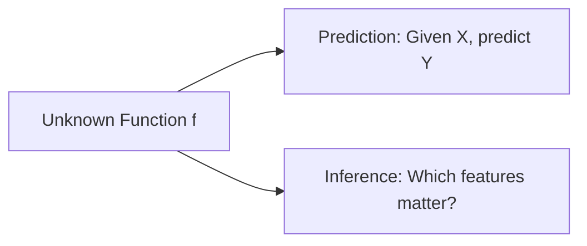
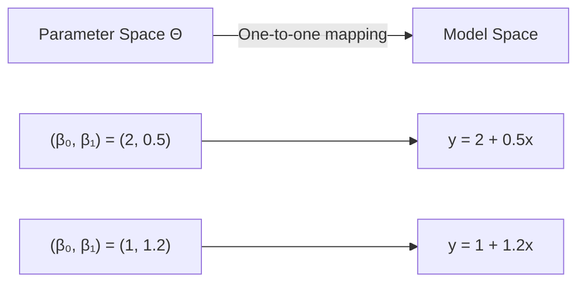
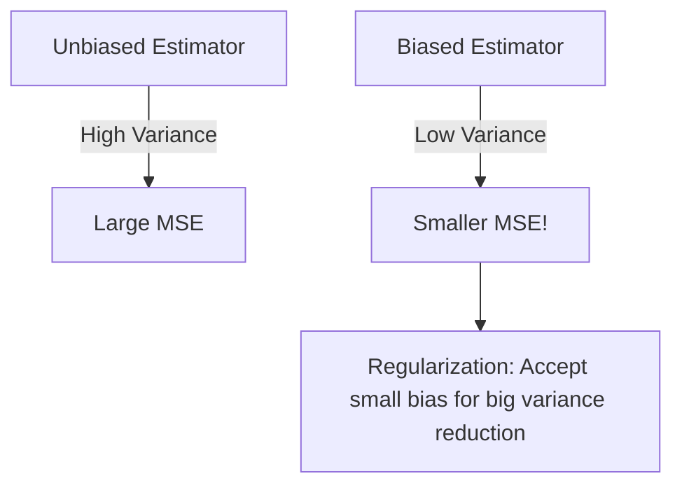
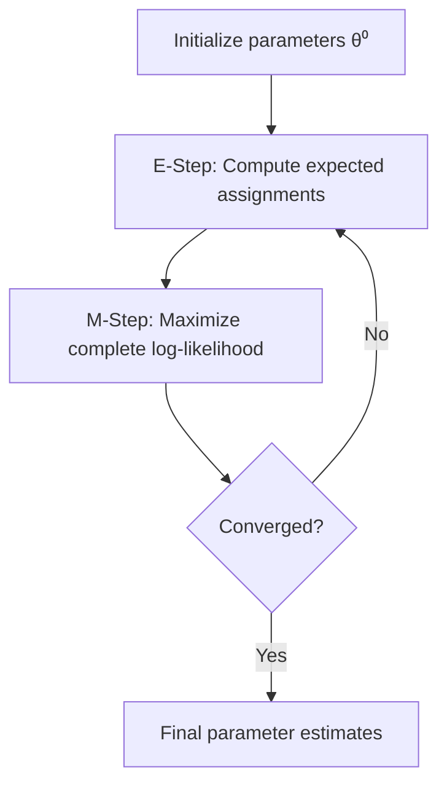

# Lecture 04: Math Foundations AI ML II

**Course**: AI for Industrial Cyber-Physical Systems (AI4ICPS) — IIT Kharagpur  
**Duration**: 1:44:05  
**Source**: ai4icps-upskilling.in  

---

## Overview

This lecture bridges statistics and machine learning by formalizing the estimation (learning) process. It covers estimator properties (unbiasedness, consistency), the bias-variance tradeoff, and three core estimation methods: Method of Moments, Maximum Likelihood Estimation (MLE), and Least Squares — establishing that all ML model training is fundamentally parameter optimization.

---

## 1. Statistical Learning: Types & Terminology `[02:55 – 09:03]`

### 1.1 Learning Paradigms `[03:50 – 08:48]`

| Paradigm | Description | Statistical Analog |
|----------|-------------|-------------------|
| Supervised | Labels present; learn input→output mapping | Classification, Regression |
| Unsupervised | No labels; discover structure | Clustering |
| Active | Model queries for informative labels | Sequential experiment design |
| Passive | Learn from fixed dataset | Standard inference |
| Online | Data arrives sequentially; model updates | Surveillance/sequential analysis |
| Batch | All data available upfront | Retrospective study |
| Teacher-Student | Large model guides smaller model | Knowledge distillation |

> **Jargon**: *Supervised learning* — Learning from labeled examples (input-output pairs). Like training with an answer key.

> **Jargon**: *Unsupervised learning* — Finding patterns in data without labels. Like clustering customers without predefined categories.

> **Jargon**: *Online learning* — Updating the model as new data arrives sequentially, producing dynamic conclusions. Contrast with batch learning where all data is processed at once.

### 1.2 The Essence of Statistical Learning `[09:03 – 11:58]`

What Is Statistical Learning?
In essence, statistical learning refers to a set of approaches for estimat-ng some unknown function f. Such learning has two major purposes
• Prediction → Based on the model predict me raisable given the other s
• Inference  -> Specification of the model parameter


The goal is to estimate some unknown function **f** for two purposes:



> **Jargon**: *Prediction* — Using the estimated model to forecast unknown values given new inputs.

> **Jargon**: *Inference* — Determining which model parameters/features are statistically significant — deciding what to include or exclude from the model.

---

## 2. Parametric vs. Non-Parametric Methods `[11:58 – 14:36]`

How Do We Estimate the unknown function f?
- Parametric
- Non-parametric Methods


| Aspect | Parametric | Non-Parametric |
|--------|-----------|---------------|
| Assumptions | Known distribution family f(θ) | f is continuous, smooth (mild assumptions) |
| Flexibility | Lower | Higher |
| Precision (if assumptions correct) | Higher | Lower |
| Data requirement | Smaller samples OK | Often needs large n |
| Example | Linear regression, Gaussian models | Kernel density estimation, k-NN |


**Example** :  Parametric vs Non-Parametric — Regression vs Trees

| Aspect              | Regression (Parametric)          | Trees (Non-Parametric)              |
|---------------------|-----------------------------------|--------------------------------------|
| Assumption          | Linear relationship               | None — just splits on data           |
| Flexibility         | Low (misses curves)               | High (captures any shape)            |
| Small data          | Works well                        | Prone to overfit                     |
| Grows with data?    | No — always same # coefficients   | Yes — deeper/more splits             |

**Intuition:** Regression is like fitting a **ruler** to your points (fixed shape, 2 numbers: slope + intercept). A tree is like **drawing boxes** around clusters of similar points — the more data, the more/smaller boxes it can draw.


> **Jargon**: *Parametric model* — A model fully specified by a finite set of parameters θ. Like a class with fixed fields — you just need to fill in the values.

> **Jargon**: *Non-parametric model* — A model not constrained to a fixed parameter set. Like a dynamically-sized data structure that grows with the data.

**Explanation**

*Regression (Parametric)*:

- Assumes a fixed form: y = β0 + β1x1 + β2x2 + ... + ε
- Model = just the β coefficients. Learn them (e.g., via OLS), and you’re done — fixed number of parameters no matter how much data you have.
- Rigid: if the real relationship is curved/non-linear, the straight-line assumption is just wrong, no matter how much data you feed it (high bias).
- Data-efficient: works fine with small n, precise if the linear assumption holds.

*Tree-based methods (Non-Parametric)*:

- No assumed formula. The tree just keeps splitting the data based on feature thresholds (e.g., age < 30, income > 50k) until regions are pure/homogeneous.
- Model complexity grows with the data — more data → deeper trees, more splits, more “parameters” (split rules). Not fixed in advance.
- Flexible: can capture non-linear patterns, interactions, weird shapes automatically — no need to guess the right formula.
- Needs more data: with few samples, trees overfit easily (memorize noise instead of a pattern) — high variance.


---

## 3. Parameter Space ↔ Model Space `[14:36 – 20:00]`



**Key principle**: Converging to the true parameter ⟹ converging to the true model. This is why estimation theory = learning theory.

---

## 4. Estimators: Definitions & Properties `[20:00 – 46:54]`

### 4.1 Statistic vs. Estimator `[21:40 – 24:76]`

| Concept | Definition | Requirement |
|---------|-----------|-------------|
| Statistic | Any function of data T(X) | Must NOT contain unknown parameters |
| Estimator | A statistic used to estimate g(θ) | Must be computable from data alone |

> **Jargon**: *Statistic* — A function of the observed data only (no unknown parameters). When viewed as a function of random variables, it's itself a random variable with a distribution.

> **Jargon**: *Estimator* — A statistic used to approximate an unknown parameter or function of parameters. Like a function that computes a "best guess" from data.

```txt
-------------Explanation--------------------
```
# Statistic vs. Estimator

## The core intuition

Before diving into formulas, the key question this lecture answers is:

> **"Can I actually compute this number just from my data — or do I need to secretly know the true population value first?"**

- If you can compute it **using only the data you observed** → it's a **statistic**.
- If computing it requires you to **know the true (unknown) parameter** (like the real population mean μ) → it's **not a statistic** — it's just a theoretical quantity you could never actually calculate in real life.

An **estimator** is simply a *statistic that has been assigned a job*: to guess the value of some unknown population parameter (like μ or σ²).

---

## Background you need first

- **Population parameter (θ)**: A fixed but *unknown* number describing the whole population (e.g., true mean μ, true variance σ²). You never observe it directly.
- **Random sample X₁, X₂, ..., Xₙ**: n observations drawn from a distribution — here, a Normal distribution N(μ, σ²), meaning bell-curve-shaped data with mean μ and spread (variance) σ².
- **Random variable**: A quantity whose value depends on chance/the sample drawn. Since your data X₁...Xₙ are random, *any function built from them* is also random — it would come out differently if you re-sampled.

---

## Definition 1: Statistic

| Term | Meaning |
|---|---|
| **Statistic** | Any function T(**X**) of the random variables (data) that does **NOT** contain any unknown parameter. |
| Why it matters | Because it's built only from data, you can always compute its value once you have the data — nothing "secret" is needed. |
| Bonus fact | Since it's a function of random data, a statistic is *itself* a random variable — it has its own distribution, and would take a different value if you drew a new sample. |

**Notation:**
- **T(X)** — statistic as a function of the *random variables* X (before you collect data). This is the random-variable version.
- **T(x)** — same function but evaluated at the *actual observed numbers* x (after data collection). This is one fixed, realized number.

---

## Definition 2: Estimator

| Term | Meaning |
|---|---|
| **Estimator** | A statistic T(**X**) that is *specifically used* to approximate/guess an unknown parametric function g(θ) (e.g., g(θ) = μ, or g(θ) = σ²). |
| **Estimate** | The actual realized *number* you get when you plug in your observed data x into the estimator: T(**x**). It's one specific value, not a random variable. |

**Notation shortcut (used loosely, but know the difference):**
- ĝ(θ) = T(**x**) → the **estimate** (a specific number, e.g., "3.2") — for a *particular sample*.
- ĝ(θ) = T(**X**) → the **estimator** (a random variable, a recipe/formula) — before data is plugged in.

The "hat" (^) symbol always means *"our best guess of..."* — e.g., σ̂² means "our estimate of σ²".

---

## Worked Example (from the lecture)

Say X₁, ..., Xₙ are random samples from N(μ, σ²) — μ and σ² are the true, unknown mean and variance.

**Case A — IS a statistic ✅**

$$
\hat{\sigma}^2 = \frac{1}{n}\sum_{i=1}^{n}(X_i - \bar{X})^2
$$

- Here **X̄** = sample mean = (1/n)ΣXᵢ — computed *entirely from your data*.
- Nothing in this formula requires knowing the true μ or σ².
- ✅ You can calculate this the moment you have your n data points.
- Since it's a valid statistic *and* it's being used to guess σ², it also qualifies as an **estimator** of σ².

**Case B — NOT a statistic ❌**

$$
\frac{1}{n}\sum_{i=1}^{n}(X_i - \mu)^2
$$

- This formula uses **μ**, the *true population mean* — which is unknown in real life.
- ❌ You cannot compute this in practice because you don't know μ.
- So this is **not a statistic** (it's sometimes called a "quasi-statistic" or theoretical quantity) — **unless μ happens to be known** (a special case).
- **Special case called out in the notes**: *if μ is known* (rare, but possible in some problems), then this formula suddenly becomes computable, and can be used as an **estimator of σ²**.

**Key contrast:** Same-looking formula, one small swap (X̄ vs μ) — determines whether it's a real-world-usable statistic or just a theoretical construct.

---

## Quick comparison table

| | Statistic | Estimator |
|---|---|---|
| Definition | Function of data only, no unknown parameters | A statistic *used* to estimate g(θ) |
| Can always compute from data? | Yes | Yes (it's a type of statistic) |
| Is it random? | Yes (has a distribution) | Yes (same reason) |
| Purpose | General building block | Specifically aimed at guessing a parameter |
| Example | X̄ (sample mean) | X̄ used to estimate μ |

> Every estimator is a statistic, but not every statistic is deliberately being used as an estimator (though most are, in inference contexts).

---

## Analogy

Think of a **statistic** as any tool you can build using only materials you actually have in your garage (your data). A formula that needs μ is like a blueprint that requires a part you don't own — you can draw it, but you can't build it. An **estimator** is just a statistic-tool that you've decided to use for a specific purpose: measuring something you can't directly see (the true parameter).

---

**Memory hook:** *A statistic is what you CAN compute from data alone; an estimator is that same computable thing used to GUESS the parameter you can't see.*


```txt
--------------Explanation----------------------
```


### 4.2 Unbiasedness `[27:49 – 32:22]`

$$E[T(X)] = g(\theta) \quad \forall \theta \in \Theta$$

```python
# An estimator T is unbiased if its expected value equals the true parameter
# for ALL possible parameter values
def is_unbiased(estimator_expectations, true_values):
    return all(abs(e - t) < epsilon for e, t in zip(estimator_expectations, true_values))
```

> *Reads as*: "The estimator T is unbiased if its average value (over many samples) equals the true parameter value, for every possible true parameter."

> **Jargon**: *Unbiasedness* — An estimator's expected value equals the true parameter. Like a dart that, on average, hits the bullseye — individual throws scatter, but the center of the cluster is on target.

**Important caveat**: $\frac{1}{n}\sum x_i^2$ is NOT an unbiased estimator of σ² when μ is unknown (bias = μ²).

### 4.3 Consistency `[33:12 – 46:02]`

$$T_n \xrightarrow{P} g(\theta) \quad \text{as } n \to \infty$$

> *Reads as*: "As sample size grows, the estimator converges in probability to the true value."

```python
# Consistency: estimator gets arbitrarily close to truth with enough data
# Demonstrated by shrinking variance of sampling distribution as n increases
```

> **Jargon**: *Consistency* — An estimator that converges to the true parameter as sample size → ∞. This is the **minimum requirement** for any useful estimator. Unbiasedness is "nice to have"; consistency is "must have."

**Critical insight from the lecturer**: "Unbiasedness is a fairy tale — we often cannot attain it for real-life problems. But consistency is a demand we must maintain."

---

## 5. Bias-Variance Decomposition `[46:54 – 59:49]`

### 5.1 Mean Squared Error (MSE) `[49:06 – 51:26]`

$$\text{MSE}(T) = E[(T(X) - g(\theta))^2]$$

### 5.2 The Decomposition `[51:26 – 55:00]`

$$\boxed{\text{MSE} = \text{Variance}(T) + \text{Bias}^2(T)}$$

```python
def mse_decomposition(estimator_values, true_value):
    bias = np.mean(estimator_values) - true_value
    variance = np.var(estimator_values)
    mse = variance + bias**2
    return mse, variance, bias
```

> *Reads as*: "Total error = how much the estimator scatters (variance) + how far its center is from truth (bias squared)."

> **Jargon**: *Bias-variance tradeoff* — Reducing bias often increases variance and vice versa. High bias = underfitting (too simple). High variance = overfitting (too complex). MSE captures both.

### 5.3 Why MSE Matters `[52:08 – 55:00]`

1. **Easy to compute**
2. **MSE → 0 implies consistency** (both bias → 0 and variance → 0)
3. Captures both accuracy (bias) and precision (variance)

### 5.4 Biased Can Beat Unbiased `[58:01 – 59:49]`

A biased estimator with low variance can have **lower MSE** than an unbiased one with high variance. This is the foundation of:
- **Ridge regression** (adds bias via regularization to dramatically reduce variance)
- **Lasso regression**
- **All regularized models in ML**



---

## 6. Method of Moments Estimation `[1:00:18 – 1:08:13]`

### 6.1 The Approach `[1:00:28 – 1:05:08]`

Match theoretical moments to sample moments:

$$E[X^k] = \frac{1}{n}\sum_{i=1}^n x_i^k \quad \text{for } k = 1, 2, ..., p$$

```python
# For Normal(μ, σ²): solve 2 equations
# E[X] = μ → μ_hat = x_bar
# Var(X) = σ² → σ²_hat = (1/n) Σ(xi - x_bar)²

# For Gamma(α, λ): solve 2 equations
# E[Y] = α/λ → α_hat/λ_hat = y_bar
# Var(Y) = α/λ² → α_hat/λ_hat² = s²
```

> **Jargon**: *Method of Moments (MoM)* — Estimate parameters by equating theoretical population moments (mean, variance, etc.) with their sample counterparts. Simple and intuitive but not always most efficient.

**Limitation**: Fails when moments don't exist (e.g., Cauchy distribution has no finite mean).

---

## 7. Maximum Likelihood Estimation (MLE) `[1:08:25 – 1:27:03]`

### 7.1 Core Idea `[1:09:52 – 1:13:03]`

**Assumption**: We observed this data because it was the *most likely* data to occur.

**Goal**: Find the parameter θ that maximizes the probability of observing our data.

$$\hat{\theta}_{MLE} = \arg\max_{\theta} L(\theta | \text{data}) = \arg\max_{\theta} \prod_{i=1}^n f(x_i; \theta)$$

### 7.2 Log-Likelihood `[1:16:41 – 1:18:15]`

Taking log converts products to sums (easier to differentiate):

$$\ell(\theta) = \log L(\theta) = \sum_{i=1}^n \log f(x_i; \theta)$$

```python
def log_likelihood_normal(data, mu, sigma):
    n = len(data)
    ll = -n/2 * np.log(2*np.pi*sigma**2) - sum((x - mu)**2 for x in data) / (2*sigma**2)
    return ll

# MLE: find mu, sigma that maximize this
from scipy.optimize import minimize
result = minimize(lambda params: -log_likelihood_normal(data, *params), x0=[0, 1])
```

> **Jargon**: *Likelihood function* — The joint density of the data, viewed as a function of the parameter (with data fixed). NOT a probability of the parameter — it's "how likely is this data given this parameter value?"

> **Jargon**: *MLE (Maximum Likelihood Estimator)* — The parameter value that makes the observed data most probable. The workhorse of statistical estimation — always consistent, asymptotically efficient.

### 7.3 MLE Properties `[1:18:15 – 1:19:20]`

| Property | Status |
|----------|--------|
| Always unbiased? | **No** (e.g., MLE of σ² is biased) |
| Always unique? | **No** (e.g., Laplace/double-exponential → median, which may not be unique) |
| Always consistent? | **Yes** (under regularity conditions) |
| Asymptotically normal? | **Yes** (under regularity conditions) |
| Asymptotically efficient? | **Yes** (achieves lowest possible variance) |

---

## 8. EM Algorithm for Mixture Models `[1:27:03 – 1:36:36]`

### 8.1 Mixture Distributions `[1:27:23 – 1:29:08]`

A mixture model assumes data comes from one of K distributions, with unknown assignment:

$$f(x) = \sum_{k=1}^K \pi_k \cdot f_k(x; \theta_k), \quad \sum_k \pi_k = 1$$

> **Jargon**: *Mixture model* — Data generated by randomly choosing one of K component distributions and drawing from it. The assignment is hidden (latent). Used for clustering, density estimation, and handling multimodal data.

### 8.2 The EM Algorithm `[1:30:04 – 1:35:03]`



| Step | Action | Formula |
|------|--------|---------|
| **E-step** | Compute P(Z=k \| x, θ^(t)) — soft cluster assignments | γᵢₖ = πₖf(xᵢ;θₖ) / Σⱼπⱼf(xᵢ;θⱼ) |
| **M-step** | Update parameters maximizing expected complete log-likelihood | μₖ = Σγᵢₖxᵢ / Σγᵢₖ |

> **Jargon**: *EM Algorithm (Expectation-Maximization)* — An iterative method for MLE when data has missing/latent variables. Alternates between inferring hidden states (E) and optimizing parameters (M). Guaranteed to increase likelihood each iteration.

> **Jargon**: *Gaussian Mixture Model (GMM)* — A mixture of K Gaussian distributions. A model-based approach to clustering that gives soft assignments (probabilities) rather than hard labels like K-means.

---

## 9. Least Squares Estimation `[1:36:53 – 1:44:05]`

### 9.1 Simple Linear Regression `[1:37:01 – 1:39:20]`

$$y_i = \beta_0 + \beta_1 x_i + \epsilon_i$$

Minimize:

$$S(\beta_0, \beta_1) = \sum_{i=1}^n (y_i - \beta_0 - \beta_1 x_i)^2$$

$$\hat{\beta}_1 = \frac{S_{xy}}{S_{xx}} = \frac{\sum(x_i - \bar{x})(y_i - \bar{y})}{\sum(x_i - \bar{x})^2}, \quad \hat{\beta}_0 = \bar{y} - \hat{\beta}_1 \bar{x}$$

### 9.2 Multiple Linear Regression (Matrix Form) `[1:41:45 – 1:43:30]`

$$\mathbf{Y} = \mathbf{X}\boldsymbol{\beta} + \boldsymbol{\epsilon}$$

$$\hat{\boldsymbol{\beta}} = (\mathbf{X}^T\mathbf{X})^{-1}\mathbf{X}^T\mathbf{Y}$$

```python
# Least squares solution
beta_hat = np.linalg.inv(X.T @ X) @ X.T @ y

# Predicted values (projection!)
y_hat = X @ beta_hat  # = H @ y, where H = X(X'X)⁻¹X' is the hat/projection matrix
```

> **Jargon**: *Least Squares Estimation (LSE)* — Find parameters that minimize the sum of squared residuals. No distributional assumption needed for point estimates; normality needed for inference (confidence intervals, hypothesis tests).

> **Jargon**: *Hat matrix* H = X(X^TX)⁻¹X^T — An idempotent projection matrix that maps observed Y to predicted Ŷ. "Puts the hat on Y."

### 9.3 Connection: MLE = LSE for Normal Errors `[1:40:55 – 1:41:02]`

When errors are Gaussian, minimizing squared error is equivalent to maximizing the likelihood. The normal assumption makes LSE and MLE identical for regression.

---

## Quick Reference: Key Jargon Glossary

| Term | One-Line Definition |
|------|-------------------|
| Supervised learning | Learning from labeled input-output pairs |
| Unsupervised learning | Finding structure in unlabeled data |
| Online learning | Model updates sequentially as data arrives |
| Parametric model | Model specified by finite parameter set |
| Non-parametric model | Flexible model not constrained to fixed parameters |
| Statistic | Function of data containing no unknown parameters |
| Estimator | Statistic used to approximate a parameter |
| Unbiasedness | E[T] = θ; average over samples hits the true value |
| Consistency | T → θ as n → ∞; convergence with more data |
| MSE | E[(T − θ)²] = Variance + Bias²; total estimation error |
| Bias-variance tradeoff | Reducing bias increases variance and vice versa |
| Method of Moments | Estimate by matching sample and theoretical moments |
| Likelihood | Joint density viewed as function of parameters |
| MLE | Parameter maximizing data probability; always consistent |
| EM Algorithm | Iterative MLE for models with latent variables |
| Mixture model | Data from K distributions with unknown assignments |
| GMM | Mixture of Gaussians; soft clustering method |
| Least Squares | Minimize sum of squared prediction errors |
| Hat matrix | Projection matrix H mapping Y to Ŷ |
| Ridge regression | LSE + L2 penalty; trades bias for reduced variance |

---

## Concept Map

```mermaid
flowchart TD
    A[Statistical Learning] --> B[Estimation = Learning]
    B --> C[Estimator Properties]
    C --> C1[Unbiasedness: E\[T\] = θ]
    C --> C2[Consistency: T → θ as n→∞]
    C --> C3[MSE = Var + Bias²]
    B --> D[Estimation Methods]
    D --> D1[Method of Moments]
    D --> D2[MLE: max L\(θ|data\)]
    D --> D3[Least Squares: min Σe²]
    D2 --> E[EM Algorithm for Mixtures]
    D3 --> F[Linear Regression: β = \(X'X\)⁻¹X'Y]
    C3 --> G[Bias-Variance Tradeoff]
    G --> H[Regularization: Ridge, Lasso]
```

**Key Takeaway**: All ML model training is parameter estimation. Consistency (convergence to truth with more data) is the non-negotiable requirement. The bias-variance tradeoff shows why regularized (biased) models often outperform unbiased ones — a principle underlying every modern ML technique from ridge regression to neural network weight decay.

---

*Notes generated from SRT transcript with timestamps. whisper.cpp (small model, Metal GPU). Enhanced with AI expert annotations.*
