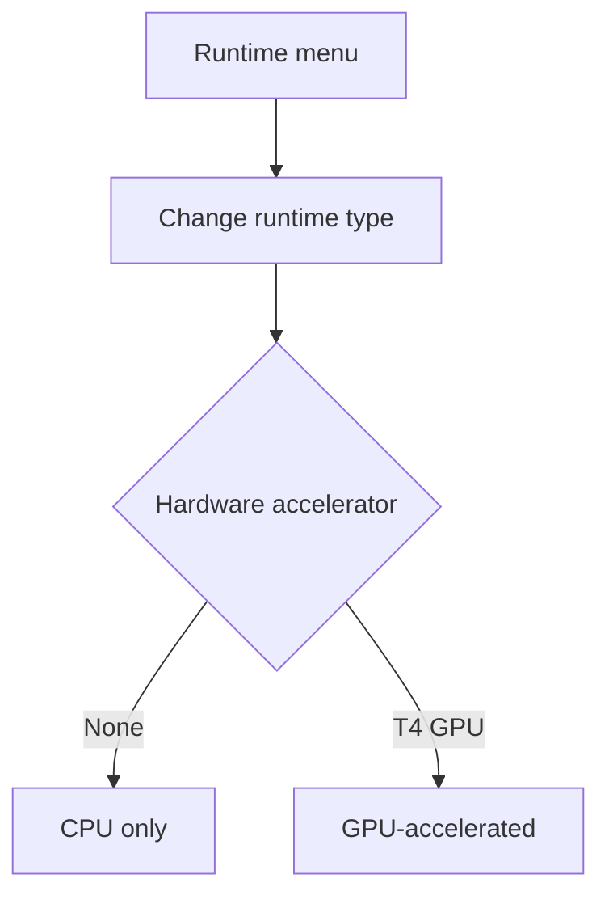
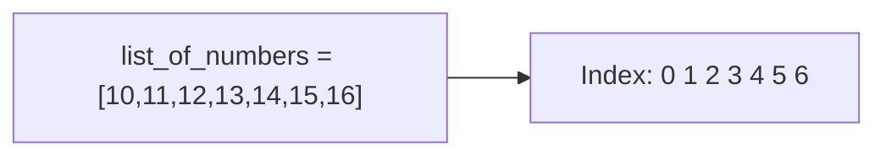
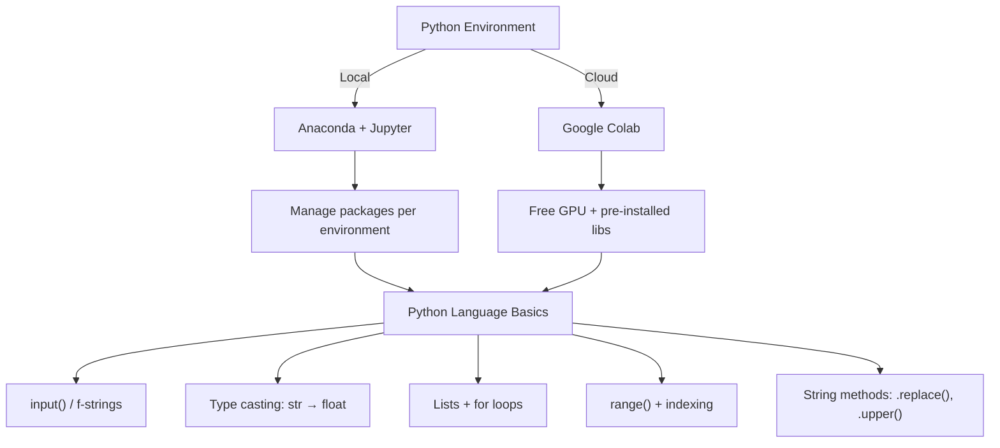

# Lecture 05: Hands-on Python I — Notebooks

**Course**: AI for Industrial Cyber-Physical Systems (AI4ICPS) — IIT Kharagpur  
**Duration**: 1:29:51  
**Source**: ai4icps-upskilling.in  

---

## Overview

The first hands-on lab of the course. It sets up two parallel Python environments — **local Jupyter via Anaconda** and **cloud-based Google Colab** — then walks through Python fundamentals: variables, type casting, `input()`/f-strings, lists, `for` loops, `range()`, indexing, and string methods, all illustrated through a running "sum two product prices" example that deliberately breaks (and gets fixed) to teach type-safety lessons.

---

## 1. Local Setup: Anaconda + Jupyter `[0:00 – 38:12]`

### 1.1 Installing Anaconda `[7:26 – 18:07]`

**Anaconda** is a Python distribution that bundles an interpreter, package manager, and a suite of data-science tools into one installer.

> **Jargon**: *Anaconda* — A pre-packaged Python/R distribution. Instead of manually installing Python + pip + dozens of libraries, Anaconda ships them together along with a GUI (**Navigator**) for managing everything.

Steps: download the OS-appropriate installer (Anaconda auto-detects Windows/Mac — note *Apple Silicon* vs *Intel* builds for Mac users) → skip account registration → run installer (~5.2 GB disk) → click through defaults.

### 1.2 Environments & Package Management `[19:06 – 24:36]`

> **Jargon**: *Virtual Environment* — An isolated Python installation with its own interpreter version and package set, so different projects don't clash over conflicting library versions. Conceptually similar to a per-project `node_modules` or a language-level dependency sandbox.


Workflow demonstrated: **Environments → Create** → name it (e.g. `ai_demo`) → pick a Python version → install `Jupyter Notebook` from the package list → **Launch**.

> **Jargon**: *ModuleNotFoundError* — Raised when you `import` a library that isn't installed in the *currently active* environment. Fix: install the package into that specific environment (Navigator → search package → Apply), not just "somewhere on the system."

**Lesson emphasized by instructor**: library **version pinning** matters — an unexpected `pandas` upgrade once broke his code until he pinned an older version. Always track your environment's package versions.

### 1.3 Jupyter Notebook Basics `[24:36 – 37:15]`

| UI Element | Function |
|---|---|
| Cell | A single executable block of code or markdown |
| `+` button | Insert a new cell |
| `Esc` then `d d` | Delete the selected cell |
| ▶ (Run) or `Ctrl+Enter` | Execute the current cell |

```python
import numpy as np
print(np.__version__)
```

> *Reads as*: "Import the numpy library under the short alias `np`, then print its version string."

First run threw `ModuleNotFoundError: No module named 'numpy'` because the package wasn't yet installed in the active environment — resolved via Navigator → install `numpy` → re-run → `2.2.2`.

---

## 2. Google Colab `[38:12 – 56:16]`

> **Jargon**: *Google Colab* — A free, browser-hosted Jupyter notebook environment running on Google's cloud infrastructure. No local install needed; notebooks live in Google Drive.

### 2.1 Colab vs. Local Jupyter `[38:33 – 54:20]`

| Aspect | Local Jupyter (Anaconda) | Google Colab |
|---|---|---|
| Setup | Manual install + environment mgmt | Zero setup, browser-based |
| Environment control | Full (choose Python version, packages) | Limited (fixed base image) |
| GPU access | Needs local GPU hardware | **Free T4 GPU** via Runtime settings |
| Pre-installed libraries | None by default | NumPy, pandas, PyTorch, etc. pre-loaded |
| Persistence | Local disk | Google Drive |



**GPU availability check**:

```python
import torch
torch.cuda.is_available()   # False on CPU runtime, True after switching to GPU
```

> **Jargon**: *CUDA* — NVIDIA's parallel-computing platform that lets libraries like PyTorch offload tensor math to the GPU. `torch.cuda.is_available()` literally asks "is a CUDA-capable GPU visible to this process?"

> **Jargon**: *PyTorch (`torch`)* — A deep learning library providing GPU-accelerated tensor operations and automatic differentiation. Introduced here only as the tool used to *check for* GPU access; full usage comes in later lectures.

**Best practice noted**: since this basic tutorial does no heavy computation, the instructor **disconnects the GPU runtime** and switches back to CPU — free GPU quota is limited, so don't reserve one unless you're actually training something compute-intensive.

### 2.2 Pre-Installed Libraries `[54:20 – 56:16]`

Running the same `import numpy; print(np.__version__)` in Colab succeeds immediately (`1.26.4`) with **no install step** — Colab ships common data-science libraries out of the box, unlike a fresh local environment.

---

## 3. Python Fundamentals: I/O, Variables & Types `[57:24 – 1:10:05]`

### 3.1 `input()` and F-Strings `[57:24 – 1:03:08]`

```python
ip = input("What is your name?")
print(ip)                          # "Tom"

print(f"Hello how are you {ip}")   # F-string: embeds ip's value
```

> *Reads as*: "`input()` pauses execution, shows the prompt, and stores whatever the user types into the variable `ip`. An f-string (prefix `f`) lets you embed `{variable}` placeholders directly inside a string literal — they get evaluated and substituted at print time."

> **Jargon**: *F-string* — A formatted string literal (`f"..."`). Anything inside `{}` is evaluated as Python code and inserted into the output. Without the `f` prefix, `{ip}` would print literally instead of substituting Tom.

Colab's UI conveniently shows a variable's inferred type (`str`) when hovering over it — a preview of Python's **dynamic typing**.

> **Jargon**: *Last-expression auto-print* — In a Jupyter/Colab cell, if the *last line* evaluates to a value, it's displayed automatically even without `print()`. This is a notebook/REPL convenience, not standard Python script behavior.

### 3.2 Type Casting: The "Sum Two Prices" Bug `[1:03:08 – 1:10:05]`

**Problem**: ask the user for two product prices, print the total.

```python
first_product_price = input("Price of first product? ")
second_product_price = input("Price of second product? ")
total_price = first_product_price + second_product_price
print(total_price)
```

> *Example*: Entering `10` and `20` prints `1020`, **not** `30`.

**Root cause**: `input()` always returns a `str`. The `+` operator on two strings performs **concatenation**, not arithmetic.

```python
print(type(first_product_price))   # <class 'str'>
```

> **Jargon**: *Type coercion bug* — A class of bugs where an operator behaves differently depending on operand type (`"10" + "20"` = `"1020"`, but `10 + 20` = `30`). Always check `type()` when arithmetic looks wrong.

**Fix**: cast the input to `float` (or `int`) before summing.

```python
first_product_price = float(input("Price of first product? "))
second_product_price = float(input("Price of second product? "))
total_price = first_product_price + second_product_price
print(total_price)   # 10 + 20 -> 30.0 ; 10.5 + 20.5 -> 31.0
```

| Type | Example | Notes |
|---|---|---|
| `int` | `42` | Whole numbers |
| `float` | `42.5` | Decimal numbers |
| `str` | `"hello"` | Text; `input()` always returns this |
| `bool` | `True` / `False` | Boolean logic |

> **Jargon**: *Type Casting* — Explicitly converting a value from one type to another (`float("10")` → `10.0`). Essential whenever data crosses a boundary (user input, file read, network request) where everything arrives as text.

---

## 4. Lists `[1:10:05 – 1:16:12]`

> **Jargon**: *List* — An ordered, mutable collection of items, written with square brackets `[...]`. Conceptually like an array, but dynamically sized and able to mix types.

```python
list_a = ["banana", "apple", "mango"]
list_b = ["biscuit", "cake"]
list_c = list_a + list_b            # concatenation, not addition!
print(list_c)
# ['banana', 'apple', 'mango', 'biscuit', 'cake']

print(type(list_c))                 # <class 'list'>
```

> *Reads as*: "`+` between two lists concatenates them into a new list — different semantics than `+` between two numbers, and different again from `+` between two strings (which also concatenates, coincidentally matching list behavior here)."

### 4.1 Iterating with `for` `[1:14:37 – 1:16:12]`

```python
for item in list_c:
    print(f"I need to buy {item}")
```

> **Jargon**: *`for` loop (iteration)* — Executes a block once per element in a collection, binding `item` to each element in turn. No manual index bookkeeping required — Python handles the "walk through the collection" mechanics for you.

---

## 5. `range()`, Indexing & Step Values `[1:16:12 – 1:22:13]`

```python
list_of_numbers = list(range(10, 17))       # [10, 11, 12, 13, 14, 15, 16]
list_of_numbers_stepped = list(range(10, 17, 2))  # [10, 12, 14, 16]

for i in range(0, len(list_of_numbers)):
    print(list_of_numbers[i])
```

> *Reads as*: "`range(start, stop, step)` generates a sequence from `start` up to (but not including) `stop`, advancing by `step` each time (default step = 1)."

| Component | Meaning |
|---|---|
| `range(10, 17)` | 10, 11, ..., 16 (17 excluded) |
| `range(10, 17, 2)` | 10, 12, 14, 16 (skip every other) |
| `len(lst)` | Number of elements in `lst` |
| `lst[i]` | Element at zero-based **index** `i` |



> **Jargon**: *Zero-based indexing* — Python (like most languages) numbers list positions starting at `0`. The first element is `lst[0]`, not `lst[1]`. This trips up nearly every newcomer at least once.

**Two loop styles compared**:

| Style | Code | Gives you |
|---|---|---|
| Value-based | `for item in lst:` | The element itself |
| Index-based | `for i in range(len(lst)): lst[i]` | Position *and* (via lookup) the element |

---

## 6. String Slicing Pitfall & Input Sanitization `[1:22:13 – 1:28:09]`

Re-running the price-sum program with currency-prefixed input (`$100`) exposed a **second** bug:

```python
# Buggy attempt: strip a leading currency symbol by slicing off index 0
first_product_price = float(input("Price? ")[1:])   # drops char at index 0
```

> *Example*: Input `$100` → slicing `[1:]` drops `$` correctly → `100`. But input `-700` (a negative price, meant to trigger validation) → slicing `[1:]` also drops the `-` sign → becomes `700`, silently **breaking the sign** and defeating the validation check below.

```python
if first_product_price < 0:
    print("Price cannot be negative, enter again")
    # loop back and re-prompt
```

> **Jargon**: *String slicing* `s[1:]` — Returns the substring from index 1 to the end, i.e. "everything except the first character." Powerful, but dangerous when applied blindly — it doesn't know or care *why* the first character exists.

**Lesson**: naive character-position tricks are fragile. Real input sanitization should target the *specific* unwanted character, not "always assume position 0 is junk."

### 6.1 String Methods `[1:25:53 – 1:28:09]`

```python
st = "Python"
print(type(st))       # <class 'str'>
print(st.upper())     # "PYTHON"
print(st.lower())     # "python"

price_str = "$1000"
clean = price_str.replace("$", "")   # "1000" — removes only the $ character
```

> *Reads as*: "`.replace(old, new)` scans the string and swaps every occurrence of `old` with `new` — here, deleting `$` by replacing it with an empty string. This is the correct, targeted fix for the currency-symbol problem above (versus blind slicing)."

| Method | Effect |
|---|---|
| `.upper()` | Converts to uppercase |
| `.lower()` | Converts to lowercase |
| `.replace(a, b)` | Replaces all occurrences of `a` with `b` |

---

## 7. Live Q&A `[1:28:22 – 1:29:51]`

| Question | Answer |
|---|---|
| Anaconda "Silicon" vs "Intel" build — which to pick? | Matches your CPU architecture: **Silicon** for Apple M-series Macs, **Intel** for Intel-based Macs/PCs. |
| Do I need to register with Anaconda to open Navigator? | No — registration is optional; skip it and go straight to creating environments. |

---

## Quick Reference: Key Jargon Glossary

| Term | One-Line Definition |
|------|-------------------|
| Anaconda | Bundled Python distribution + package/environment manager |
| Virtual Environment | Isolated Python install with its own interpreter + packages |
| ModuleNotFoundError | Import failure because the package isn't in the active environment |
| Google Colab | Free cloud-hosted Jupyter notebook with optional GPU access |
| CUDA | NVIDIA's platform enabling GPU-accelerated computation |
| F-string | `f"..."` literal that substitutes `{expr}` at runtime |
| Type Casting | Explicit conversion between types, e.g. `float("10")` |
| Type Coercion Bug | Wrong result from an operator behaving differently per type (`"10"+"20"` vs `10+20`) |
| List | Ordered, mutable, square-bracket collection `[...]` |
| `for` loop | Iterates once per element of a collection |
| `range(start, stop, step)` | Generates a numeric sequence, `stop` excluded |
| Zero-based Indexing | First element of a sequence is at position `0` |
| String Slicing | `s[a:b]` extracts a substring by index range |
| `.replace(a, b)` | String method substituting all occurrences of `a` with `b` |

---

## Summary



**Key Takeaway**: Before writing any ML code, you need a reproducible environment (Anaconda locally, or Colab in the cloud) and a firm grip on Python's dynamic typing — nearly every beginner bug in this session (`"10"+"20"` ≠ `30`, slicing off a sign along with a currency symbol) traces back to *not knowing the type of the value you're operating on*. `type()` is your best debugging friend.

---

*Notes generated from SRT transcript with timestamps. whisper.cpp (small model, Metal GPU). Enhanced with AI expert annotations.*
