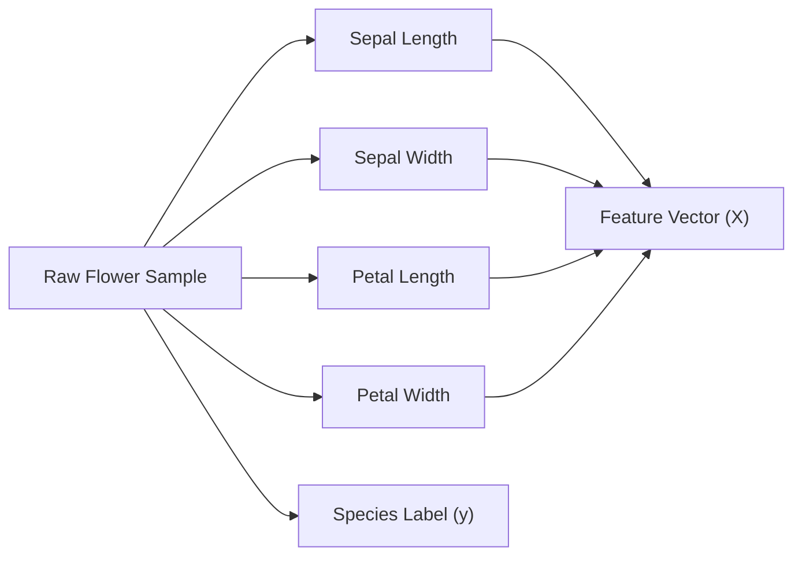
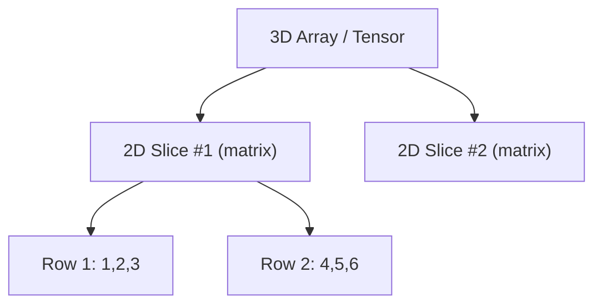
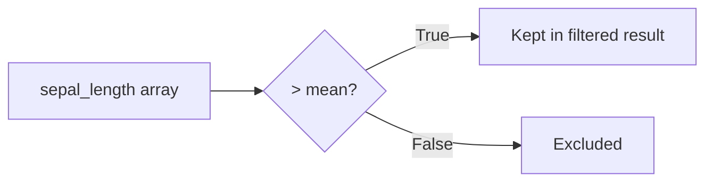
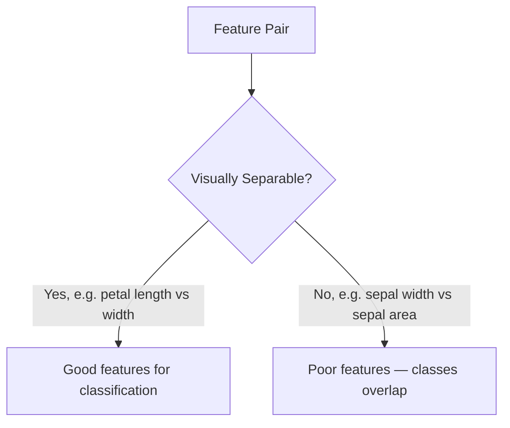
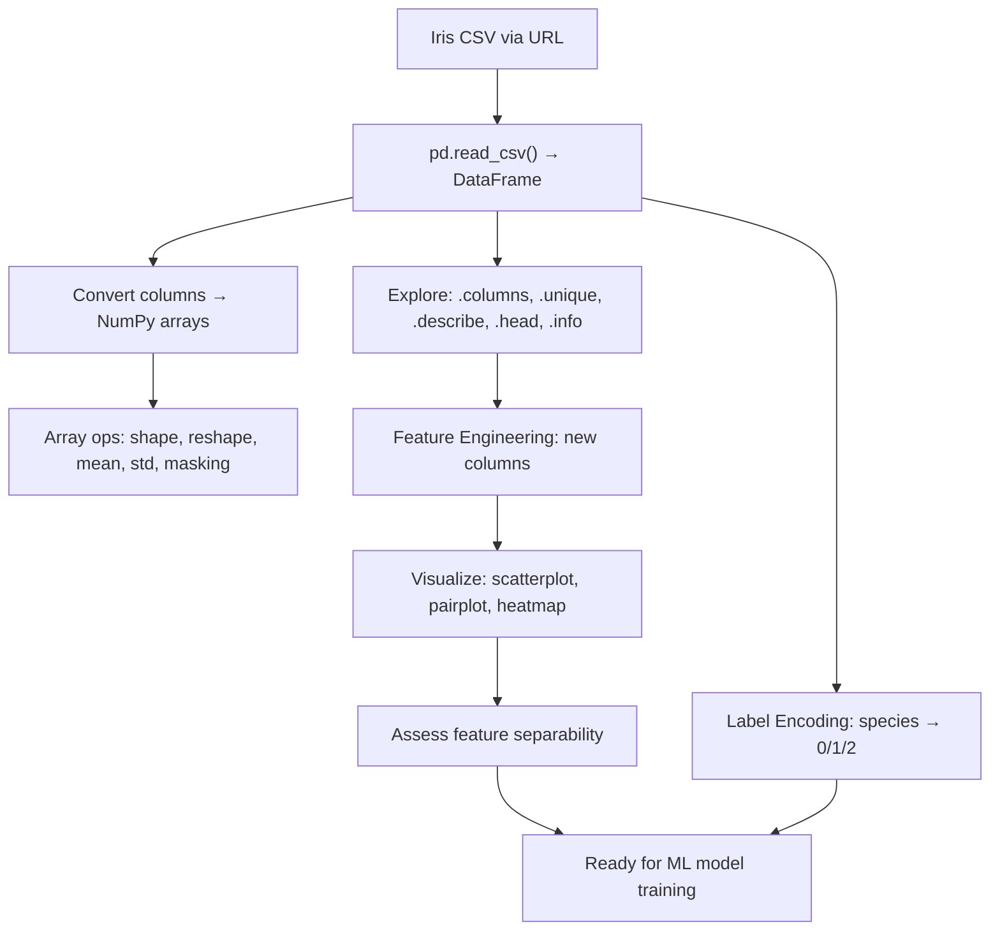

# Lecture 06: Hands-on Python I — Part 1

**Course**: AI for Industrial Cyber-Physical Systems (AI4ICPS) — IIT Kharagpur  
**Duration**: 1:42:05  
**Source**: ai4icps-upskilling.in  

---

## Overview

The second hands-on lab introduces **NumPy** and **pandas**, the two workhorse libraries for numerical computing and tabular data handling in Python's ML stack. Using the classic **Iris flower dataset**, the lecture covers loading real-world data, understanding features vs. labels, N-dimensional arrays, array creation/reshaping, and pandas operations for filtering, describing, feature engineering, and visualization — building the practical foundation needed before touching any ML algorithm.

---

## 1. The Iris Dataset: A Machine Learning Classic `[7:34 – 21:20]`

### 1.1 What's in the Data `[9:15 – 18:11]`

The **Iris dataset** contains 150 samples of flowers, each described by 4 real-valued measurements plus a species label — one of the most-used toy datasets for teaching classification.

| Column | Type | Description |
|---|---|---|
| Sepal length (cm) | float | Length of the sepal (outer flower leaf) |
| Sepal width (cm) | float | Width of the sepal |
| Petal length (cm) | float | Length of the petal (inner flower leaf) |
| Petal width (cm) | float | Width of the petal |
| Species | categorical | `Iris-setosa`, `Iris-versicolor`, or `Iris-virginica` |

> **Jargon**: *Feature* — An input variable measured about each sample (here: the 4 flower measurements). *Label* — The target/output variable you're trying to predict (here: species). Every supervised ML dataset splits into features (X) and a label (y).



> **Jargon**: *Classification Task* — Predicting a discrete category (species) from continuous input features. Contrast with *regression*, which predicts a continuous value.

**Metadata from the UCI ML Repository**: 150 instances, 4 features, 3 balanced classes (50 samples each), no missing values. Baseline models (SVM, XGBoost) reportedly reach ~95–100% accuracy on this dataset — a benchmark students are later challenged to beat.

### 1.2 Session Setup `[0:00 – 7:34]`

Standard Colab workflow recap: **File → New notebook in Drive** to get a fresh, auto-saved-to-Drive notebook; cells can be **Code** or **Text** (markdown) type; clicking **Connect** provisions a backend VM (RAM/CPU) to execute cells.

---

## 2. Loading Data with pandas `[21:20 – 37:00]`

### 2.1 Importing Libraries `[21:20 – 27:00]`

```python
import numpy as np
import pandas as pd
```

> **Jargon**: *Alias (`as np`)* — A shorthand name for an imported module. `np` and `pd` are pure *convention* (not required by the language), but universal enough that any ML codebase you read will use them — deviating makes your code harder for others to follow.

> *Reads as*: "Import numpy but let me refer to it as `np` everywhere in this file, so I don't retype `numpy` on every line." (Analogous to a C `#include` — you're pulling in a library's pre-written functions.)

### 2.2 Reading CSV From a URL `[26:38 – 29:12]`

```python
url = "https://.../iris.data"
columns = ["sepal_length", "sepal_width", "petal_length", "petal_width", "species"]
iris_df = pd.read_csv(url, names=columns)
```

> **Jargon**: *CSV (Comma-Separated Values)* — A plain-text tabular format where each line is a row and commas separate column values. `pd.read_csv()` parses this directly into a structured table.

> **Jargon**: *DataFrame* — pandas's core 2D data structure: rows × labeled columns, like a spreadsheet or SQL table you can manipulate programmatically. `iris_df` is a DataFrame.

Since the raw file has no header row, the `names=` argument supplies column labels learned from the dataset documentation — the loaded DataFrame now has 150 rows × 5 labeled columns.

### 2.3 Exploring Structure `[30:47 – 36:00]`

```python
iris_df.columns          # Index(['sepal_length', 'sepal_width', ..., 'species'])
iris_df["species"].unique()  # array(['Iris-setosa', 'Iris-versicolor', 'Iris-virginica'])
```

> *Reads as*: "`.columns` lists all column names. Indexing a DataFrame with `["colname"]` extracts that single column (a pandas Series); calling `.unique()` on it returns each distinct value exactly once — useful for discovering how many classes/categories exist in a label column."

---

## 3. NumPy Arrays: Dimensions `[38:07 – 56:00]`

> **Jargon**: *NumPy array (`ndarray`)* — A fixed-type, N-dimensional grid of numbers. Unlike Python lists, arrays are stored contiguously in memory and support vectorized math — operations apply to every element at once without an explicit loop, making them dramatically faster than lists for numerical work.

### 3.1 1D Arrays = Vectors `[40:01 – 48:06]`

```python
array_1d = np.array([1, 2, 3, 4, 5])
```

A flat sequence of numbers — also called a **vector**.

### 3.2 2D Arrays = Matrices `[41:14 – 48:06]`

```python
array_2d = np.array([[1, 2, 3],
                      [4, 5, 6],
                      [7, 8, 9]])

print(array_2d.shape)   # (3, 3)  -> 3 rows, 3 columns
print(array_2d.dtype)   # int64   -> default integer type
print(array_2d.ndim)    # 2       -> number of dimensions
```

> *Reads as*: "Each inner `[...]` is one row; the outer `[...]` groups all rows into the full matrix. `.shape` reports `(rows, cols)`, `.dtype` reports the element type, `.ndim` reports how many axes/dimensions the array has."

$$\text{array\_2d} = \begin{pmatrix} 1 & 2 & 3 \\ 4 & 5 & 6 \\ 7 & 8 & 9 \end{pmatrix}$$

| Term | Meaning |
|---|---|
| `.shape` | Tuple of `(dim0_size, dim1_size, ...)` |
| `.dtype` | Element data type (`int64`, `float64`, `int32`, ...) |
| `.ndim` | Number of axes (1 = vector, 2 = matrix, 3+ = tensor) |

### 3.3 3D Arrays = Tensors `[49:41 – 55:07]`

> **Jargon**: *3D array / Tensor* — A stack of 2D matrices. The lecture's mental model: a **Rubik's Cube** is a 3D array made of three 2D layers stacked on top of each other.

```python
arr = np.array([[[1, 2, 3], [4, 5, 6]],
                 [[7, 8, 9], [10, 11, 12]]], dtype=np.int32)
print(arr.dtype)   # int32
print(arr.ndim)    # 3
```



> **Math Note**: *Bit-width & memory* — `int64` reserves 8 bytes per number; `int32` reserves only 4 bytes. Choosing a smaller dtype halves memory usage — a real consideration when arrays scale to millions of elements (e.g. image tensors in deep learning).

---

## 4. Indexing & Slicing 2D Arrays `[56:31 – 59:10]`

```python
array_2d[0, :]     # first row, all columns  -> [1, 2, 3]
array_2d[:, 0]     # all rows, first column  -> [1, 4, 7]
```

> *Reads as*: "Inside the brackets, the syntax is `[row_selector, column_selector]`. A bare `:` means 'take everything along this axis.' `array_2d[0, :]` = row index 0, every column. `array_2d[:, 0]` = every row, column index 0."

| Expression | Meaning | Result (for the 3×3 matrix above) |
|---|---|---|
| `arr[0, :]` | Row 0, all columns | `[1, 2, 3]` |
| `arr[:, 0]` | All rows, column 0 | `[1, 4, 7]` |
| `arr[1, :]` | Row 1, all columns | `[4, 5, 6]` |
| `arr[:, 2]` | All rows, column 2 | `[3, 6, 9]` |

> **Jargon**: *Slicing* — Extracting a sub-portion of an array by specifying index ranges per axis, rather than looping element-by-element. Fundamental to how ML code selects batches, columns, or channels of data.

---

## 5. Array Creation & Reshaping `[1:06:57 – 1:17:00]`

### 5.1 `np.arange` + `.reshape` `[1:06:57 – 1:13:38]`

```python
float_array = np.arange(1.5, 10.5, dtype=np.float64).reshape(3, 3)
```

> *Reads as*: "`np.arange(start, stop)` generates evenly-spaced values from `start` up to (excluding) `stop` — same half-open convention as Python's `range()`. `.reshape(3, 3)` then re-arranges that flat sequence of 9 numbers into a 3×3 grid without changing the underlying data."

> *Example*: `np.arange(1, 9)` → `[1, 2, 3, 4, 5, 6, 7, 8]` (8 elements). `.reshape(4, 2)` → 4 rows × 2 columns. `.reshape(4, 3)` → **error**, since 4×3=12 ≠ 8 elements. `.reshape(2, 2, 2)` → a valid 3D array (2×2×2 = 8 elements).

> **Jargon**: *Reshape* — Reinterprets the same flat block of numbers as a different-dimensional array, as long as the total element count matches. Using `-1` for one dimension tells NumPy "figure this size out automatically" — e.g. `.reshape(4, -1)` on 8 elements infers 2 columns.

**Why this matters for deep learning** (previewed): a grayscale image is a 2D array of pixel intensities; an RGB image is a 3D array (height × width × 3 color channels). Reshaping is constantly used to convert between flat vectors and image-shaped tensors when feeding data into neural networks.

### 5.2 Convenience Constructors `[1:15:02 – 1:17:00]`

```python
np.zeros((2, 3))          # 2x3 array of 0.0 (default dtype int64/float64)
np.ones((2, 3))           # 2x3 array of 1.0
np.full((2, 2), 99)       # 2x2 array where every element is 99
```

| Function | Produces |
|---|---|
| `np.zeros(shape)` | Array filled with `0` |
| `np.ones(shape)` | Array filled with `1` |
| `np.full(shape, value)` | Array filled with a custom `value` |

These are commonly used to **pre-allocate** arrays (e.g. initializing weight matrices or accumulator buffers) before filling them with real values.

---

## 6. NumPy Statistics on Real Data `[1:17:48 – 1:24:37]`

### 6.1 Mean & Standard Deviation `[1:18:32 – 1:20:14]`

```python
sepal_length = np.array(iris_df["sepal_length"])
sepal_width  = np.array(iris_df["sepal_width"])

mean_sepal_length = np.mean(sepal_length)
std_sepal_width   = np.std(sepal_width)
```

> **Jargon**: *`np.mean` / `np.std`* — Vectorized statistical reductions: no explicit summation loop needed. This is the "extra facility" arrays give you over plain Python lists — a single function call replaces hand-written aggregation code.

### 6.2 Boolean Masking `[1:20:52 – 1:24:37]`

```python
large_sepal = sepal_length > mean_sepal_length     # array of True/False
print(sepal_length[large_sepal])                    # only the values > mean

iris_df[iris_df["sepal_length"] > mean_sepal_length]  # matching DataFrame rows
```

> *Reads as*: "Comparing an array to a scalar produces a same-shaped array of booleans (`True` where the condition holds). Using that boolean array to *index* the original array or DataFrame filters it down to only the matching rows — no explicit `for`/`if` loop required."

> **Jargon**: *Boolean Masking* — A vectorized filtering technique: build a `True`/`False` array from a condition, then use it as an index to select matching elements. One of the most common patterns in numerical/data-science Python. 70 of the 150 Iris samples have above-average sepal length in this example.



---

## 7. Pandas Data Exploration `[1:25:13 – 1:33:07]`

### 7.1 Summary Statistics: `.describe()`, `.head()`, `.info()` `[1:25:13 – 1:30:10]`

```python
iris_df.describe()   # count, mean, std, min, quartiles, max — per numeric column
iris_df.head()       # first 5 rows (default n=5)
iris_df[0:10]        # rows 0 through 9 (slice notation works on DataFrames too)
iris_df.info()       # dtypes, non-null counts, memory usage
```

| Method | Purpose |
|---|---|
| `.describe()` | Statistical summary (count, mean, std, min/max, quartiles) per column |
| `.head(n)` | Preview the first `n` rows (default 5) |
| `.info()` | Column dtypes, null counts, memory footprint |

> **Jargon**: *`dtype: object`* — Pandas' catch-all type for non-numeric columns (usually strings). The `species` column shows as `object` since it holds text labels, while the 4 measurement columns show `float64`.

> **Jargon**: *Null / NaN* — A missing value. `.info()`'s "non-null count" equal to the total row count (150) confirms the Iris dataset has **no missing data** — a rare luxury; real-world datasets almost always need cleaning.

### 7.2 Filtering by Label & Feature Engineering `[1:30:32 – 1:33:07]`

```python
iris_s = iris_df[iris_df["species"] == "Iris-setosa"]
print(iris_s.shape)      # (50, 5) -> 50 setosa samples, 5 columns

# Feature engineering: derive a new column from existing ones
iris_df["sepal_area"] = iris_df["sepal_length"] * iris_df["sepal_width"]
```

> **Jargon**: *Feature Engineering* — Creating new input variables by transforming or combining existing ones (here, `sepal_area = length × width`), in hopes the derived feature is more informative for a model than the raw inputs alone. This is a core, often underrated, ML skill — good features can matter more than model choice.

---

## 8. Data Visualization with Seaborn `[1:33:24 – 1:40:04]`

```python
import matplotlib.pyplot as plt
import seaborn as sns

sns.scatterplot(data=iris_df, x="sepal_length", y="sepal_width", hue="species")
plt.title("Sepal Length vs Width by Species")
```

> **Jargon**: *`hue`* — A seaborn parameter that colors points by a categorical column, letting you visually separate classes on a 2D plot.

### 8.1 Visual Separability `[1:34:51 – 1:39:04]`

> **Key insight**: plotting features against each other reveals whether classes are **linearly separable** — i.e., whether a straight line could divide them. *Iris-setosa* separates cleanly from the other two species on sepal measurements; *versicolor* and *virginica* overlap more.



**`sns.pairplot(iris_df, hue="species")`** extends this to *every* feature pair at once in a grid, making it easy to spot which feature combinations best separate the three species. Petal length/width pairs separate classes with clean, near-vertical/horizontal lines; sepal width alone separates poorly.

> **Jargon**: *Pair Plot* — A grid of scatter plots showing every 2-feature combination from a dataset, typically colored by class. A fast way to eyeball which features carry the most discriminative signal before building a model.

### 8.2 Correlation Matrix `[1:39:04 – 1:40:04]`

```python
correlation = iris_df.corr(numeric_only=True)
sns.heatmap(correlation, annot=True, cmap="coolwarm")
```

> **Jargon**: *Correlation Matrix* — A table of pairwise correlation coefficients (–1 to +1) between all numeric columns. `1.0` on the diagonal (a feature always perfectly correlates with itself). High correlation between two features (e.g. sepal length & petal length) suggests they carry overlapping/redundant information.

$$\text{corr}(X, Y) = \frac{\text{Cov}(X, Y)}{\sigma_X \sigma_Y} \in [-1, 1]$$

---

## 9. Label Encoding `[1:40:04 – 1:41:20]`

Machine learning models operate on numbers, not text — string labels must be converted before training.

```python
iris_df["species"] = iris_df["species"].map({
    "Iris-setosa": 0,
    "Iris-versicolor": 1,
    "Iris-virginica": 2
})
iris_df.head()   # 'species' column now shows 0, 0, 0, ... for setosa rows
```

> **Jargon**: *Label Encoding* — Mapping each distinct categorical value to a unique integer. Simple and effective for the *target* label in classification; note that for *input* categorical features, one-hot encoding is often preferred to avoid implying a false numeric ordering (covered in later lectures).

---

## Quick Reference: Key Jargon Glossary

| Term | One-Line Definition |
|------|-------------------|
| Feature / Label | Input variable(s) vs. the target to predict |
| DataFrame | pandas' labeled 2D table structure |
| CSV | Plain-text tabular format, comma-separated |
| NumPy array (`ndarray`) | Fixed-type N-dimensional numeric array with vectorized ops |
| `.shape` / `.dtype` / `.ndim` | Array's dimensions / element type / number of axes |
| Vector / Matrix / Tensor | 1D / 2D / 3D-or-more array |
| Reshape | Reinterpret same data as a different-dimensional array |
| Slicing | Extracting a sub-range of an array along one or more axes |
| Boolean Masking | Filtering an array/DataFrame using a `True`/`False` condition array |
| `.describe()` / `.head()` / `.info()` | pandas summary, preview, and schema inspection methods |
| Feature Engineering | Deriving new informative columns from existing ones |
| Pair Plot | Grid of scatter plots for every feature-pair combination |
| Correlation Matrix | Pairwise linear-relationship strength between numeric columns |
| Label Encoding | Mapping categorical text labels to integers |
| Linear Separability | Whether classes can be divided by a straight line/hyperplane |

---

## Summary



**Key Takeaway**: NumPy gives you fast, vectorized numeric computation (arrays, reshaping, statistics, masking); pandas gives you labeled, tabular data manipulation (loading, filtering, describing, engineering features) built on top of NumPy. Together they form the standard pre-processing pipeline every ML project runs *before* any model ever sees the data — and visualizing feature separability (via scatter/pair plots) is how you sanity-check whether your features are even worth feeding into a classifier.

---

*Notes generated from SRT transcript with timestamps. whisper.cpp (small model, Metal GPU). Enhanced with AI expert annotations.*
