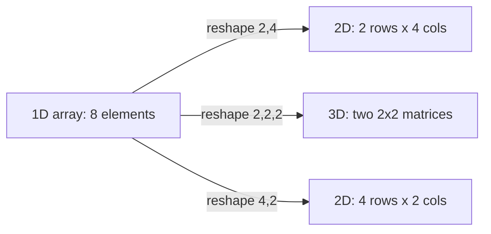
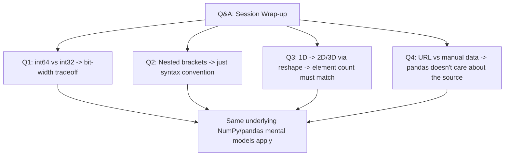

# Lecture 07: Hands-on Python I — Part 2

**Course**: AI for Industrial Cyber-Physical Systems (AI4ICPS) — IIT Kharagpur  
**Duration**: 6:09  
**Source**: ai4icps-upskilling.in  

---

## Overview

A short live Q&A segment closing out the NumPy/pandas hands-on session (Lecture 06). Four student questions are addressed: integer bit-widths in NumPy dtypes, why 2D arrays use nested square brackets, whether/how to reshape a 1D array into 2D or 3D arrays, and how to load feature data manually instead of via URL. Despite its brevity, it reinforces core mental models around memory representation and array dimensionality.

---

## 1. Integer Dtypes: `int64` vs `int32` vs `int16` `[0:00 – 1:49]`

**Question**: What's the difference between "integer" and "integer 64" as a NumPy dtype?

The suffix number specifies **how many bits of memory** are reserved to store each element's binary representation.

| Dtype | Bits | Bytes | Practical Implication |
|---|---|---|---|
| `int64` | 64 | 8 | Default; can represent very large numbers |
| `int32` | 32 | 4 | Half the memory; smaller value range |
| `int16` | 16 | 2 | Even less memory; much smaller value range |

> *Reads as*: "Every number a computer stores is ultimately binary. Allocating more bits lets you represent a wider range of values (and represent them exactly), at the cost of more memory per element. Allocating fewer bits saves memory but caps the maximum representable value."

> **Jargon**: *Bit-width* — The number of binary digits used to encode a value in memory. Doubling the bit-width roughly squares the range of representable integers ($2^{16}$ vs. $2^{32}$ vs. $2^{64}$ possible values). If you don't specify a `dtype`, NumPy defaults to the platform's native width — `int64` on most modern systems.

> **Math Note**: An unsigned $n$-bit integer can represent values from $0$ to $2^n - 1$. For signed integers (allowing negatives), the range shifts to roughly $-2^{n-1}$ to $2^{n-1}-1$. This is why `int64` is preferred for very large numbers, while `int16`/`int32` are chosen to save memory when you know values stay small (e.g. pixel intensities 0–255 comfortably fit in `int8`/`uint8`).

**Practical guidance**: use the smallest dtype that safely covers your data's range — this matters a lot at scale (e.g. large image tensors in deep learning), where memory savings compound across millions of elements.

---

## 2. Why 2D Arrays Use Nested Square Brackets `[1:49 – 2:40]`

**Question**: Why the "double square bracket" (nested `[[...]]`) syntax for 2D arrays?

**Answer**: It's simply Python/NumPy **convention** for expressing nested structure — not a special or magic requirement. Each inner `[...]` represents one row; the outer `[...]` groups all rows into the full 2D array. This is analogous to how mathematical matrix notation nests rows inside an overall bracket.

```python
array_2d = np.array([[1, 2, 3],
                      [4, 5, 6],
                      [7, 8, 9]])
```

> *Reads as*: "The syntax just needs to be parseable and consistent — Python happens to use square brackets `[...]` for both lists and array literals. If a future language design chose angle brackets `<...>` instead, the *concept* of nesting rows inside a container would be identical; only the punctuation would change."

> **Jargon**: *Syntax vs. Semantics* — The *syntax* is the specific characters/punctuation a language requires (square brackets here); the *semantics* is the underlying meaning (an ordered nested collection representing rows and columns). Understanding semantics transfers across languages; syntax does not.

---

## 3. Reshaping 1D Arrays into 2D / 3D Arrays `[2:40 – 4:05]`

**Question**: Can we form a 2D array from a 1D array using `.reshape()`?

**Answer**: Yes — and you're not limited to 2D; you can reshape into 3D or higher-dimensional arrays too, as long as the **total element count matches**.

```python
arr = np.arange(8)                 # 1D array: [0, 1, 2, 3, 4, 5, 6, 7]  (8 elements)

arr.reshape(2, 3)                  # ERROR: 2*3 = 6 ≠ 8 elements
arr.reshape(2, 4)                  # OK: 2 rows x 4 columns  (2*4 = 8)
arr.reshape(2, 2, 2)               # OK: two 2x2 matrices stacked (2*2*2 = 8)
```

> *Reads as*: "`.reshape(d0, d1, ..., dn)` succeeds only when the product of the new dimensions equals the original number of elements. Reshaping never creates or destroys data — it only changes how the same flat sequence of numbers is *interpreted* as rows/columns/layers."



> **Jargon**: *Element-count invariance* — The one hard rule of `.reshape()`: $\text{rows} \times \text{cols} \times \dots = \text{total elements}$, always. Violating it raises a `ValueError`.

**Instructor's suggested exercise**: try reshaping into 4D or 5D arrays and print the results to build intuition — higher-dimensional tensors are exactly what you'll encounter later when handling batches of color images or video in deep learning (e.g. `(batch, height, width, channels)`).

---

## 4. Loading Feature Data Manually (Without a URL) `[4:05 – 6:09]`

**Question**: Can sepal length/width be defined manually instead of pulling from the Iris dataset URL?

**Answer**: Yes — the URL is just one convenient data source; nothing about pandas *requires* fetching from the web.

```python
# Option A: download the file once, then read it locally
iris_df = pd.read_csv("iris.csv", names=["sepal_length", "sepal_width",
                                          "petal_length", "petal_width", "species"])

# Option B: construct data manually
import numpy as np
sepal_length = np.array([5.1, 4.9, 4.7, ...])
sepal_width  = np.array([3.5, 3.0, 3.2, ...])
```

> *Reads as*: "`pd.read_csv()` accepts either a URL or a local file path — the mechanism for parsing comma-separated values is identical either way. If you already have the raw values, you can equally construct NumPy arrays or a DataFrame directly from Python literals, skipping file I/O entirely."

**On column naming**: names like `sepal_length` are just *labels chosen by convention* (matching the dataset's documented feature descriptions) — you're free to name columns anything meaningful to you. What actually matters for a machine learning task is **correctly capturing the underlying measurements**, not the specific column names used to reference them.

> **Jargon**: *Data Source Independence* — A well-written data-loading step doesn't care whether the raw data comes from a URL, a local CSV, a database query, or manually-typed values — as long as it ends up in the same structured format (DataFrame / array) that downstream code expects. This separation of "how data arrives" from "how data is processed" is a good software engineering habit that carries directly into ML pipelines.

**Forward pointer**: this session's classification approach was manual ("draw a separating line by eye" on a scatter plot); subsequent lectures introduce actual **machine learning models** that learn such decision boundaries automatically — for both classification and regression tasks.

---

## Quick Reference: Key Jargon Glossary

| Term | One-Line Definition |
|------|-------------------|
| Bit-width (`int64`/`int32`/`int16`) | Number of memory bits per element; trades range for memory |
| Syntax vs. Semantics | Punctuation rules vs. underlying structural meaning |
| Reshape | Reinterpret a flat array as different dimensions, same element count |
| Element-count invariance | `.reshape()` requires new dims' product = original element count |
| Data Source Independence | Loading logic shouldn't care whether data comes from URL, file, or manual entry |

---

## Summary



**Key Takeaway**: These four questions all trace back to the same theme — understand the *underlying representation* (bits in memory, nested structure, element counts, data-agnostic loading) rather than memorizing surface syntax. That conceptual grasp is what lets you debug confidently and adapt code to new situations, rather than being stuck if a tutorial's exact URL or dataset changes.

---

*Notes generated from SRT transcript with timestamps. whisper.cpp (small model, Metal GPU). Enhanced with AI expert annotations.*
