# Lecture 08: Linear Models Regression Classification Part1

**Course**: AI for Industrial Cyber-Physical Systems (AI4ICPS) — IIT Kharagpur  
**Duration**: 1:09:28  
**Source**: ai4icps-upskilling.in  

---

## Overview

This lecture lays the foundation of supervised machine learning: representation (features), the hypothesis function, and the learning objective (minimizing a loss function). It then walks through **linear regression** end-to-end — from the mean-squared-error loss, to its closed-form (normal equation) solution, to the general-purpose iterative solver **gradient descent** — using the running example of predicting house prices.

---

## 1. What Is Machine Learning? `[02:33 – 07:57]`

### 1.1 The Three Pillars of AI `[02:47 – 03:32]`

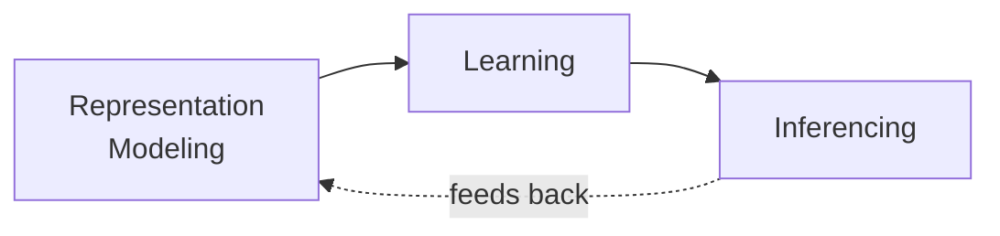

Learning is the process of building a **model** from past data/experience so that the model can be used for prediction, decision-making, or problem solving.

> **Jargon**: *Task* — The problem you're trying to solve (e.g., predict house price). *Data* — The experience (examples) you learn from. *Model* — The function learned from data that solves the task.

### 1.2 Representation, Model, and Algorithm `[05:58 – 07:57]`

Every ML system has three moving parts:

| Component | Question It Answers | Example |
|-----------|---------------------|---------|
| Representation | How is input **x** encoded numerically? | House → [area, bedrooms, material] |
| Model (Hypothesis) | What function form maps x → y? | Linear, quadratic, decision tree, neural net |
| Learning Algorithm | How do we find the *best* model parameters? | Closed-form solution, gradient descent |

> **Jargon**: *Structured vs. Unstructured Data* — Structured data (tables, numeric features) is human-designed. Unstructured data (text, image, video) needs a learned representation — modern neural networks convert it into feature vectors automatically.

---

## 2. Regression vs. Classification `[15:37 – 20:02]`

| Aspect | Regression | Classification |
|--------|-----------|-----------------|
| Output y | Continuous number | Discrete class label |
| Example | House price, remaining useful life of a machine | Cat vs. dog, defective vs. non-defective |
| Decision surface role | Directly computes y | Separates classes (boundary) |

```mermaid
flowchart TD
    A[Input Features x] --> B{Task Type}
    B -->|Numeric target| C[Regression<br/>y = f(x)]
    B -->|Categorical target| D[Classification<br/>decision boundary splits classes]
```

**Real-world regression examples** (from lecture): house price prediction, remaining useful life (RUL) of plant machinery, probability of crack formation in a component, demand forecasting.

**Real-world classification examples**: digit/object recognition, defect detection, credit-card fraud detection.

> **Jargon**: *Remaining Useful Life (RUL)* — A regression target common in industrial/predictive-maintenance settings: how much longer a machine can run before it needs replacement or maintenance.

---

## 3. Representation: Features & the Hypothesis Function `[07:57 – 15:37]`, `[20:02 – 32:11]`

### 3.1 Feature Vectors `[07:57 – 09:19]`

A house is represented as **x** = (x₁, x₂, ..., xₙ) — e.g., area, number of bedrooms, material quality, garage area. This vector is the model's *representation* of the object.

### 3.2 The Hypothesis Function `[20:20 – 21:20]`

The function we learn is commonly called **h** (hypothesis) or **f**, parameterized by **θ** (theta):

$$h_\theta(\mathbf{x}) = \theta_0 + \theta_1 x_1 + \theta_2 x_2 + \dots + \theta_n x_n$$

```python
# Pseudocode: linear hypothesis
def h_theta(x, theta):
    return theta[0] + sum(theta[i] * x[i] for i in range(1, len(theta)))
```

> *Reads as*: "The predicted value is a constant (θ₀) plus a weighted sum of every feature."

### 3.3 Compact (Vector) Notation `[27:06 – 28:14]`

Set **x₀ = 1** (an *augmented* feature), so the bias θ₀ becomes just another weight:

$$h_\theta(\mathbf{x}) = \boldsymbol{\theta}^T \mathbf{x} = \sum_{j=0}^n \theta_j x_j$$

> **Math Note**: *Why θᵀx and not θ·x?* θ and x are conventionally row vectors; transposing θ turns it into a column vector so matrix multiplication (row · column) is well-defined. θᵀx is just notation for the dot product.

> **Jargon**: *Model Parameters (θ)* — The tunable numbers (θ₀, θ₁, ..., θₙ) that define exactly which line/plane/hyperplane the hypothesis represents. Learning = finding the best θ.

```txt
----------------------------------Explanation Starts------------------------------
```
# Matrix Multiplication as a "Column Picture" — House Price Example

## Clarification

- **X = actual data** (feature values from the training examples)
- **θ = parameters** (weights learned by the model)
- Prediction = **Xθ** (data matrix times parameter vector)

## Setup

**θ (parameters, learned by the model) — a single column vector:**

θ = [ 50, 30, 10 ]ᵀ

## Why the ᵀ appears on θ and on the extracted columns

Writing a column vector vertically takes multiple lines:

θ =
[ 50 ]
[ 30 ]
[ 10 ]

To write the *same* column vector inline (one line), the convention is:

θ = [50, 30, 10]ᵀ

Read it as: "write the numbers as a row, then transpose to make it a column."
The ᵀ here does **not** perform any new computation — it's purely a
formatting trick so the column vector fits on one line of text/markdown.

**X (actual data — 3 training examples, each row = one house):**

| | x0 | x1 (size) | x2 (bedrooms) |
|---|---|---|---|
| Row 1 | 1 | 2.1 | 3 |
| Row 2 | 1 | 1.6 | 3 |
| Row 3 | 1 | 2.4 | 4 |

We compute predictions as `Xθ`.

### Same logic applies to the extracted columns of X

The x1 column of X, written vertically, is:

[ 2.1 ]
[ 1.6 ]
[ 2.4 ]

Written inline: [2.1, 1.6, 2.4]ᵀ — same vector, same values, just compact notation.

## The column picture

Since θ is a single column, `Xθ` is one linear combination of the **columns of X**, where each column of X is scaled by the matching entry in θ:

Xθ = 50 · (x0 column) + 30 · (x1 column) + 10 · (x2 column)

Where the columns of X are:

- x0 column = [1, 1, 1]ᵀ
- x1 column = [2.1, 1.6, 2.4]ᵀ
- x2 column = [3, 3, 4]ᵀ

## Step 1 — Scale each column by its θ

| Scaling | Column | Scaled result |
|---|---|---|
| 50 × | [1, 1, 1]ᵀ | [50, 50, 50]ᵀ |
| 30 × | [2.1, 1.6, 2.4]ᵀ | [63, 48, 72]ᵀ |
| 10 × | [3, 3, 4]ᵀ | [30, 30, 40]ᵀ |

## Step 2 — Sum the three scaled columns element-wise

| Row | 50-col | 30-col | 10-col | Sum | Result |
|---|---|---|---|---|---|
| 1 | 50 | 63 | 30 | 50+63+30 | 143 |
| 2 | 50 | 48 | 30 | 50+48+30 | 128 |
| 3 | 50 | 72 | 40 | 50+72+40 | 162 |

## Result

Xθ = [143, 128, 162]ᵀ

| Example | Predicted price h_θ(x) | Actual price y |
|---|---|---|
| 1 | 143 | 400 |
| 2 | 128 | 330 |
| 3 | 162 | 369 |

## Key takeaway

`Xθ` can be read two equivalent ways:

1. **Row picture** (dot products) — each row of X dotted with θ → one prediction per example.
2. **Column picture** (shown above) — each column of X scaled by its matching θ entry, then all columns summed → same result, viewed as "how much each feature contributes to every prediction simultaneously."

Both are the same computation — the column picture just makes visible how much weight (θ) each feature (x0, x1, x2) contributes across the whole dataset at once.

```txt
-----------------------------Explanation Ends---------------------------------------
```

### 3.4 Training vs. Testing Pipeline `[13:54 – 15:04]`, `[23:16 – 24:50]`

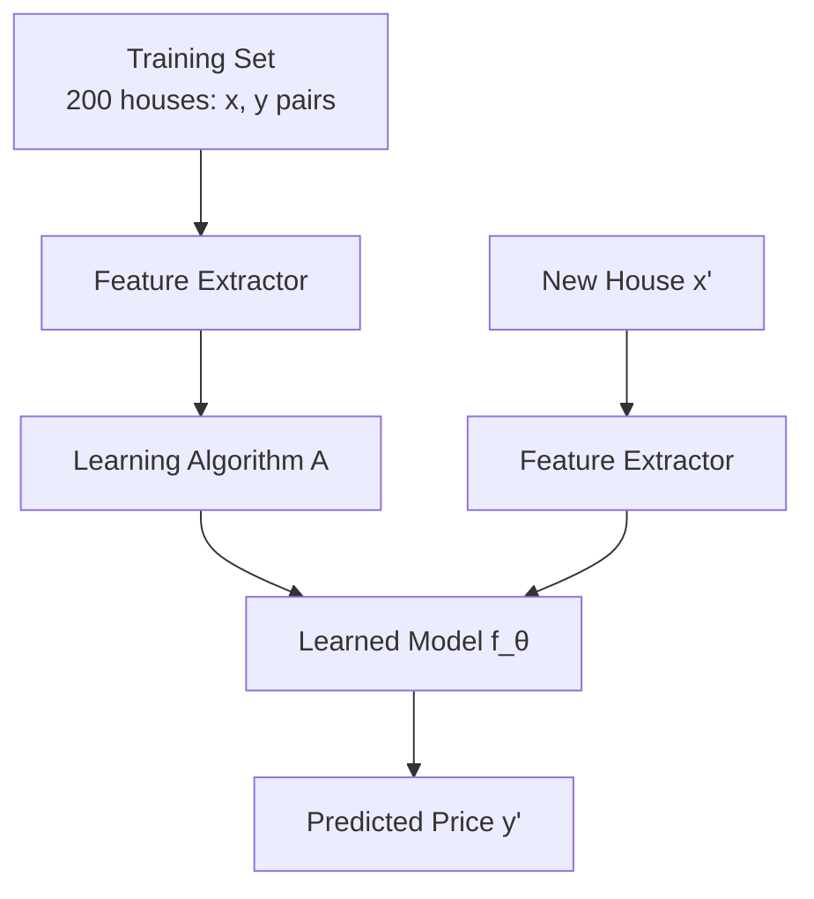

> **Jargon**: *Training Phase* — Using labeled (x, y) data to learn θ. *Testing/Inference Phase* — Applying the learned f_θ to new, unseen x to predict y.

### 3.5 Classification Outputs: Hard Labels vs. Probabilities `[23:49 – 25:20]`

Two ways to output a classification result:

| Style | Output | Example |
|-------|--------|---------|
| Hard label | Single predicted class | "This is *setosa*" |
| Probabilistic (soft) | Probability per class | P(setosa)=0.1, P(versicolor)=0.4, P(virginica)=0.5 |

> *Example*: Soft outputs let you quantify confidence — [0.1, 0.4, 0.5] tells you the model is genuinely unsure between the last two classes, information a hard label would throw away. Taking the `argmax` of the probability vector recovers the hard label.

### 3.6 Worked Example: Iris Classification `[19:23 – 23:16]`

Four features (sepal length/width, petal length/width) predict one of three species (setosa, versicolor, virginica). Using just 2 features (sepal length/width), a **linear decision boundary** can separate setosa from the other two almost perfectly — but versicolor and virginica overlap too much for a single line.

> **AI Expert Note**: This is the classic illustration of *linear separability* — some class pairs are linearly separable, others require non-linear boundaries or more features.

---

## 4. Defining the Loss Function `[32:11 – 44:05]`

### 4.1 Why We Need a Quantitative Error Measure `[34:39 – 37:07]`

Infinitely many lines *could* fit the data — we need a numeric score to compare them and an efficient way to find the best one **without enumerating every possible line**.

### 4.2 From Per-Point Error to Mean Squared Error `[37:07 – 40:25]`

$$\text{error}_i = \hat{y}_i - y_i = h_\theta(x_i) - y_i$$

Squaring avoids positive/negative errors cancelling out:

$$J(\theta) = \frac{1}{2m}\sum_{i=1}^m \left(h_\theta(x_i) - y_i\right)^2$$

```python
# Pseudocode: Mean Squared Error loss
def mse_loss(theta, X, y):
    m = len(y)
    total = sum((h_theta(X[i], theta) - y[i])**2 for i in range(m))
    return total / (2 * m)
```

> *Reads as*: "For every training example, predict ŷ, subtract the true y, square it (kills the sign), sum over all m examples, then divide by 2m."

> *Example*: True price y=50 (lakh), predicted ŷ=45 → squared error = 25. Another point y=30, ŷ=32 → squared error = 4. Total loss (for m=2) = (25+4)/(2×2) = 7.25.

> **Jargon**: *Loss Function / Cost Function* — Used synonymously. A single number summarizing "how wrong" the model is across the whole training set. Lower is better.

| Symbol | Meaning |
|--------|---------|
| m | Number of training examples |
| n | Number of features |
| xᵢ | Feature vector of the iᵗʰ example |
| yᵢ | True label/value of the iᵗʰ example |
| ŷᵢ | Predicted value = h_θ(xᵢ) |
| θⱼ | jᵗʰ model parameter |

> **AI Expert Note**: The `1/2` in front is *purely cosmetic* — it cancels the 2 that appears when differentiating the square term, making the gradient formula cleaner. It does not change which θ minimizes the loss.

### 4.3 Why the Loss Surface Is Convex `[44:24 – 46:09]`

For linear regression, $J(\theta)$ is a **quadratic bowl** in θ-space with exactly **one global minimum** — no risk of getting stuck in a bad local minimum.

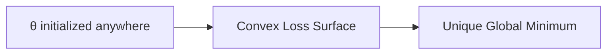

> **Jargon**: *Convex Function* — A function shaped like a bowl; any local minimum is automatically the global minimum. Linear regression's MSE loss is always convex, which is why it has a guaranteed, unique best solution.

---

## 5. Solving for θ: Two Approaches `[46:09 – 1:09:28]`

### 5.1 Approach 1 — Calculus / Closed-Form (Normal Equation) `[46:41 – 52:11]`

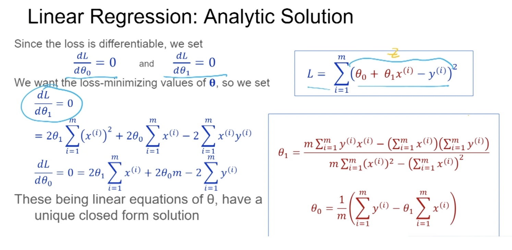

At the minimum of a convex function, the derivative (gradient) is exactly **0**. Setting ∂J/∂θⱼ = 0 for every parameter and solving the resulting system of equations gives an exact formula:

$$\hat{\boldsymbol{\theta}} = (\mathbf{X}^T\mathbf{X})^{-1}\mathbf{X}^T\mathbf{Y}$$

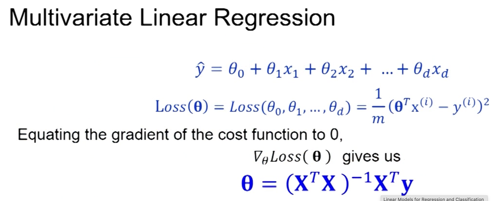

```python
import numpy as np
theta = np.linalg.inv(X.T @ X) @ X.T @ y   # X: (m x n+1) matrix, includes the bias column of 1s
```

> *Reads as*: "There's a direct matrix formula — no iteration needed — that gives you the exact best θ in one shot, as long as (XᵀX) is invertible."

> **Jargon**: *Closed-Form Solution* — An exact algebraic formula, computed in one step, rather than an approximation reached by iterating. Also called the **Normal Equation** for linear regression.

**Limitation**: Closed-form solutions exist for linear regression, but most other model types (logistic regression, neural networks) have no such formula — hence the need for a general iterative method.

### 5.2 Approach 2 — Gradient Descent (Iterative) `[52:23 – 1:09:28]`

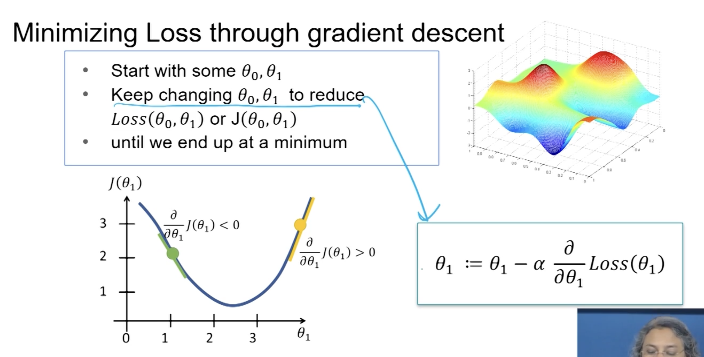

The idea: start with any guess for θ, then repeatedly nudge θ in the direction that reduces the loss, using the slope (gradient) of the loss surface as a compass.

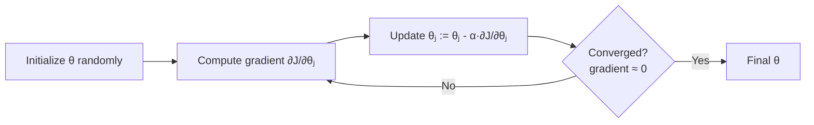

$$\theta_j := \theta_j - \alpha \frac{\partial J(\theta)}{\partial \theta_j}$$

For the MSE loss, the partial derivative works out to a clean closed form:

$$\frac{\partial J(\theta)}{\partial \theta_j} = \frac{1}{m}\sum_{i=1}^m (\hat{y}_i - y_i)\, x_{j}^{(i)}$$

```python
# Pseudocode: one gradient descent step (batch)
def gradient_descent_step(theta, X, y, alpha):
    m = len(y)
    n = len(theta)
    grad = [0] * n
    for j in range(n):
        grad[j] = sum((h_theta(X[i], theta) - y[i]) * X[i][j] for i in range(m)) / m
    new_theta = [theta[j] - alpha * grad[j] for j in range(n)]
    return new_theta
```

> *Reads as*: "For each parameter θⱼ, compute how much increasing it would increase the loss (the gradient), then step *against* that direction, scaled by a small learning rate α."

> *Example*: If the gradient w.r.t. θ₁ is +4 and α = 0.01, the update is θ₁ := θ₁ − 0.01×4 = θ₁ − 0.04 — a small step toward lower loss.

| Symbol | Meaning |
|--------|---------|
| α (alpha) | Learning rate / step size |
| ∂J/∂θⱼ | Partial derivative (gradient) of loss w.r.t. θⱼ |
| Convergence | Point where the gradient ≈ 0 (no more improvement) |

> **Jargon**: *Gradient Descent* — A general-purpose optimization algorithm: repeatedly move parameters opposite to the gradient of the loss until the loss stops decreasing. Works for **any differentiable (or piecewise-differentiable) loss function**, not just MSE — this generality is why it's the workhorse of modern ML, including deep learning.

> **Math Note**: The sign of the gradient tells you which way to move. Positive gradient (loss increasing as θ increases) → *decrease* θ. Negative gradient → *increase* θ. Gradient descent always moves opposite the gradient's sign.

### 5.3 Choosing the Learning Rate α `[1:03:31 – 1:04:23]`

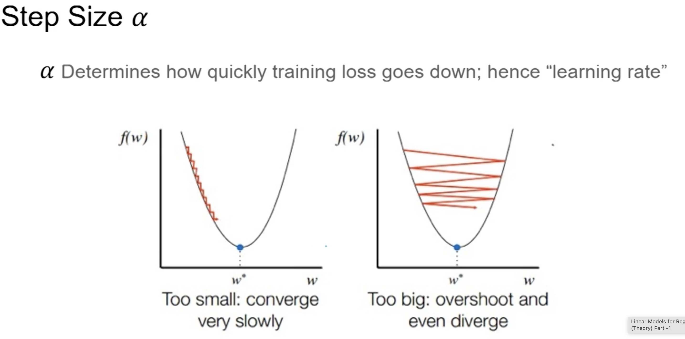

| α too small | α too large |
|-------------|-------------|
| Converges, but takes many iterations (slow) | May overshoot the minimum and fail to converge |
| Safe but inefficient | Risky but fast (if it works) |

**Practical trick**: Start with a larger α to move quickly, then shrink it as the gradient naturally decreases near the minimum (since ∂J/∂θ → 0 as θ → θ*).

> **AI Expert Note**: This is the seed idea behind modern *learning-rate schedules* and adaptive optimizers (Adam, RMSProp) used in deep learning — they automate the "start big, shrink later" strategy.

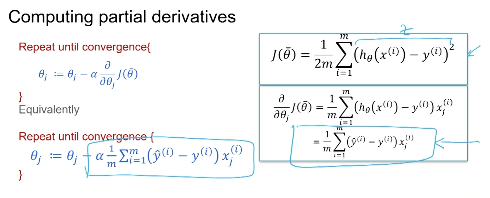
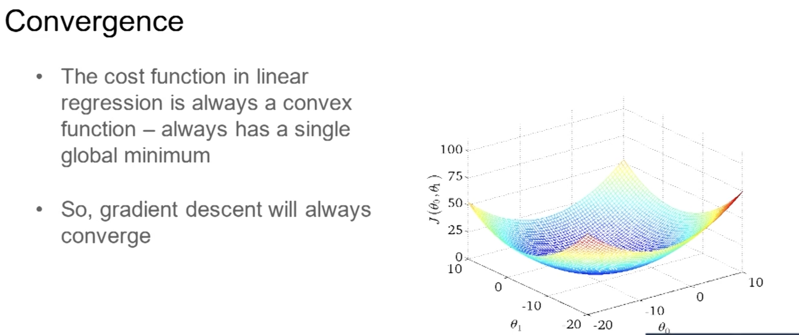

### 5.4 Batch Gradient Descent `[1:08:00 – 1:09:15]`

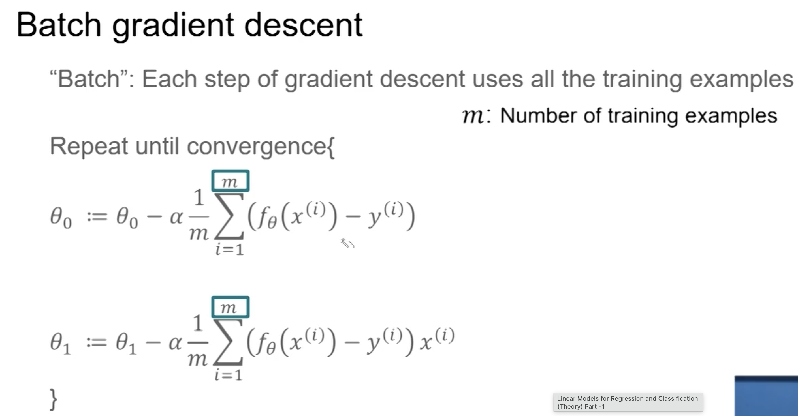


Computing the gradient over **all** m training examples every step is accurate but slow for large datasets. **Batch gradient descent** approximates the gradient using a smaller subset (e.g., 10 of 200 examples) per step.

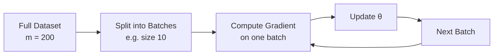

> **Jargon**: *Batch Gradient Descent* — Using a subset of the training data (rather than the full set) to estimate the gradient at each step. Trades a slightly noisier gradient estimate for a large speedup — still provably converges, just potentially needing more (cheaper) steps. (Note: in most modern literature this specific "small subset" variant is called **mini-batch gradient descent**; "batch" alone often refers to using the *full* dataset — be aware both terms appear in practice.)

**Batch GD** is slower per step because it must touch every one of the m examples before taking a single update — but the gradient direction it computes is exact/stable. SGD updates immediately after each example (fast per step, cheap), trading accuracy of direction for update frequency.

There’s also a middle ground — Mini-batch GD — which uses a small subset (e.g., 32/64/128 examples) per update. This is what’s used in practice for large datasets: cheaper than full-batch, less noisy than pure SGD.

Key takeaway: the “batch” in batch GD refers to how many examples are used to estimate one gradient step (all of them), not to a performance optimization trick. If your dataset is huge, batch GD can actually be the slowest option per iteration.

### 5.5 Q&A Highlights from the Lecture

- **Feature order doesn't matter** mathematically — swapping which column is x₁ vs. x₂ just relabels θ's; the learned model is equivalent.
- **New data arriving** → either retrain from scratch or incrementally update θ (both are valid strategies; choice depends on time/resource constraints).
- **Custom loss functions are allowed** — gradient descent works with *any* differentiable (or piecewise-differentiable) loss, not just MSE.
- **MLE and EM are optimization frameworks**, not specific loss functions — they can be paired with different loss/likelihood formulations.

---

## Quick Reference: Key Jargon Glossary

| Term | One-Line Definition |
|------|---------------------|
| Feature Vector | Numeric representation x = (x₁, ..., xₙ) of an object |
| Hypothesis Function (h_θ / f_θ) | The parameterized model that maps x → predicted y |
| Model Parameters (θ) | Tunable weights defining the specific hypothesis |
| Augmented Vector | Prepending x₀ = 1 so bias θ₀ folds into θᵀx |
| Regression | Predicting a continuous numeric output |
| Classification | Predicting a discrete class label |
| Linear Separability | Whether a straight line/hyperplane can fully separate classes |
| Loss/Cost Function J(θ) | Numeric measure of prediction error to minimize |
| Mean Squared Error (MSE) | Average of squared prediction errors |
| Convex Function | Bowl-shaped function; any local min = global min |
| Closed-Form Solution / Normal Equation | Exact one-step algebraic formula for optimal θ |
| Gradient Descent | Iterative optimization: step opposite the gradient to reduce loss |
| Learning Rate (α) | Step size controlling how far each gradient descent update moves |
| Convergence | Point where gradient ≈ 0; no further improvement |
| Batch/Mini-Batch Gradient Descent | Estimating the gradient from a data subset for speed |

---

## Summary

```mermaid
flowchart TD
    A[Training Data<br/>x, y pairs] --> B[Choose Representation<br/>Feature Vector x]
    B --> C[Choose Hypothesis Form<br/>Linear: h_θ = θᵀx]
    C --> D[Define Loss Function<br/>MSE: J(θ)]
    D --> E{Solvable in<br/>Closed Form?}
    E -->|Yes: Linear Regression| F[Normal Equation<br/>θ = (XᵀX)⁻¹XᵀY]
    E -->|No: General Case| G[Gradient Descent<br/>θ := θ - α∇J]
    F --> H[Learned Model f_θ]
    G --> H
    H --> I[Predict y for New x]
```

**Key Takeaway**: Every supervised learning problem reduces to three choices — how to represent the input, what family of functions the hypothesis belongs to, and what loss function measures error — after which learning is *just optimization*. Linear regression is solvable exactly via the normal equation, but gradient descent's real power is that it generalizes to virtually any differentiable model, making it the universal training algorithm of machine learning.

---

*Notes generated from SRT transcript with timestamps. whisper.cpp (small model, Metal GPU). Enhanced with AI expert annotations.*
