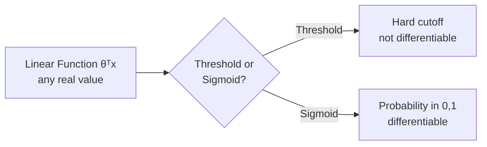
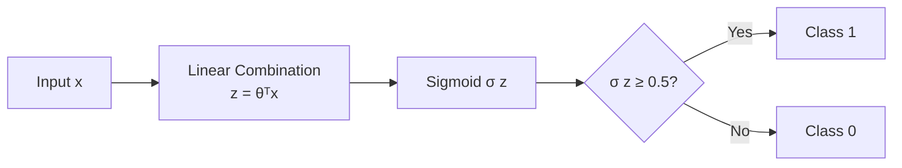
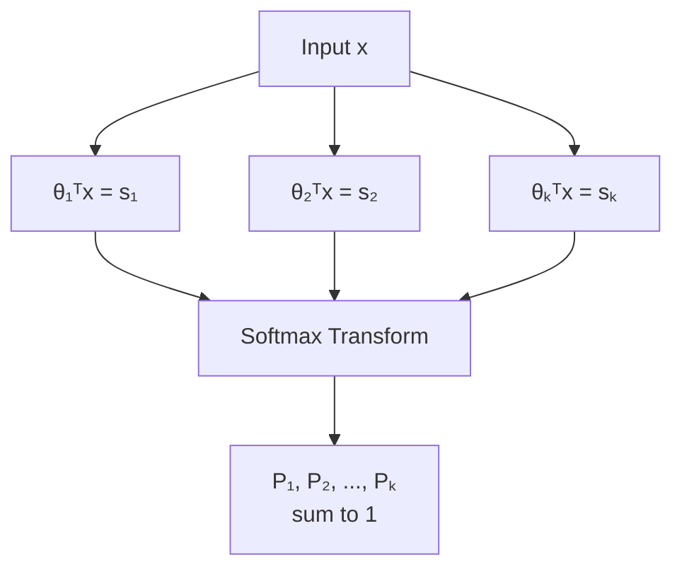
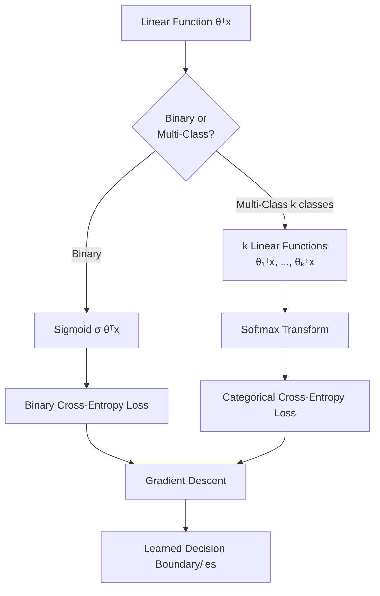

# Lecture 09: Linear Models Regression Classification Part2

**Course**: AI for Industrial Cyber-Physical Systems (AI4ICPS) — IIT Kharagpur  
**Duration**: 40:44  
**Source**: ai4icps-upskilling.in  

---

## Overview

This lecture extends linear models from regression to **classification**, introducing **logistic regression** — a linear model whose output is squashed into a probability via the sigmoid function. It covers the cross-entropy (negative log) loss, its gradient-descent solution, and generalizes to **multi-class classification** via the softmax transformation.

---

## 1. From Regression to Classification: Two Strategies `[00:28 – 03:27]`

A raw linear function θᵀx produces an unbounded numeric value — not directly usable as a class label. Two strategies:

| Strategy | Mechanism | Limitation |
|----------|-----------|------------|
| Hard threshold | If θᵀx > t → class 1, else class 0 | Not differentiable → can't use gradient descent |
| Probability (sigmoid) | Squash θᵀx into [0, 1], interpret as P(class 1) | Smooth, differentiable — usable with gradient descent |



> **AI Expert Note**: The name **logistic regression** is a historical misnomer — despite "regression" in the name, it is a **classification** algorithm. The name comes from the *logistic function* (a.k.a. sigmoid) used to transform the linear output.

---

## 2. The Sigmoid Function `[03:27 – 09:28]`

$$\sigma(z) = \frac{1}{1 + e^{-z}}$$

```python
import math
def sigmoid(z):
    return 1 / (1 + math.exp(-z))
```

> *Reads as*: "Take any real number z, and squash it smoothly into the range (0, 1)."

> *Example*: σ(0) = 0.5, σ(2) = 1/(1+e⁻²) ≈ 0.88, σ(-2) ≈ 0.12. Large positive z → close to 1; large negative z → close to 0.

| Property | Value |
|----------|-------|
| σ(z) as z → +∞ | → 1 |
| σ(z) as z → -∞ | → 0 |
| σ(0) | = 0.5 |
| σ(z) > 0.5 | ⟺ z > 0 |
| σ(z) < 0.5 | ⟺ z < 0 |

> **Jargon**: *Sigmoid (Logistic) Function* — Maps any real number to (0, 1), making it ideal for representing probabilities. It's a smooth, differentiable substitute for a hard step/threshold function — essential because gradient descent requires derivatives.

### 2.1 The Logistic Regression Model `[06:33 – 08:53]`

$$h_\theta(\mathbf{x}) = \sigma(\boldsymbol{\theta}^T \mathbf{x}) = \frac{1}{1+e^{-\theta^T x}}$$

Interpreted as:

$$P(y=1 \mid \mathbf{x}) = h_\theta(\mathbf{x}), \qquad P(y=0 \mid \mathbf{x}) = 1 - h_\theta(\mathbf{x})$$

**Decision rule**: predict class 1 if $h_\theta(\mathbf{x}) \geq 0.5$, which is algebraically equivalent to $\boldsymbol{\theta}^T\mathbf{x} \geq 0$ (since σ(0)=0.5).



> **Jargon**: *Decision Surface/Boundary* — The set of points where σ(θᵀx) = 0.5, i.e., θᵀx = 0. This is the same hyperplane geometry as linear regression, but now it *separates* classes rather than predicting a numeric value directly.

---

## 3. The Cross-Entropy (Negative Log) Loss `[09:28 – 21:00]`

### 3.1 Motivating the Loss `[13:15 – 17:17]`

We want $P(y=1|\mathbf{x})$ close to 1 when the true label is 1, and close to 0 when the true label is 0. Define the per-example loss as **negative log probability of the correct class**:

$$L = -\log(\hat{y}) \quad \text{if } y=1, \qquad L = -\log(1-\hat{y}) \quad \text{if } y=0$$

Combined into a single formula (only the "active" term survives depending on y):

$$L(\theta) = -y\log(h_\theta(\mathbf{x})) - (1-y)\log(1 - h_\theta(\mathbf{x}))$$

```python
import math
def cross_entropy_loss(y, y_hat):
    # y is 0 or 1; y_hat = sigmoid(theta . x), in (0, 1)
    return -y * math.log(y_hat) - (1 - y) * math.log(1 - y_hat)
```

> *Reads as*: "If the true label is 1, only the first term survives (loss = −log ŷ). If the true label is 0, only the second term survives (loss = −log(1−ŷ)). Either way, the loss is 0 only when the model predicts the true class with 100% confidence."

> *Example*: True label y=1, model predicts ŷ=0.9 → loss = −log(0.9) ≈ 0.105 (small, good). If model predicts ŷ=0.1 → loss = −log(0.1) ≈ 2.303 (large, bad — confidently wrong).

**Why negative log, not something else?** As ŷ → 1 (correct, confident), −log(ŷ) → 0. As ŷ → 0 (wrong, confident), −log(ŷ) → ∞ — the loss explodes, heavily penalizing confident wrong answers.

> **Jargon**: *Cross-Entropy Loss* (a.k.a. Log Loss / Negative Log-Likelihood) — The standard loss function for classification. Measures the "distance" between the predicted probability distribution and the true (one-hot) label distribution. Heavily penalizes confident, wrong predictions.

### 3.2 Averaging Over the Training Set `[19:37 – 20:01]`

$$J(\theta) = -\frac{1}{m}\sum_{i=1}^m \left[y_i \log h_\theta(x_i) + (1-y_i)\log(1-h_\theta(x_i))\right]$$

> **AI Expert Note**: This is the *binary cross-entropy* loss used to train virtually every modern binary classifier, from logistic regression to the final layer of deep neural networks.

---

## 4. Solving Logistic Regression: Gradient Descent `[20:01 – 22:12]`

Unlike linear regression, logistic regression's cross-entropy loss has **no simple closed-form solution** — but it *is* still convex (single global minimum), so gradient descent works reliably.

$$\frac{\partial J(\theta)}{\partial \theta_j} = \frac{1}{m}\sum_{i=1}^m (h_\theta(x_i) - y_i)\, x_j^{(i)}$$

$$\theta_j := \theta_j - \alpha \frac{\partial J(\theta)}{\partial \theta_j}$$

```python
def logistic_gradient_step(theta, X, y, alpha):
    m = len(y)
    n = len(theta)
    grad = [0] * n
    for j in range(n):
        grad[j] = sum((sigmoid(dot(theta, X[i])) - y[i]) * X[i][j] for i in range(m)) / m
    return [theta[j] - alpha * grad[j] for j in range(n)]
```

> *Reads as*: "This looks identical in form to linear regression's gradient update — but the crucial difference is that here ŷ = σ(θᵀx), not just θᵀx."

| Model | h_θ(x) | Gradient formula |
|-------|--------|-------------------|
| Linear Regression | θᵀx | (1/m)Σ(ŷᵢ − yᵢ)xⱼ |
| Logistic Regression | σ(θᵀx) | (1/m)Σ(ŷᵢ − yᵢ)xⱼ *(same shape, different ŷ)* |

> **Math Note**: This elegant symmetry isn't a coincidence — it falls out of the calculus: the derivative of σ(z) is σ(z)(1−σ(z)), and this factor cancels neatly with the 1/ŷ from differentiating log(ŷ), leaving the same clean (ŷ−y)x form for both models.

---

## 5. Multi-Class Classification: Softmax `[22:12 – 32:15]`

### 5.1 Why One Model Isn't Enough `[22:41 – 25:01]`

Binary logistic regression separates *one* class from the rest. For **k classes**, learn **k separate linear functions** — one weight vector θᵢ per class:

$$s_i = \boldsymbol{\theta}_i^T \mathbf{x} \quad \text{for } i = 1, \dots, k$$



### 5.2 The Softmax Transformation `[26:51 – 30:03]`

Raw scores s₁, ..., sₖ don't sum to 1 and aren't individually bounded. The **softmax function** converts them into a valid probability distribution:

$$P(y=k \mid \mathbf{x}) = \frac{e^{s_k}}{\sum_{j=1}^K e^{s_j}}$$

```python
import math
def softmax(scores):
    exp_scores = [math.exp(s) for s in scores]
    total = sum(exp_scores)
    return [e / total for e in exp_scores]
```

> *Reads as*: "Exponentiate every raw score (making them all positive), then divide each by the sum of all exponentiated scores — this guarantees the outputs are all positive and sum to exactly 1."

> *Example*: Raw scores s = [2.0, 1.0, 0.1]. exp(s) ≈ [7.39, 2.72, 1.11], sum ≈ 11.22.  
> Softmax ≈ [0.66, 0.24, 0.10] — a valid probability distribution favoring class 1.

> **Jargon**: *Softmax* — The multi-class generalization of the sigmoid. It amplifies the largest score relative to the others (thanks to the exponential) while guaranteeing a valid probability distribution. Used as the final layer of virtually every multi-class neural network classifier.

> **AI Expert Note (from Q&A)**: The exponential isn't the *only* possible choice (e.g., squaring instead of exponentiating also amplifies larger values) — but exp() has clean derivatives and is the overwhelmingly standard choice in practice.

### 5.3 Multi-Class Loss `[30:38 – 32:15]`

For an example belonging to class *k*, only the term for that class contributes to the loss:

$$J(\theta) = -\frac{1}{m}\sum_{i=1}^m \log P(y=y_i \mid x_i)$$

```python
# For each example, only the true class's softmax probability matters
loss_i = -math.log(softmax_probs[true_class_index])
```

> *Reads as*: "For each training example, look up the softmax probability assigned to its *true* class, and take the negative log of just that number. Ignore all the other classes' probabilities for this example — being wrong about a wrong class doesn't matter."

> **Jargon**: *Categorical Cross-Entropy* — The multi-class extension of binary cross-entropy: negative log of the softmax probability assigned to the true class, averaged over all examples.

---

## 6. Q&A Highlights `[32:22 – 40:44]`

- **Choosing an initial θ**: For convex losses (linear/logistic regression), the starting point doesn't matter — gradient descent always reaches the (unique) global minimum. For non-convex losses (e.g., deep neural networks), initialization *does* matter and requires special techniques.
- **How gradient descent finds the minimum**: At any point, if the derivative (slope) is positive, the minimum lies to the *left* (decrease the parameter); if negative, the minimum lies to the *right* (increase the parameter). This holds for *any* function, not just ML loss surfaces.
- **Where's "the estimator" in gradient descent?** The gradient itself — computed as an *average* over m training examples — is a **sample mean**, which is a classic unbiased estimator of the true (population) gradient. Gradient descent is the optimization procedure that uses this estimated gradient.
- **α is always positive**: The direction of movement (increase/decrease θ) is controlled entirely by the *sign of the gradient*, not by α. α only controls step *size*.
- **Choice of model/algorithm**: There's no universal formula — start simple (linear/logistic) and escalate to more complex models only if the data/task demands it.

---

## Quick Reference: Key Jargon Glossary

| Term | One-Line Definition |
|------|---------------------|
| Logistic Regression | Linear model + sigmoid, used for binary classification (despite the name) |
| Sigmoid/Logistic Function | Squashes any real number into (0, 1) |
| Decision Boundary | Hyperplane θᵀx = 0 where predicted probability = 0.5 |
| Cross-Entropy Loss | −log(probability assigned to the true class); standard classification loss |
| Convex Loss | Loss surface with a single global minimum — gradient descent always succeeds |
| Softmax | Multi-class generalization of sigmoid; converts k raw scores into a probability distribution |
| Categorical Cross-Entropy | Multi-class cross-entropy loss using softmax probabilities |
| One-vs-Rest (implicit) | Learning k separate linear classifiers, one per class, then combining via softmax |
| Unbiased Estimator (of gradient) | The sample mean gradient over m examples, used inside gradient descent |

---

## Summary



**Key Takeaway**: Classification with linear models is really "regression + squashing function + a probability-flavored loss." Sigmoid + binary cross-entropy handles two classes; softmax + categorical cross-entropy generalizes this to any number of classes — and both losses remain convex, so the same gradient descent machinery from linear regression carries over unchanged in spirit, just with a different h_θ(x).

---

*Notes generated from SRT transcript with timestamps. whisper.cpp (small model, Metal GPU). Enhanced with AI expert annotations.*
