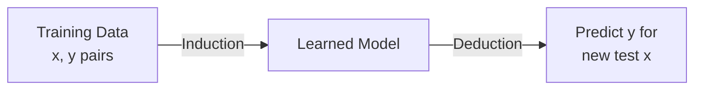
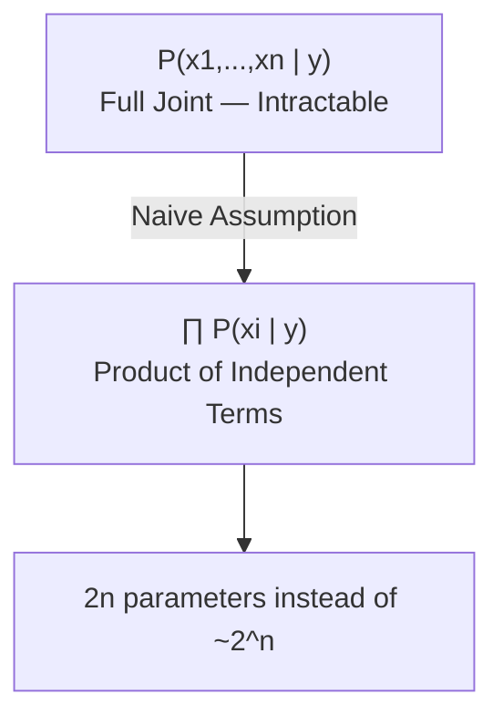
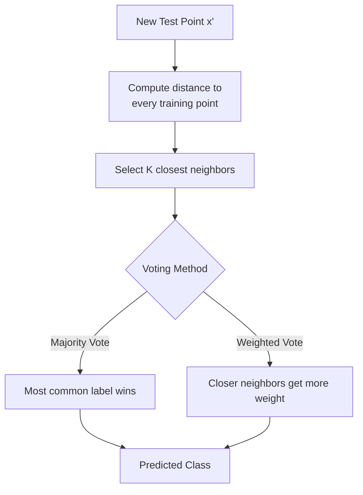
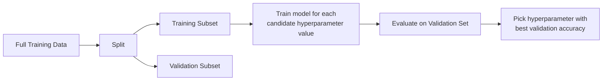
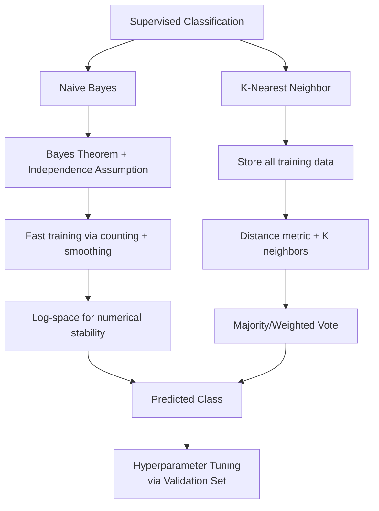

# Lecture 10: Supervised ML I Bayes KNN SVM Part1

**Course**: AI for Industrial Cyber-Physical Systems (AI4ICPS) — IIT Kharagpur  
**Duration**: 54:35  
**Source**: ai4icps-upskilling.in  

---

## Overview

This lecture introduces two classic supervised classifiers beyond linear/logistic regression: the **Naive Bayes classifier** (a probabilistic model built on Bayes' theorem plus a simplifying independence assumption) and the **k-Nearest Neighbor (KNN) classifier** (an instance-based, "lazy" learner). It closes with the essential ML practice of **hyperparameter tuning via cross-validation**.

---

## 1. Classification Recap: Induction & Deduction `[00:51 – 03:45]`

$$\text{Classification} = f(\mathbf{x}) \rightarrow y, \quad \mathbf{x} = \text{attributes/features}, \ y = \text{class label}$$



> **Jargon**: *Induction* — Learning a general model from specific labeled training examples. *Deduction* — Applying that learned model to predict labels for new, unseen inputs.

**Examples discussed**: spam vs. non-spam email (binary), malignant vs. benign tumor (binary), handwritten digit recognition (multi-class).

---

## 2. Naive Bayes Classifier `[04:30 – 35:03]`

### 2.1 Motivating Example: Handwritten Digit Recognition `[04:30 – 09:02]`

A bank automating check processing must read handwritten digits from a scanned check. Each pixel (0/1, "on"/"off") becomes a feature xᵢ; there are n such features (e.g., n=900 for a 30×30 image).

$$\hat{y} = \arg\max_{y \in \{5, 6\}} P(y \mid x_1, \dots, x_n)$$

> *Reads as*: "Compute the probability that the digit is 5 given all pixel values, and the probability it's 6 given the same pixels — predict whichever is larger."

### 2.2 Applying Bayes' Theorem `[09:02 – 13:23]`

$P(y \mid x_1,...,x_n)$ can't be estimated directly (too many combinations), so we flip it using Bayes' rule:

$$P(y \mid x_1, \dots, x_n) = \frac{P(x_1, \dots, x_n \mid y) \cdot P(y)}{P(x_1, \dots, x_n)}$$

| Term | Name | Meaning |
|------|------|---------|
| P(x₁,...,xₙ \| y) | Likelihood | How pixels look, *given* we know the digit being written |
| P(y) | Prior | How often each class occurs overall |
| P(x₁,...,xₙ) | Evidence/Normalizer | Same for every class → can be dropped when comparing classes |

> *Reads as*: "Instead of asking 'what digit is this?' directly (hard), we ask 'if someone deliberately wrote a 5, what would the pixels typically look like?' (easy to estimate from labeled examples), then combine with how common 5s are overall."

> **Jargon**: *Likelihood* — Captures how features are generated *by* a known class. *Prior* — The baseline frequency of each class, independent of any features.

> **AI Expert Note**: Since the denominator P(x₁,...,xₙ) is identical when comparing P(y=5|x) vs. P(y=6|x), it cancels out of the arg max — we only ever need to compute likelihood × prior for each candidate class.

### 2.3 The Naive (Conditional Independence) Assumption `[14:11 – 17:09]`

Modeling the full joint likelihood $P(x_1,...,x_n \mid y)$ requires tracking every possible combination of pixel values — computationally intractable (2×(2ⁿ−1) parameters). **Naive Bayes** simplifies this by assuming features are **conditionally independent given the class**:

$$P(x_1, \dots, x_n \mid y) = \prod_{i=1}^n P(x_i \mid y)$$

```python
# Pseudocode: Naive Bayes likelihood
def naive_likelihood(x, y, feature_probs):
    prob = 1.0
    for i, xi in enumerate(x):
        prob *= feature_probs[i][xi][y]     # P(x_i | y)
    return prob
```

> *Reads as*: "Assume that once you know the digit is '5', each individual pixel's value doesn't depend on any other pixel — only on the fact that the digit is 5. Multiply all n individual pixel probabilities together."

> **Jargon**: *Naive Bayes Assumption* — Treats all features as conditionally independent given the class label. Reduces the parameter count from exponential (2×(2ⁿ−1)) to linear (2n) in the number of features — the key trick that makes the model tractable.



### 2.4 Training: Just Counting `[17:09 – 21:57]`

Because Naive Bayes only needs P(y) and P(xᵢ|y), training is simple **frequency counting**:

$$\hat{P}(y=v) = \frac{\text{count}(y=v)}{\text{total records}}, \qquad \hat{P}(x_i = u \mid y = v) = \frac{\text{count}(x_i=u, y=v)}{\text{count}(y=v)}$$

> *Example*: 100 check leaves, 50 show digit "5", 50 show "6" → P(y=5) = P(y=6) = 0.5. Among the "5" leaves, if pixel #42 was "on" in 40 of them → P(x₄₂=1 | y=5) = 40/50 = 0.8.

### 2.5 Laplace Smoothing `[21:57 – 24:12]`

**Problem**: if a class or feature value never appears in training data, its count is 0 → the resulting probability is 0, which can zero-out the entire product or cause division-by-zero.

$$\hat{P}(x_i = u \mid y=v) = \frac{\text{count}(x_i=u, y=v) + 1}{\text{count}(y=v) + 2}$$

```python
def smoothed_prob(count_xy, count_y, num_feature_values=2):
    return (count_xy + 1) / (count_y + num_feature_values)
```

> *Reads as*: "Pretend you've seen one extra example of every possible feature value, for every class — this nudges zero counts away from exactly zero without materially changing well-populated estimates."

> **Jargon**: *(Laplace) Smoothing* — Adding small pseudo-counts to avoid zero probabilities that would otherwise break the model (division by zero, or a single missing observation zeroing out an entire probability product).

### 2.6 Multi-Class Naive Bayes & a Cautionary Failure Mode `[22:20 – 24:01]`

A binary classifier (trained only on "5" vs "6") will **always** force a prediction into one of those two classes — even for an image of a completely different digit (e.g., "2"). **Fix**: train a full 10-class (0–9) Naive Bayes classifier instead of an artificially restricted binary one; the same math (arg max over all classes) applies unchanged.

### 2.7 Worked Example: Will the Match Be Played? `[24:28 – 28:01]`

| Outlook | Match Played | Match Not Played |
|---------|-------------|-------------------|
| Sunny | 2 | 3 |
| Overcast | 4 | 0 |

Given a new day (sunny, cool, high humidity, windy), compute:

$$P(\text{play}) \propto P(\text{sunny}|\text{play}) \times P(\text{cool}|\text{play}) \times P(\text{high humidity}|\text{play}) \times \dots \times P(\text{play})$$

> *Example*: Likelihood(play) = (2/9)×(3/9)×(3/9)×... ≈ **0.0053**. Likelihood(no play) = (3/5)×(1/5)×(4/5)×... ≈ **0.0206**. Since 0.0206 > 0.0053, predict **no match**.

### 2.8 When the Independence Assumption Fails `[28:01 – 32:01]`

- **Digit recognition**: adjacent pixels are highly correlated (you can't write a "5" with isolated, unrelated dots) — the independence assumption is technically false here.
- **XOR-like functions**: y depends jointly on x₁ AND x₂ in a way that cannot be decomposed into independent per-feature contributions.

> **AI Expert Note**: Despite being "almost never true" in the strict mathematical sense, Naive Bayes remains a strong, fast baseline in practice — a recurring theme in ML: theoretical assumptions don't have to hold perfectly for a model to perform well empirically. This is why it's often the first classifier tried on a new problem.

### 2.9 Floating-Point Underflow & the Log Trick `[32:01 – 34:41]`

Multiplying hundreds/thousands of small probabilities (e.g., 0.5²⁰⁰⁰) underflows to 0 in floating-point arithmetic. **Fix**: work in log-space, where products become sums.

$$\log P(x_1,\dots,x_n \mid y) = \sum_{i=1}^n \log P(x_i \mid y)$$

```python
import math
def log_naive_bayes_score(x, y, feature_probs, prior):
    score = math.log(prior[y])
    for i, xi in enumerate(x):
        score += math.log(feature_probs[i][xi][y])
    return score
# Predict: arg max over y of log_naive_bayes_score(x, y, ...)
```

> *Reads as*: "Instead of multiplying tiny probabilities (which underflows to zero), add their logarithms (numerically stable) — the class with the highest log-score is still the class with the highest actual probability, since log is monotonic."

> **Jargon**: *Floating-Point Underflow* — When a computed value becomes too small for the computer's number representation and is rounded down to 0, losing information. Common when multiplying many probabilities < 1.

---

## 3. K-Nearest Neighbor (KNN) Classifier `[35:37 – 54:35]`

### 3.1 Instance-Based Learning `[35:48 – 38:53]`

Unlike Naive Bayes (which learns summary statistics), KNN is an **instance-based (lazy) learner** — it stores the entire training set and defers computation to prediction time.

| Learner Type | Strategy | Example |
|---------------|----------|---------|
| Rote learner | Memorize training data; classify only on *exact* match | Naive baseline |
| K-nearest neighbor | Find the k *closest* stored examples; vote | KNN |
| Eager learner | Build an explicit model upfront | Decision Tree, Naive Bayes |

> **Jargon**: *Rote Learner* — The simplest (impractical) instance-based method: only classifies a new input if it exactly matches a stored training example. *Lazy Learner* — Defers all computation (distance calculations, voting) until a prediction is actually requested. Contrast with *Eager Learners* (Naive Bayes, Decision Trees) that build a model during training and use it cheaply at test time.

> *Reads as* (lecturer's mnemonic): "If it looks like a duck, walks like a duck, and quacks like a duck — call it a duck." I.e., classify based on similarity to known, labeled examples.

### 3.2 The KNN Algorithm `[38:53 – 47:04]`



**Three ingredients required**: (1) the set of stored training records, (2) a distance metric, (3) the value of k.

### 3.3 Distance Metrics `[43:01 – 44:52]`

| Metric | Formula | Notes |
|--------|---------|-------|
| Euclidean | $\sqrt{\sum_i (p_i - q_i)^2}$ | Straight-line distance |
| Manhattan | $\sum_i \lvert p_i - q_i \rvert$ | Grid/city-block distance |
| Minkowski (qᵗʰ-norm) | $\left(\sum_i \lvert p_i - q_i \rvert^q \right)^{1/q}$ | Generalizes both (q=2 → Euclidean, q=1 → Manhattan) |

> **Jargon**: *Minkowski Distance* — A family of distance metrics parameterized by q; setting q=2 recovers Euclidean distance, q=1 recovers Manhattan distance.

### 3.4 Choosing K and Voting Strategy `[44:52 – 46:59]`

- **K is usually odd** to avoid ties in majority voting.
- **Majority voting**: each of the k neighbors casts one equal vote; most frequent class wins.
- **Weighted voting**: each neighbor's vote is scaled by $\frac{1}{\text{distance}^2}$, so closer neighbors have more influence — this resolves ties and handles cases where the naive majority is misleading (e.g., loan-default prediction where nearer points are more informative than a simple headcount).

```python
def weighted_vote(neighbors_with_labels_and_distances):
    scores = {}
    for label, dist in neighbors_with_labels_and_distances:
        weight = 1 / (dist ** 2 + 1e-9)
        scores[label] = scores.get(label, 0) + weight
    return max(scores, key=scores.get)
```

> *Example*: k=5 neighbors, majority vote gives 3 ticks vs. 2 crosses → predict "tick." But if the 2 crosses are much *closer* to the test point than the 3 ticks, weighted voting (1/distance²) can flip the prediction to "cross" — distance-aware voting captures information a simple headcount misses.

### 3.5 Effect of K `[49:31 – 50:52]`

| K too small | K too large |
|-------------|-------------|
| Sensitive to noise (a single mislabeled neighbor swings the vote) | Neighborhood becomes too broad, washing out local structure |
| High variance | High bias / underfitting |

---

## 4. Hyperparameters & Cross-Validation `[50:06 – 53:02]`

### 4.1 What Is a Hyperparameter? `[50:06 – 50:31]`

K (in KNN) and the choice of distance metric are **hyperparameters** — settings chosen *before* training, not learned from data directly like model parameters (θ).

> **Jargon**: *Hyperparameter* — A configuration choice (e.g., k, learning rate, distance metric) set by the practitioner rather than learned from data via optimization. Contrast with *model parameters* (θ), which the learning algorithm solves for.

### 4.2 The Validation Set Solution `[50:57 – 52:36]`

Since the true test set is unavailable during development, split the **training data** further into an actual training subset and a **validation set**, which acts as a proxy for the test set.



> **Jargon**: *Cross-Validation* — The general practice of holding out part of the training data (a validation set) to tune hyperparameters without ever peeking at the true test set, preventing overly optimistic performance estimates.

---

## Quick Reference: Key Jargon Glossary

| Term | One-Line Definition |
|------|---------------------|
| Induction / Deduction | Learning a model from data / applying it to new inputs |
| Bayes' Theorem | P(y\|x) = P(x\|y)P(y) / P(x); flips a hard probability into two easier ones |
| Likelihood | P(x\|y): how features look, given the class |
| Prior | P(y): baseline frequency of each class |
| Naive Bayes Assumption | Features are conditionally independent given the class label |
| Laplace Smoothing | Adding pseudo-counts to avoid zero probabilities |
| Floating-Point Underflow | Numeric value rounds to 0 from multiplying many small probabilities |
| Log-Sum Trick | Replacing probability products with log-probability sums for numerical stability |
| Instance-Based / Lazy Learner | Defers computation to prediction time; stores raw training data (e.g., KNN) |
| Eager Learner | Builds an explicit model at training time (e.g., Naive Bayes, Decision Tree) |
| K-Nearest Neighbor (KNN) | Classify by majority/weighted vote among the k closest training points |
| Minkowski Distance | General distance metric family (Euclidean/Manhattan are special cases) |
| Hyperparameter | A model setting chosen before training (e.g., k), not learned via optimization |
| Validation Set | Held-out training data used to tune hyperparameters without touching the test set |
| Cross-Validation | Systematic procedure for hyperparameter selection using validation performance |

---

## Summary



**Key Takeaway**: Naive Bayes trades mathematical rigor (the independence assumption rarely holds exactly) for tractability and speed, while KNN trades upfront training effort for expensive-but-simple test-time similarity lookups. Both illustrate a core ML lesson: a model's practical usefulness is judged by validation performance, not by how perfectly its assumptions match reality — and every model has hyperparameters that must be tuned via a held-out validation set, never the test set.

---

*Notes generated from SRT transcript with timestamps. whisper.cpp (small model, Metal GPU). Enhanced with AI expert annotations.*
