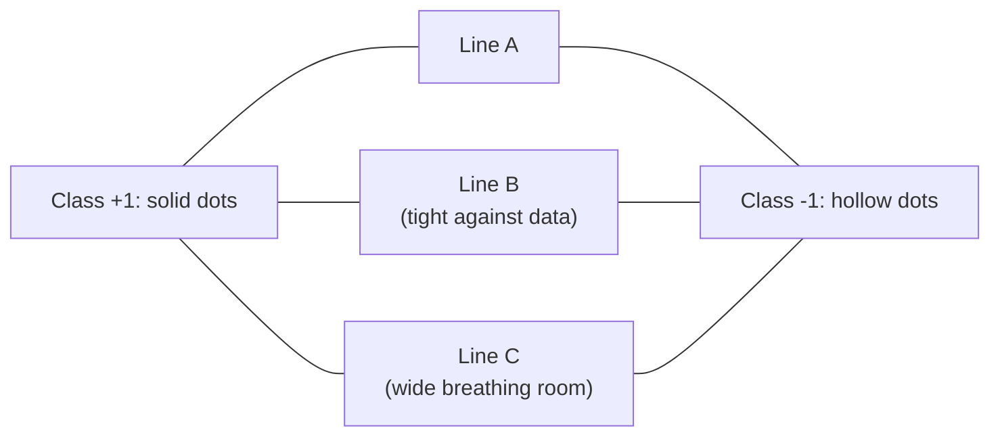
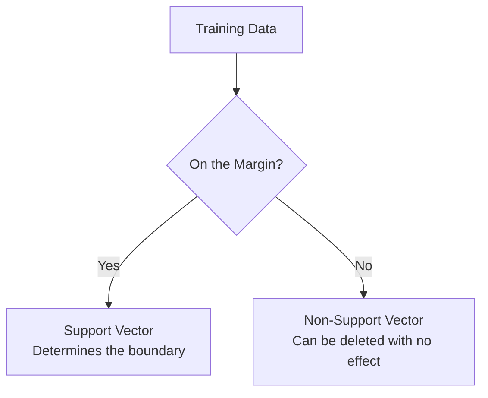
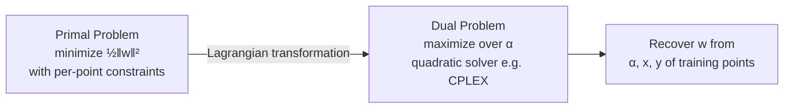
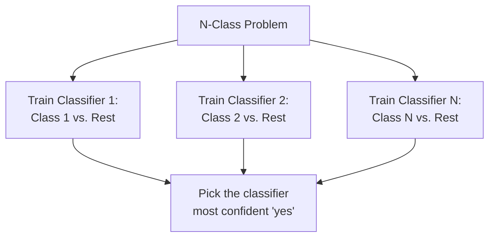
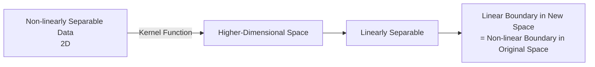
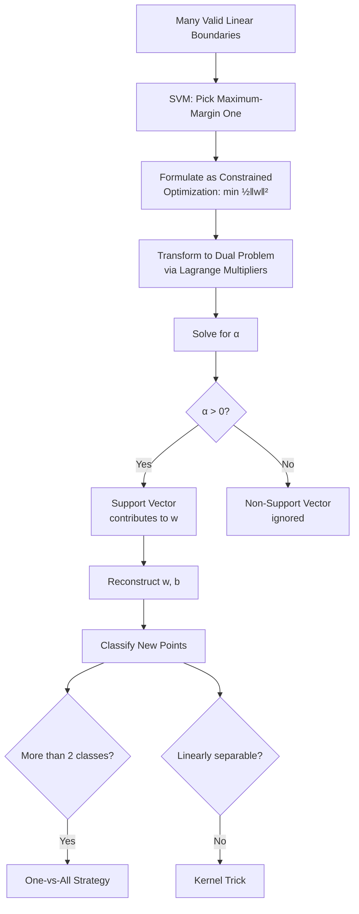

# Lecture 11: Supervised ML I Bayes KNN SVM Part2

**Course**: AI for Industrial Cyber-Physical Systems (AI4ICPS) — IIT Kharagpur  
**Duration**: 37:27  
**Source**: ai4icps-upskilling.in  

---

## Overview

This lecture introduces the **Support Vector Machine (SVM)** — a linear classifier distinguished by its principled way of choosing *the best* decision boundary among infinitely many candidates: the one with the **maximum margin**. It covers the geometric intuition, a light mathematical formulation (primal → dual problem, Lagrange multipliers), support vectors, multi-class extension, and non-linear SVMs via kernels, closing with practical Q&A on distance metrics and model selection.

---

## 1. The Problem: Too Many Valid Decision Boundaries `[00:20 – 03:10]`

Given linearly separable classes, *any* line that separates them technically "works" — but some choices generalize better than others.



> **AI Expert Note**: All three lines above achieve 0% training error. The question SVM answers is: *which one will generalize best to new, unseen data?*

---

## 2. Maximum Margin Classification `[03:10 – 07:17]`

### 2.1 Defining the Margin `[03:10 – 05:07]`

> **Jargon**: *Margin* — The width by which the decision boundary could be expanded (on both sides) before touching any training data point. A large margin means lots of empty "buffer space" around the boundary.

**SVM's core principle**: among all valid separating hyperplanes, choose the one with the **maximum margin**.

### 2.2 Why Maximum Margin Is Preferred `[05:16 – 07:17]`

| Property | Benefit |
|----------|---------|
| Low error risk | A new point near the boundary is less ambiguous — more "buffer" before crossing into the wrong class's territory |
| Robust to small boundary shifts | A slightly mis-estimated boundary still classifies most points correctly |
| Immune to non-support-vector removal | Deleting a point far from the boundary doesn't change the solution at all |
| Strong empirical performance | Works well across many real-world problems, not just in theory |

> *Example*: If your decision boundary sits right on top of the data, a new point that's genuinely closer to class −1's cluster might fall on the +1 side purely due to boundary placement noise — a wide margin reduces this risk.

---

## 3. Support Vectors `[04:38 – 05:04]`

> **Jargon**: *Support Vectors* — The specific training data points that lie exactly on the margin boundary ("pushing up against it"). They are the only points that determine the decision boundary — this is where the algorithm's name comes from.



---

## 4. Mathematical Formulation `[07:24 – 21:46]`

### 4.1 Vector Norm Refresher `[09:27 – 11:56]`

$$\lVert \mathbf{w} \rVert = \sqrt{\sum_i w_i^2} = \sqrt{\mathbf{w}^T\mathbf{w}}$$

> **Jargon**: *Norm* — The length/magnitude of a vector. Unlike a scalar (a plain number), a vector has both magnitude *and* direction; dividing a vector by its norm gives a unit vector pointing in the same direction.

### 4.2 Positive and Negative Hyperplanes `[12:07 – 14:17]`

The decision boundary sits exactly between two parallel "supporting" planes:

$$\text{Decision boundary:} \quad \mathbf{w}^T\mathbf{x} + b = 0$$
$$\text{Positive plane (+pen):} \quad \mathbf{w}^T\mathbf{x} + b = +1$$
$$\text{Negative plane (−pen):} \quad \mathbf{w}^T\mathbf{x} + b = -1$$

> *Reads as*: "The decision boundary is the zero-crossing of a linear function; the two supporting planes are where that same function equals exactly +1 and −1 — the margin is the gap between them."

### 4.3 Combined Constraint `[14:17 – 15:10]`

Multiplying by the true label $y_i \in \{+1,-1\}$ produces a single unified constraint for *every* training point, correctly classified or not:

$$y_i(\mathbf{w}^T\mathbf{x}_i + b) \geq 1 \quad \forall i$$

```python
# Pseudocode: constraint check for one training example
def satisfies_margin(x_i, y_i, w, b):
    return y_i * (dot(w, x_i) + b) >= 1
```

> *Reads as*: "For positive-class points, wᵀx+b is already ≥1, and yᵢ=+1, so the product stays ≥1. For negative-class points, wᵀx+b ≤ −1, and yᵢ=−1, so multiplying two negatives again gives a product ≥1. One inequality covers both classes."

### 4.4 The Margin Width Formula `[15:16 – 16:03]`

$$\text{Margin} = \frac{2}{\lVert \mathbf{w} \rVert}$$

> **AI Expert Note**: The full derivation (projecting the gap between the +1 and −1 planes onto the direction of **w**) is skipped in-lecture for time, but the takeaway is simple: **maximizing the margin ⟺ minimizing ‖w‖** (equivalently, minimizing ½‖w‖², which is smoother/easier to optimize).

### 4.5 The Optimization Problem: Primal Form `[16:03 – 17:51]`

$$\min_{\mathbf{w}, b} \frac{1}{2}\lVert \mathbf{w} \rVert^2 \quad \text{subject to} \quad y_i(\mathbf{w}^T\mathbf{x}_i + b) \geq 1 \ \ \forall i$$

> **Jargon**: *Constrained Optimization* — Finding the best values of variables (here, **w**, b) subject to a set of inequality/equality restrictions, rather than minimizing freely. *Primal Problem* — The original formulation of the optimization task, before any mathematical transformation.

### 4.6 The Dual Problem & Lagrange Multipliers `[18:03 – 20:15]`

Directly solving the constrained primal is hard. SVM theory transforms it into an equivalent **dual problem** using **Lagrange multipliers** αᵢ (one per training point):

$$\max_{\alpha} \sum_i \alpha_i - \frac{1}{2}\sum_{i,j}\alpha_i \alpha_j y_i y_j \mathbf{x}_i^T\mathbf{x}_j \quad \text{s.t. } \alpha_i \geq 0, \ \sum_i \alpha_i y_i = 0$$



> **Jargon**: *Lagrange Multiplier (α)* — An auxiliary variable, one per constraint, introduced to convert a constrained optimization problem into an unconstrained (or differently-constrained) one that's easier to solve. *Dual Problem* — A reformulated optimization problem whose solution recovers the original (primal) solution, often much easier to compute.

> **AI Expert Note**: This transformation is standard convex optimization machinery (KKT conditions) — the lecture intentionally skips the full derivation; interested learners should consult a dedicated optimization tutorial or textbook.

### 4.7 The Punchline: Sparsity of Support Vectors `[20:30 – 22:49]`

After solving the dual problem, **most αᵢ turn out to be exactly 0**. Only the points with αᵢ > 0 — the **support vectors** — contribute to the final weight vector:

$$\mathbf{w} = \sum_{i \in \text{support vectors}} \alpha_i y_i \mathbf{x}_i$$

```python
# Pseudocode: reconstruct w from only the support vectors
def compute_weight_vector(support_vectors, alphas, labels):
    w = zeros(dim)
    for alpha_i, y_i, x_i in zip(alphas, labels, support_vectors):
        w += alpha_i * y_i * x_i
    return w
```

> *Reads as*: "The decision boundary only 'cares about' the handful of training points sitting right at the margin — every other point could be deleted from the training set without changing the answer at all."

| Symbol | Meaning |
|--------|---------|
| w | Weight vector defining the decision boundary's orientation |
| b | Bias term (offset from origin) |
| αᵢ | Lagrange multiplier for training point i; non-zero only for support vectors |
| yᵢ | True label of point i (+1 or −1) |
| xᵢ | Feature vector of point i |

---

## 5. SVM vs. KNN: Efficiency `[25:49 – 26:44]`

| Aspect | KNN | SVM |
|--------|-----|-----|
| Test-time cost | Compute distance to *every* training point | Compute using only a handful of support vectors |
| Storage | Store entire training set | Store only support vectors |
| Speed | Slow, especially with large training sets | Faster, since support vectors are typically a small subset |
| Theoretical backing | Weaker (heuristic similarity) | Strong (convex optimization guarantees) |

> **AI Expert Note**: This is the core structural advantage of SVM over KNN — by reducing "the whole dataset" down to "just the support vectors," SVM turns an expensive per-query search into a cheap, fixed computation.

---

## 6. Beyond Binary: One-vs-All `[26:53 – 27:45]`

Unlike Naive Bayes (which naturally handles multi-class via arg max), SVM is inherently binary. Multi-class problems use the **one-vs-all (OvA)** strategy:



> **Jargon**: *One-vs-All (OvA) / One-vs-Rest* — A strategy for extending binary classifiers to multi-class problems: train one binary classifier per class (that class vs. everything else), then combine their outputs (e.g., pick the class whose classifier is most confident).

---

## 7. Non-Linear SVM: The Kernel Trick `[27:48 – 29:11]`

Basic SVM only finds *linear* decision boundaries. When classes require a curved boundary (e.g., one class enclosed in a circle inside another), a **kernel function** implicitly maps data into a higher-dimensional space where a linear separator *does* exist.



> **Jargon**: *Kernel Trick* — A technique that lets SVM find non-linear decision boundaries by implicitly operating in a higher-dimensional feature space (via a kernel function), without ever explicitly computing the (potentially infinite-dimensional) transformed coordinates. Common kernels: polynomial, radial basis function (RBF/Gaussian).

> **AI Expert Note**: The lecture only introduces the *concept* here; common kernel choices (RBF, polynomial) and their hyperparameters (e.g., γ for RBF) are typically covered in follow-up hands-on sessions.

---

## 8. Trade-offs & Wrap-Up `[29:16 – 29:43]`

| Model | Training Cost | Test Cost | Space |
|-------|---------------|-----------|-------|
| Naive Bayes | Low (counting) | Low | Low |
| KNN | None (lazy) | High (compare to all points) | High (store all data) |
| SVM | High (quadratic optimization) | Low (only support vectors) | Moderate (store support vectors) |

---

## 9. Q&A Highlights `[30:06 – 37:04]`

### 9.1 Choosing a Distance Metric (KNN) `[30:12 – 34:01]`

> *Example*: Measuring the distance between two cities' lat/long coordinates with **Euclidean distance** gives the "as the crow flies" aerial distance — useful for placing a loudspeaker or radio tower, but *meaningless* for a delivery driver who must follow actual roads. In a grid-like road network (like Manhattan), the driver's real travel distance matches **Manhattan distance** far better.

> **AI Expert Note**: The general principle — pick the distance metric that matches how "closeness" is actually defined in your application, not just whichever is mathematically convenient.

### 9.2 How to Choose the Best Classifier `[34:10 – 35:38]`

Reiterates the cross-validation workflow from Part 1: split training data into training + validation subsets, train multiple candidate models/algorithms, evaluate each on the validation set (where true labels are known), and pick the one with the best validation accuracy.

### 9.3 Which Points Fall on the Margin? `[35:44 – 36:29]`

Re-emphasizes: the margin is defined as the maximal region around the decision boundary containing no training points; the points that lie exactly on its edges (on either side) are the support vectors used to compute predictions for new test points.

---

## Quick Reference: Key Jargon Glossary

| Term | One-Line Definition |
|------|---------------------|
| Margin | Buffer zone around the decision boundary with no training points inside |
| Support Vector | A training point lying exactly on the margin boundary; determines the classifier |
| Maximum Margin Classifier | The SVM principle: choose the separating hyperplane with the widest margin |
| Norm (‖w‖) | The length/magnitude of a vector |
| Primal Problem | The original constrained optimization formulation |
| Dual Problem | An equivalent, often easier-to-solve reformulation via Lagrange multipliers |
| Lagrange Multiplier (α) | Auxiliary variable per constraint, used to solve constrained optimization |
| One-vs-All (OvA) | Extending binary classifiers to multi-class by training one classifier per class vs. the rest |
| Kernel Trick | Implicitly mapping data to higher dimensions to enable non-linear SVM boundaries |
| Manhattan Distance | Grid-based ("city block") distance metric; sum of absolute coordinate differences |

---

## Summary



**Key Takeaway**: SVM resolves the "which decision boundary is best?" ambiguity inherent to linear classifiers by choosing the one with maximum margin — a choice with strong theoretical (convex optimization) and empirical backing. Its most elegant property is sparsity: the final model depends on only a small subset of training points (the support vectors), making SVM both fast at test time and naturally extensible to non-linear problems via the kernel trick.

---

*Notes generated from SRT transcript with timestamps. whisper.cpp (small model, Metal GPU). Enhanced with AI expert annotations.*
