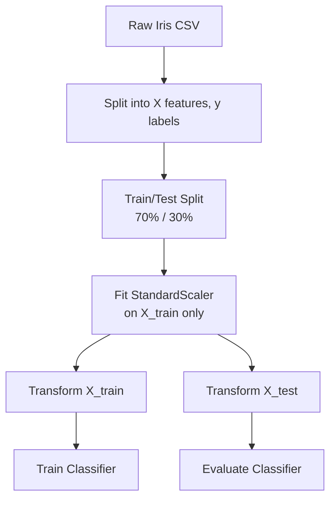
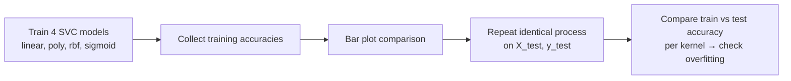
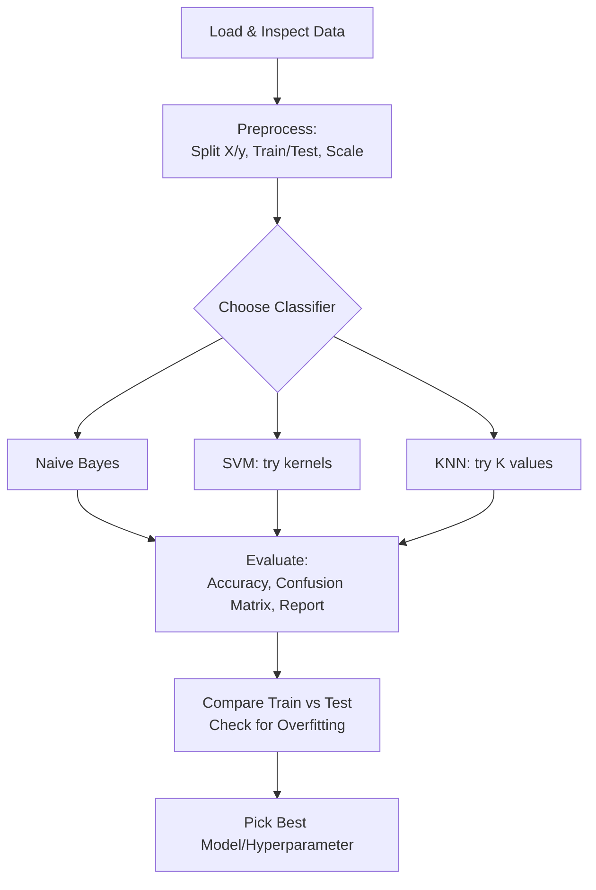
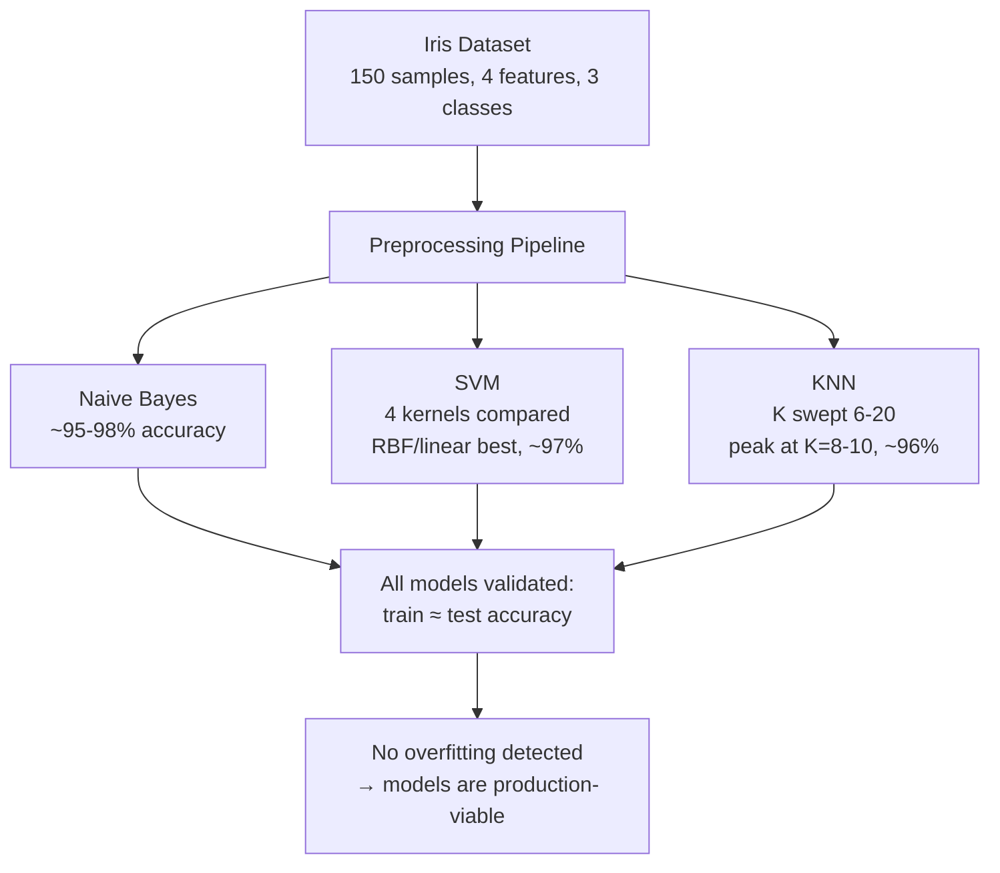

# Lecture 12: Hands on ML I Supervised ScikitLearn

**Course**: AI for Industrial Cyber-Physical Systems (AI4ICPS) — IIT Kharagpur  
**Duration**: 2:04:12  
**Source**: ai4icps-upskilling.in  

---

## Overview

This is a hands-on lab session that implements the classifiers covered in the two preceding theory lectures (Naive Bayes, SVM, KNN) on the classic **Iris dataset** using Python's `scikit-learn` in Google Colab. It walks through the full supervised-learning pipeline — loading data, preprocessing, train/test split, feature scaling, model fitting, and evaluation (confusion matrix, classification report) — while emphasizing the *practical* workflow for comparing models and tuning hyperparameters.

---

## 1. Setup: Environment & Imports `[00:00 – 09:56]`

The session uses **Google Colab** (a free, browser-based Jupyter notebook environment). Code and a companion explanatory PDF are shared via GitHub.

```python
import numpy as np
import pandas as pd
import matplotlib.pyplot as plt
import seaborn as sns
from sklearn.metrics import accuracy_score, confusion_matrix, classification_report
```

| Package | Role |
|---------|------|
| `numpy` | Array/numerical operations |
| `pandas` | DataFrame manipulation (tabular data) |
| `matplotlib.pyplot` | MATLAB-style plotting |
| `seaborn` | Statistical visualization built on matplotlib; adds color palettes (used for the confusion matrix heatmap) |
| `sklearn.metrics` | Evaluation utilities: accuracy, confusion matrix, precision/recall report |

> **AI Expert Note**: This import list is the near-universal "starter kit" for any classical ML workflow in Python — expect to see this same block at the top of almost every scikit-learn notebook.

---

## 2. Loading & Understanding the Iris Dataset `[10:07 – 30:16]`

### 2.1 Downloading from a Web Link `[12:01 – 22:36]`

```python
path = "<UCI Iris dataset URL>"
header_names = ['sepal-length', 'sepal-width', 'petal-length', 'petal-width', 'class']
data = pd.read_csv(path, names=header_names)
data.shape   # (150, 5)
```

> **Jargon**: *Secondary Data* — Data collected by someone else and reused (e.g., downloaded from UCI/Kaggle/a web link) — contrast with *Primary Data*, which you collect yourself (lab experiments, IoT sensors, surveys). Understanding *how* data was collected matters for spotting noise or preprocessing needs.

### 2.2 Dataset Structure `[22:52 – 29:32]`

| Property | Value |
|----------|-------|
| Samples | 150 total, 50 per class |
| Features | sepal-length, sepal-width, petal-length, petal-width (4 numeric features) |
| Target | class: *Iris-setosa*, *Iris-versicolor*, *Iris-virginica* |
| Index layout | 0–49: setosa, 50–99: versicolor, 100–149: virginica (Python is 0-indexed) |
| Origin | R.A. Fisher's classic 1936 paper; hosted on the UCI ML Repository |

```python
data.head()   # inspect first 5 rows
```

> *Reads as*: "`.head()` shows the first 5 rows (indices 0–4) — since the dataset is sorted by class, these will all be *setosa*."

---

## 3. Data Preprocessing `[30:34 – 41:07]`

### 3.1 Splitting Features (X) and Target (y) `[30:41 – 34:39]`

```python
X = data.iloc[:, :-1].values   # all rows, all columns except the last (features)
y = data.iloc[:, 4].values     # all rows, column index 4 (the class label)
```

> **Jargon**: *`.iloc`* — Pandas' **i**nteger-**loc**ation indexer; selects rows/columns by numeric position rather than by label name. `[:, :-1]` reads as "all rows, all columns except the last."

### 3.2 Train/Test Split `[34:49 – 38:42]`

```python
from sklearn.model_selection import train_test_split
X_train, X_test, y_train, y_test = train_test_split(X, y, test_size=0.30)
```

With 150 samples and a 70/30 split: **105 training samples, 45 test samples**.

| Split ratio | When used |
|-------------|-----------|
| 70% train / 30% test | Common default for smaller datasets |
| 80% train / 20% test | Also widely used |

> **AI Expert Note**: Because `train_test_split` randomly shuffles the data by default, re-running the notebook produces a *different* random split each time — this is why different students following the exact same code got slightly different accuracy numbers (discussed further in §6.1).

### 3.3 Feature Scaling (Standardization) `[38:53 – 43:34]`

$$x_{\text{scaled}} = \frac{x - \mu}{\sigma}$$

```python
from sklearn.preprocessing import StandardScaler
scaler = StandardScaler()
scaler.fit(X_train)                        # learns mean (μ) and std-dev (σ) from training data only
X_train = scaler.transform(X_train)        # (X_train - μ) / σ
X_test = scaler.transform(X_test)          # (X_test  - μ) / σ  — using the TRAINING set's μ, σ!
```

> *Reads as*: "Compute the mean and standard deviation from the *training* data, then use those same statistics to rescale both the training set and the test set — this keeps them on a consistent numeric scale without letting any test-set information leak into training."

> **Jargon**: *Feature Scaling / Standardization* — Rescaling features (which may originally span very different ranges, e.g., 0–750 vs. 0–250) onto a common scale (mean 0, standard deviation 1) so that no single feature dominates a distance- or gradient-based algorithm purely due to its numeric range.

> **AI Expert Note**: Critically, `scaler.fit()` is called **only on `X_train`**. The test set is *transformed* using the training set's mean/std, never re-fit. Fitting the scaler on test data would leak test-set statistics into the pipeline — a subtle but common bug called *data leakage*.



---

## 4. Naive Bayes in Practice `[43:44 – 1:10:45]`

### 4.1 Gaussian Naive Bayes `[43:56 – 45:01]`

```python
from sklearn.naive_bayes import GaussianNB
classifier = GaussianNB()
classifier.fit(X_train, y_train)
```

> **Jargon**: *Gaussian Naive Bayes* — The Naive Bayes variant assuming each feature, within each class, follows a normal (Gaussian) distribution. Well-suited to small, continuous-valued datasets like Iris (as opposed to categorical/count data, which would use Multinomial or Bernoulli Naive Bayes variants).

### 4.2 Training-Set Accuracy Check (Overfitting Sanity Check) `[47:44 – 53:40]`

```python
y_pred = classifier.predict(X_train)
accuracy = accuracy_score(y_train, y_pred)
print(f"Accuracy: {accuracy}")   # ≈ 0.9524 → 95.24%
```

> **Jargon**: *Overfitting* — When a model performs much better on training data than on test data, indicating it has "memorized" training quirks rather than learned generalizable patterns. **Rule of thumb from the lecture**: training and test accuracy should be *close* (same, or test slightly higher/lower) — a large gap (e.g., 93% train vs. 55% test) signals a problem.

### 4.3 Test-Set Evaluation `[1:03:19 – 1:08:13]`

```python
y_pred = classifier.predict(X_test)
result = confusion_matrix(y_test, y_pred)

sns.heatmap(result, annot=True, fmt='g',
            xticklabels=['setosa','versicolor','virginica'],
            yticklabels=['setosa','versicolor','virginica'])
plt.ylabel('Prediction', fontsize=13)
plt.xlabel('Actual', fontsize=13)
plt.title('Confusion Matrix', fontsize=17)
plt.show()
```

**Reading the confusion matrix** (example from the lecture, 45 test samples):

| Actual → / Predicted ↓ | setosa | versicolor | virginica |
|---|---|---|---|
| **setosa** | 18 | 0 | 0 |
| **versicolor** | 0 | 11 | 1 |
| **virginica** | 0 | 0 | 15 |

> *Reads as*: "18 of 18 true setosas correctly classified. 11 of 12 true versicolors correctly classified, 1 misclassified as virginica. 15 of 15 true virginicas correctly classified." Test accuracy in this run: **97.78%** — actually *higher* than the 95.24% training accuracy, confirming no overfitting.

### 4.4 Classification Report `[1:03:38 – 1:08:01]`

```python
result1 = classification_report(y_test, y_pred)
print(result1)
```

$$\text{Precision} = \frac{TP}{TP+FP}, \quad \text{Recall} = \frac{TP}{TP+FN}, \quad F_1 = \frac{2 \cdot \text{Precision} \cdot \text{Recall}}{\text{Precision}+\text{Recall}}$$

| Metric | Meaning |
|--------|---------|
| Precision | Of everything predicted as class X, what fraction was actually X? |
| Recall | Of everything actually class X, what fraction did we correctly catch? |
| F1-score | Harmonic mean of precision and recall — balances both |
| Support | Number of true test samples for that class |
| Macro avg | Simple (unweighted) average of the metric across classes |
| Weighted avg | Average weighted by each class's support (sample count) |

> *Example*: If precision = recall = 1.0 for setosa (18/18 correct, no false positives), F1 = 1.0. For versicolor with one misclassification, precision and recall both dip slightly below 1.0, pulling down its F1-score too.

> **Jargon**: *TP/FP/TN/FN* — **T**rue/**F**alse **P**ositive/**N**egative: whether the model's prediction for a given class was correct (True) or wrong (False), and whether it predicted the class present (Positive) or absent (Negative).

---

## 5. Support Vector Machine: Comparing Kernels `[1:10:45 – 1:37:12]`

### 5.1 Looping Over Kernel Types `[1:11:02 – 1:16:45]`

```python
from sklearn.svm import SVC

accuracy_list = []
for kernel in ['linear', 'poly', 'rbf', 'sigmoid']:
    clf = SVC(kernel=kernel)
    clf.fit(X_train, y_train)
    y_pred = clf.predict(X_train)          # first: check training accuracy
    accuracy = accuracy_score(y_train, y_pred)
    accuracy_list.append(accuracy)
    print(f"Accuracy of {kernel}: {accuracy}")
```

| Kernel | Best suited for | Example training accuracy |
|--------|------------------|----------------------------|
| `linear` | Linearly separable data | 96.19% |
| `poly` (polynomial) | Complex polynomial-shaped boundaries | 88.57% |
| `rbf` (Gaussian/RBF) | Non-linearly separable data — most flexible | 97.14% (often highest) |
| `sigmoid` | Non-linearly separable data (S-shaped boundary) | 89.52% |

> **Jargon**: *RBF (Radial Basis Function) Kernel* — Also called the Gaussian kernel; measures similarity between points based on distance, decaying smoothly with distance. Extremely flexible and often the strongest default choice for non-linear problems.

### 5.2 Visualizing the Comparison `[1:17:37 – 1:22:00]`

```python
accuracy_dict = {'linear': accuracy_list[0], 'poly': accuracy_list[1],
                  'rbf': accuracy_list[2], 'sigmoid': accuracy_list[3]}

plt.figure(figsize=(8, 6))
sns.barplot(x=list(accuracy_dict.keys()), y=list(accuracy_dict.values()))
plt.xlabel('Kernel')
plt.ylabel('Accuracy')
plt.ylim(0.80, 1.0)   # zoom in on the 80-100% range for a clearer visual comparison
plt.title('Accuracy of different SVM kernels on Iris dataset')
plt.show()
```



> **AI Expert Note**: Zooming the y-axis to `[0.80, 1.0]` rather than `[0, 1.0]` is a common (and slightly risky) visualization trick — it makes small differences between kernels visually dramatic. Always check the axis range before interpreting a bar chart's "big" differences.

### 5.3 Repeating on the Test Set & Confirming No Overfitting `[1:24:41 – 1:36:33]`

The same loop is re-run using `clf.predict(X_test)` and `accuracy_score(y_test, y_pred)`. In the lecture's run: linear/poly/RBF all scored **97.78%**, sigmoid scored **93.33%** on test data — closely tracking (or exceeding) training accuracy, confirming the models generalize well.

> **AI Expert Note (Q&A on result variability)**: Because `train_test_split` randomly partitions data by default, different runs (or different students running identical code) get different train/test partitions — and therefore slightly different accuracy numbers. This is expected and is one motivation for techniques like **k-fold cross-validation** (averaging performance across multiple random splits) for a more robust estimate.

---

## 6. K-Nearest Neighbors: Tuning K `[1:39:03 – 2:03:15]`

### 6.1 Basic Setup `[1:39:14 – 1:44:00]`

```python
from sklearn.neighbors import KNeighborsClassifier
classifier = KNeighborsClassifier(n_neighbors=8)
classifier.fit(X_train, y_train)
```

> **AI Expert Note**: The lecturer deliberately avoids starting with very small K (1, 2, 3), since tiny neighborhoods make KNN's decision boundary overly jagged and sensitive to individual noisy points (high variance / risk of a spuriously "perfect" but non-generalizing fit). Starting around K=6–8 and searching upward is recommended practice.

### 6.2 Manual Hyperparameter Search `[1:44:24 – 1:50:47]`

The lecture manually sweeps K = 8, 9, 10, 11, ... on the **training set**, tracking where accuracy peaks and where it starts to drop:

```python
best_k, best_acc = None, 0
for k in range(6, 20):
    clf = KNeighborsClassifier(n_neighbors=k)
    clf.fit(X_train, y_train)
    acc = accuracy_score(y_train, clf.predict(X_train))
    if acc > best_acc:
        best_k, best_acc = k, acc
print(f"Best K: {best_k}, Accuracy: {best_acc}")
```

**Observed pattern in the lecture**: accuracy peaked at **96.19%** for K = 8, 9, and 10 (a plateau), then dropped at K = 11 — so the "best" region is K ∈ {8, 9, 10}, not a single unique value.

```mermaid
flowchart LR
    A[Try K = 6, 7, 8, ...] --> B{Accuracy increasing?}
    B -->|Yes| A
    B -->|No, dropped| C[Best K = last value(s)<br/>before the drop]
```

> **AI Expert Note**: This manual sweep is exactly what `GridSearchCV` or `cross_val_score` automate in production code — the lecture demonstrates the underlying logic manually for pedagogical clarity before students would typically graduate to scikit-learn's built-in hyperparameter search tools.

### 6.3 Test-Set Confirmation `[1:50:05 – 2:02:47]`

Repeating with `X_test`/`y_test` for K = 8, 9, 10 gave test accuracies at or above training accuracy (up to 100% in one run) — again confirming no overfitting. Testing further at K=13–14 showed accuracy dropping to ~93%, confirming the K=8–10 plateau was indeed optimal.

| K | Train Accuracy | Test Accuracy | Verdict |
|---|-----------------|-----------------|---------|
| 8 | 96.19% | ~95–100% | Good |
| 9 | 96.19% | ~95–100% | Good |
| 10 | 96.19% | ~95–100% | Good |
| 11 | Drops | — | Past the peak |
| 13–14 | — | ~93% | Confirmed decline |

---

## 7. Practical Takeaways from the Session `[2:02:47 – 2:04:12]`

- **Always compare train vs. test accuracy** for every model — a large gap signals overfitting; a small or favorable gap means the model generalizes.
- **Build a comparison table** across models (Naive Bayes, SVM per kernel, KNN per K) on the *same* train/test split to fairly judge which algorithm suits your dataset best.
- **This same Iris pipeline recurs** across classifiers — only the model class and its hyperparameters change; the surrounding scaffolding (load → split → scale → fit → predict → evaluate) stays constant.



---

## Quick Reference: Key Jargon Glossary

| Term | One-Line Definition |
|------|---------------------|
| `iloc` | Pandas positional (integer-based) row/column indexer |
| Train/Test Split | Dividing data so model performance can be honestly evaluated on unseen data |
| Feature Scaling / Standardization | Rescaling features to zero mean, unit variance for fair comparison across features |
| Data Leakage | Accidentally letting test-set information influence training (e.g., fitting a scaler on test data) |
| Gaussian Naive Bayes | Naive Bayes variant assuming per-class Gaussian feature distributions |
| Confusion Matrix | Grid comparing predicted vs. actual class counts |
| Precision / Recall / F1 | Metrics quantifying prediction correctness per class |
| Overfitting | Model performs much better on training data than test data |
| RBF Kernel | Gaussian-based SVM kernel; flexible default for non-linear problems |
| Hyperparameter Sweep | Systematically trying multiple hyperparameter values (e.g., K in KNN) to find the best-performing one |
| Cross-Validation | Averaging model performance across multiple train/test splits for a robust estimate |

---

## Summary



**Key Takeaway**: The theoretical algorithms from the previous two lectures (Naive Bayes, SVM, KNN) all reduce to the same practical scikit-learn workflow: `fit()` on training data, `predict()` on test data, and evaluate with `accuracy_score`/`confusion_matrix`/`classification_report`. Rigorous practice always means comparing training vs. test performance to catch overfitting, and systematically sweeping hyperparameters (kernel type, K) rather than guessing a single value.

---

*Notes generated from SRT transcript with timestamps. whisper.cpp (small model, Metal GPU). Enhanced with AI expert annotations.*
