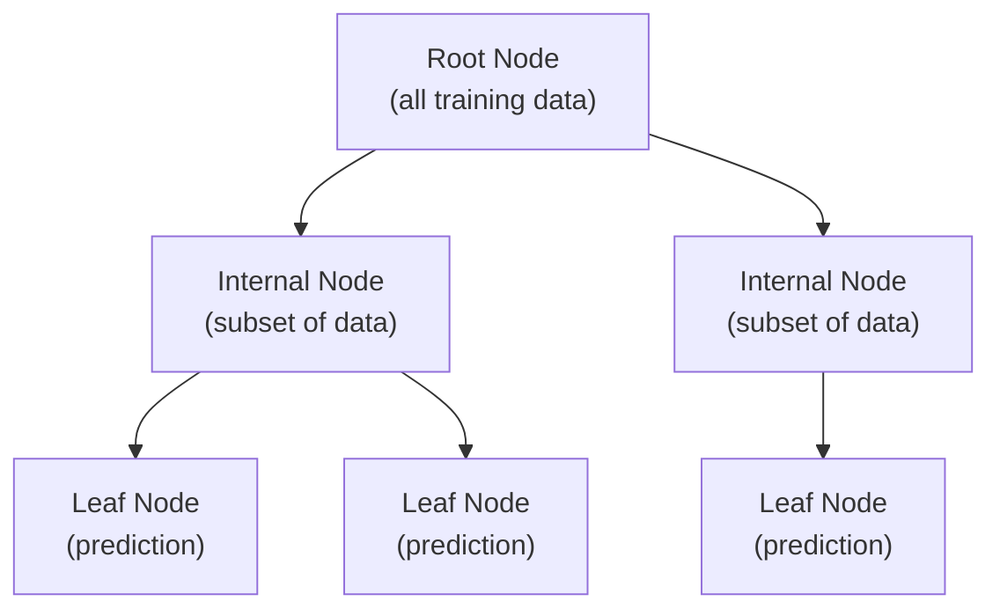
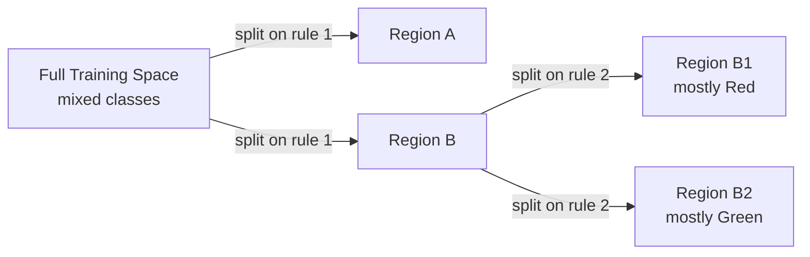
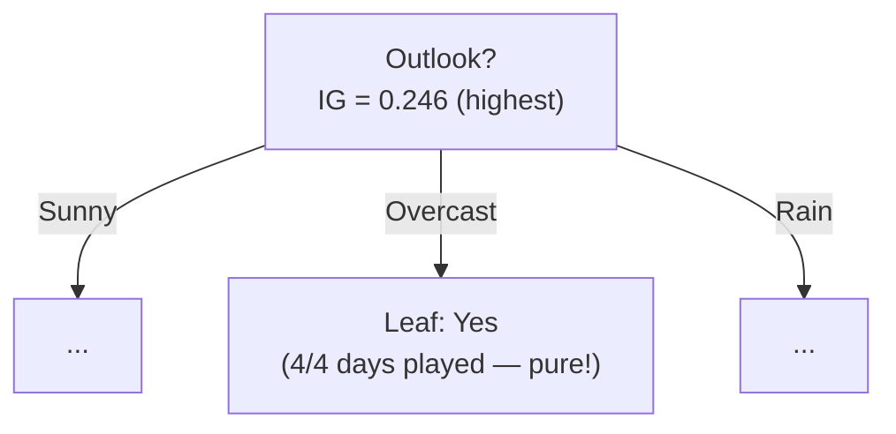
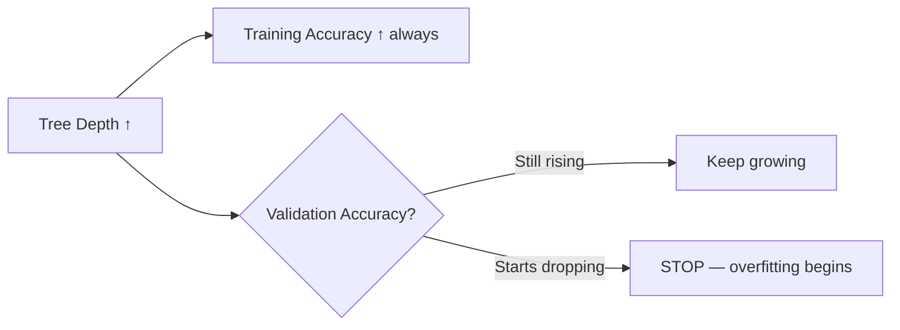

# Lecture 13: Supervised ML II — Decision Tree & Random Forest (Part 1)

**Course**: AI for Industrial Cyber-Physical Systems (AI4ICPS) — IIT Kharagpur  
**Duration**: 51:20  
**Source**: ai4icps-upskilling.in  

---

## Overview

This lecture introduces **decision trees** as a supervised classifier that recursively partitions the feature space into homogeneous regions using simple, interpretable rules. It builds up the theory of **entropy** and **information gain** as the mathematical basis for choosing the best splits, and walks through the classic "play tennis" example to show exactly how a tree is grown level by level.

---

## 1. Recap: Classification & Where Decision Trees Fit `[0:00 – 2:27]`

Classification learns a mapping from a feature vector **x** to a class label *y*. So far the course has covered **Naive Bayes**, **k-NN**, and **SVM** — all of which are "black box" style decision boundaries. Today introduces **decision trees**, followed later by **ensemble methods** (bagging, boosting, random forest) that combine many trees.

> **Jargon**: *Categorical feature* — A feature that takes one of a fixed set of discrete values (e.g., Outlook ∈ {Sunny, Overcast, Rain}). Contrast with a **numerical feature** (e.g., Temperature = 23.5°C), which takes continuous values.

---

## 2. The "Play Tennis" Running Example `[2:27 – 5:33]`

A club recorded 14 days of weather data and whether a tennis match was played:

| Day | Outlook | Temperature | Humidity | Wind | Play? |
|-----|---------|-------------|----------|------|-------|
| 1 | Sunny | Hot | High | Weak | No |
| 4 | Rain | Mild | High | Weak | Yes |
| ... | ... | ... | ... | ... | ... |

- **Features**: Outlook, Temperature, Humidity, Wind (all categorical here)
- **Label**: Play ∈ {Yes, No} — a **binary classification** problem

This small, fully-labeled dataset is used throughout the lecture to compute entropy and information gain by hand.

---

## 3. Anatomy of a Decision Tree `[5:33 – 6:56]`



| Node Type | Role |
|-----------|------|
| Root node | Holds the entire training set; tests the first, most informative rule |
| Internal node | Holds a subset of training data; tests one feature/rule |
| Leaf node | Holds the (ideally) most homogeneous subset; outputs the final prediction |

> **Jargon**: *Decision Tree* — A hierarchy of if/else rules learned from data. Each internal node tests one feature; each path from root to leaf is a chain of tests that ends in a class prediction.

---

## 4. The Core Idea: Recursive Partitioning into Homogeneous Regions `[6:37 – 9:26]`

The tree's goal is to **recursively split the feature space into homogeneous regions** — regions where (ideally) all points share the same class label.

> **Jargon**: *Homogeneous region* — A region of feature space where the (large) majority of training points belong to one class. Perfect homogeneity (100% single class) is the ideal but not always achievable or even desirable (it can cause overfitting).



Once regions are homogeneous enough, a simple supervised rule ("predict the majority label in this region") does the job — no complex classifier is needed inside a leaf.

---

## 5. How Prediction Works at Test Time `[9:26 – 17:26]`

### 5.1 Walking a Test Point Through the Tree `[9:36 – 15:19]`

Using a 2D toy example with rules like `X1 > 3.5?` and `X2 > 2?`, a test point is routed left/right at each internal node until it reaches a leaf, which gives the final class.

> *Example*: Test point has X1 = 2.0, X2 = 3.0.
> - Root rule: `X1 > 3.5?` → **No** → go left
> - Next rule: `X2 > 2?` → **Yes** → go right
> - Reach a leaf labeled **Green** → predict Green

### 5.2 Efficiency vs. k-NN `[15:19 – 17:26]`

| Aspect | Decision Tree | k-Nearest Neighbor |
|--------|---------------|---------------------|
| Test-time cost | O(h) — h = tree height (a handful of comparisons) | O(n) — compare against **all** training points |
| Comparisons in example | 2 (X1 rule, X2 rule) | Compare against every one of n training points |
| Scalability at inference | Excellent | Poor for large n |

> **Jargon**: *Tree height (h)* — The number of edges from root to the deepest leaf. Prediction cost scales with h, not with the size of the training set — this is decision trees' biggest speed advantage.

---

## 6. Tree Shape: Design Choices `[17:26 – 20:49]`

Building a tree requires deciding:

1. **Branching factor** — an internal node need not be binary; it can split into more than 2 children.
2. **Tree size** — number of internal/leaf nodes, and maximum **depth**.
3. **Split criterion** — *which* feature/rule to test at each internal node (the focus of the rest of this lecture).
4. **Leaf-node policy** — predict a constant majority class, or run a local k-NN-style vote among just the points that reached that leaf.

> **Jargon**: *Cross-validation* — Using a held-out validation split to empirically choose hyperparameters (tree depth, size, split rules) rather than guessing them.

---

## 7. Split Criterion: Purity, Entropy & Information Gain `[20:49 – 39:23]`

### 7.1 Purity — The Goal of a Good Split `[20:49 – 24:00]`

> **Jargon**: *Purity* — A node/region is "pure" when most (ideally all) of its points share one class label. A good split should **increase purity** relative to before the split.

**Bad split example**: Start with 4 red + 4 blue (uniform). Split into two groups, each still 2 red + 2 blue (uniform). No purity gained → useless split.

**Good split example**: Start with 4 red + 4 blue (uniform). Split into a group that's mostly red and a group that's mostly blue. Purity increased in both children → useful split.

### 7.2 Entropy — Measuring Randomness `[24:05 – 28:05]`

> **Jargon**: *Entropy* — A measure of randomness/uncertainty in a class distribution. High entropy = classes are evenly mixed (hard to guess); low entropy = one class dominates (easy to guess).

> *Analogy*: Picking a ball blindfolded from a bag.
> - 50% red / 50% blue → **high entropy** (pure guesswork, 50/50 odds either way)
> - 90% blue / 10% red → **low entropy** (you're fairly confident it'll be blue)

$$H(S) = -\sum_{c=1}^{C} p_c \log_2 p_c$$

```python
import math

def entropy(class_fractions):
    return -sum(p * math.log2(p) for p in class_fractions if p > 0)

# Example: perfectly mixed binary set (half cross, half tick)
entropy([0.5, 0.5])   # = 1.0  -> maximum entropy for 2 classes
entropy([0.9, 0.1])   # ≈ 0.469 -> low entropy, skewed/pure
```

> *Reads as*: "For each class c, take the fraction of examples pc, multiply by log2(pc), sum them all, and negate." Entropy is 0 for a perfectly pure set and maximal (1.0 for two classes) for a perfectly uniform 50/50 mix.

| Symbol | Meaning |
|--------|---------|
| S | The set of labeled examples at a node |
| C | Number of classes |
| $p_c$ | Fraction of examples in S belonging to class c |
| H(S) | Entropy of set S (bits of randomness) |

### 7.3 Information Gain `[28:05 – 34:51]`

> **Jargon**: *Information Gain* — The reduction in entropy achieved by a split. Higher gain = more informative split.

$$IG(S, \text{split}) = H(S) - \sum_{k} \frac{|S_k|}{|S|} H(S_k)$$

```python
def information_gain(H_parent, children):
    # children: list of (size, entropy) tuples for each resulting subset
    total = sum(size for size, _ in children)
    weighted_child_entropy = sum((size/total) * h for size, h in children)
    return H_parent - weighted_child_entropy
```

> *Reads as*: "Take the entropy before the split. Subtract the weighted-average entropy of the child subsets after the split (weighted by how many points fell into each child). The difference is your information gain."

> *Example*: S has 2 tick + 2 cross → H(S) = 1.0 (max entropy).
> Split into S1 = {1 tick, 1 cross} and S2 = {1 tick, 1 cross}.
> H(S1) = H(S2) = 1.0 → weighted average = 1.0 → **Information Gain = 1.0 − 1.0 = 0** (a useless split, as expected — both children are still 50/50).

The tree-growing rule: **at every node, pick the feature whose split gives the largest information gain** (the most informative rule is tested first).

---

## 8. Worked Example: Choosing the Root Feature `[40:50 – 45:36]`

For the 14-day tennis dataset: 9 days played, 5 days not played.

$$H(S) = -\frac{9}{14}\log_2\frac{9}{14} - \frac{5}{14}\log_2\frac{5}{14} = 0.94$$

Computing information gain for each candidate root feature:

| Feature | Information Gain |
|---------|-------------------|
| Wind | 0.048 |
| Temperature | 0.029 |
| Humidity | 0.151 |
| **Outlook** | **0.246** ← highest |

**Outlook** wins → it becomes the **root node**.



> *Example (Wind computation)*: Weak wind → 6 played / 2 not (H ≈ 0.811). Strong wind → 3 played / 3 not (H = 1.0). Weighted entropy after split ≈ 0.892. IG = 0.94 − 0.892 = **0.048**.

### 8.1 Growing the Next Level `[45:36 – 51:12]`

For the **Outlook = Sunny** branch, information gain is recomputed on just that subset:

| Feature (at level 2, left branch) | Information Gain |
|---|---|
| Temperature | 0.570 |
| **Humidity** | **0.970** ← highest |
| Wind | 0.019 |

**Humidity** is chosen at this internal node. Note **Outlook = Overcast** needed no further split — all 4 examples there already say "Yes" (entropy = 0, already pure) → it becomes a **leaf** directly.

The process **recurses**: recompute information gain on the remaining subset at each new node, pick the best feature, and repeat.

---

## 9. Stopping Criteria `[48:17 – 51:12]`

A tree stops growing at a node when:

1. **The node is already pure** (all examples share one class) — nothing left to split.
2. **All features have been exhausted** — no more splits are possible even if impure.
3. **The tree starts to overfit** — training accuracy keeps rising but **validation accuracy** starts dropping.



> **Jargon**: *Overfitting (in trees)* — Growing the tree so deep that it perfectly memorizes training data (including noise) at the cost of generalization to unseen data.

**Practical tip**: It's fine to accept an **impure leaf** (e.g., 3-red/8 vs 5-green/8 → predict majority "green") rather than forcing 100% purity — this acts as a natural regularizer against overfitting.

---

## Quick Reference: Key Jargon Glossary

| Term | One-Line Definition |
|------|---------------------|
| Decision Tree | Hierarchy of feature-tests that route inputs to a leaf prediction |
| Root / Internal / Leaf node | Full data / data subset / final prediction, respectively |
| Homogeneous region | A region where most points share one class label |
| Purity | Degree to which a node's examples belong to a single class |
| Entropy H(S) | Measure of randomness in the class distribution of set S |
| Information Gain | Entropy reduction achieved by a candidate split |
| Decision Stump | A depth-1 decision tree (tests only one feature) |
| Overfitting | Model fits training noise; validation accuracy degrades |
| Cross-validation | Using held-out data to choose tree hyperparameters |

---

## Summary

```mermaid
flowchart TD
    A[Training Data] --> B[Compute Entropy H(S)]
    B --> C[For each candidate feature:<br/>compute Information Gain]
    C --> D[Pick feature with max IG]
    D --> E[Split into child nodes]
    E --> F{Stopping criterion met?<br/>pure / no features left / overfitting}
    F -->|No| B
    F -->|Yes| G[Leaf: predict majority class]
```

**Key Takeaway**: A decision tree greedily picks, at every node, the feature split that yields the largest **information gain** (biggest entropy drop) — repeating this recursively until a stopping criterion is hit. This greedy, entropy-driven process is what turns a flat table of features into an interpretable, fast-to-query hierarchy of rules.

---

*Notes generated from SRT transcript with timestamps. whisper.cpp (small model, Metal GPU). Enhanced with AI expert annotations.*
