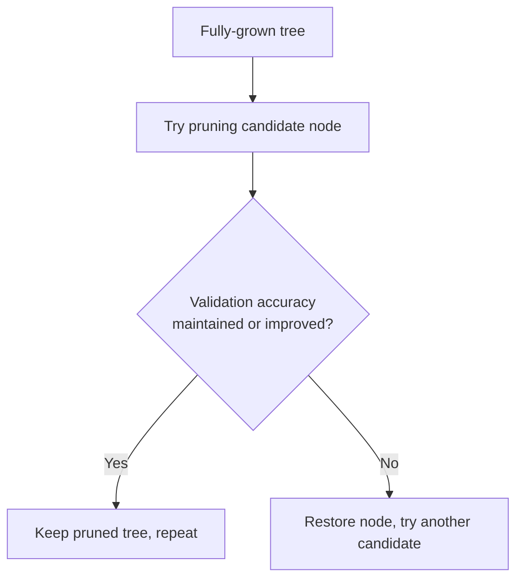
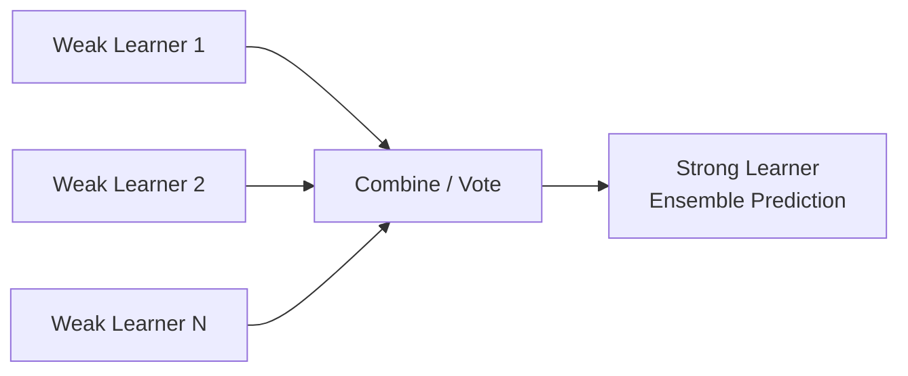
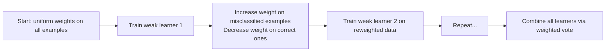
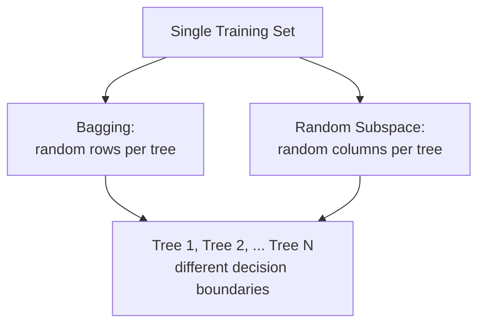
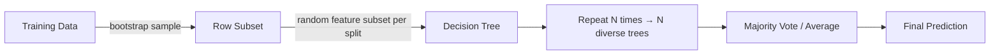
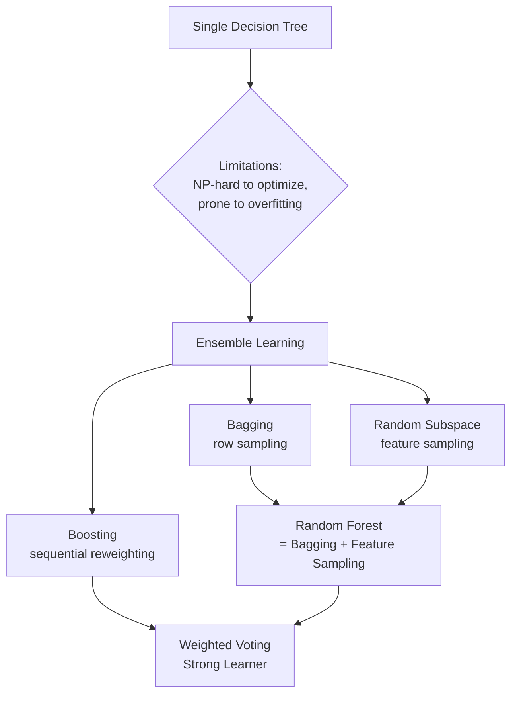

# Lecture 14: Supervised ML II — Decision Tree & Random Forest (Part 2)

**Course**: AI for Industrial Cyber-Physical Systems (AI4ICPS) — IIT Kharagpur  
**Duration**: 30:43  
**Source**: ai4icps-upskilling.in  

---

## Overview

This is the direct continuation of Part 1. It covers **pruning** strategies for controlling decision-tree complexity, summarizes the strengths/weaknesses of decision trees, and then introduces **ensemble learning** — the idea of combining many "weak learners" into one "strong learner" via **bagging**, **boosting**, and finally **random forest**.

---

## 1. Controlling Tree Complexity: Pruning `[0:00 – 6:25]`

### 1.1 The Bias–Complexity Tradeoff `[0:14 – 1:08]`

The ideal decision tree is **not too big** (avoids overfitting) yet **fits the training data reasonably well** (avoids underfitting).

> **Jargon**: *Decision Stump* — The simplest possible tree: just one root node with one rule and its leaves (depth 1). Fast and simple, but weak on its own — it can only use one feature, so it can't capture interactions. It becomes powerful only when combined in large ensembles (see §3).

### 1.2 Pre-pruning vs. Post-pruning `[1:08 – 3:09]`

| Strategy | When it happens | Description |
|----------|------------------|--------------|
| **Pre-pruning** | While building the tree | Stop growing early (limit depth, min samples per leaf, etc.) |
| **Post-pruning** | After the tree is fully built | Grow the full tree first, then cut back branches that don't help |

> **Jargon**: *Pruning* — Removing branches/subtrees to make the model simpler and more general, trading a small amount of training accuracy for better test-time generalization.

### 1.3 Post-pruning via Cross-Validation `[3:09 – 4:10]`

Using a held-out **validation set**, two common pruning policies:

1. **Threshold policy**: Prune any node as long as validation accuracy does **not drop below** some baseline (e.g., stay ≥ 80%).
2. **Greedy improvement policy**: Prune the node that **improves validation accuracy the most** at each step (e.g., go from 80% → 85%).



---

## 2. Decision Trees: Strengths & Weaknesses `[4:10 – 6:25]`

### 2.1 Strengths

| Strength | Why |
|----------|-----|
| Simple & interpretable | Rules are human-readable if/else chains |
| Handles mixed feature types | Categorical and numerical features both work natively |
| Fast at test time | O(h) comparisons, h = tree height — much cheaper than k-NN's O(n) |
| Ensemble-friendly | Many trees can be combined (→ random forest) for a big accuracy boost |

### 2.2 Weaknesses

| Weakness | Why |
|----------|-----|
| Finding the *optimal* tree is NP-hard | All practical tree-building algorithms are **greedy heuristics** — no global optimality guarantee |
| Prone to overfitting | Without early stopping or pruning, trees can grow arbitrarily complex |

---

## 3. Ensemble Classifiers: The Committee Analogy `[6:25 – 12:47]`

So far every classifier discussed (Naive Bayes, k-NN, SVM, Decision Tree) has been a **single model** making the decision alone.

> *Analogy*: Important organizational decisions are usually made by a **committee**, not one individual — because different members bring different viewpoints (financial, HR, technical, etc.) and their combined judgment tends to beat any one person's. Ensembling applies the same idea to classifiers: combine multiple models that each see the data from a different angle.

To get real benefit from ensembling, individual classifiers should be **diverse** — trained on different subsets of examples and/or different subsets of features — so their errors are **uncorrelated** and complementary.

> **Jargon**: *Strong learner* — A model that can be made arbitrarily accurate on the training data, usually at the cost of high complexity (e.g., a fully-grown decision tree).

> **Jargon**: *Weak learner* — A simple model that's only slightly better than random guessing (e.g., a decision stump). Individually weak, but a large ensemble of weak learners, appropriately combined, forms a strong learner.



This lecture covers three ensembling approaches: **Bagging**, **Boosting**, and **Random Forest**.

---

## 4. Bagging (Bootstrap Aggregating) `[12:47 – 17:13]`

> **Jargon**: *Bagging* — Short for **B**ootstrap **AGG**regat**ING**. Train M independent models on M different **bootstrap samples** of the training data, then combine their predictions by voting/averaging.

> **Jargon**: *Bootstrap sample* — A sample of the same approximate size as the original dataset, drawn **with replacement**. This means some original points may appear multiple times in a bootstrap sample, while others may not appear at all.

$$D_1, D_2, \ldots, D_M \text{ (bootstrap samples)} \rightarrow g_1(x), g_2(x), \ldots, g_M(x) \text{ (trained models)}$$

```python
# Pseudocode for bagging
models = []
for m in range(M):
    D_m = bootstrap_sample(training_data, with_replacement=True)
    g_m = train_weak_learner(D_m)
    models.append(g_m)

# Regression: average the outputs
prediction = sum(g(x) for g in models) / M

# Classification: majority vote (or weighted vote)
prediction = majority_vote([g(x) for g in models])
```

> *Reads as*: "Draw M random samples (with replacement) from your training set, train one model per sample, then let all M models vote on the final answer."

> *Example*: With training data $\{(X_1,Y_1), ..., (X_5,Y_5)\}$ and M=3: bootstrap sample 1 might be $\{X_1Y_1, X_2Y_2\}$; sample 2 might be $\{X_2Y_2, X_3Y_3, X_4Y_4\}$ (note X2Y2 reused); sample 3 might be $\{X_4Y_4, X_5Y_5\}$. Samples can differ in size and overlap.

**Key statistical fact**: On average, each bootstrap sample contains about **63%** of the unique original instances (the rest are duplicates or omitted) — this is what injects diversity and encourages **uncorrelated errors** across the M models.

---

## 5. Boosting `[17:13 – 22:00]`

> **Jargon**: *Boosting* — An ensembling method that trains weak learners **sequentially**, where each new learner focuses on the mistakes of the previous ones by re-weighting the training examples.

### 5.1 The Algorithm



1. Start with **uniform weights** on all training examples.
2. Train a weak classifier.
3. **Increase weights** on examples it misclassified; **decrease weights** on examples it got right. (Conceptually similar to duplicating the hard examples in the training set.)
4. Train the next weak classifier on this reweighted distribution — it is forced to focus on the previously "difficult" examples.
5. Repeat, then combine all classifiers via **weighted majority voting** — a classifier with lower error gets a **larger vote weight**.

> *Reads as*: "Each round, boosting shines a spotlight on the mistakes of the previous round, forcing the next weak learner to specialize on the hard cases. The final answer is a weighted vote where more accurate learners count for more."

> *Example*: A single simple boundary misclassifies one green point. Boosting increases that point's weight, trains a second classifier that fixes it (possibly at the cost of new small errors elsewhere), and the weighted combination of both classifiers correctly separates all points.

---

## 6. Random Forest `[22:00 – 29:01]`

### 6.1 Two Sources of Diversity `[22:00 – 26:47]`

Given **one** training set, how do we get diverse trees? Two strategies:

| Strategy | What varies across trees | Also known as |
|----------|---------------------------|----------------|
| **Bagging** | Random *subset of data points* (bootstrap sample) per tree | Bootstrap aggregating |
| **Random subspace method** | Random *subset of features* per tree (same data) | Feature bagging |



> *Example (bagging)*: An apples-vs-oranges dataset split into several bootstrap samples yields several **differently-shaped decision boundaries**, even though all samples came from the same source data — because each tree saw a slightly different set of examples.

> *Example (random subspace)*: One tree sees only {mass, color}; another sees only {pH, texture}; another sees only {pH, mass} — each produces a different decision boundary using different feature combinations.

At inference: a test point falls into one region per tree. If 3 of 4 trees say "apple" and 1 says "orange," the ensemble predicts **apple with 75% confidence**.

### 6.2 Random Forest = Bagging + Random Subspace `[26:47 – 28:24]`

> **Jargon**: *Random Forest* — An ensemble of decision trees where **each tree** is trained on (a) a random bootstrap sample of the data **and** (b) a random subset of features at each split. Predictions are combined via majority vote (classification) or averaging (regression).



### 6.3 Summary Comparison `[28:24 – 29:01]`

| Method | Core Mechanism | Main Benefit |
|--------|-----------------|---------------|
| Bagging | Multiple instances of the same model on different data subsets | Reduces variance via averaging |
| Random Forest | Bagging + random feature selection per tree | Extra diversity → less overfitting, more robust |
| Boosting | Sequential training, reweighting misclassified examples | Reduces bias, targets hard examples |

**Bottom line**: Ensemble methods (bagging, boosting, random forest) consistently outperform any single decision tree by combining diverse, complementary weak learners.

---

## Quick Reference: Key Jargon Glossary

| Term | One-Line Definition |
|------|---------------------|
| Pruning | Removing tree branches post-hoc (or stopping early) to reduce overfitting |
| Decision Stump | A depth-1 decision tree using only one feature |
| Strong Learner | A model that can be made arbitrarily accurate (often complex) |
| Weak Learner | A simple model, only slightly better than random guessing |
| Bagging | Train models on bootstrap samples; combine via vote/average |
| Bootstrap Sample | Random sample drawn with replacement from training data |
| Boosting | Sequential ensembling that reweights misclassified examples each round |
| Random Subspace Method | Ensembling by training each model on a random subset of features |
| Random Forest | Ensemble combining bagging + random feature subsets per tree |

---

## Summary



**Key Takeaway**: No single decision tree can be guaranteed optimal (the problem is NP-hard), but combining many diverse, individually-weak trees — via bagging's row sampling, boosting's error-focused reweighting, or random forest's row+feature sampling — reliably produces a strong, robust ensemble classifier that generalizes far better than any one tree alone.

---

*Notes generated from SRT transcript with timestamps. whisper.cpp (small model, Metal GPU). Enhanced with AI expert annotations.*
