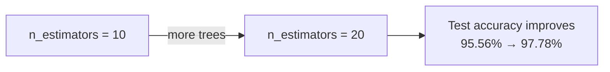
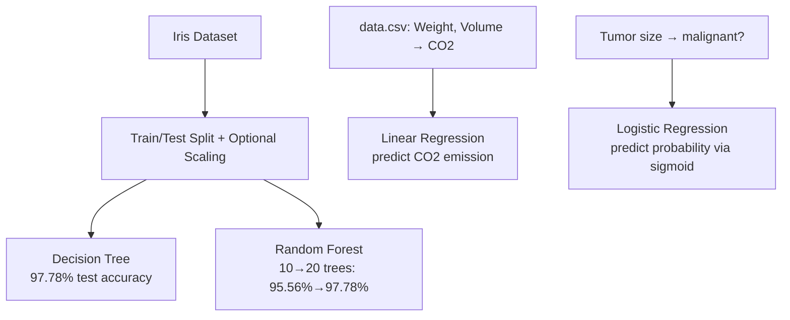

# Lecture 15: Hands-on ML II — Classification & Regression with Scikit-Learn

**Course**: AI for Industrial Cyber-Physical Systems (AI4ICPS) — IIT Kharagpur  
**Duration**: 2:05:41  
**Source**: ai4icps-upskilling.in  

---

## Overview

This is a live, Google-Colab-based hands-on session that implements everything taught in Lectures 13–14 (Decision Tree, Random Forest) plus a recap of **Linear Regression** and **Logistic Regression** in `scikit-learn`. The instructor works through the **Iris dataset** for classification and two small custom datasets (`data.csv` for linear regression, a synthetic tumor-size dataset for logistic regression). Most of the runtime is live-coding pacing/admin; this note distills the technical content only.

---

## 1. Setup & Iris Dataset Pipeline `[0:00 – 27:47]`

### 1.1 Imports `[6:43 – 8:06]`

```python
import numpy as np
import pandas as pd
import matplotlib.pyplot as plt
import seaborn as sns
from sklearn.metrics import accuracy_score, confusion_matrix, classification_report
```

> **Jargon**: *Seaborn* — A plotting library built on top of Matplotlib that adds nicer color palettes and statistical plot types (like heatmaps for confusion matrices).

### 1.2 Loading & Exploring the Iris Dataset `[10:31 – 18:23]`

```python
path = "https://archive.ics.uci.edu/ml/machine-learning-databases/iris/iris.data"
header_names = ["sepal length", "sepal width", "petal length", "petal width", "class"]
data = pd.read_csv(path, names=header_names)
print(data.shape)   # (150, 5)
data.head()
```

The Iris dataset has 150 samples, 50 each of *Iris setosa* (rows 0–49), *Iris versicolor* (50–99), and *Iris virginica* (100–149).

### 1.3 Feature/Target Split, Train/Test Split, Scaling `[17:29 – 24:56]`

```python
X = data.iloc[:, 0:-1]     # all columns except the last (class)
y = data.iloc[:, 4]        # the class column

from sklearn.model_selection import train_test_split
X_train, X_test, y_train, y_test = train_test_split(
    X, y, test_size=0.30, random_state=0
)

# Optional for tree-based models (scaling doesn't affect splits)
from sklearn.preprocessing import StandardScaler
scaler = StandardScaler()
scaler.fit(X_train)
X_train = scaler.transform(X_train)
X_test = scaler.transform(X_test)
```

> **Jargon**: *`random_state`* — A fixed seed for the random number generator so that the train/test split (or any other randomized step) is **reproducible** across runs.

> **Math Note**: Standard scaling computes $\frac{x - \mu}{\sigma}$ for every feature. Unlike distance-based classifiers (k-NN, SVM), **decision trees and random forests are scale-invariant** — splits are based on threshold comparisons per feature, so this step is optional here (kept only for pipeline consistency).

---

## 2. Decision Tree Classifier `[27:47 – 48:07]`

```python
from sklearn.tree import DecisionTreeClassifier

classifier = DecisionTreeClassifier()
classifier.fit(X_train, y_train)

# Training accuracy check (guard against overfitting)
y_pred_train = classifier.predict(X_train)
accuracy = accuracy_score(y_train, y_pred_train)
print(accuracy)   # 100%
```

```python
# Test-time evaluation
y_pred = classifier.predict(X_test)

from sklearn.metrics import confusion_matrix, classification_report, accuracy_score
result = confusion_matrix(y_test, y_pred)
sns.heatmap(result, annot=True, fmt="g")
plt.xlabel("Prediction", fontsize=13)
plt.ylabel("Actual", fontsize=13)
plt.title("Confusion Matrix", fontsize=17)
plt.show()

result1 = classification_report(y_test, y_pred)
print(result1)
result2 = accuracy_score(y_test, y_pred)
print(result2)   # ≈ 97.78%
```

**Result**: 100% training accuracy, **97.78%** test accuracy → good fit, **no overfitting** (test accuracy stays close to training accuracy).

### 2.1 Reading the Confusion Matrix `[35:47 – 39:08]`

| Actual \ Predicted | Setosa | Versicolor | Virginica |
|---|---|---|---|
| Setosa | 16 | 0 | 0 |
| Versicolor | 0 | 17 | 1 |
| Virginica | 0 | 0 | 11 |

All 16 setosa correctly classified; 17/18 versicolor correct (1 mislabeled as virginica); all 11 virginica correct.

> **Math Note**: Recap of classification metrics (from the prior lecture):
> $$\text{Precision} = \frac{TP}{TP+FP}, \quad \text{Recall} = \frac{TP}{TP+FN}, \quad F_1 = \frac{2 \cdot P \cdot R}{P+R}$$
> **Macro average** = simple mean across classes. **Weighted average** = mean weighted by each class's **support** (number of true instances of that class).

---

## 3. Random Forest Classifier `[48:37 – 1:19:59]`

```python
from sklearn.ensemble import RandomForestClassifier

classifier = RandomForestClassifier(n_estimators=10)
classifier.fit(X_train, y_train)
```

| n_estimators | Train Accuracy | Test Accuracy |
|---|---|---|
| 10 trees | ≈99.05% | ≈95.56% |
| 20 trees | ≈100% | **≈97.78%** |



> **Jargon**: *`n_estimators`* — The number of decision trees in the random forest ensemble. More trees generally reduce variance (up to a point of diminishing returns), at the cost of more compute.

> *Exercise given to students*: Try `n_estimators=50` or `100` and observe whether accuracy keeps improving or plateaus.

---

## 4. Linear Regression `[1:19:59 – 1:44:31]`

### 4.1 Loading External CSV in Colab `[1:20:33 – 1:28:24]`

```python
from google.colab import files
uploaded = files.upload()   # prompts a "Choose Files" dialog for data.csv

df = pd.read_csv("data.csv")
print(df.shape)   # (36, 5) -> Car, Model, Volume, Weight, CO2
df.head()
```

### 4.2 Fitting the Model `[1:29:41 – 1:33:29]`

```python
X = df[["Weight", "Volume"]]
y = df["CO2"]

from sklearn import linear_model
regr = linear_model.LinearRegression()
regr.fit(X, y)
```

### 4.3 Prediction & Interpreting Coefficients `[1:35:19 – 1:41:26]`

```python
predicted_CO2 = regr.predict([[2300, 1300]])   # weight=2300kg, volume=1300cc
print(predicted_CO2)   # ≈ 107.209 g CO2/km

print(regr.coef_)        # [coef_weight, coef_volume]
```

$$y = \beta_0 + \beta_1 x, \quad \text{i.e., the familiar } y = mx + c$$

> *Reads as*: β₀ (intercept/bias) shifts the line up/down; β₁ (slope/coefficient) tells you how much y changes per unit change in x. Here there are two predictors, so it's a multiple linear regression: $\text{CO2} = \beta_0 + \beta_1 \cdot \text{Weight} + \beta_2 \cdot \text{Volume}$.

> *Example*: A 1.3-liter-engine car (volume = 1300 cc) weighing 2300 kg is predicted to emit **≈107.21 g CO2/km**. Increasing weight to 3300 kg (keeping volume fixed) raises the prediction to **≈114.76 g/km** — an ~8g increase, confirming weight and emission are **positively linearly related**.

> **Jargon**: *`.coef_`* — The learned β coefficients (one per feature) in a fitted scikit-learn linear model. *`.intercept_`* — The learned β₀.

---

## 5. Logistic Regression `[1:44:31 – 2:05:41]`

### 5.1 Toy Dataset: Tumor Size → Malignant? `[1:48:15 – 1:51:22]`

```python
import numpy as np
from sklearn import linear_model

X = np.array([3.78, 2.44, 2.09, 0.14, 1.72, 1.65, 4.92, 4.37, 4.96, 4.52, 3.69, 5.88]).reshape(-1, 1)
y = np.array([1, 0, 0, 0, 0, 0, 1, 1, 1, 1, 1, 1])   # 1 = cancerous (malignant), 0 = benign

logr = linear_model.LogisticRegression()
logr.fit(X, y)
```

> **Jargon**: *`.reshape(-1, 1)`* — A NumPy trick to force a 1-D array into a **column vector** (N rows × 1 column). `-1` tells NumPy "infer this dimension automatically from the data length"; `1` fixes the number of columns. A very common data-scientist interview question.

### 5.2 Prediction & Odds `[1:51:22 – 1:58:35]`

```python
predicted = logr.predict(np.array([3.46]).reshape(-1, 1))
print(predicted)   # [0] -> benign, not cancerous

log_odds = logr.coef_
odds = np.exp(log_odds)
print(odds)   # ≈ 4.03
```

$$P(y=1|x) = \frac{1}{1 + e^{-(\beta_0 + \beta_1 x)}}$$

> *Reads as*: This is the **sigmoid function** applied to the linear combination $\beta_0 + \beta_1 x$ — it squashes any real number into a (0, 1) probability.

> **Jargon**: *Odds* — The ratio $\frac{P(\text{event})}{1 - P(\text{event})}$; "chances." Here, $e^{\beta_1} \approx 4.03$ means: **for every 1 cm increase in tumor size, the odds of malignancy multiply by ≈4×.**

### 5.3 Computing Per-Point Probability `[1:59:32 – 2:03:00]`

```python
def logit_to_prob(logr, x):
    log_odds = logr.coef_ * x + logr.intercept_
    odds = np.exp(log_odds)
    probability = odds / (1 + odds)
    return probability

print(logit_to_prob(logr, X))
```

> *Reads as*: Convert the raw linear "logit" score to odds via exponentiation, then convert odds to probability using $P = \frac{\text{odds}}{1+\text{odds}}$ — the algebraic inverse of the sigmoid.

| Tumor Size (cm) | P(Malignant) |
|---|---|
| 3.78 | 60.75% |
| 2.44 | 19.27% |
| 2.09 | 12.78% |

**Interpretation**: Larger tumors are predicted to have a substantially higher probability of being cancerous — consistent with the fitted positive coefficient.

---

## Quick Reference: Key Jargon Glossary

| Term | One-Line Definition |
|------|---------------------|
| `n_estimators` | Number of trees in a random forest ensemble |
| `random_state` | Fixed seed for reproducible randomized operations |
| StandardScaler | Normalizes features to zero mean, unit variance |
| Confusion Matrix | Table of actual vs. predicted class counts |
| Macro Average | Unweighted mean of a metric across classes |
| Weighted Average | Mean of a metric weighted by class support |
| `.coef_` / `.intercept_` | Learned slope(s) / intercept of a fitted linear model |
| Sigmoid Function | Squashes any real value into (0, 1); core of logistic regression |
| Odds | Ratio P(event) / (1 − P(event)); "chances" |
| `.reshape(-1, 1)` | NumPy trick to convert a 1-D array to a column vector |

---

## Summary



**Key Takeaway**: This session operationalizes the theory from Lectures 13–14: `DecisionTreeClassifier` and `RandomForestClassifier` follow the identical scikit-learn pattern (`fit` → `predict` → `confusion_matrix`/`classification_report`), and increasing ensemble size (n_estimators) generally improves test accuracy. Linear and logistic regression follow the same `fit`/`predict` API — the only difference is that logistic regression's output must be converted from log-odds to a probability via the sigmoid function.

---

*Notes generated from SRT transcript with timestamps. whisper.cpp (small model, Metal GPU). Enhanced with AI expert annotations.*
