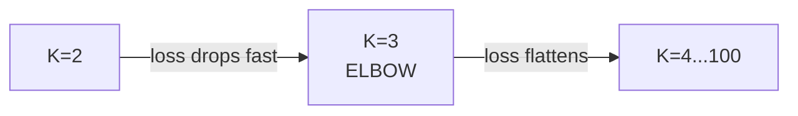
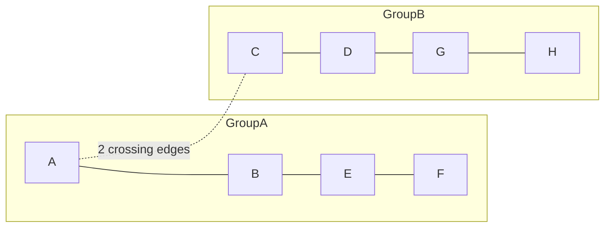
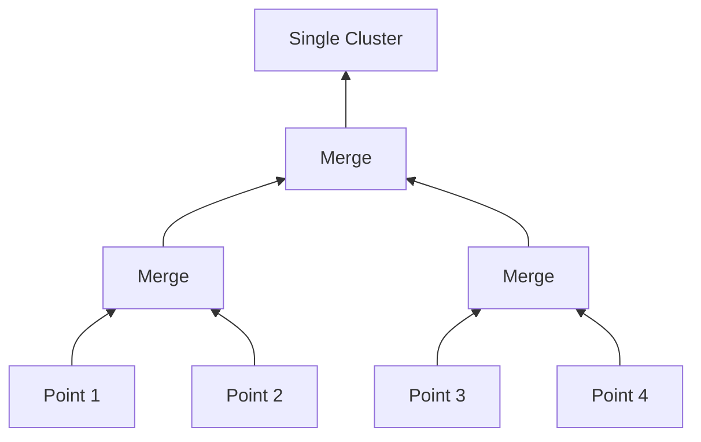
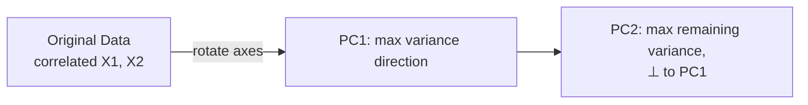
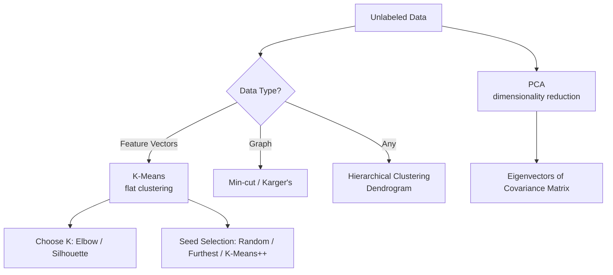

# Lecture 16: Unsupervised ML — Clustering (K-Means, Hierarchical) & PCA

**Course**: AI for Industrial Cyber-Physical Systems (AI4ICPS) — IIT Kharagpur  
**Duration**: 1:42:14  
**Source**: ai4icps-upskilling.in  

---

## Overview

This lecture is the first deep dive into **unsupervised learning** — learning structure from **unlabeled** data. It covers **flat clustering (K-Means, K-Means++)**, **graph clustering (min-cut, Karger's algorithm)**, **hierarchical clustering (single/complete linkage, dendrograms)**, and finishes with **Principal Component Analysis (PCA)** for dimensionality reduction.

---

## 1. What Is Clustering? `[0:00 – 6:47]`

> **Jargon**: *Clustering* — Grouping unlabeled objects such that items **within** a cluster are similar, and items **across** clusters are dissimilar. No ground-truth labels are used or available.

**Example application**: Search-engine result clustering — a query like "apple" is ambiguous (fruit vs. company), so a search engine clusters retrieved documents by topic and shows representative results from each cluster, covering all likely intents.

### 1.1 The Three Major Design Issues `[4:37 – 6:47]`

| Issue | Question to Answer |
|-------|---------------------|
| **Representation** | How do we turn raw data (images, text, tables) into feature vectors a clustering algorithm can use? |
| **Similarity/Distance** | What distance or similarity metric defines "closeness" between objects? |
| **Number of clusters** | Do we fix *k* in advance, or discover it from the data? |

### 1.2 Flat vs. Hierarchical, Hard vs. Soft `[6:47 – 9:35]`

| Dimension | Option A | Option B |
|-----------|----------|----------|
| Structure | **Flat**: disjoint groups (e.g., K-Means) | **Hierarchical**: nested tree of groups (agglomerative/divisive) |
| Membership | **Hard**: each point belongs to exactly one cluster | **Soft**: probabilistic membership across multiple clusters |

---

## 2. K-Means Clustering `[9:35 – 21:05]`

### 2.1 The Algorithm `[9:35 – 12:14]`

```mermaid
flowchart TD
    A["Step 1: Initialize K cluster centers<br/>(one-time, usually random)"] --> B["Step 2: Assignment —<br/>assign each point to its nearest center"]
    B --> C["Step 3: Update —<br/>recompute each center as the mean of its assigned points"]
    C --> D{Converged?<br/>(centers stable or max iterations)}
    D -->|No| B
    D -->|Yes| E[Final clusters]
```

> **Jargon**: *K-Means* — One of the oldest and most widely used clustering algorithms because of its simplicity and computational efficiency. Requires the user to pre-specify *k*, the number of clusters.

### 2.2 Distance Measure `[18:59 – 19:16]`

$$d(\mathbf{x}, \mathbf{c}) = \sqrt{\sum_{i=1}^n (x_i - c_i)^2} \quad \text{(Euclidean — most common choice)}$$

Other options include Manhattan, Minkowski, Mahalanobis distance — K-Means works with any of them, though Euclidean is the default.

### 2.3 Recomputing Centers `[19:16 – 20:59]`

$$\boldsymbol{\mu}_k = \frac{1}{|C_k|}\sum_{\mathbf{x}_i \in C_k} \mathbf{x}_i \quad \text{(the mean vector of all points currently in cluster } k\text{)}$$

### 2.4 The K-Means Loss Function `[21:05 – 25:21]`

$$L = \sum_{i=1}^{n} \|\mathbf{x}_i - \boldsymbol{\mu}_{k(i)}\|^2$$

```python
def kmeans_loss(points, centers, assignments):
    return sum(
        distance(points[i], centers[assignments[i]]) ** 2
        for i in range(len(points))
    )
```

> *Reads as*: "For every data point, measure its squared distance to the center of the cluster it's currently assigned to, then sum over all points." Low loss ⇒ tight, compact clusters. High loss ⇒ dispersed, poor clusters. K-Means iteratively **minimizes** this loss (though it has no guarantee of finding the global optimum — clustering is a hard combinatorial problem).

### 2.5 Computational Complexity `[23:55 – 25:21]`

| Step | Cost per iteration |
|------|---------------------|
| Assignment (compare every point to every center) | $O(KN)$ |
| Update (recompute means) | $O(N)$ |
| **Total for P iterations** | $O(PKN)$ — **linear** in N, hence very fast |

---

## 3. Practical Issue #1: Choosing K `[25:21 – 34:00]`

### 3.1 The Elbow Method `[26:44 – 29:16]`

Run K-Means for $K = 2, 3, \ldots, 100$, plot **K vs. K-Means loss**, and look for the "elbow" — the point where the loss drops sharply and then flattens.



> ⚠️ **Caveat** (explicitly emphasized by the lecturer): The elbow method is a **guideline, not a guarantee**. It does not always exist or point to the truly optimal K.

### 3.2 Silhouette Score `[29:23 – 33:47]`

Balances two criteria:

- **Within-cluster distance** (should be **small** — tight clusters)
- **Between-cluster distance** (should be **large** — well-separated clusters)

$$\text{avg. within-cluster distance} = \frac{1}{|C_i|(|C_i|-1)} \sum_{j,k \in C_i} d(j,k)$$

Plot K vs. silhouette score; look for a peak (sharp rise then sharp fall). Unlike K-Means loss (lower = better), **for silhouette score, higher = better** (range: −1 to +1).

| K-Means Loss | Silhouette Score |
|---|---|
| Lower is better | Higher is better |
| Monotonically decreases with K | Peaks at a "good" K, then falls |

---

## 4. Practical Issue #2: Seed (Initial Center) Selection `[33:53 – 50:16]`

### 4.1 The Problem With Random Initialization `[34:44 – 37:36]`

Poor random initial centers can lead to **slow convergence** or convergence to a **suboptimal (dispersed, elongated)** clustering — even though the data itself has a visually "obvious" good clustering.

### 4.2 Heuristic: Furthest-Center Selection `[37:45 – 41:33]`

Pick the first center randomly; each subsequent center is the point **furthest from all existing centers**.

- ✅ Works reasonably well on clean data with clear structure.
- ❌ On real (noisy) data, this heuristic **greedily selects outliers** as centers, since outliers are — by definition — far from everything else, producing bad clusters (e.g., one giant cluster + several singleton outlier clusters).

### 4.3 K-Means++ `[42:15 – 50:16]`

> **Jargon**: *K-Means++* — A **probabilistic** improvement to the seed-selection step only (the rest of K-Means is unchanged). Instead of deterministically picking the furthest point, it picks the next center **probabilistically**, weighted by distance.

**Algorithm**:
1. Choose the first center $c_1$ randomly from the data.
2. For every remaining point $x$, compute $d(x) = $ distance to the **nearest already-chosen** center.
3. Choose the next center from the data with probability $\propto \frac{d(x)^2}{\sum_{x'} d(x')^2}$.
4. Repeat steps 2–3 until $k$ centers are chosen.

```python
# Pseudocode: K-Means++ seeding
centers = [random.choice(data)]
while len(centers) < k:
    d = [min(distance(x, c) for c in centers) for x in data]
    probs = [di**2 / sum(dj**2 for dj in d) for di in d]
    centers.append(weighted_random_choice(data, probs))
```

> *Reads as*: "Points far from all existing centers get a **higher chance** (not a guarantee) of being picked next." This softens the furthest-heuristic's blind spot: true outliers still get *higher* probability, but so do many legitimate, non-outlier far points — spreading the risk so outliers don't dominate every seed selection.

> **Q&A note**: The lecturer clarified there is **no guarantee** K-Means++ avoids outliers — it only reduces the *likelihood* by distributing probability mass across many points rather than deterministically chasing the single furthest one.

---

## 5. Clustering Graph Data `[50:16 – 1:05:15]`

### 5.1 Why Graphs Are Different `[50:27 – 54:38]`

Examples: Facebook friendship networks, Q&A community detection, protein interaction networks. Unlike n-dimensional point data, **graphs have no natural "centroid"** — so K-Means-style approaches don't directly apply.

> **Jargon**: *Graph* — A set of **nodes** (objects) connected by **edges** (relationships), optionally with edge **weights** (e.g., road distances).

### 5.2 Minimum Cut `[55:02 – 57:16]`

> **Jargon**: *Min-cut* — Partitioning a graph into two groups such that the **number of edges crossing between the groups is minimized**.



To get more than 2 groups, recursively apply min-cut to the resulting subgraphs.

### 5.3 Karger's Algorithm (Randomized Contraction) `[57:24 – 1:05:15]`

**Algorithm**: Repeat until 2 nodes remain:
1. Pick a random edge (uniformly among remaining edges).
2. **Contract** it — merge its two endpoints into a single "super-node," keeping all their external edges (creating parallel edges where needed).

```python
# Pseudocode: Karger's min-cut algorithm
while graph.num_nodes() > 2:
    edge = graph.pick_random_edge()   # uniform over all remaining edges
    graph.contract(edge)              # merge endpoints, keep parallel edges
cut_value = graph.num_edges()          # edges between the final 2 super-nodes
```

> *Reads as*: "Randomly collapse edges one at a time until only two 'super-nodes' remain; the edges still connecting them define the cut." Because this is randomized, **run it multiple times and keep the run with the smallest cut value** for a better (though not guaranteed optimal) result.

> *Example*: An 8-node, 14-edge graph is repeatedly contracted (`BF`, `GH`, `DGH`, `AE`, `AEBF`, `CDGH`) until 2 super-nodes remain (`{A,B,E,F}` and `{C,D,G,H}`), with a final cut value of **2**.

---

## 6. Hierarchical (Agglomerative) Clustering `[1:05:15 – 1:26:16]`

> **Jargon**: *Agglomerative clustering* — A **bottom-up** approach: start with every point in its own cluster, then repeatedly **merge the two closest clusters** until one cluster remains (or a stopping threshold is reached). The opposite (top-down splitting) is called **divisive** clustering.

Unlike K-Means, hierarchical clustering does **not** require fixing *k* in advance — you build the full merge history and can "cut" it at any level to get any number of clusters.

### 6.1 Dendrograms `[1:06:44 – 1:08:00]`

> **Jargon**: *Dendrogram* — A tree diagram recording the full history of merges, from individual points (leaves) up to one root cluster. Cutting the dendrogram horizontally at any height yields a specific number of clusters.



### 6.2 Linkage Criteria: How to Measure Cluster-to-Cluster Distance `[1:08:00 – 1:23:16]`

| Linkage | Definition | Behavior |
|---------|-------------|----------|
| **Single link** | Distance = **minimum** distance among all cross-cluster point pairs (or max similarity) | Tends to produce **elongated/chained** clusters — two accidentally-close points can force a merge even if the clusters are otherwise very dissimilar |
| **Complete link** | Distance = **maximum** distance among all cross-cluster point pairs (min similarity) | Produces **tight, compact, spherical** clusters; one far-flung point can distort the measure |
| **Average link** | Distance = **average** pairwise distance across all cross-cluster point pairs | A compromise between single and complete link |

> *Example (single-link chaining problem)*: Four points laid out almost in a line get merged one after another purely because each adjacent pair happens to be close — even though the two end points are very far apart, they end up in the same cluster.

```python
# Distance matrix example (5 objects)
# Step 1: find the globally minimum distance pair and merge (e.g., objects 1 & 2, distance = 2)
# Step 2: recompute distances from the new merged cluster to all others using the chosen linkage
# Step 3: repeat until 1 cluster remains
```

> *Worked example*: With a 5×5 distance matrix, single linkage first merges objects `1` and `2` (distance 2, the global minimum). The matrix is recomputed (distance from `{1,2}` to others = *minimum* of the two individual distances), and the process repeats — building the dendrogram bottom-up.
> Complete linkage on the **same data** merges `1` and `2` first too (still the global min), but subsequent merges use the **maximum** pairwise distance between cluster members (e.g., distance between clusters $C_1=\{1,2\}$ and $C_2=\{3\}$ uses $\max(d_{13}, d_{23}) = 6$, not the minimum), leading to different, more compact final clusters.

---

## 7. Principal Component Analysis (PCA) `[1:26:16 – 1:41:30]`

### 7.1 Motivation `[1:26:16 – 1:29:00]`

> **Jargon**: *PCA (Principal Component Analysis)* — A dimensionality-reduction technique that transforms *p* correlated original features into *k* (*k* ≪ *p*) **uncorrelated** synthetic features (**principal components**) that retain as much of the original variance as possible.

**Motivating questions**:
1. Do we really need all *p* original dimensions to represent the data well?
2. Can we find a **better axis system** than the original feature axes?
3. What is the smallest *k*-dimensional subspace that preserves the most information?

### 7.2 Geometric Intuition `[1:29:25 – 1:33:06]`

> **Jargon**: *Principal Component* — A direction (axis) in feature space along which the data has **maximum variance**, subject to being **orthogonal (perpendicular)** to all previously found principal components.



PC1 captures the most variance; PC2 captures the most of the *remaining* variance while staying perpendicular to PC1; and so on.

### 7.3 The Linear Algebra `[1:34:39 – 1:39:02]`

**Step 1 — Variance-covariance matrix**:

$$\Sigma = \frac{1}{n}X^T X \quad \text{(assuming } X \text{ is mean-centered)}$$

$$\text{Cov}(X_i, X_j) = \frac{1}{n}\sum_{m=1}^n (x_{im} - \bar{x}_i)(x_{jm} - \bar{x}_j)$$

> **Jargon**: *Trace* — The sum of the diagonal elements (variances) of the covariance matrix; equals the **total variance** in the data.

**Step 2 — Eigen-decomposition**:

$$\Sigma \mathbf{v}_k = \lambda_k \mathbf{v}_k$$

- Eigenvalues $\lambda_1 > \lambda_2 > \ldots$ (sorted descending) — each tells you **how much variance** its component captures.
- The eigenvector corresponding to the **largest** eigenvalue = **PC1**; the next largest = **PC2**, etc.

**Step 3 — Project the data**:

```python
# Pseudocode
Sigma = (X_centered.T @ X_centered) / n
eigenvalues, eigenvectors = np.linalg.eigh(Sigma)
# sort descending by eigenvalue
top_k_vectors = eigenvectors[:, :k]
X_reduced = X_centered @ top_k_vectors   # project onto top-k principal components
```

> *Reads as*: "Compute the covariance matrix, find its eigenvalues/eigenvectors, keep the top-*k* eigenvectors (by eigenvalue), and project (dot-product) every data point onto those new axes." This yields a new, lower-dimensional representation $y_{i1}, y_{i2}, \ldots, y_{ik}$ per original point $x_i$.

> *Example*: Original data has eigenvalues $\lambda_1 = 9.8$, $\lambda_2 = 3.03$ (total variance ≈ 12.909, matching the trace). If reducing 100 features to 10, keep the top-10 eigenvectors by eigenvalue and project all data onto them.

### 7.4 Limitations `[1:40:47 – 1:41:30]`

> **Jargon**: *Linear assumption* — PCA only captures **linear** relationships between features (via covariance). When relationships are non-linear, a linear method under-performs, and non-linear alternatives like **autoencoders** (deep-learning based) are preferred.

---

## Quick Reference: Key Jargon Glossary

| Term | One-Line Definition |
|------|---------------------|
| Clustering | Grouping unlabeled data by similarity, no ground truth |
| Flat clustering | Disjoint partition into k groups (e.g., K-Means) |
| Hierarchical clustering | Nested tree of clusters built bottom-up or top-down |
| K-Means | Iterative flat clustering: assign → update centroid → repeat |
| K-Means Loss | Sum of squared distances from points to their cluster center |
| Elbow Method | Heuristic for choosing K via a loss-vs-K plot's bend point |
| Silhouette Score | Cluster-quality metric (−1 to +1) balancing compactness & separation |
| K-Means++ | Probabilistic seed selection weighted by distance from existing centers |
| Min-cut | Graph partition minimizing edges crossing between two groups |
| Karger's Algorithm | Randomized edge-contraction algorithm for approximate min-cut |
| Dendrogram | Tree diagram recording the full hierarchical merge history |
| Single/Complete/Average Linkage | Min / max / average cross-cluster pairwise distance, respectively |
| PCA | Linear technique projecting data onto orthogonal, max-variance axes |
| Eigenvalue / Eigenvector | Variance captured / direction of a principal component |

---

## Summary



**Key Takeaway**: Unsupervised learning finds structure without labels — K-Means and hierarchical clustering group similar points using distance-based objectives (with K-Means++ and linkage criteria addressing their respective initialization and chaining pitfalls), while PCA re-expresses high-dimensional, correlated data along a small number of orthogonal, variance-maximizing axes for compression, noise reduction, and visualization.

---

*Notes generated from SRT transcript with timestamps. whisper.cpp (small model, Metal GPU). Enhanced with AI expert annotations.*
