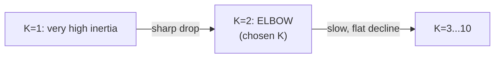
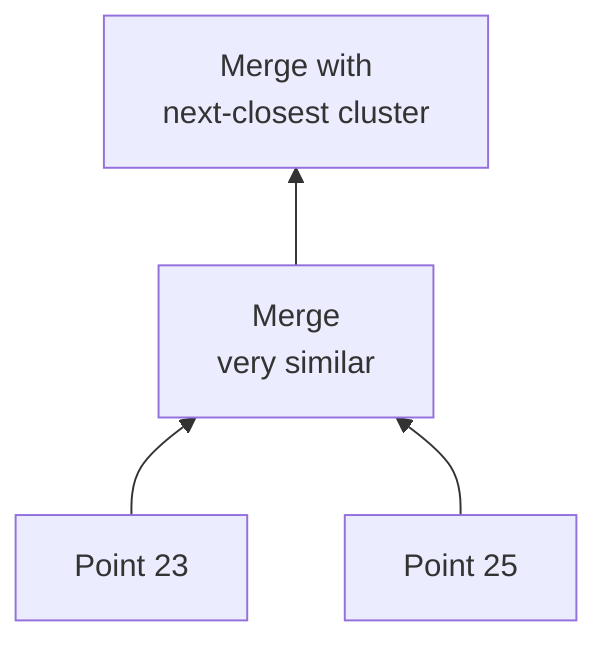
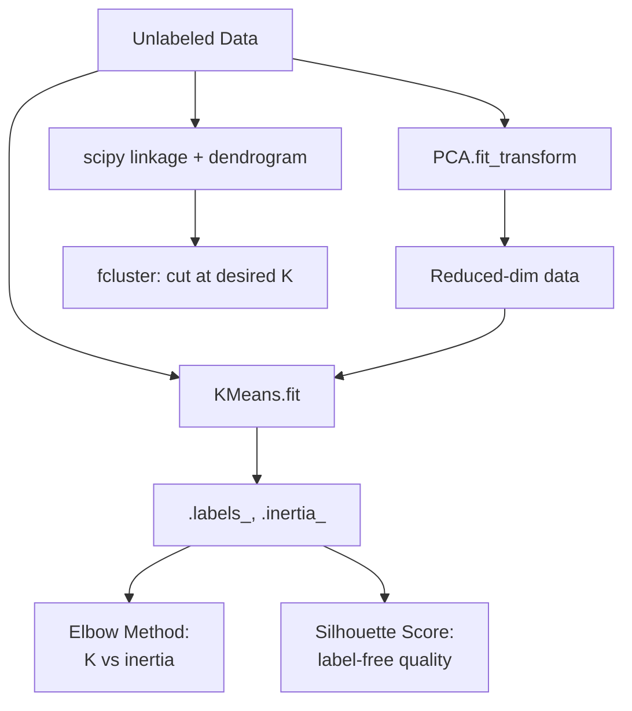

# Lecture 17: Hands-on ML III — Unsupervised Learning with Scikit-Learn

**Course**: AI for Industrial Cyber-Physical Systems (AI4ICPS) — IIT Kharagpur  
**Duration**: 1:52:14  
**Source**: ai4icps-upskilling.in  

---

## Overview

This hands-on session implements Lecture 16's theory in `scikit-learn`: **K-Means clustering** on a small synthetic dataset, the **elbow method** and **silhouette score** for choosing K, **PCA** for dimensionality reduction on the California-housing-style `housing.csv` dataset, and **hierarchical (agglomerative) clustering** with dendrograms and multiple linkage methods.

---

## 1. Why Unsupervised Learning? `[0:00 – 4:20]`

Supervised learning needs **labeled** data, and labels are usually expensive (human-annotated "ground truth"). Clustering sidesteps this: given only feature vectors, it discovers groups automatically. Labels for those groups (if needed) can be assigned by a human **after** clustering, by inspecting what each cluster contains.

> **Jargon**: *Ground truth* — Human-verified correct labels used to train/evaluate supervised models. Unsupervised learning does not require it.

---

## 2. K-Means Clustering `[19:02 – 44:00]`

### 2.1 Preparing the Data `[22:53 – 23:41]`

A small synthetic dataset (student marks, 22 points, 2 features) is reshaped into scikit-learn's expected input format:

```python
data = list(zip(x, y))   # [[x1, y1], [x2, y2], ...] — list of [feature1, feature2] pairs
print(data)
```

### 2.2 Fitting K-Means `[19:37 – 25:00]`

```python
from sklearn.cluster import KMeans

kmeans = KMeans(n_clusters=2, n_init="auto")
kmeans.fit(data)
c = kmeans.labels_
print(c)   # e.g. [0, 1, 0, 0, 1, ...] — one cluster ID per data point
```

| Parameter | Meaning |
|-----------|---------|
| `n_clusters` | The required *k* — number of clusters to form (must be decided/estimated beforehand) |
| `n_init` | Number of random centroid initializations to try; keeps the best (lowest-loss) run. `"auto"` picks a sensible default (e.g., ~10 runs) |
| `.labels_` | Output cluster ID (0, 1, 2, ...) assigned to each input point |

> **Jargon**: *`n_init`* — Since K-Means' first step (random centroid initialization) affects the final result, scikit-learn runs the whole algorithm `n_init` times with different random seeds and keeps the run with the lowest inertia (loss).

### 2.3 Visualizing Clusters `[25:00 – 27:14]`

```python
plt.scatter(x, y, c=kmeans.labels_)
plt.show()
```

Coloring each point by its predicted cluster label confirms the two visually-obvious groups were correctly recovered by K-Means.

### 2.4 Evaluating Without Ground Truth: Silhouette Score `[27:39 – 30:47]`

```python
from sklearn import metrics
score = metrics.silhouette_score(data, kmeans.labels_, metric="euclidean")
print(score)   # close to +1 -> well-separated, compact clusters
```

| Silhouette Score | Interpretation |
|---|---|
| **+1** | Highly dense, well-separated clustering (ideal) |
| **0** | Overlapping clusters (ambiguous boundary) |
| **−1** | Incorrect clustering (points closer to a different cluster than their own) |

> **Jargon**: *Overlapping clusters* — Clusters whose boundary is ambiguous — many points are nearly equidistant from two or more cluster centers, giving silhouette scores near 0.

---

## 3. Choosing K: Elbow Method & Silhouette Sweep `[44:00 – 52:00]`

### 3.1 Elbow Method via Inertia `[44:23 – 49:13]`

```python
inertia = []
for i in range(1, 11):
    kmeans = KMeans(n_clusters=i, n_init="auto")
    kmeans.fit(data)
    inertia.append(kmeans.inertia_)

plt.plot(range(1, 11), inertia, marker="o")
plt.title("Elbow Method")
plt.xlabel("Number of Clusters (K)")
plt.ylabel("Sum of Squared Errors (Inertia)")
plt.show()
```

> **Jargon**: *`.inertia_`* — Scikit-learn's built-in attribute giving the K-Means loss (sum of squared distances from points to their assigned cluster center) after fitting.

> ⚠️ **Caution (explicitly repeated in the session)**: Inertia **always decreases** as K increases (more clusters = a better/tighter fit, trivially reaching 0 when K = N — one cluster per point, i.e., **overfitting**). The elbow method looks for the point of **sharpest change** in the decreasing curve, not the lowest absolute value.



In the demo, the sharpest drop occurs at **K = 2**, matching the visually-obvious two clusters.

### 3.2 Silhouette Sweep `[49:27 – 51:37]`

```python
sil_scores = []
for i in range(2, 11):    # note: K must be ≥ 2 for silhouette score
    kmeans = KMeans(n_clusters=i, n_init="auto")
    kmeans.fit(data)
    sil_scores.append(metrics.silhouette_score(data, kmeans.labels_))

plt.plot(range(2, 11), sil_scores, marker="o")
plt.show()
```

The silhouette curve peaks at **K = 2**, confirming the elbow method's choice.

---

## 4. Principal Component Analysis (PCA) `[1:11:00 – 1:20:00]`

### 4.1 Loading & Normalizing the Housing Dataset `[1:05:27 – 1:12:53]`

```python
df = pd.read_csv("/content/drive/MyDrive/.../housing.csv")

X = df   # all 10 features, e.g. longitude, latitude, MedInc, AveRooms, etc.

# Min-max normalization
X_norm = (X - X.min()) / (X.max() - X.min())
X_norm.head(2)
```

> **Jargon**: *Min-max normalization* — Rescales every feature to the [0, 1] range via $\frac{x - x_{min}}{x_{max}-x_{min}}$. Different from **z-score standardization** (subtract mean, divide by std. dev.) used in earlier lectures — the instructor notes you must understand *when* to use which.

### 4.2 Fitting PCA `[1:12:56 – 1:16:00]`

```python
from sklearn.decomposition import PCA

pca = PCA(n_components=2)
principal_components = pca.fit_transform(X_norm)
transformed_df = pd.DataFrame(principal_components)
print(transformed_df.shape)   # (20640, 2) -- 10 features compressed to 2
```

> **Jargon**: *`n_components`* — The target number of output dimensions (*k* in PCA theory). Aggressively reducing many features to very few (e.g., 10 → 2) **loses information** — shown here mainly for pedagogical clarity, not as best practice.

### 4.3 Re-running K-Means on PCA-Reduced Data `[1:16:00 – 1:20:00]`

```python
X, y = principal_components[:, 0], principal_components[:, 1]
data = list(zip(X, y))
# ... same elbow-method loop as Section 3.1, on the PCA-reduced 2D data
```

With a large, dense real-world dataset (20,640 rows) compressed to 2 PCA dimensions, the elbow is much less obvious (candidates around **K = 4–6**), illustrating that the elbow method's reliability **degrades** as the underlying cluster structure gets fuzzier — a realistic, messier dataset compared to the clean synthetic toy example in Section 2.

> **Jargon**: *PCA for visualization* — Even when reducing dimensions purely for 2D plotting (rather than genuine compression), you inevitably discard information — the resulting scatter plot is a lossy approximation, useful for rough intuition rather than precise conclusions.

---

## 5. Hierarchical (Agglomerative) Clustering `[1:36:47 – 1:44:00]`

### 5.1 Building Linkages `[1:36:50 – 1:38:32]`

```python
from scipy.cluster.hierarchy import dendrogram, linkage

data = list(zip(x, y))

Z1 = linkage(data, method="single",   metric="euclidean")
Z2 = linkage(data, method="complete", metric="euclidean")
Z3 = linkage(data, method="average",  metric="euclidean")
Z4 = linkage(data, method="ward",     metric="euclidean")
Z5 = linkage(data, method="centroid", metric="euclidean")
```

| `method=` | Linkage Criterion |
|---|---|
| `single` | Minimum distance between cluster members |
| `complete` | Maximum distance between cluster members |
| `average` | Mean distance between cluster members |
| `ward` | Minimizes the increase in total within-cluster variance at each merge |
| `centroid` | Distance between cluster centroids |

### 5.2 Plotting & Reading a Dendrogram `[1:38:42 – 1:43:08]`

```python
plt.figure(figsize=(10, 6))
dendrogram(Z1)
plt.title("Single Linkage Dendrogram")
plt.show()
```



**Key operational insight**: unlike K-Means, you don't need to choose *k* upfront. Instead, you build the full dendrogram once, then **cut it horizontally at any height** to obtain any desired number of clusters:

- Cut near the top → **k = 2** (two big branches)
- Cut a bit lower → **k = 3** (splits one of the branches further)
- Cut even lower → more, smaller clusters

### 5.3 Extracting Flat Clusters from a Dendrogram `[1:43:23 – 1:44:00]`

```python
from scipy.cluster.hierarchy import fcluster

c = fcluster(Z4, t=num_clusters, criterion="maxclust")
```

> **Jargon**: *`fcluster`* — Converts a dendrogram (`linkage` output) back into flat cluster-ID labels, given either a target number of clusters (`criterion="maxclust"`) or a distance threshold (`criterion="distance"`).

These flat labels can then be passed to `metrics.silhouette_score` exactly as with K-Means, for objective (label-free) quality comparison across the five linkage methods.

---

## 6. Q&A Highlights `[1:49:53 – 1:52:14]`

- **Feature selection before PCA**: If you already know some features are important, keep them as-is and apply PCA only to the remaining, less-clear features — don't blindly PCA-transform everything.
- **Choosing `n_components`**: Cross-validation (sweeping candidate values, e.g., 3–7 components, and comparing downstream model performance) is the principled way to select it — not covered hands-on in this session but flagged as the standard approach.

---

## Quick Reference: Key Jargon Glossary

| Term | One-Line Definition |
|------|---------------------|
| `KMeans(n_clusters, n_init)` | scikit-learn's K-Means estimator |
| `.labels_` | Per-point predicted cluster ID after `.fit()` |
| `.inertia_` | K-Means' sum-of-squared-error loss after fitting |
| `silhouette_score` | Label-free cluster quality metric, range [−1, +1] |
| Min-max normalization | Rescale features to [0, 1] via (x−min)/(max−min) |
| `PCA(n_components)` | scikit-learn PCA estimator; reduces to k dimensions |
| `linkage(data, method=...)` | SciPy function building a hierarchical merge tree |
| `dendrogram(Z)` | Plots the hierarchical merge tree from `linkage` output |
| `fcluster` | Cuts a dendrogram into flat cluster labels |
| Ward linkage | Merge criterion minimizing increase in within-cluster variance |

---

## Summary



**Key Takeaway**: `scikit-learn` turns the K-Means/PCA/hierarchical-clustering theory into a few consistent method calls (`fit`, `fit_transform`, `.labels_`, `.inertia_`), and evaluating cluster quality without ground truth (via silhouette score) plus systematic K-selection (elbow method) are essential companion steps whenever you cluster real, messy data — as opposed to the clean toy examples where the "right" K is visually obvious.

---

*Notes generated from SRT transcript with timestamps. whisper.cpp (small model, Metal GPU). Enhanced with AI expert annotations.*
