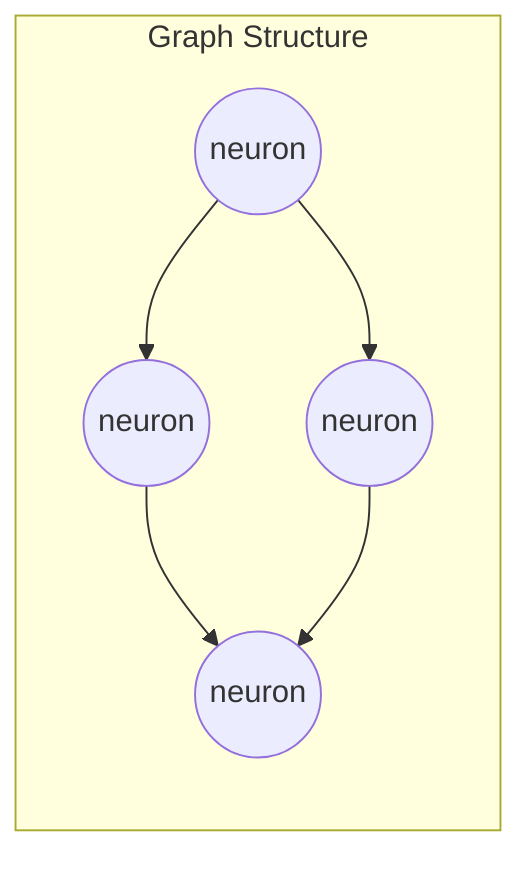
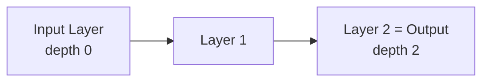
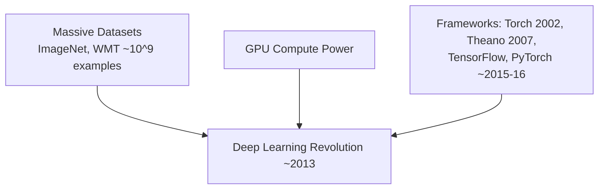
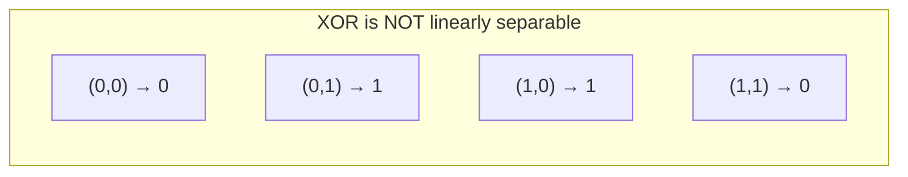
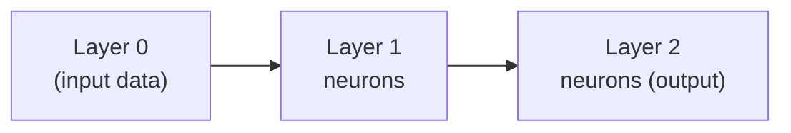
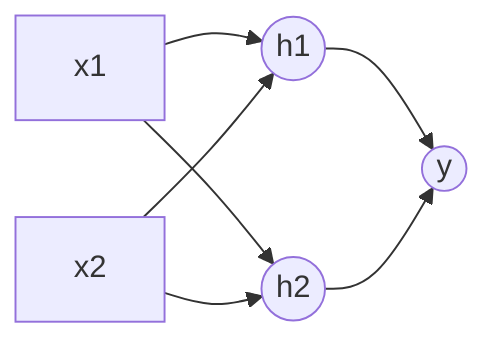
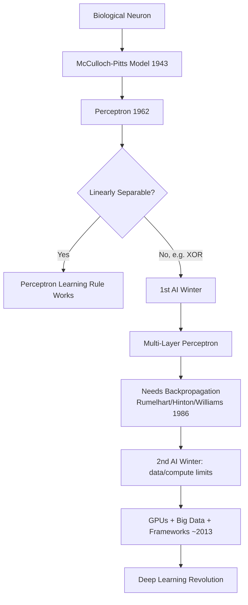

# Lecture 18: Neural Networks DL FeedForward CNN RNN Part1

**Course**: AI for Industrial Cyber-Physical Systems (AI4ICPS) — IIT Kharagpur  
**Duration**: 57:20  
**Source**: ai4icps-upskilling.in  

---

## Overview

This lecture lays the mathematical foundation of neural networks: what a neuron computes, why activation functions are needed, and how the field evolved from the 1943 McCulloch-Pitts model through two "AI winters" to the modern deep learning era. It closes with a hand-worked example of building a multi-layer perceptron to solve the XOR problem — the classic proof that a single neuron isn't enough.

---

## 1. What Is a Neural Network? `[0:00 – 5:43]`

### 1.1 Two Mental Models `[0:52 – 8:20]`

A neural network is a **computation model inspired by biological neural circuits** — but instead of the sequential, one-instruction-at-a-time execution of classical programs, it performs **massively parallel** computation across many simple units.

Formally, a neural network is a **directed acyclic graph (DAG)** of neurons:



> **Jargon**: *Directed Acyclic Graph (DAG)* — A graph where edges have direction and following them can never loop back to a node you've already visited. Neural networks must be acyclic (in the basic feedforward case) so a forward computation always terminates.

Two equivalent ways to think about a network:

| View | Description |
|------|-------------|
| Structural | A graph of neurons connected by weighted, directed edges — modeled loosely on the brain |
| Functional | A **function approximator**: $y = f(x)$, mapping an input vector to an output vector |

> *Reads as*: "Feed in a vector of numbers x, the network spits out a vector y. Whatever f actually is gets shaped by the network's weights."

The behavior of $f$ is entirely controlled by the **weights** attached to each edge — and critically, these weights are *learned* from data rather than hand-coded.

---

## 2. Depth & the Deep Learning Distinction `[8:20 – 10:19]`

There is no hard boundary between a "neural network" and "deep learning" — deep learning is simply a neural network with a **large depth**.

> **Jargon**: *Depth* — The number of layers of neurons stacked after the input layer. The input layer itself counts as layer 0 (not counted toward depth).



> *Example*: A network with an input layer, one hidden layer, and one output layer has **depth 2** (input layer doesn't count).

---

## 3. A Brief History of Neural Networks `[10:19 – 23:16]`

### 3.1 Timeline `[10:22 – 16:32]`

| Year | Milestone | Significance |
|------|-----------|---------------|
| 1943 | McCulloch & Pitts, *"A Logical Calculus of the Ideas Immanent in Nervous Activity"* | First mathematical model of a single neuron |
| 1962 | Perceptron (Rosenblatt) | First trainable neural network applied to a real learning task |
| ~1960 | Adaline (Adaptive Linear Neuron) | Competing linear model, similar era |
| ~1969 | Minsky & Papert critique | Proved single-layer perceptrons **cannot approximate XOR** → triggered **1st AI Winter** |
| 1967–70 | Early multi-layer perceptron (MLP) papers | Showed MLPs can approximate many more functions, but *training* them was unsolved |
| 1986 | Rumelhart, Hinton & Williams (*Nature*) | Formalized **backpropagation** — 2nd AI boom begins |
| ~1990s | Data & compute insufficient for real-world tasks | Field shifts to SVMs and other efficient models → **2nd AI Winter** |
| ~2013 | GPUs + massive datasets (ImageNet, etc.) | 3rd AI revolution: the **deep learning era** begins |
| 2015 | Bengio, LeCun & Hinton, *Nature* "Deep Learning" review | Deep learning enters the mainstream |

> **Jargon**: *AI Winter* — A period of reduced funding/interest in AI after inflated expectations collide with a fundamental limitation. Two occurred: (1) after the XOR critique showed perceptrons were too weak, and (2) after neural nets underperformed simpler models like SVMs due to lack of data/compute.

### 3.2 Why 2013 Was Different `[16:52 – 22:07]`

Three converging factors triggered the deep learning revolution:



- **Data**: Dataset sizes jumped from ~10³–10⁴ examples (1950s–80s) to 10⁹+ (ImageNet, WMT translation corpus) after ~2005. Traditional ML models plateaued on this much richer, more complex data — the information was there, but old models couldn't extract it.
- **Compute**: Model sizes grew from thousands of connections-per-neuron to today's foundation models with 7B+ parameters.
- **Software**: Frameworks bundled **automatic differentiation and backpropagation**, making it dramatically easier to define and train large networks — removing the biggest practical barrier to adoption.

---

## 4. The Artificial Neuron `[23:16 – 27:04]`

### 4.1 The McCulloch-Pitts Computation `[23:22 – 26:02]`

Each neuron performs three steps:

$$o = s\left(\sum_{i} w_i x_i + b\right) = s(\mathbf{w}^T \mathbf{x} + b)$$

```python
# Pseudocode: one neuron (McCulloch-Pitts model, 1943)
weighted_sum = sum(w[i] * x[i] for i in range(n))
z = weighted_sum + b          # b = bias
output = s(z)                 # s = activation function
```

> *Reads as*: "Multiply every input by its weight, sum them, add a bias, then squash the result through an activation function `s` to get a single output."

| Symbol | Meaning |
|--------|---------|
| **x** | Input vector to the neuron |
| **w** | Weight vector — one weight per incoming edge |
| b | Bias — shifts where the neuron activates |
| s(·) | Activation function |
| o | The neuron's single scalar output |

This is called the **McCulloch-Pitts model** — the original 1943 mathematical abstraction of a biological neuron.

---

## 5. Activation Functions `[27:04 – 34:12]`

### 5.1 Biological Motivation & the Threshold Function `[27:04 – 28:42]`

A biological neuron aggregates incoming electrical signals and **fires** (sends its own signal) once the aggregate crosses a threshold. This maps directly to a **hard threshold function**:

$$s(z) = \begin{cases} 0 & z < 0 \\ 1 & z \geq 0 \end{cases}$$

### 5.2 Why Sigmoid Replaces the Hard Threshold `[28:42 – 32:04]`

The hard threshold is **non-differentiable** — you can't compute a gradient through a step. The **sigmoid** function is a smooth, differentiable approximation:

$$\sigma(z) = \frac{1}{1+e^{-z}}$$

> **Math Note**: By scaling the exponent ($e^{-\lambda z}$ for large $\lambda$), the sigmoid's slope steepens and it approaches the hard threshold arbitrarily closely — so using sigmoid loses very little expressive power while gaining differentiability, which is essential for backpropagation.

The bias `b` shifts *where* the threshold occurs: since the neuron computes $s(\mathbf{w}^T\mathbf{x} + b)$, the actual crossover point is at $\mathbf{w}^T\mathbf{x} = -b$, not at 0. Both the weights *and* the threshold position are tunable — this is what "learning" adjusts.

### 5.3 Common Activation Functions & the Gradient Problem `[32:04 – 34:12]`

| Function | Formula | Gradient Behavior |
|----------|---------|--------------------|
| Sigmoid | $\frac{1}{1+e^{-z}}$ | Near-zero gradient outside a small central region → prone to **vanishing gradients** |
| Tanh | $\frac{e^z - e^{-z}}{e^z + e^{-z}}$ | Similar shape to sigmoid, zero-centered |
| ReLU | $\max(0, z)$ | Constant, healthy gradient for $z>0$; **zero gradient for $z<0$** |
| Leaky ReLU | $\max(\alpha z, z)$, small $\alpha$ | Small non-zero gradient even for $z<0$ — further reduces vanishing gradients |
| Maxout | Generalization of ReLU (max over several linear pieces) | Learnable piecewise-linear shape |
| ELU | Exponential decay for $z<0$, linear for $z\geq 0$ | Smooth negative-side alternative to Leaky ReLU |

> **Jargon**: *Vanishing/Exploding Gradient* — During backpropagation, gradients are multiplied layer by layer. If each layer's local gradient is small (as with sigmoid's flat tails), the product shrinks toward zero in deep networks ("vanishing"), stalling learning. The opposite (exploding) happens when local gradients are consistently >1. ReLU-family activations were popularized largely because their gradient stays large and constant for positive inputs, mitigating this.

---

## 6. The Perceptron: A Single Neuron as a Classifier `[34:12 – 39:18]`

### 6.1 Formulation `[34:12 – 37:23]`

For a **two-class classification** problem with labels $\{+1, -1\}$:

$$\hat{y} = \text{sign}(\mathbf{w}^T \mathbf{x})$$

```python
# Pseudocode: perceptron prediction
score = dot(w, x)
prediction = +1 if score > 0 else -1
```

> *Reads as*: "Compute the dot product of weights and input. Positive → class +1. Negative → class −1." The `sign` function here plays the same role as the threshold function, just using ±1 instead of 0/1 — purely a notational convenience common in SVM-style derivations.

The perceptron is literally the **simplest possible neural network**: one neuron, taking input $x_1, \dots, x_d$, with weights $w_1, \dots, w_d$, producing $y = \text{sign}(\mathbf{w}^T\mathbf{x})$.

### 6.2 The Decision Boundary Is a Hyperplane `[37:23 – 39:18]`

The boundary between the two predicted classes is:

$$\mathbf{w}^T \mathbf{x} = 0$$

> **Jargon**: *Hyperplane* — In 2D this equation is a line, in 3D a plane, and in general a flat $(d-1)$-dimensional surface slicing the $d$-dimensional input space in two. A single neuron can only ever carve out a **linear** decision boundary.

Since `sign` is non-differentiable, the original perceptron wasn't trained by gradient descent — it used the **perceptron learning rule**, a simple error-driven weight update that is *guaranteed to converge* only when the data is **linearly separable**.

---

## 7. The XOR Problem `[39:18 – 41:39]`

### 7.1 Why a Single Neuron Fails `[39:18 – 41:19]`

| x₁ | x₂ | XOR Output |
|----|----|------------|
| 0 | 0 | 0 |
| 0 | 1 | 1 |
| 1 | 0 | 1 |
| 1 | 1 | 0 |



No single straight line can separate the "0" points $\{(0,0), (1,1)\}$ from the "1" points $\{(0,1), (1,0)\}$ — visually they alternate around the square. This was the crux of the **Minsky-Papert critique** that triggered the first AI winter: perceptrons/Adaline are fundamentally limited to **linearly separable** problems, and even a function as simple as XOR (the basis of binary addition in digital electronics) is out of reach.

**The fix**: stack multiple layers → **Multi-Layer Perceptron (MLP)**.

---

## 8. Multi-Layer Perceptrons (MLPs) `[41:39 – 51:27]`

### 8.1 Layer Architecture `[41:39 – 44:08]`



- **Layer 0** is simply the raw input data (not composed of computing neurons).
- **Layer 1** neurons take input directly from layer 0.
- **Layer 2** neurons take input from the *outputs* of layer 1, and so on.

> **Jargon**: *Fully Connected Layer* — Every neuron in one layer receives input from *every* neuron in the previous layer. This is the defining property of a standard MLP layer — in code, this is the `Linear` / `Dense` layer.

### 8.2 The Matrix View of a Layer `[44:08 – 48:53]`

For a layer $j$ receiving input from a previous layer $k$ with $d_k$ neurons, computing output for neuron $j$'s entry 0:

$$a_j^{(0)} = \sum_{\ell=1}^{d_k} w_{kj}^{(\ell)} \, a_k^{(\ell)}$$

```python
# Pseudocode: one fully connected layer
# a_k: activations from previous layer (d_k values)
# W:   weight matrix of shape (d_j, d_k)
a_j = activation(W @ a_k + b)     # matrix-vector product + bias, then squash
```

> *Reads as*: "Each neuron in the new layer computes a weighted sum over *every* neuron in the previous layer — so the whole layer's weights form a matrix, not just a vector."

| Layer transition | Weight matrix shape |
|-------------------|----------------------|
| $d_k$ input neurons → $d_j$ output neurons | $d_j \times d_k$ |

> *Example*: A layer with 10 input neurons feeding into 4 output neurons needs a **10 × 4 = 40**-weight matrix (i.e., 4 sets of 10 weights, one set per output neuron).

**Key architectural rule for MLPs**: layer $n$ takes input *only* from layer $n-1$ (never skipping layers or looping back) — that's what distinguishes a strict MLP from other architectures (e.g., ResNets with skip connections).

### 8.3 Hidden Layers `[49:29 – 51:27]`

> **Jargon**: *Hidden Layer* — Any layer that is neither the input nor the output layer. Called "hidden" because a user of the network only supplies input `x` and reads output `y` — the intermediate computations and their outputs are never directly observed.

The central design question for any MLP: **how many hidden layers, and how many neurons per layer?** There's no closed-form answer — it's an architecture search problem, guided by task complexity and empirical tuning.

---

## 9. Hand-Solving XOR with a Hidden Layer `[51:27 – 57:20]`

### 9.1 A Manually-Designed 2-Neuron Hidden Layer `[51:48 – 56:34]`

One hidden layer with two neurons $h_1, h_2$ can solve XOR, using **hand-picked** (not learned) weights:

$$h_1 = \text{step}(20x_1 + 20x_2 - 10) \qquad h_2 = \text{step}(-20x_1 - 20x_2 + 30)$$
$$y = \text{step}(20h_1 + 20h_2 - 30)$$

```python
# Pseudocode: XOR via a hand-crafted 2-layer network
def step(z):
    return 1 if z > 0 else 0

def xor_mlp(x1, x2):
    h1 = step(20*x1 + 20*x2 - 10)     # fires unless BOTH inputs are 0
    h2 = step(-20*x1 - 20*x2 + 30)    # fires unless BOTH inputs are 1
    y  = step(20*h1 + 20*h2 - 30)     # fires only if BOTH h1 and h2 fire
    return y
```

> *Reads as*: "h1 draws one separating line (fires for everything except (0,0)); h2 draws another (fires for everything except (1,1)). The output neuron fires only when **both** h1 and h2 fire — which happens exactly at (0,1) and (1,0), the two points where XOR = 1."

| Input (x₁, x₂) | h₁ | h₂ | Output y |
|-----------------|----|----|---------|
| (0, 0) | 0 | 1 | 0 |
| (0, 1) | 1 | 1 | 1 |
| (1, 0) | 1 | 1 | 1 |
| (1, 1) | 1 | 0 | 0 |

> *Example*: At (1,1): $h_1 = \text{step}(20+20-10)=\text{step}(30)=1$; $h_2 = \text{step}(-20-20+30)=\text{step}(-10)=0$. Output $= \text{step}(20\cdot1 + 20\cdot0 - 30) = \text{step}(-10) = 0$. Correct — XOR(1,1) = 0.

**Crucial takeaway**: this example used *manually chosen* weights purely to illustrate that a hidden layer creates a new, linearly-separable representation of the problem ($h_1, h_2$ space). In practice, a learning algorithm (backpropagation, covered in Part 2) discovers these weights automatically.



---

## Quick Reference: Key Jargon Glossary

| Term | One-Line Definition |
|------|----------------------|
| Directed Acyclic Graph (DAG) | Graph with directed edges and no cycles — the structure of a feedforward NN |
| Depth | Number of layers after the input layer; defines "deep" learning |
| McCulloch-Pitts Model | 1943 mathematical model of a neuron: weighted sum + bias + activation |
| Perceptron | Single-neuron linear classifier; only solves linearly separable problems |
| Hyperplane | Flat decision boundary of dimension (d−1) in a d-dimensional input space |
| AI Winter | Period of reduced AI interest after a fundamental limitation is exposed |
| Sigmoid | Smooth, differentiable approximation of the hard threshold function |
| Vanishing/Exploding Gradient | Gradients shrink/grow uncontrollably across many layers during backprop |
| ReLU | $\max(0,z)$ activation; mitigates vanishing gradients for positive inputs |
| Multi-Layer Perceptron (MLP) | Network of fully connected layers stacked sequentially |
| Fully Connected Layer | Every neuron connects to every neuron in the adjacent layer |
| Hidden Layer | Any layer that isn't the input or output layer |
| XOR Problem | Classic non-linearly-separable function; motivated the shift to MLPs |

---

## Summary



**Key Takeaway**: A single neuron can only draw a straight-line (hyperplane) decision boundary, which is why perceptrons fail on non-linearly-separable problems like XOR — stacking neurons into hidden layers lets a network compose multiple linear boundaries into arbitrarily complex ones, and this compositional power, combined with data, compute, and differentiable activation functions, is exactly what makes deep learning work.

---

*Notes generated from SRT transcript with timestamps. whisper.cpp (small model, Metal GPU). Enhanced with AI expert annotations.*
