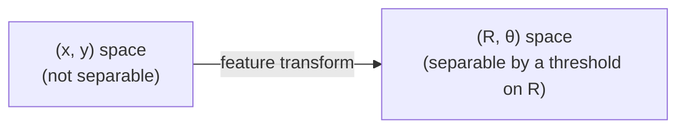
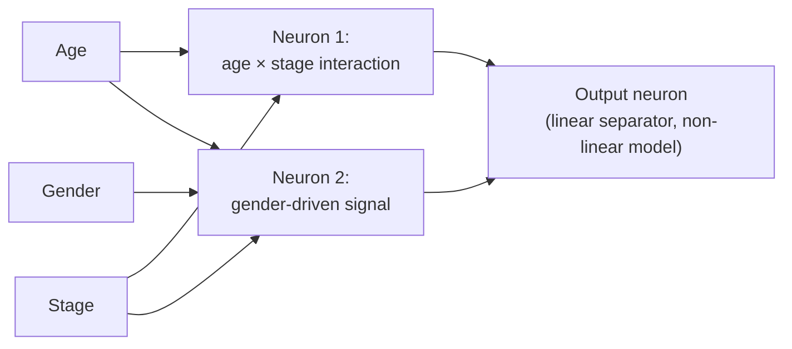
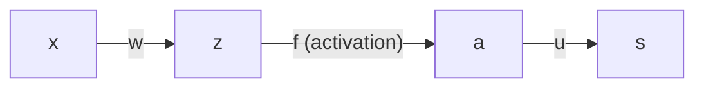
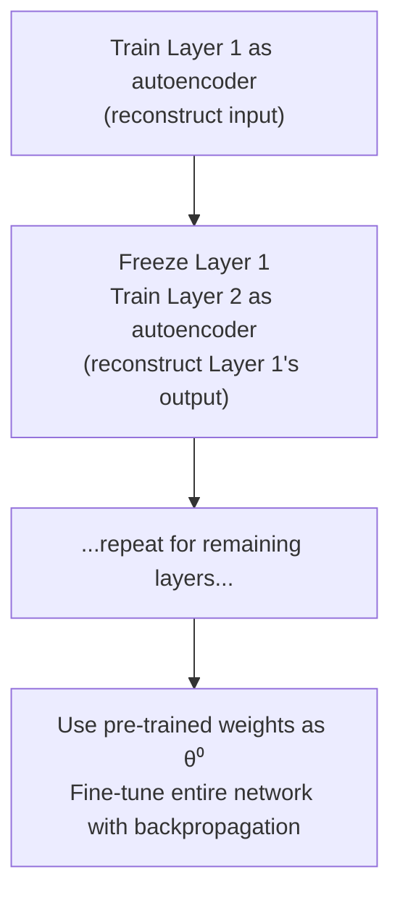
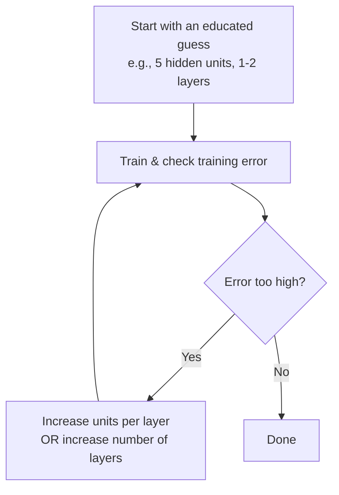
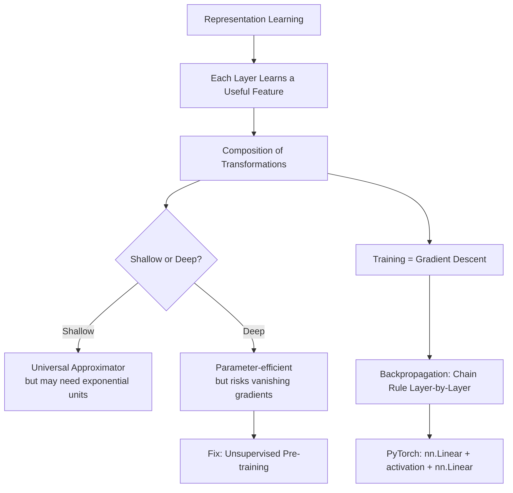

# Lecture 19: Neural Networks DL FeedForward CNN RNN Part2

**Course**: AI for Industrial Cyber-Physical Systems (AI4ICPS) — IIT Kharagpur  
**Duration**: 1:12:58  
**Source**: ai4icps-upskilling.in  

---

## Overview

This lecture explains *why* neural networks work — through the lens of representation learning and the composition of feature transformations — then derives the backpropagation algorithm from first principles using the chain rule. It closes with a PyTorch implementation walkthrough and a rich Q&A covering practical design questions (how many layers, how weight matrices are shaped, why bias matters).

---

## 1. Representation Learning `[0:44 – 9:47]`

### 1.1 Every Layer Learns a Useful Feature `[0:44 – 5:43]`

> **Jargon**: *Representation Learning* — Instead of hand-designing features (as in classical ML), each layer of a neural network *learns* to compute a transformed version of its input that makes the downstream task easier.

**Worked example**: Given 2D points $(x, y)$ split into green/blue classes that are *not* linearly separable in $(x,y)$-space, transform each point into polar coordinates:

$$R = \sqrt{x^2+y^2}, \qquad \theta = \tan^{-1}(y/x)$$



> *Reads as*: "R alone (the radial distance) is often enough to separate two classes arranged in concentric rings — even without θ." One neuron computing $R$, followed by a second neuron thresholding it, solves the classification.

| Term | Meaning |
|------|---------|
| Useful representation | A feature that simplifies the *specific* end-task (e.g., R alone) |
| Complete representation | A feature set that fully preserves the original information (e.g., R **and** θ — you can recover x, y) |

### 1.2 Distributed Representations `[5:43 – 9:05]`

> **Jargon**: *Distributed Representation* — Each data point's feature (e.g., its R value) is computed **independently** of every other data point — depending only on the shared layer weights, not on other samples. This independence is what makes layer computation trivially parallelizable across a batch.

Representations are built up **hierarchically**: each layer's output becomes progressively more useful for the final task, which is why neural networks are sometimes called **feature encoders** or **automatic feature learning models** — unlike the polar-coordinate example (done by hand), real networks *learn* these transformations from data.

### 1.3 Composition of Transformations: A Clinical Example `[9:47 – 12:37]`

Given patient features (age, gender, cancer stage), a two-hidden-neuron layer might learn:



Neuron 1 might implicitly capture "high age + high stage → low survival," while neuron 2 captures a gender-specific effect. The final layer combines these *learned* intermediate features — this composition of simple transformations is the essence of what a neural network does.

---

## 2. Why Go Deep? Shallow vs. Deep Networks `[13:00 – 22:58]`

### 2.1 The Universal Approximation Theorem `[13:00 – 15:05]`

> **Jargon**: *Universal Approximation Theorem* — A neural network with just **one hidden layer** can approximate *any* sufficiently smooth function $F$ arbitrarily closely:
> $$\|F'(x) - F(x)\| \le \epsilon \quad \forall x$$
> A network satisfying this is called a **shallow neural network**.

> *Reads as*: "Given enough hidden units, a single hidden layer is theoretically sufficient to approximate almost any well-behaved function to any desired precision."

### 2.2 The Catch: Efficiency `[15:05 – 19:31]`

The theorem says shallow networks are *possible*, not *efficient*. Some functions require an **exponentially large** number of hidden units to represent with just one layer — meaning far more weights, more data, and more compute than a deeper equivalent.

**Face detection example**:


Detecting a face directly from raw pixels in *one* layer is theoretically possible but would need an enormous number of neurons. Building it up hierarchically — edges → shapes/corners → face parts → face — reuses simple building blocks across layers, requiring far fewer total parameters.

### 2.3 How Deep Is "Deep"? `[19:31 – 22:58]`

> **Jargon**: *Shallow vs. Deep* — As a rough rule of thumb (not a strict definition), networks with **3–4 layers or fewer** are "shallow"; beyond that, they're considered "deep."

Two practical reasons the deep/shallow distinction matters:

| Challenge | Shallow Network | Deep Network |
|-----------|-------------------|----------------|
| Design approach | Ad hoc | Needs a **modular** plan — what representation should each layer/group of layers achieve? |
| Vanishing gradients | Rarely an issue | Major issue — gradients shrink across many layers, slowing or halting training |

---

## 3. Training a Neural Network: The Big Picture `[22:58 – 34:54]`

### 3.1 The Training Loop `[22:58 – 28:26]`

```mermaid
flowchart TD
    A[Randomly initialize weights θ⁰] --> B[Forward pass:<br/>compute ŷ = f_θ(x)]
    B --> C["Compute loss J(ŷ, y)"]
    C --> D["Compute gradient ∂J/∂θ"]
    D --> E["Update: θ ← θ − η·∂J/∂θ"]
    E --> B
```

Given a training set $D = \{(x_i, y_i)\}_{i=1}^N$ (commonly N ≈ millions of examples):

$$J(\theta) = \sum_{i=1}^N L(f_\theta(x_i), y_i)$$

```python
# Pseudocode: neural network training loop
theta = random_init()
for epoch in range(num_epochs):
    for x, y in dataset:
        y_hat = forward_pass(x, theta)      # layer-by-layer computation
        loss = loss_fn(y_hat, y)
        grad = backward_pass(loss, theta)   # backpropagation
        theta = theta - learning_rate * grad
```

> *Reads as*: "Guess random weights. Run the input through the network to get a prediction. Compare prediction to the true answer to get a loss. Figure out how each weight contributed to that loss (gradient). Nudge every weight a little in the direction that reduces the loss. Repeat until the weights stop changing."

This procedure is called **gradient descent**; the per-weight direction/step is computed via **backpropagation**.

### 3.2 The Gradient Descent Update Rule `[29:09 – 34:54]`

$$w^{(t+1)} = w^{(t)} - \eta_t \cdot \frac{\partial J}{\partial w}$$

| Symbol | Meaning |
|--------|---------|
| $w^{(t)}$ | Weight value at iteration $t$ |
| $\eta_t$ | Learning rate (step size) at iteration $t$ |
| $\partial J/\partial w$ | Gradient of total loss w.r.t. that specific weight |

The unresolved question: with potentially **millions** of weights spread across many layers, how do you efficiently compute $\partial J / \partial w$ for *every single one*? Answer: **layer-by-layer backward propagation**, mirroring the layer-by-layer forward pass.

---

## 4. Deriving Backpropagation `[34:54 – 46:33]`

### 4.1 A Minimal 2-Layer Example `[35:45 – 42:01]`

Consider the simplest possible chain: input $x$ → weight $w$ → pre-activation $z$ → activation $a = f(z)$ → weight $u$ → final output $s$.



**Goal**: compute $\partial s/\partial u$ and $\partial s/\partial w$.

**Easy case** — output layer weight $u$:
$$s = u_1 a_1 + u_2 a_2 \implies \frac{\partial s}{\partial u_1} = a_1$$

**Harder case** — earlier layer weight $w_{ij}$, requiring the **chain rule**:

$$\frac{\partial s}{\partial w_{ij}} = \underbrace{u_i \cdot f'(z_i)}_{\text{upstream error}} \cdot \underbrace{x_j}_{\text{downstream input}}$$

```python
# Pseudocode: chain rule for one weight, one layer back
upstream_error = u[i] * f_prime(z[i])   # how much this activation affects the final output
gradient_wij   = upstream_error * x[j]  # scale by the input that fed this weight
```

> *Reads as*: "The gradient for a weight = (how much the final output cares about this neuron's activation, via the layer(s) above) × (the input value that flowed through this particular weight)."

> **Jargon**: *Upstream Error* — The accumulated sensitivity of the loss to a given neuron's output, computed by working *backward* from the final layer. *Downstream Input* — The value flowing *into* the weight being differentiated (i.e., the activation from the previous layer). Every backprop step multiplies these two signals together.

### 4.2 Deep Networks: Chained Multiplications `[45:20 – 46:33]`

For a network with many layers (e.g., 100), computing the gradient for an early-layer weight requires multiplying together **~100 upstream error terms**, one per layer traversed backward:

$$\frac{\partial J}{\partial w^{(1)}} = \underbrace{(\text{layer 100 error}) \times (\text{layer 99 error}) \times \cdots \times (\text{layer 2 error})}_{\text{~100 multiplicative terms}} \times x$$

Since most of these per-layer terms are fractions $<1$ (e.g., sigmoid derivatives), the product **shrinks toward zero** as depth grows — this is precisely the **vanishing gradient problem** introduced in Section 2.3.

---

## 5. Fixing Vanishing Gradients: Unsupervised Pre-training `[46:33 – 50:05]`

### 5.1 The Layer-Wise Pre-training Strategy `[47:37 – 50:05]`

> **Jargon**: *Unsupervised Pre-training* — Before running full backpropagation on a deep network, train each layer *individually* as a shallow **autoencoder** that tries to reconstruct its own input. This gives each layer a sensible initial weight setting *without* needing to propagate error signals through the whole deep stack.



Because each individual autoencoder is shallow, it trains fast and avoids vanishing gradients. The resulting weights $\theta^{(0)}$ give full backpropagation a much better starting point, making the final **supervised fine-tuning** phase converge dramatically faster than training a random-initialized deep network from scratch.

---

## 6. Implementing an MLP in PyTorch `[50:05 – 53:49]`

### 6.1 Defining a Model for MNIST `[50:05 – 53:49]`

```python
import torch
import torch.nn as nn

input_size  = 784   # 28 x 28 MNIST images, flattened
hidden_size = 128
num_classes = 10     # digits 0-9
num_epochs  = 10
batch_size  = 64
learning_rate = 0.001

class MLP(nn.Module):
    def __init__(self):
        super().__init__()
        self.fc1  = nn.Linear(input_size, hidden_size)
        self.relu = nn.ReLU()
        self.fc2  = nn.Linear(hidden_size, num_classes)

    def forward(self, x):
        x = x.view(-1, input_size)   # flatten 28x28 image to a 784-vector
        x = self.fc1(x)
        x = self.relu(x)             # ReLU is an activation, not a "layer" with weights
        x = self.fc2(x)
        return x
```

> *Reads as*: "Flatten the image into a vector, push it through a fully connected layer, squash with ReLU, push through a second fully connected layer to get 10 class scores." This simple 2-layer MLP achieves roughly **96% accuracy** on MNIST digit classification — good enough for a toy problem, but real-world vision tasks need more sophisticated architectures (CNNs — covered next lecture).

---

## 7. Q&A Highlights `[53:49 – 1:12:58]`

### 7.1 Why $\mathbf{W}^T\mathbf{x}$ and Not $\mathbf{W}\mathbf{x}$? `[54:10 – 58:42]`

If $W$ has shape (inputs × outputs) — e.g., a 3×2 matrix connecting 3 input neurons to 2 output neurons — then $W \cdot x$ has mismatched dimensions. Transposing $W$ to shape (outputs × inputs) makes the matrix-vector product dimensionally valid: $h = W^T x$.

> **Math Note**: Weight matrix convention matters. If $W_{ij}$ denotes the weight from input $i$ to output $j$, then $W$ naturally has shape $(d_{in}, d_{out})$, and you need $W^T x$ (shape $(d_{out}, d_{in}) \times (d_{in}, 1)$) to get a valid $(d_{out}, 1)$ output vector.

### 7.2 How Many Hidden Layers/Units Should I Use? `[58:54 – 1:01:47]`

There's **no formula** — it's an empirical, iterative process:



**Trade-off**: Going deeper is more *parameter-efficient* (fewer total units needed, per Section 2.2), but increases training time and may require specialized techniques (e.g., pre-training) once you exceed ~4–5 layers.

### 7.3 Can a Cyclic Graph Be a Neural Network? `[1:01:47 – 1:04:04]`

No — a graph with a **directed cycle** is not a valid (feedforward) neural network; only **DAGs** qualify. Terminology clarification: **Multi-Layer Perceptron**, **Feedforward Neural Network**, and **Fully Connected Neural Network** are all synonyms for the same DAG-structured, layer-wise architecture discussed in this lecture.

### 7.4 Why Does Bias Take Positive or Negative Values? `[1:06:51 – 1:09:39]`

The bias **shifts the decision threshold**. If you want the activation to switch from 0 to 1 exactly when $\mathbf{w}^T\mathbf{x} = 1.1$ (instead of at 0), simply set $b = -1.1$, since the neuron fires when $\mathbf{w}^T\mathbf{x} + b \geq 0 \iff \mathbf{w}^T\mathbf{x} \geq -b = 1.1$.

### 7.5 How Are the Hand-Picked XOR Weights (20, −10, etc.) Derived? `[1:09:39 – 1:12:56]`

By **inspection**, not any formula: pick weights large enough that $\mathbf{w}^T\mathbf{x} + b$ has the correct sign for every one of the 4 training points, then verify all four cases. Such weights are **not unique** — many different weight combinations solve the same problem equally well. In real systems, this manual search is replaced entirely by gradient descent.

---

## Quick Reference: Key Jargon Glossary

| Term | One-Line Definition |
|------|----------------------|
| Representation Learning | Networks learn useful transformed features rather than using hand-crafted ones |
| Distributed Representation | Per-sample feature computed independently of other samples — enables parallelism |
| Universal Approximation Theorem | A single hidden layer can approximate any smooth function, given enough units |
| Shallow Network | Network with ~3-4 layers or fewer |
| Deep Network | Network with many more layers; more parameter-efficient but harder to train |
| Gradient Descent | Iteratively update weights opposite to the loss gradient |
| Backpropagation | Layer-by-layer application of the chain rule to compute all weight gradients |
| Upstream Error | Accumulated loss-sensitivity flowing backward from later layers |
| Downstream Input | The activation value feeding into the weight being differentiated |
| Vanishing Gradient | Product of many small per-layer gradients shrinks toward zero in deep nets |
| Unsupervised Pre-training | Layer-wise autoencoder training used to initialize weights before full backprop |
| Feedforward / MLP / Fully Connected Network | Synonyms for a DAG-structured, layer-wise neural network |

---

## Summary



**Key Takeaway**: Neural networks work by composing simple, learned feature transformations layer by layer; deep networks are more parameter-efficient than shallow ones for complex tasks, but that efficiency comes at the cost of harder training (vanishing gradients), which backpropagation combined with techniques like pre-training and modern activations (ReLU) is specifically designed to overcome.

---

*Notes generated from SRT transcript with timestamps. whisper.cpp (small model, Metal GPU). Enhanced with AI expert annotations.*
