# Lecture 20: DL Models Inference Pretrained Pytorch Part1

**Course**: AI for Industrial Cyber-Physical Systems (AI4ICPS) — IIT Kharagpur  
**Duration**: 56:01  
**Source**: ai4icps-upskilling.in  

---

## Overview

This lecture explains why the field has largely moved away from training models from scratch, toward **pre-training** a general-purpose "source model" on massive data and then **adapting** it to a specific task with much less labeled data. It surveys the major pre-training recipes for vision (masked autoencoders, DINOv2), language (word embeddings, BERT's masked language modeling), and vision-language models (VQA, image-text matching), then covers the two practical strategies for reusing a pre-trained model: freezing vs. partial fine-tuning.

---

## 1. Why Pre-Training? The Practical Motivation `[0:00 – 9:36]`

### 1.1 The Cooking Analogy `[0:00 – 1:32]`

> *Reads as*: "Pre-boiling and steaming meat ahead of time lets you cook a full dish quickly later by just adding spices — you've front-loaded the expensive work." Pre-training does the same for neural networks: do the expensive general-purpose learning once, then cheaply specialize it later.

### 1.2 Four Real-World Obstacles to Training From Scratch `[1:32 – 9:36]`

| Obstacle | Why It's a Problem |
|----------|---------------------|
| **Annotation is scarce & costly** | Raw data (social media, video, audio) is abundant, but labeling it needs domain experts, is slow, and needs multiple annotators for reliability |
| **Compute is gatekept** | Training large models needs GPU/TPU clusters mostly available only to large organizations (Google, Meta, Microsoft) |
| **Out-of-distribution generalization** | Test data is rarely drawn from *exactly* the same distribution as training data (e.g., medical MRI data is scarce and varies by hospital/scanner) |
| **Personalization needs** | A general model serves the average case, but individuals have idiosyncratic behavior a general model can't capture |

> **Jargon**: *Out-of-Distribution (OOD) Generalization* — A model's ability to perform well on data that differs somewhat from its training distribution. Real-world deployment almost always involves some distribution shift.

**The core question this motivates**: *Can we achieve strong generalization with limited domain-specific data?* Pre-training + transfer learning is the field's answer.

---

## 2. Pre-Training ↔ Transfer Learning `[9:36 – 14:27]`

### 2.1 Source Model → Target Model `[9:36 – 14:03]`

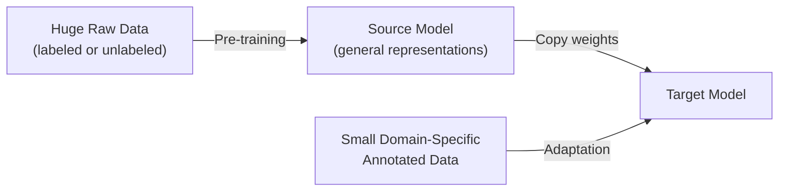

> **Jargon**: *Source Model* — A model trained on large, general-purpose data with no specific downstream task in mind; it captures broad, transferable patterns. *Target Model* — The source model's weights copied over and then adapted (fine-tuned) using a small amount of labeled, domain-specific data.

This directly resolves the obstacles from Section 1: the small target dataset requires far less annotation effort and far less compute than training from scratch, and can even be tailored to individuals ("personalized models").

### 2.2 The General Recipe for Pre-Training `[14:03 – 14:27]`

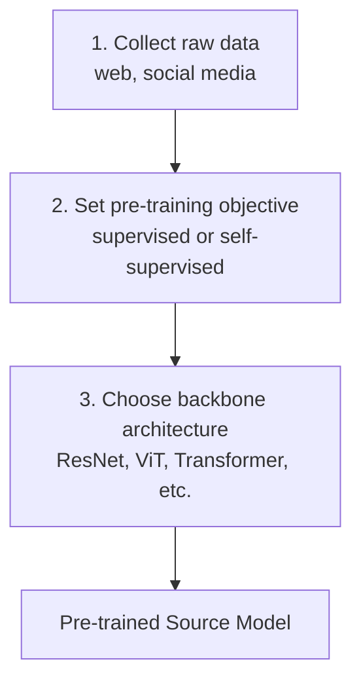

> **Jargon**: *Self-Supervised Learning* — A training objective derived automatically from the structure of the data itself (e.g., "predict the masked word" or "predict the next sentence"), requiring **zero manual labels**. Distinct from unsupervised learning: it uses genuine supervision signals, just ones extracted from the raw data rather than assigned by a human.

---

## 3. Pre-Trained Vision Models `[15:47 – 21:40]`

### 3.1 Data & Backbones `[15:47 – 17:23]`

| Dataset | Scale |
|---------|-------|
| ImageNet | ~14M images, 21,000 object classes |
| JFT-300M | ~300M images |
| Instagram (Facebook) | Massive, informally-labeled |

| Backbone | Parameter Range |
|----------|-------------------|
| ResNet | ~25M – 65M |
| Vision Transformer (ViT) | Larger; scales further |

### 3.2 Masked Autoencoders (MAE) `[17:47 – 19:11]`

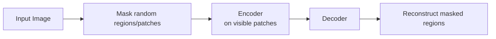

> **Jargon**: *Masked Autoencoder (MAE)* — Randomly mask patches of an image, encode only the *visible* patches, then train a decoder to reconstruct the masked ones. No manual labels needed — the masked pixels themselves are the supervision signal, making this a **self-supervised** technique. Forces the encoder to learn robust, holistic representations resilient to missing information.

### 3.3 DINOv2: Smarter Dataset Curation `[19:40 – 21:40]`

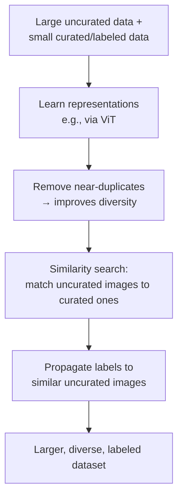

Rather than manually labeling everything, DINOv2's pipeline uses similarity in the *learned* representation space to extend labels from a small curated set to a much larger uncurated pool — while explicitly removing duplicates to preserve diversity and avoid bias toward over-represented image types.

---

## 4. Pre-Trained Language Models `[21:40 – 38:16]`

### 4.1 Distributional Semantics `[21:40 – 24:18]`

> **Jargon**: *Distributional Semantics* — The hypothesis that a word's meaning is defined by the other words it frequently co-occurs with ("you shall know a word by the company it keeps"). This underlies essentially all modern word/subword embedding techniques.

**Training objective**: designate a **center word** and its surrounding **context words** (within a fixed window), then maximize the probability of observing the correct context given the center word (or vice versa).

```python
# Pseudocode: window-based context prediction (Word2Vec-style)
for center_word, context_words in sliding_window(corpus, window_size=5):
    maximize P(context_words | center_word)
```

> *Example*: The learned vector relationship "China → Beijing" turns out to be nearly parallel to "Russia → Moscow" — the embedding space captures the abstract relation "capital-of" as a consistent direction/offset, without ever being told about capitals explicitly.

### 4.2 The Polysemy Problem `[24:51 – 26:00]`

A single static vector for "apple" must represent **both** the fruit and the tech brand — because both contexts get merged into one averaged representation. This ambiguity is a fundamental limitation of static (non-contextual) word embeddings.

### 4.3 BERT: Contextual, Bidirectional Representations `[26:00 – 27:38]`

> **Jargon**: *BERT (Bidirectional Encoder Representations from Transformers)* — Produces a **different** representation for the same word depending on its surrounding left *and* right context, resolving the polysemy problem. Uses a special **CLS token** whose final representation is used for downstream classification tasks.

### 4.4 Pre-Training Objective 1: Masked Language Modeling (MLM) `[27:38 – 29:04]`

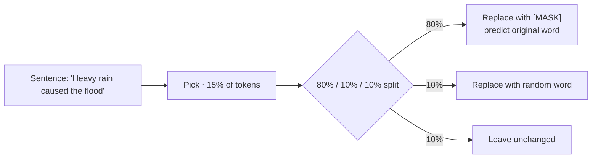

> **Jargon**: *80-10-10 Corruption Rule* — Of the ~15% of tokens selected for masking: 80% become the literal `[MASK]` token, 10% are swapped for a random word, and 10% are left untouched. This mix prevents the model from simply learning "predict whatever's behind `[MASK]`" and forces it to build genuinely robust contextual representations.

> *Example*: "Heavy **rain** caused the flood" → "Heavy **[MASK]** caused the flood." The model must predict "rain" using only the surrounding context.

### 4.5 Pre-Training Objective 2: Next Sentence Prediction (NSP) `[29:04 – 32:11]`

Given a sentence pair (A, B), predict whether B genuinely follows A in the original text.

| Sentence A | Sentence B | Label |
|------------|------------|-------|
| "The man went to the store." | "He bought a gallon of milk." | **IsNext** (valid pair) |
| "The man went to the store." | "Penguins are flightless birds." | **NotNext** |

This label comes **for free** from document structure — no manual annotation required, making it another self-supervised signal.

**Combined BERT pre-training**: feed sentence-pairs A and B (with MLM masking applied to tokens in both), predict the masked tokens *and* the IsNext/NotNext label from the CLS token's representation — simultaneously.

---

## 5. Pre-Trained Vision-Language Models `[32:11 – 38:16]`

### 5.1 Downstream-Style Multimodal Tasks Used for Pre-Training `[32:11 – 35:00]`

| Task | Input | Output |
|------|-------|--------|
| Visual Question Answering (VQA) | Image + question | Answer (e.g., "orange") |
| Referring Expression | Image + phrase (e.g., "child," "sheep") | Aligned object/region |
| Multimodal Verification | Image + statement | True / False |
| Caption-Based Image Retrieval | Text query | Matching image |
| Image Captioning | Image | Generated description |

### 5.2 Notable Models & Self-Supervised Objectives `[35:00 – 38:16]`

Models: early vision-language transformers (2019+) from Facebook/Google/Microsoft, up through modern multimodal LLMs (LLaVA, DeepSeek-VL, GPT-4V).

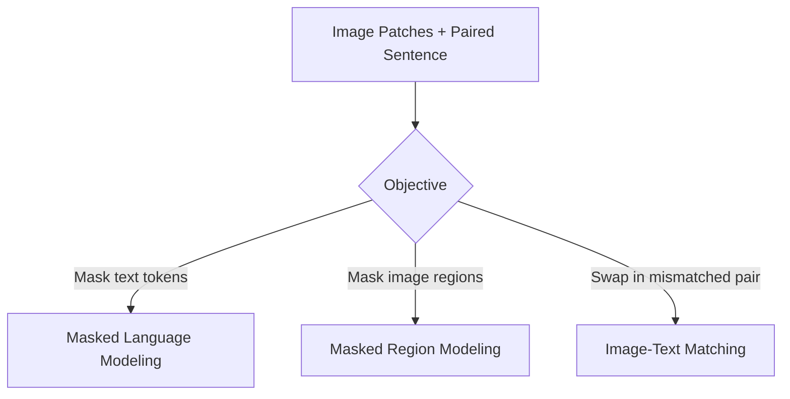

> **Jargon**: *Image-Text Matching (ITM)* — Given an (image, text) pair, predict whether they are a genuine ("positive") match or a mismatched ("negative") pair — a binary classification objective that teaches the model cross-modal alignment.

---

## 6. Reusing a Pre-Trained Model: Two Fine-Tuning Strategies `[38:16 – 46:39]`

### 6.1 Strategy 1: Freeze Everything, Train Only a New Head `[38:16 – 40:14]`

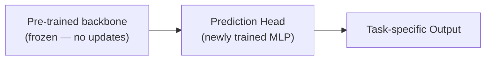

### 6.2 Strategy 2: Freeze Early Layers, Fine-Tune Later Layers + Head `[40:14 – 41:31]`

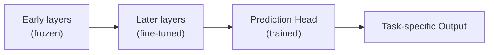

| | Strategy 1 (Freeze All) | Strategy 2 (Partial Fine-Tune) |
|---|---|---|
| Parameters updated | Few (just the head) | More (later layers + head) |
| Convergence speed | Fast | Slower |
| Compute needed | Low | Higher |
| Captures domain-specific nuance | Less | More |

### 6.3 Why Freeze Early Layers Specifically? `[44:15 – 46:39]`

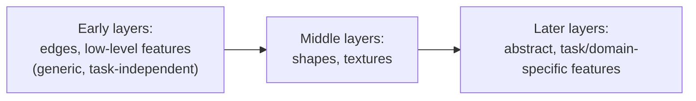

> *Reads as*: "Edge detectors are useful whether you're classifying birds, cars, or medical scans — so there's no need to relearn them. But the deepest layers encode abstract, domain-specific concepts, so *those* benefit most from fine-tuning on your specific data." This is why Strategy 2 keeps early layers frozen (they're universally reusable) while allowing later layers to specialize.

This choice — training from scratch vs. freezing everything vs. partial fine-tuning — is fundamentally a trade-off between **compute cost**, **convergence speed**, and how much **domain-specific structure** you need the model to capture.

---

## 7. Downstream Task Patterns with Pre-Trained Language Models `[46:39 – 50:18]`

### 7.1 Sentence-Pair Classification `[46:39 – 48:22]`

| Task | Example |
|------|---------|
| Paraphrase Detection | Are two questions asking the same thing? |
| Natural Language Inference (NLI) | Given premise + hypothesis: entailment / contradiction / neutral |
| Semantic Similarity | Are two sentences semantically close? |

**Pipeline**: tokenize both sentences → embeddings → transformer encoder layers → CLS token representation → linear classification head → class label.

### 7.2 Single-Sentence Classification `[48:22 – 49:30]`

| Task | Example |
|------|---------|
| Sentiment Detection | Positive / negative / neutral emotion |
| Grammaticality (CoLA task) | Is the sentence grammatically well-formed? |

### 7.3 Token-Level Prediction `[49:30 – 50:18]`

| Task | What's Predicted |
|------|-------------------|
| Extractive Question Answering | Start token $T_1'$ and end token $T_m'$ of the answer span within a paragraph |
| Named Entity Recognition (NER) | Per-token label: inside vs. outside a named entity |

---

## 8. Downstream Task Patterns with Vision-Language Models `[50:18 – 54:24]`

### 8.1 Visual Question Answering & Visual Entailment `[50:18 – 53:05]`

- **VQA**: Image + question → answer (e.g., "What color are her eyes?" → "black")
- **Visual Entailment**: Image = premise; text = hypothesis → entail / neutral / contradict, predicted from the CLS token, exactly analogous to text-only NLI (Section 7.1) but with an image premise.

### 8.2 Visual Reasoning (NLVR-style) `[53:05 – 54:24]`

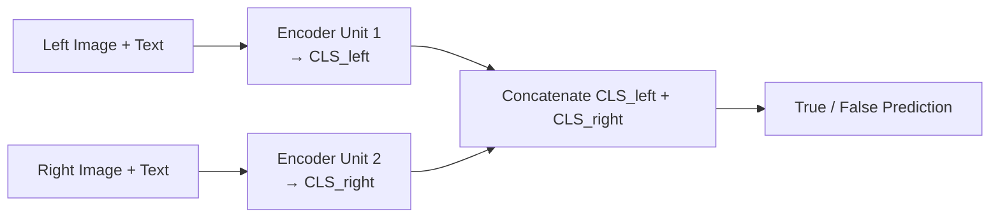

> *Example*: "The left image contains twice the number of dogs as the right image, and at least two dogs in total are standing." Given two images (2 dogs vs. 1 dog) and this statement, the model must verify the claim jointly across **both** images — a genuinely compositional reasoning task.

---

## Quick Reference: Key Jargon Glossary

| Term | One-Line Definition |
|------|----------------------|
| Pre-training | Training a general-purpose model on large-scale data with no specific downstream task |
| Source Model | The general model produced by pre-training |
| Target Model | The pre-trained model adapted to a specific downstream task |
| Self-Supervised Learning | Training objective derived automatically from data structure, no manual labels |
| Out-of-Distribution (OOD) Generalization | Performing well on data that differs from the training distribution |
| Masked Autoencoder (MAE) | Vision pre-training: mask patches, reconstruct them from the rest |
| DINOv2 | Vision pre-training pipeline using dedup + label-propagation for dataset curation |
| Distributional Semantics | Hypothesis that word meaning is defined by co-occurring words |
| BERT | Bidirectional transformer producing context-dependent word representations |
| Masked Language Modeling (MLM) | Predict randomly masked tokens using surrounding context |
| 80-10-10 Rule | BERT's token corruption scheme: 80% [MASK], 10% random, 10% unchanged |
| Next Sentence Prediction (NSP) | Predict whether sentence B genuinely follows sentence A |
| Image-Text Matching (ITM) | Binary classification: does this image/text pair genuinely correspond? |
| CLS Token | Special token whose final representation is used for classification tasks |
| Fine-Tuning (Strategy 1/2) | Freeze-all-but-head vs. freeze-early-layers-only adaptation strategies |

---

## Summary

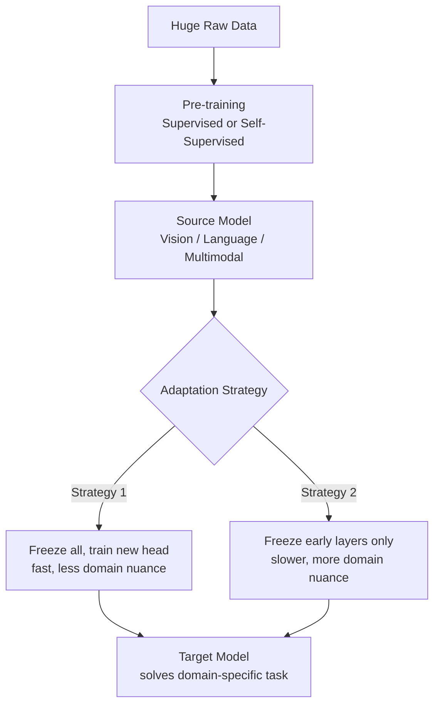

**Key Takeaway**: Pre-training decouples the expensive part of deep learning (learning general representations from massive data) from the cheap part (adapting those representations to a specific task with limited labeled data) — and the choice of *which* layers to freeze versus fine-tune is a direct, controllable trade-off between compute cost and how deeply the model can specialize to your domain.

---

*Notes generated from SRT transcript with timestamps. whisper.cpp (small model, Metal GPU). Enhanced with AI expert annotations.*
