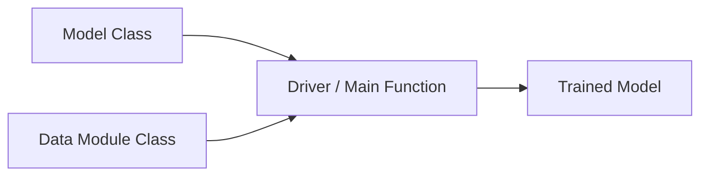
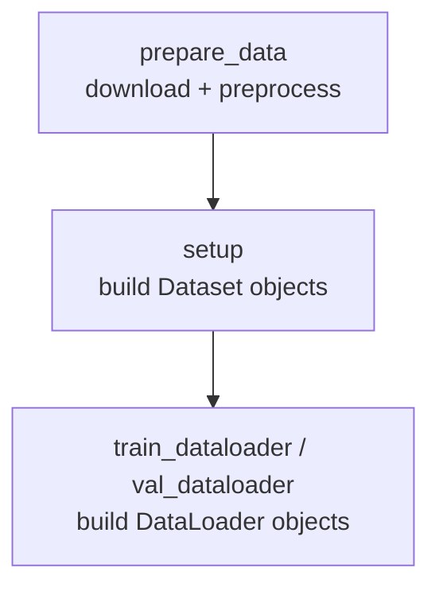
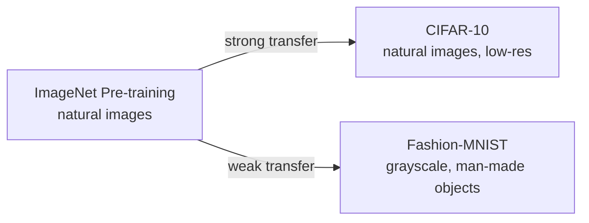
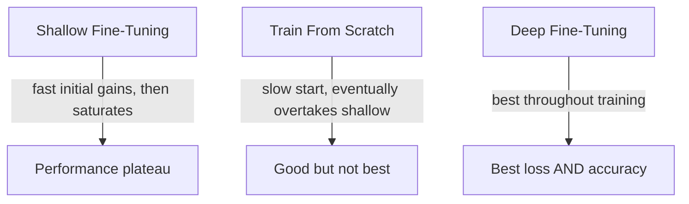
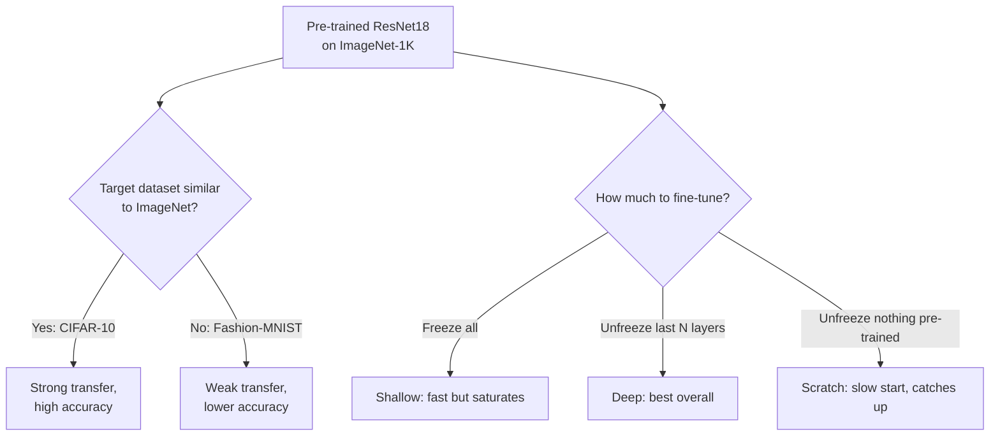

# Lecture 21: DL Models Inference Pretrained Pytorch Part2

**Course**: AI for Industrial Cyber-Physical Systems (AI4ICPS) — IIT Kharagpur  
**Duration**: 49:14  
**Source**: ai4icps-upskilling.in  

---

## Overview

This is the hands-on companion to Part 1's theory: a PyTorch coding walkthrough covering good object-oriented practices for deep learning code, then two concrete experiments — (1) testing whether ImageNet pre-training transfers well to CIFAR-10 vs. Fashion-MNIST, and (2) comparing shallow fine-tuning, deep fine-tuning, and training-from-scratch on CIFAR-100. The empirical punchline: **deep fine-tuning consistently wins**.

---

## 1. Good Coding Practice: A Modular Template `[0:00 – 6:45]`

### 1.1 Why Modularity Matters `[0:00 – 2:23]`

> *Reads as*: "Object-oriented, modular code lets you swap out a data augmentation, change a convolution's stride, or spin up an ensemble of models — all by instantiating a class differently, rather than rewriting functions." This is exactly how libraries like Hugging Face, TorchVision, and PyTorch Lightning are structured internally.

Any deep learning training script needs three pieces:



### 1.2 The Model Class `[2:23 – 5:26]`

| Method | Purpose |
|--------|---------|
| `__init__` (constructor) | Register all layers/parameters the model will use |
| `forward(x)` | Defines how data flows through the model — e.g., sequential (VGG-style) or with skip connections (ResNet-style) |
| `configure_optimizers` | Defines optimizer (SGD, AdamW, etc.) and learning-rate scheduler |
| `training_step` | Logic for a single training iteration |
| `validation_step` | Logic for a single validation iteration |

> **Jargon**: *Forward Function* — PyTorch is fundamentally an automatic-differentiation (autodiff) library: once you write the *forward* computation as ordinary code, PyTorch builds a computation graph and derives all backward-pass gradients for you automatically — you never hand-derive backpropagation formulas.

> **Jargon**: *PyTorch Lightning* — A wrapper library built on PyTorch that formalizes this exact `training_step` / `validation_step` / `configure_optimizers` pattern, reducing boilerplate.

### 1.3 The Data Module Class `[5:26 – 6:45]`

| Method | Purpose |
|--------|---------|
| `prepare_data` | Download/preprocess raw data |
| `setup` | Construct the actual `Dataset` objects (train/validation) |
| `train_dataloader` / `val_dataloader` | Return `DataLoader` objects that batch the dataset for iteration |



---

## 2. Experiment 1: Does Pre-Training Knowledge Transfer? `[7:01 – 10:45]`

### 2.1 Setup `[7:08 – 9:24]`

**Question**: Is a model pre-trained on ImageNet-1K a *good fit* for every downstream dataset, or does the fit depend on how similar the domains are?

| Dataset | Nature | Resolution | Classes |
|---------|--------|------------|---------|
| ImageNet-1K (pre-training source) | Natural images, varied | up to 512×512 | 1,000 |
| CIFAR-10 | Natural images (small) | 32×32 | 10 |
| Fashion-MNIST | Grayscale clothing items | 28×28 | 10 |

> *Reads as*: "CIFAR-10 is a low-resolution *natural image* dataset — similar in spirit to ImageNet. Fashion-MNIST is grayscale and depicts man-made objects (boots, shirts) rather than natural scenes — a bigger domain gap from ImageNet."

**Hypothesis**: ImageNet pre-training should transfer well to CIFAR-10, but poorly to Fashion-MNIST.

---

## 3. Building the Data Pipeline `[11:02 – 24:42]`

### 3.1 Why Data Augmentation? The Tank Camouflage Story `[14:06 – 16:35]`

> *Reads as*: A (possibly apocryphal) WWII anecdote: analysts trained a model to spot camouflaged tanks using daylight photos only — it failed completely on nighttime or shadowed images, because the training data never represented those conditions. **Augmentation solves this without needing more raw photos**: apply synthetic transformations (crops, flips, resizing) to existing images to simulate the diversity you'd otherwise need to physically capture.

### 3.2 The Augmentation Pipeline `[16:35 – 21:02]`

```python
from torchvision import transforms

train_transform = transforms.Compose([
    transforms.Resize((256, 256)),        # match pre-trained model's expected input size
    transforms.RandomCrop(224),            # simulate varying camera distance/framing
    transforms.RandomHorizontalFlip(),     # simulate left/right mirroring
    transforms.ToTensor(),                 # PIL image -> PyTorch tensor
    transforms.Normalize(mean=[0.485, 0.456, 0.406],
                          std=[0.229, 0.224, 0.225]),
])

val_transform = transforms.Compose([
    transforms.Resize((256, 256)),   # NO random crop/flip — we test on the real image
    transforms.ToTensor(),
    transforms.Normalize(mean=[0.485, 0.456, 0.406],
                          std=[0.229, 0.224, 0.225]),
])
```

> *Reads as*: "Training gets randomized crops/flips to teach the model invariance to framing; validation only gets resizing + normalization, because we want to test on the image as-is, not an artificially perturbed version."

> **Jargon**: *Normalization (Standardization)* — Raw pixel values range 0–255 per channel. Subtracting the per-channel mean and dividing by the per-channel standard deviation rescales values to roughly [-1, 1] — matching the range that model weights are typically initialized around, which speeds up convergence significantly.

For grayscale Fashion-MNIST, an extra `transforms.Grayscale(num_output_channels=3)` duplicates the single channel into three — required because the pre-trained ResNet expects 3-channel RGB input.

### 3.3 Dataset → DataLoader `[22:06 – 24:42]`

```python
from torchvision.datasets import CIFAR10, FashionMNIST
from torch.utils.data import DataLoader

train_set = FashionMNIST(root="./data", train=True, download=True, transform=train_transform)
val_set   = FashionMNIST(root="./data", train=False, download=True, transform=val_transform)

train_loader = DataLoader(train_set, batch_size=64, shuffle=True)
val_loader   = DataLoader(val_set, batch_size=64, shuffle=False)
```

> **Jargon**: *Dataset vs. DataLoader* — A `Dataset` is an *iterable* wrapping raw data + transforms (one item at a time). A `DataLoader` wraps a `Dataset` and handles **batching** and **shuffling** — feeding the model manageable, randomized chunks rather than the whole dataset (or single items) at once.

---

## 4. Building the Model Class `[25:00 – 32:41]`

### 4.1 Loading a Pre-Trained Backbone & Replacing the Head `[25:32 – 28:34]`

```python
import torch.nn as nn
from torchvision import models

class MyModel(nn.Module):
    def __init__(self, num_classes, pretrained=True, num_unfreeze_layers=0):
        super().__init__()
        if pretrained:
            self.backbone = models.resnet18(weights=models.ResNet18_Weights.DEFAULT)
            for param in self.backbone.parameters():
                param.requires_grad = False      # freeze everything initially
        else:
            self.backbone = models.resnet18(weights=None)   # random init, train from scratch

        # ResNet18's final conv output is a 512-dim vector; swap 1000-class ImageNet head for ours
        self.backbone.fc = nn.Linear(512, num_classes)
```

> *Reads as*: "Load ResNet-18 with ImageNet weights, freeze every parameter (`requires_grad = False`), then replace the final 512→1000 classification layer — the **head** — with a fresh 512→`num_classes` layer sized for your task." The head is the *only* newly-initialized, trainable part in this "shallow" configuration.

> **Jargon**: *Head* — The final layer(s) of a network that map its learned features to task-specific outputs (e.g., class scores). Swapping the head is standard practice when the number of output classes differs from the pre-training task.

### 4.2 Loss, Metrics, Optimizer & Scheduler `[28:34 – 30:29]`

```python
self.criterion = nn.CrossEntropyLoss()
self.train_acc = torchmetrics.Accuracy(task="multiclass", num_classes=num_classes)
self.val_acc   = torchmetrics.Accuracy(task="multiclass", num_classes=num_classes)

def configure_optimizers(self):
    optimizer = torch.optim.SGD(self.parameters(), lr=0.01, momentum=0.9)
    scheduler = torch.optim.lr_scheduler.StepLR(optimizer, step_size=5, gamma=0.1)
    return optimizer, scheduler
```

> **Jargon**: *Learning Rate Scheduler* — Gradually reduces the learning rate over training. Early on, a large learning rate makes fast progress; as training approaches a good minimum, a smaller learning rate avoids overshooting it.

### 4.3 Forward Pass & Training Step `[30:29 – 32:41]`

```python
def forward(self, x):
    return self.backbone(x)

def training_step(self, x, y):
    self.optimizer.zero_grad()             # clear stale gradients from the computation graph
    preds = self.forward(x)
    self.train_acc.update(preds, y)
    loss = self.criterion(preds, y)
    loss.backward()                        # backprop: compute all gradients via the chain rule
    self.optimizer.step()                  # apply the gradient-descent update
    return loss.item()
```

> **Jargon**: *`zero_grad()`* — PyTorch **accumulates** gradients into the computation graph by default across calls to `.backward()`. If you don't clear them first, gradients from previous batches would incorrectly add into the current batch's gradient computation.

> **Jargon**: *`model.train()` vs. `model.eval()`* — Some layers (dropout, batch normalization) behave differently during training vs. inference. `model.train()` activates dropout/batch-stat updates; `model.eval()` disables dropout and freezes batch-norm statistics — PyTorch handles this switch automatically once you call the right flag, no need to special-case it in your own code.

---

## 5. Experiment 1 Results: ImageNet Transfers to CIFAR-10, Not Fashion-MNIST `[34:07 – 40:48]`

### 5.1 Training Loop Structure `[35:00 – 36:54]`

```python
for epoch in range(num_epochs):
    model.train()
    for x, y in train_loader:
        loss = model.training_step(x, y)
    print(f"Train acc: {model.train_acc.compute()}")
    model.train_acc.reset()

    model.eval()
    for x, y in val_loader:
        model.validation_step(x, y)
    print(f"Val acc: {model.val_acc.compute()}")
    model.val_acc.reset()
```

> **Jargon**: *Epoch* — One complete pass through the entire training dataset (all batches).

### 5.2 Results `[36:54 – 40:48]`

| Dataset | Starting Val Accuracy | Final Val Accuracy (Top-1) |
|---------|------------------------|------------------------------|
| CIFAR-10 | 89% (pre-trained knowledge already helps a lot) | **95%** (Top-5 ≈ 100%) |
| Fashion-MNIST | much lower | Noticeably lower than CIFAR-10 throughout training |



> **Takeaway 1**: *Domain similarity drives transferability.* CIFAR-10 shares ImageNet's core statistical structure (natural images, RGB), so the pre-trained features generalize well. Fashion-MNIST's domain gap (grayscale, non-natural objects) means the same pre-trained features are a much weaker starting point — a grayscale-pretrained model would likely have been a better source for this target.

---

## 6. Experiment 2: Shallow vs. Deep Fine-Tuning vs. Training From Scratch `[40:48 – 49:14]`

### 6.1 Layer-Freezing Strategy `[41:34 – 44:38]`

```mermaid
flowchart LR
    subgraph ResNet18 ~52 layers total
    direction LR
    E1[Early layers<br/>general: edges, textures] --> M1[...] --> L1[Final layers<br/>abstract, domain-specific]
    end
```

> *Reads as*: "Unfreezing proceeds from the *output* end backward toward the input — because early layers hold general-purpose features (edges, simple textures) useful across almost any image task, while later layers encode increasingly abstract, task-specific concepts that most benefit from adapting to your particular data."

```python
def unfreeze_layers(backbone, num_unfreeze_layers):
    all_layers = [m for m in backbone.modules()
                  if isinstance(m, (nn.Conv2d, nn.Linear, nn.BatchNorm2d))]
    total = len(all_layers)                       # ResNet18 has ~52 such layers
    unfreeze_from = total - num_unfreeze_layers
    for i, layer in enumerate(all_layers):
        if i >= unfreeze_from:
            for p in layer.parameters():
                p.requires_grad = True
```

> *Example*: With 52 total layers and `num_unfreeze_layers = 31`, layers **22 through 52** (the last 31) become trainable, while layers 1–21 stay frozen.

### 6.2 Three Configurations Compared `[44:38 – 48:22]`

| Configuration | `pretrained` | `num_unfreeze_layers` | What's Trainable |
|----------------|---------------|--------------------------|---------------------|
| **Shallow fine-tuning** | `True` | 0 | Only the new head |
| **Deep fine-tuning** | `True` | 31 | Head + last 31 backbone layers |
| **Train from scratch** | `False` | 0 (irrelevant) | Everything, random init |

### 6.3 Results on CIFAR-100 `[46:38 – 49:14]`



| Strategy | Behavior Over Training |
|----------|--------------------------|
| Shallow fine-tuning | Strong early performance (leverages pre-trained features immediately) but **saturates** quickly — the frozen backbone can't adapt to CIFAR-100's specifics |
| Train from scratch | Starts slower (no prior knowledge) but eventually **overtakes** shallow fine-tuning, since it can fully learn domain-specific structure |
| Deep fine-tuning | **Best of both** — retains general ImageNet knowledge *and* adapts deeper layers to CIFAR-100 — consistently outperforms both alternatives on loss and validation accuracy |

> **Takeaway 2**: *Deep fine-tuning is the hybrid sweet spot.* It combines the fast convergence benefit of transferred general features (early layers) with the adaptability of domain-specific learning (later layers) — beating both the "freeze everything" and "train from nothing" extremes. Full fine-tuning (unfreezing the *entire* backbone) is an even more parameter-heavy variant that can push performance further at increased compute cost.

---

## Quick Reference: Key Jargon Glossary

| Term | One-Line Definition |
|------|----------------------|
| Forward Function | Defines the model's computation; PyTorch auto-derives gradients from it |
| Head | Final task-specific layer(s) of a network, swapped out for new tasks |
| Dataset vs. DataLoader | Dataset = iterable data wrapper; DataLoader = batches + shuffles a Dataset |
| Data Augmentation | Synthetic transformations (crop, flip, resize) that simulate data diversity |
| Normalization | Rescaling pixel values (via mean/std) to speed up training convergence |
| `zero_grad()` | Clears accumulated gradients before a new backward pass |
| `model.train()` / `model.eval()` | Toggles dropout/batch-norm behavior between training and inference |
| Learning Rate Scheduler | Reduces learning rate over time as training approaches convergence |
| Epoch | One full pass through the entire training dataset |
| Shallow Fine-Tuning | Only the new head is trained; backbone fully frozen |
| Deep Fine-Tuning | Head + a subset of later backbone layers are trained |
| Training From Scratch | All weights randomly initialized and trained; no pre-training used |

---

## Summary



**Key Takeaway**: Two independent decisions determine transfer learning success — *which* pre-trained model/dataset best matches your domain, and *how much* of that model you allow to adapt to your specific task — and empirically, a **domain-matched pre-trained backbone with deep (not shallow) fine-tuning** consistently delivers the best accuracy-for-compute trade-off.

---

*Notes generated from SRT transcript with timestamps. whisper.cpp (small model, Metal GPU). Enhanced with AI expert annotations.*
