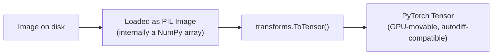
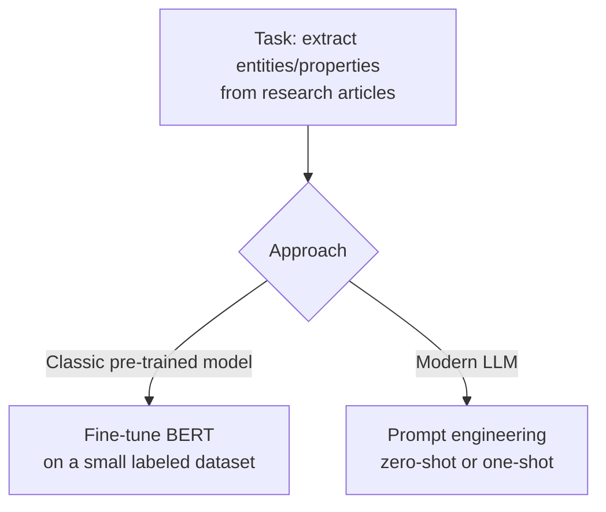
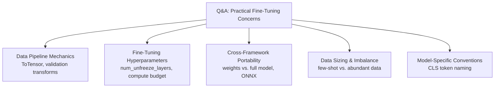

# Lecture 22: DL Models Inference Pretrained Pytorch Part3

**Course**: AI for Industrial Cyber-Physical Systems (AI4ICPS) — IIT Kharagpur  
**Duration**: 9:25  
**Source**: ai4icps-upskilling.in  

---

## Overview

A short, dense Q&A session closing out the pre-trained models module. It clarifies several practical loose ends from the hands-on lab (Lecture 21): tensor conversion mechanics, why validation transforms differ from training transforms, how to choose the number of layers to unfreeze, cross-framework model portability, and how to size training data — including handling class imbalance.

---

## 1. `transforms.ToTensor()` Explained `[0:00 – 0:39]`

### 1.1 Why Convert to a Tensor? `[0:00 – 0:39]`



> *Reads as*: "Python image libraries load images as PIL objects backed by NumPy arrays — but PyTorch models only operate on **tensors**, which support GPU acceleration and automatic differentiation. `ToTensor()` is the required bridge between 'image as loaded' and 'image as the model can consume it.'"

> **Jargon**: *Tensor* — PyTorch's core data structure; essentially a NumPy-array-like object with built-in support for GPU computation and gradient tracking. Model inputs, weights, and outputs are all tensors.

---

## 2. Why Validation Transforms Skip Augmentation `[0:39 – 1:22]`

Training transforms include random crops and horizontal flips to *diversify* the training signal (see Lecture 21 §3.1). Validation transforms deliberately **exclude** these:

> *Reads as*: "Validation is meant to measure how the model performs on the image **as given** — flipping or cropping it during evaluation would mean you're not actually testing on the real input distribution. Doing so could produce misleadingly inflated ('artificial') accuracy numbers that don't reflect real deployment performance."

**Rule of thumb**: validation/test transforms should only include operations required for *consistency* with training (resize, tensor conversion, normalization) — never operations meant to expand data diversity.

---

## 3. Choosing How Many Layers to Unfreeze `[1:22 – 3:45]`

### 3.1 It's a Hyperparameter, Not a Formula `[1:22 – 2:53]`

> *Reads as*: "There's no fixed rule for how many layers to unfreeze during fine-tuning — treat `num_unfreeze_layers` like any other hyperparameter: tune it empirically against your validation set." More unfrozen layers means more trainable parameters, which directly increases the **compute budget** required (more gradients to compute and store, longer training time) — so the right choice balances expected accuracy gains against available compute.

### 3.2 Finding the Penultimate Layer's Size `[3:05 – 3:45]`

The size of a pre-trained backbone's second-to-last layer (e.g., ResNet-18's 512-dimensional output) is a **fixed architectural property** of that specific backbone — not something you choose. To find it for any model:

```python
print(model)   # prints full architecture with each layer's input/output dimensions
```

> *Reads as*: "Just print the model — PyTorch shows you every layer's shape, so you can read off exactly how many units feed into your new head."

---

## 4. Cross-Framework Model Portability `[3:45 – 5:24]`

### 4.1 What Actually Matters: Parameters, Not the Training Framework `[3:45 – 4:33]`

> *Reads as*: "Once a model is pre-trained, what you actually care about is the **learned parameter values** — not which library trained them. As long as those values (and the architecture that uses them) are available to you, it doesn't matter whether the original training happened in PyTorch, Keras, or elsewhere."

### 4.2 The Catch: Saving Weights-Only vs. Full Architecture `[4:33 – 5:24]`

| What You Save | Portability |
|----------------|--------------|
| Parameter values only | Framework-agnostic — reusable anywhere, as long as you reconstruct the same architecture |
| Full model (architecture + weights) | Tied to the saving framework's serialization format |

> **Jargon**: *ONNX (Open Neural Network Exchange)* — An intermediate model format that lets you convert a model trained in one framework (e.g., PyTorch) into a representation loadable by another (e.g., Keras/TensorFlow), enabling cross-framework portability without manually re-implementing the architecture.

---

## 5. Extracting Scientific Properties from Research Papers via NLP `[5:24 – 6:56]`

Two viable approaches, both applicable to a task like extracting named molecules and their properties from scientific text:



| Approach | How It Works |
|----------|----------------|
| Fine-tune BERT | Build a small labeled dataset of articles annotated with the target properties, then fine-tune a BERT-family model on it (a supervised, task-specific adaptation) |
| LLM + Prompting | Write a prompt describing the extraction task, use zero-shot or one-shot examples with a large language model — no fine-tuning/training required |

> **Jargon**: *Zero-Shot / One-Shot Learning* — Asking a large pre-trained model to perform a task using only a natural-language instruction (zero-shot) or a single worked example embedded in the prompt (one-shot), with no gradient-based training on task-specific data at all.

---

## 6. How Much Training Data Do You Need? `[6:56 – 8:47]`

### 6.1 No Fixed Rule, but General Guidance `[6:56 – 8:04]`

| Data Volume Per Class | Recommended Approach |
|-------------------------|------------------------|
| Very small (e.g., 10–20 images) | Lean heavily on a pre-trained model — you don't have enough data to learn good features from scratch |
| Large (e.g., 10,000–20,000+ images) | Either pre-trained fine-tuning **or** training from scratch can work well |

> *Reads as*: "More data is always better in principle, but what counts as 'enough' is domain- and dataset-dependent. With very little data, pre-trained features do most of the heavy lifting; with abundant data, you have the freedom to train from scratch if you want."

### 6.2 Class Imbalance `[8:04 – 8:47]`

> **Jargon**: *Class Imbalance* — When some classes have far more training examples than others (a natural occurrence in real-world data, e.g., common diseases vs. rare ones). Left unaddressed, models tend to become biased toward predicting the majority class. Standard mitigations include re-weighting the loss function, oversampling minority classes, or undersampling majority classes.

---

## 7. Are Special Tokens (like CLS) Standardized Across Models? `[8:47 – 9:25]`

> *Reads as*: "The `[CLS]` token naming convention is widely used and shared across most BERT-family pre-trained language models, but it's not a universal law — different architectures may use different special-token names or conventions, so always check a specific model's documentation before assuming token names transfer directly."

---

## Quick Reference: Key Jargon Glossary

| Term | One-Line Definition |
|------|----------------------|
| Tensor | PyTorch's core GPU-accelerated, autodiff-compatible array structure |
| `transforms.ToTensor()` | Converts a PIL/NumPy image into a PyTorch tensor |
| Validation Transform | Minimal, non-augmenting preprocessing used to test on the "real" image |
| Hyperparameter (unfreeze layers) | A tunable training setting with no universal correct value; found via experimentation |
| ONNX | Intermediate format enabling model portability across ML frameworks |
| Zero-Shot / One-Shot Learning | Using an LLM to perform a task via prompting alone, without gradient-based fine-tuning |
| Class Imbalance | Unequal numbers of training examples across classes; biases models toward majority classes |
| CLS Token | Special token whose representation is used for classification; common but not universal |

---

## Summary



**Key Takeaway**: Most "how do I actually do this" questions in transfer learning boil down to empirical tuning rather than fixed rules — how many layers to unfreeze, how much data you need, and which pre-trained model to start from are all choices you validate experimentally against your specific dataset and compute budget, not settings with one universally correct answer.

---

*Notes generated from SRT transcript with timestamps. whisper.cpp (small model, Metal GPU). Enhanced with AI expert annotations.*
