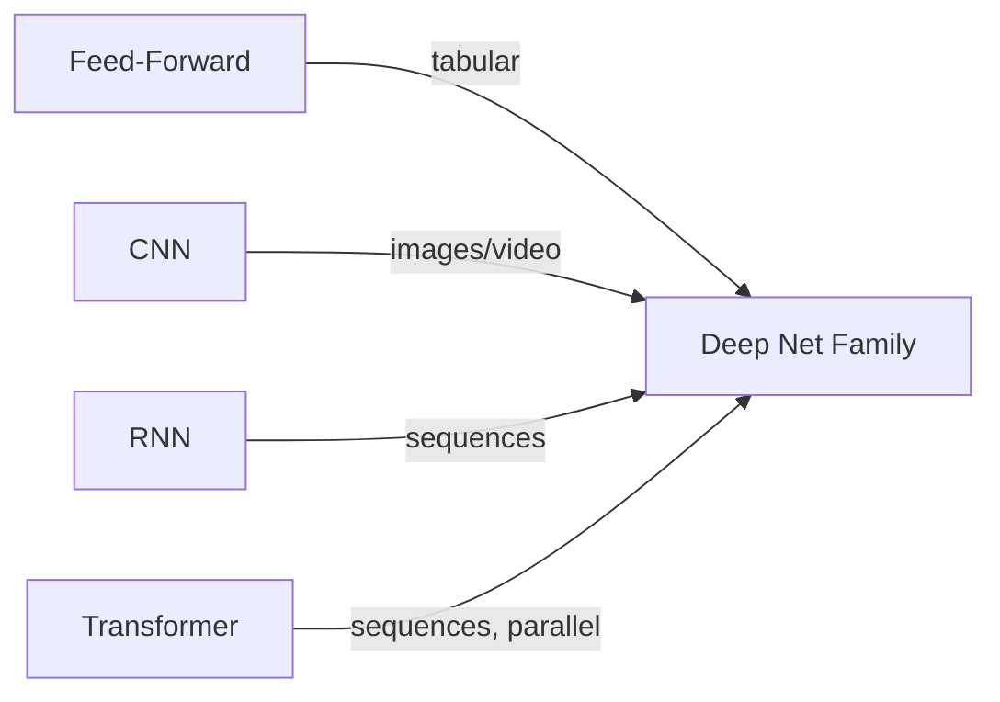
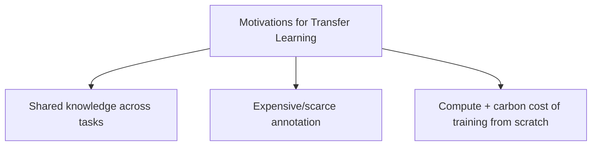
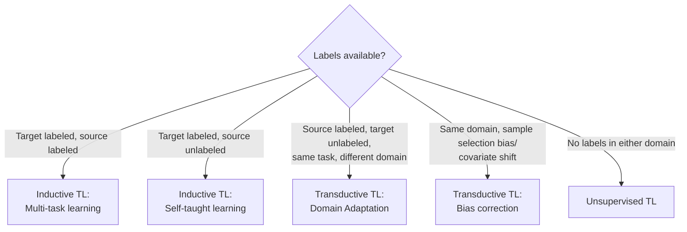
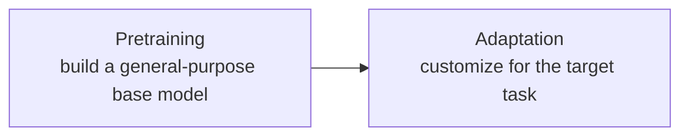
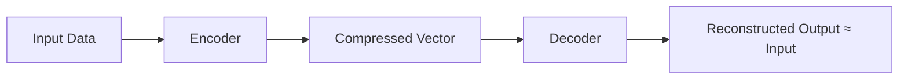
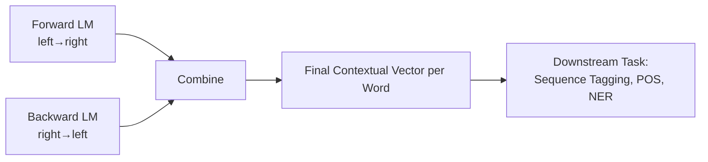
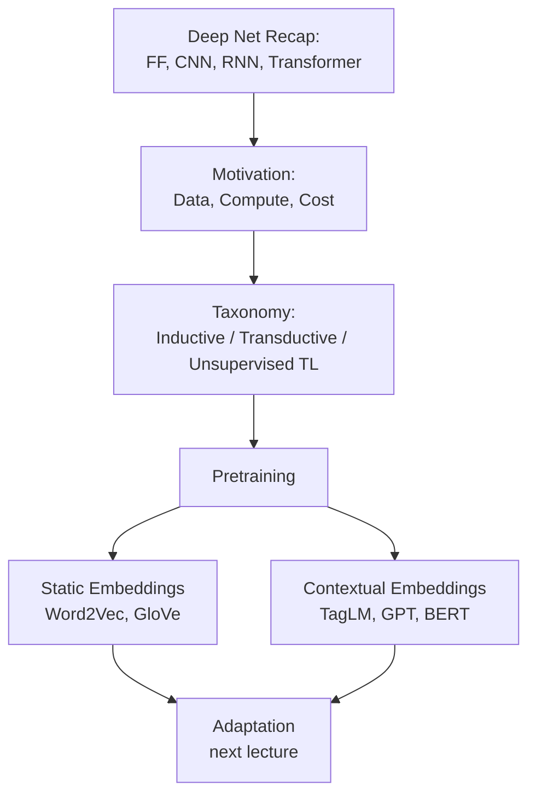

# Lecture 23: DL Transfer Learning Pretrained Part 1

**Course**: AI for Industrial Cyber-Physical Systems (AI4ICPS) — IIT Kharagpur  
**Duration**: 0:56:29  
**Source**: ai4icps-upskilling.in  

---

## Overview

This lecture introduces **transfer learning** for deep neural networks — the practice of reusing a model trained on one task/domain (the *source*) to solve a different task/domain (the *target*) instead of training from scratch. After a quick recap of deep net architectures, the lecture builds the motivation (data, compute, and cost constraints), lays out a taxonomy of transfer-learning settings, and walks through the evolution of pretrained representations — from static word embeddings to contextual vectors to full transformer-based language models (Word2Vec → GPT/BERT).

---

## 1. Deep Nets Refresher & the Vector-Centric View `[0:00 – 9:51]`

### 1.1 Why Deep Learning Works `[0:00 – 4:26]`
Unlike classical ML — where a **human domain expert** hand-engineers features before feeding an SVM/logistic-regression/decision-tree — deep nets learn the feature representation **automatically**, driven purely by data and the objective function.

> **Jargon**: *Feature Engineering* — Manually designing numeric descriptors (edges, histograms, n-grams, etc.) from raw data so a classical ML model can use them. Deep learning replaces this human step with learned layers.

A deep net is simply *a very large, complex mathematical function*, parameterized by millions/billions of **weights (W)** and **biases (b)**. General rule of thumb: more parameters → more capacity, but also more compute and more data required — this is precisely the pressure that motivates transfer learning.

### 1.2 The Architecture Zoo `[4:26 – 7:24]`

| Architecture | Best Suited For | Key Idea |
|---|---|---|
| Feed-Forward / Vanilla NN | Tabular data | Fully-connected layers, left-to-right computation |
| CNN | Images, video | Convolution + pooling layers extract spatial features |
| RNN | Temporal / sequence data (text, time series) | Recurrent state carries dependency across time steps |
| Transformer (attention-based) | Text, and increasingly everything else | **Self-attention** captures dependencies *in parallel* — no recursion needed |

> **Jargon**: *Self-Attention* — A mechanism that lets every element of a sequence directly "look at" every other element and weigh their relevance, instead of passing information step-by-step like an RNN. This parallelism is why transformers train faster and scale better.



### 1.3 Everything Becomes a Vector `[7:24 – 9:51]`
The **essence of deep learning is representation learning**: raw input (image/video/text/audio) → deep net → a fixed-dimension **hidden vector** of real numbers → final prediction.

> **Jargon**: *Embedding / Hidden Vector* — A dense numeric vector that a network produces to represent an input. It's not human-interpretable directly, but distances/angles between vectors reflect similarity — this is the **discriminative principle**: similar objects → similar vectors; different objects → dissimilar vectors (large angle/distance).

> *Reads as*: "The vector itself is meaningless to a human, but *relationships between vectors* (closeness) encode meaning that downstream models can exploit."

---

## 2. Why Transfer Learning? `[9:51 – 18:11]`

### 2.1 Shared Knowledge Across Tasks `[9:51 – 11:47]`
Many tasks — text classification, sentiment analysis, clustering — share underlying **linguistic** or **structural** knowledge (e.g., edges in images are useful across classification, captioning, segmentation). Why re-learn this from scratch every time?

### 2.2 Annotation Cost `[11:47 – 12:29]`
Training big models needs lots of **labeled** data. Annotation is slow, expensive, and noisy at scale.

### 2.3 Compute & Environmental Cost `[12:29 – 13:10]`
Training large nets from scratch is computationally heavy and has a real **carbon footprint**. Reusing existing models reduces this burden significantly.



### 2.4 Traditional ML vs. Transfer Learning `[13:10 – 15:06]`

| Paradigm | Setup |
|---|---|
| Traditional ML | Each task has its *own* annotated data and *own* model — no sharing |
| Transfer Learning | A **source task** (with data/model already available) feeds knowledge into a **target task** (with little/no labeled data) |

### 2.5 The Three Key Questions `[15:06 – 18:11]`

| Question | Meaning |
|---|---|
| **What** to transfer | Which portion of the source knowledge is task-specific vs. common/reusable? |
| **When** to transfer | Ensure the target task genuinely *improves* (or degrades only minimally) — don't transfer blindly |
| **How** to transfer | The technical machinery — architecture edits, retraining strategy, data/compute budget |

> **Jargon**: *Negative Transfer* — When transferring knowledge actually *hurts* target performance because the source and target are too dissimilar. This is why "when to transfer" matters.

---

## 3. Taxonomy of Transfer Learning Strategies `[17:47 – 21:00]`

The right strategy depends on **label availability** in source and target domains:



| Setting | Source Labels? | Target Labels? | Approach |
|---|---|---|---|
| Inductive TL | Optional | Yes | Multi-task learning (if source labeled) or self-taught learning (if not) |
| Transductive TL | Yes | No | Domain adaptation (same task, different domain) |
| Unsupervised TL | No | No | Transfer representations without any labels |

> **Jargon**: *Domain Adaptation* — A transductive-TL scenario: same task, but the source and target data come from different distributions/domains (e.g., product reviews vs. news headlines for sentiment).

> **Jargon**: *Covariate Shift* — When the *input* distribution changes between training and deployment even though the task/labels stay conceptually the same.

---

## 4. Two Pillars: Pretraining + Adaptation `[21:00 – 25:51]`

Transfer learning in deep learning breaks into two stages:



**Pretraining** produces a base model on huge, general-purpose data. Examples surveyed:

| Model | Domain | What It Produces |
|---|---|---|
| Word2Vec (transcribed "what to make") | NLP | Static word vectors; similar-context words → similar-angle vectors |
| GPT (OpenAI) | NLP, transformer-based | Autoregressive language model, produces contextual vectors |
| BERT (transcribed "BART" — *bidirectional encoder from transformers*) | NLP, transformer-based | Bidirectional contextual vectors for words/sentences |

> **AI Expert Correction**: The lecture audio was transcribed as "BART" when describing "the bidirectional encoder from transformers" — this is unambiguously **BERT** (Bidirectional Encoder Representations from Transformers), not the actual BART model (which is a sequence-to-sequence encoder-decoder from Facebook AI). Treat all "BART" references below in this context as **BERT**.

Downstream uses shown: text classification, question answering, sequence tagging (e.g., NER) — all achieved by taking the pretrained vectors and adding/adjusting a small amount on top with target-task data.

---

## 5. Pretraining Data Regimes `[25:51 – 28:08]`

| Regime | Data Needed | Example Domains | Key Assumption |
|---|---|---|---|
| **Self-supervised** (unlabeled) | Raw text/web crawls, no annotation | Wikipedia, news, social media | **Distributional Hypothesis**: words/things appearing in similar contexts are semantically similar |
| **Supervised pretraining** | Labeled pairs (input, label) | Computer vision (image→label), Machine Translation (src→tgt language), QA | Explicit input–output associations exist and transfer across domains |

> **Jargon**: *Distributional Hypothesis* — "You shall know a word by the company it keeps." Words used in similar contexts tend to have similar meanings — the statistical foundation behind word embeddings.

Most modern large language models (GPT, BERT, etc.) rely overwhelmingly on **self-supervised** pretraining because unlabeled text is nearly infinite and free to collect.

---

## 6. From Word Vectors to Contextual Vectors `[28:08 – 51:00]`

### 6.1 Static Word Embeddings `[29:03 – 34:29]`
Each word gets **one fixed vector**, regardless of context, trained so that semantically similar words end up with similar vectors.

$$\text{sim}(\vec{v}_{\text{cat}}, \vec{v}_{\text{dog}}) \text{ is high because both appear in similar contexts (pets, animals)}$$

> *Reads as*: "If two words show up around similar neighboring words across a huge corpus, their learned vectors will point in similar directions."

**Limitation**: word meaning is often context-dependent — "two cats" (animal) vs. "the play premiered" (theatre) — a single fixed vector per word can't capture this ambiguity.

### 6.2 Language Modeling as the Engine `[32:06 – 36:05]`

> **Jargon**: *Language Model (LM)* — A model that estimates the probability of a piece of text (e.g., "what's the probability this word comes next, given the preceding words?"). Grammar/spell-checkers, autocomplete, and generative AI (GPT) are all built on this idea.

$$P(w_t \mid w_1, w_2, \ldots, w_{t-1})$$

```python
# Pseudocode: probability the next word fits given prior context
context_vector = encode(previous_words)
prob = similarity(context_vector, candidate_word_vector)
# high similarity -> word fits naturally; low -> flag as likely error
```

> *Reads as*: "Encode everything seen so far into a context vector. A candidate next word is 'good' if its vector is similar to that context vector."

Bengio's early neural LM (2003-era, described here) used a **shallow neural network** to learn this word/context relationship — a precursor to today's deep transformer LMs. Shallow networks, however, struggle to capture the *intricate, multi-word* dependencies needed for tasks like sentiment ("three or four words in combination decide positive vs. negative").

> **Math Note**: *Why depth helps* — Each layer combines information from the previous one. More layers = more combinations = capacity to represent higher-order dependencies between distant words/features.

### 6.3 Multitask Word Embeddings `[42:22 – 44:22]`
Instead of training embeddings for a single objective, train them **simultaneously across multiple tasks** sharing the same underlying layers (e.g., Conv → MaxPool → FC → Softmax stack), so representations generalize better.

### 6.4 Sentence & Document Vectors `[44:22 – 46:26]`
Just as words get embeddings, whole **paragraphs/documents** can too (e.g., early *distributed-memory paragraph vector* methods — a precursor to Doc2Vec): feed in the paragraph, average/combine word vectors, produce one vector representing its meaning.

### 6.5 Next-Sentence Prediction & Seq2Seq `[45:34 – 46:26]`
Predict whether a candidate next sentence is coherent given the previous one — trains models to understand discourse-level structure. Implemented via **sequence-to-sequence** architectures (encoder consumes sentence A, decoder predicts/validates sentence B).

### 6.6 Autoencoder Pretraining `[46:26 – 47:46]`
Fully unsupervised: encode input → compressed vector → decode back to reconstruct the *same* input. No labels needed at all.



> **Jargon**: *Autoencoder* — Learns a compressed representation by trying to reconstruct its own input. If reconstruction is accurate, the compressed vector has captured the input's essential structure.

### 6.7 GloVe & the Word-Vector Powerhouse `[47:46 – 48:55]`
GloVe (transcribed "molecular glove") is a well-known pretrained word-vector set. Example: nearest neighbors of "play" include verbs (playing, played), nouns (game, games, players, football), adjectives (multiplayer) — demonstrating that vector-space neighborhoods encode part-of-speech and semantic relatedness simultaneously.

### 6.8 Contextual Word Vectors `[48:55 – 51:00]`
The key upgrade: **the vector for a word depends on its surrounding context**, not just the word itself.

> *Example*: "The kids **play** a game in the park" vs. "The Broadway **play** premiered yesterday" — same word, but the contextual vectors for "play" must differ because the *meanings* differ.

---

## 7. Bidirectional & Deep Contextual Architectures `[50:39 – 55:54]`

### 7.1 TagLM (Tag Language Model) `[50:39 – 53:05]`
Pretrains **two** language models — one reading left→right, one reading right→left — then **combines** their outputs into a single context vector per word. This captures dependency information from *both directions*, something a single-direction LM misses.



> **Jargon**: *Bidirectional Context* — Combining left-to-right and right-to-left passes so a word's representation reflects both its preceding *and* following context — critical since language meaning often depends on words that come later in a sentence too.

### 7.2 GPT `[53:05 – 54:40]`
A deep stack (e.g., 12 blocks) of transformer blocks: embedding → attention (similarity between embeddings) → weighted combination → feed-forward network → layer normalization, repeated. Final vectors feed into classification, entailment, similarity, QA, fill-in-the-blank tasks. GPT is trained overwhelmingly with **unsupervised** self-supervision on raw text.

### 7.3 BERT (mis-transcribed "BART") `[54:40 – 55:54]`
Also transformer-based; pretrained by **masking** random words and predicting them using both left and right context simultaneously (**Masked Language Modeling**). The resulting generic vectors are then **fine-tuned** for specific downstream tasks: QA, NER, language understanding, etc.

> **Jargon**: *Masked Language Modeling (MLM)* — BERT's pretraining objective: hide (mask) a percentage of input tokens and train the model to predict them from the surrounding (bidirectional) context. This forces the model to build rich, context-aware representations.

---

## Quick Reference: Key Jargon Glossary

| Term | One-Line Definition |
|---|---|
| Transfer Learning | Reusing knowledge/model from a source task to help a target task |
| Feature Engineering | Manual design of input descriptors (replaced by learned features in DL) |
| Self-Attention | Mechanism letting every sequence element weigh relevance of every other element in parallel |
| Embedding / Hidden Vector | Dense numeric representation of an input; similarity encoded via distance/angle |
| Distributional Hypothesis | Words with similar contexts tend to have similar meanings |
| Domain Adaptation | Transferring across different data distributions for the *same* task |
| Negative Transfer | When transfer learning hurts rather than helps target performance |
| Language Model (LM) | Predicts probability of text/next word given prior context |
| Autoencoder | Unsupervised model that compresses then reconstructs its input |
| Contextual Word Vector | A word's vector representation that changes based on surrounding context |
| TagLM | Combines forward + backward language models for bidirectional context |
| Masked Language Modeling (MLM) | BERT's pretraining task: predict masked tokens from bidirectional context |
| Inductive / Transductive / Unsupervised TL | Transfer-learning categories based on label availability in source/target |

---

## Summary



**Key Takeaway**: Transfer learning exists because training deep nets from scratch for every new task is data-hungry, compute-hungry, and environmentally costly — pretraining on huge general corpora to build reusable vector representations (progressing from static word vectors to bidirectional contextual transformers) lets us solve new tasks with a fraction of the data and compute, at the cost of a small, well-managed drop in accuracy versus training from scratch.

---

*Notes generated from SRT transcript with timestamps. whisper.cpp (small model, Metal GPU). Enhanced with AI expert annotations.*
