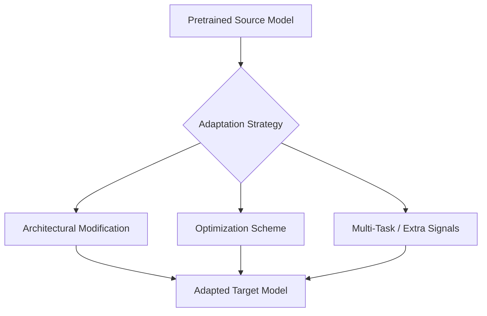
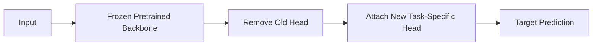
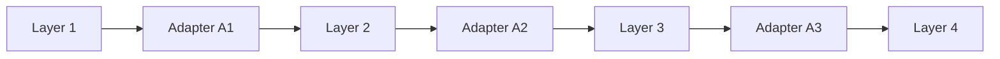
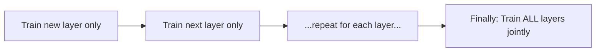
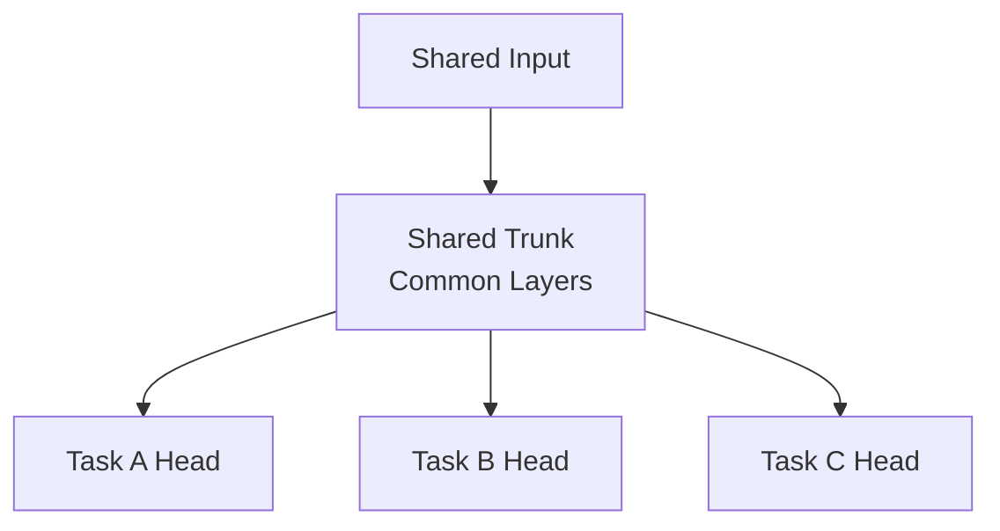
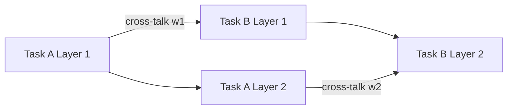
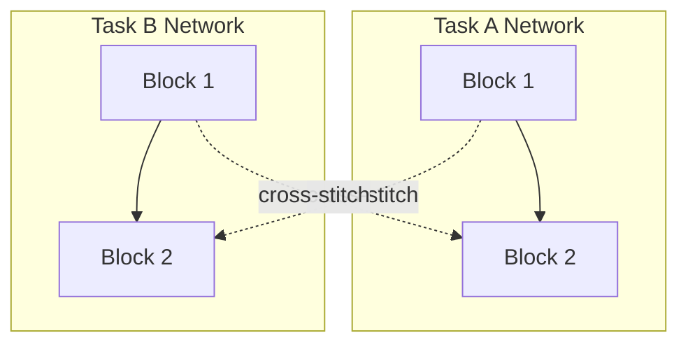
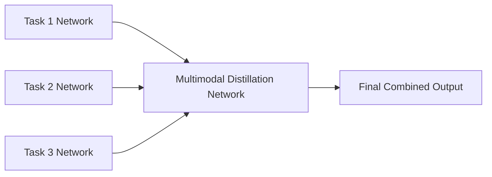
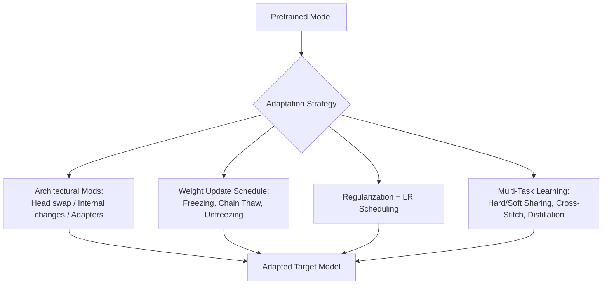

# Lecture 24: DL Transfer Learning Pretrained Part 2

**Course**: AI for Industrial Cyber-Physical Systems (AI4ICPS) — IIT Kharagpur  
**Duration**: 0:51:48  
**Source**: ai4icps-upskilling.in  

---

## Overview

Continuing directly from Part 1's "pretraining" pillar, this lecture covers **adaptation** — the practical toolbox for turning a big pretrained model into a specialized model for your target task. It walks through architectural modification strategies, parameter-efficient **adapters**, weight-update schedules (layer freezing, chain-thaw, gradual/sequential unfreezing), regularization, learning-rate scheduling, and finally **multi-task learning** architectures (hard/soft parameter sharing, shared trunk, cross-stitching, prediction distillation). Closes with a rich Q&A that clarifies common misconceptions.

---

## 1. The Adaptation Problem `[0:00 – 3:06]`

Having a pretrained source model, the goal is to modify it for a target task **without retraining from scratch** — because the target task typically has limited data and limited compute budget.

Three things must be decided simultaneously:

| Dimension | Question |
|---|---|
| **Architectural modification** | How much of the pretrained structure do we change — one layer? several? all? |
| **Optimization scheme** | How do we train during adaptation — what schedule, what learning rate? |
| **Extra signals** | Can we exploit multi-task architectures, ensembling, or additional supervision signals? |



---

## 2. Architectural Modification Strategies `[3:06 – 10:24]`

Two broad approaches:

### 2.1 Keep Internals Unchanged (Shallow Adaptation) `[3:31 – 8:10]`

The pretrained model's internal layers are left untouched — you only touch the **top** (task head) or **bottom** (input) layer.

**Pattern A — Swap the task head** `[5:06]`: Remove the original prediction head (e.g., an image-classification softmax layer) and attach a new head suited to the target task (e.g., a segmentation head).



> *Example*: A model pretrained for image classification (head predicts 1 of 1000 classes) is repurposed for image segmentation — swap out the classification head, bolt on a segmentation head, retrain only that new layer with target data.

**Pattern B — Multiple input signals** `[7:14 – 8:10]`: For tasks with several separate inputs (e.g., combining text + metadata), feed each into the frozen backbone, concatenate the resulting vectors, then feed into the (possibly new) output layer. The pretrained backbone itself is never touched.

> **Jargon**: *Task Head* — The final layer(s) of a network specialized for a particular objective (classification, regression, segmentation, etc.), sitting on top of a general-purpose, shared backbone.

### 2.2 Modify Internal Architecture (Deep Adaptation) `[4:21 – 10:24]`

Used when the **target task is structurally very different** from the source task — e.g., pretrained on single-sequence input but the target task needs multiple input sequences (sentence classification → next-sentence prediction).

Approach: initialize as much of the target model's weights as possible from the pretrained model, then **retrain** on target data. Common example: use a pretrained language model's weights to initialize the encoder/decoder of a machine translation model.

### 2.3 Adding New Capabilities `[10:24 – 11:34]`

For structurally demanding target tasks, insert new components: **skip connections**, **residual connections**, or **attention layers** — e.g., adding self-attention layers for NLP, or ResNet-style residual blocks for vision.

> **Jargon**: *Residual/Skip Connection* — A shortcut that lets a layer's input bypass the layer and be added directly to its output ($y = F(x) + x$), easing gradient flow and letting deeper models train more reliably.

---

## 3. Adapters: Parameter-Efficient Fine-Tuning `[11:34 – 14:59]`

**Motivation**: target data is scarce, so we want to fine-tune as **few new parameters** as possible relative to the (huge) original model.

> **Jargon**: *Adapter* — A small, lightweight module inserted between existing layers of a pretrained model. Only the adapter's parameters are trained; the rest of the backbone stays frozen. Adapters can be as simple as a residual connection or an extra attention block.



Each adapter (A1, A2, A3, ...) connects consecutive layers and partially fulfills the target task's requirements without demanding a full retrain. The adapter's design is domain-dependent:

| Domain | Typical Adapter |
|---|---|
| Vision | Extra convolutional block |
| NLP | Extra self-attention layer |

**Key benefit**: strong performance even with **limited target data**, since the vast majority of parameters (the backbone) stay frozen and only the small adapter parameters need to be learned.

---

## 4. Weight Update Schedules `[14:59 – 25:41]`

**Core tension**: we must update weights to fit the target task, but must **not overwrite** the valuable general knowledge baked into the pretrained backbone (otherwise we lose the very benefit of pretraining and risk poor generalization).

### 4.1 Top-to-Bottom Layer Freezing `[17:15 – 20:22]`

The simplest, cheapest strategy: freeze all layers except one, train that one, then move to the next.

```python
# Pseudocode: sequential layer-wise adaptation
for layer in reversed(model.layers):        # top -> bottom
    freeze_all_except(layer)
    train_on_target_data(layer)
    freeze(layer)                            # lock it in before moving on
```

> *Reads as*: "Update one layer at a time, from the top layer down to the bottom, freezing everything else while you do so." This is a very old technique (layer-wise training, ~2006, one of deep learning's foundational ideas) still widely reused in transfer learning today.

### 4.2 Freeze-All-But-Top `[20:54 – 21:25]`

Freeze every layer except the very top one; train only that. **Pros**: fast, needs little data. **Cons**: sacrifices some accuracy/generalizability since only one layer adapts.

### 4.3 Chain Thaw `[21:25 – 22:39]`

Train **one new layer at a time** (like freeze-all-but-top), but after each individual layer is trained, progressively move to training **all layers jointly**. The individually-trained layers give the joint phase a good starting point, so joint training converges faster.



### 4.4 Gradual Unfreezing `[22:39 – 23:19]`

The reverse of freeze-all-but-top: start with everything frozen, then **unfreeze one layer at a time** (typically top to bottom), training progressively larger portions of the network.

### 4.5 Sequential Unfreezing `[23:19 – 24:45]`

Focuses on **hyperparameters** (not weights) across training epochs — e.g., fine-tune pretrained parameters *excluding embedding layers* for several epochs, gradually expanding scope, and finally train **all parameters jointly** until convergence.

| Strategy | What Varies | Speed | Data Needed | Accuracy Trade-off |
|---|---|---|---|---|
| Freeze-all-but-top | Only top layer trains | Fastest | Least | Largest sacrifice |
| Top-to-bottom freezing | One layer at a time | Slow | Moderate | Balanced |
| Chain Thaw | Layer-by-layer → joint | Moderate | Moderate | Good, faster joint convergence |
| Gradual Unfreezing | Unfreeze incrementally | Moderate | Moderate | Balanced |
| Sequential Unfreezing | Hyperparameters over epochs | Slowest | Most thorough | Best generalization (of these heuristics) |

> **Important caveat** (repeated by the lecturer): **none of these heuristics guarantee the globally optimal solution** for the objective function — they are pragmatic trade-offs between effectiveness, computational cost, and generalizability under limited data/compute.

---

## 5. Regularization During Adaptation `[26:06 – 28:22]`

Since we must change *some* weights but must not lose the original model's knowledge, add a regularization term that penalizes the new parameters for straying too far from the original pretrained values.

$$\mathcal{L}_{\text{total}} = \mathcal{L}_{\text{target}} + \lambda \sum_i \| \theta_i' - \theta_i \|_2^2$$

```python
# Pseudocode: L2 regularization anchoring new weights to original
target_loss = compute_loss(model, target_data)
reg_term = sum((new_weight - original_weight)**2 for new_weight, original_weight in zip(model.params, pretrained.params))
total_loss = target_loss + lambda_reg * reg_term
```

> *Reads as*: "Penalize the new model whenever its parameters drift far from the original pretrained parameters — this keeps the model anchored to what it already learned while still letting it adapt."

| Symbol | Meaning |
|---|---|
| $\theta_i$ | Original pretrained parameter for layer $i$ |
| $\theta_i'$ | New (adapted) parameter for layer $i$ |
| $\lambda$ | Regularization strength hyperparameter |

---

## 6. Learning Rate Scheduling `[28:22 – 32:05]`

**Observation driving the strategy**: lower (earlier) layers in a deep net tend to capture **general** information; higher (later) layers capture **task-specific** information.

**Consequences**:
- Early in target training: the new model still needs to adapt to the target distribution.
- Late in training: the model is near convergence — be careful not to overshoot.
- If learning rates are set too high for lower layers, general knowledge gets overwritten — and it's *hard to recover* since higher layers can't relearn what was lost below.

**Discriminative fine-tuning** (layer-dependent learning rates):

$$\alpha_i = \alpha \cdot d^{\,i}$$

```python
# Pseudocode: smaller learning rate for earlier (more general) layers
for i, layer in enumerate(model.layers):     # i = 0 at bottom, increasing upward
    layer_lr = base_lr * (decay_factor ** i)
    optimizer.set_lr(layer, layer_lr)
```

> *Reads as*: "Instead of one fixed learning rate for the whole network, scale it by a decay factor raised to the layer's depth — lower layers (small $i$) get a smaller effective learning rate, protecting their general-purpose knowledge; higher layers get a relatively larger rate to adapt faster to the target task."

| Symbol | Meaning |
|---|---|
| $\alpha$ | Base learning rate (constant) |
| $\alpha_i$ | Effective learning rate for layer $i$ |
| $d$ | Decay factor (constant, $0 < d < 1$ typically) |
| $i$ | Layer depth index |

---

## 7. Multi-Task Learning (MTL) `[32:05 – 44:44]`

MTL trains **one network** to solve **multiple tasks simultaneously**, on the assumption that if the network is large enough, its lower layers can learn representations common across tasks that share structure — reducing total parameters and data needs versus training separate models per task.

### 7.1 Hard Parameter Sharing `[32:57 – 34:14]`

A common "trunk" of layers is shared across all tasks; only a small set of task-specific layers/branches sit at the very top.



### 7.2 Soft Parameter Sharing `[34:21 – 36:35]`

Instead of one shared trunk, each task gets its **own** full network, but parallel layers across the different networks **exchange information** via parameterized cross-links ("cross-talk").



### 7.3 Shared Trunk (Vision) `[35:14 – 35:59]`

A big common backbone processes the image once; multiple lightweight heads branch off the end for classification, segmentation, object detection, etc. Assumes the shared trunk produces general-enough features for *all* downstream heads.

### 7.4 Cross-Stitching `[36:35 – 38:33]`

Each task gets a **separate**, identically-structured network, but the input to each layer is a **learned linear combination** of the outputs from the *parallel* layers of both networks:

$$h_i^{A} = \alpha_{AA} \cdot h_{i-1}^A + \alpha_{AB} \cdot h_{i-1}^B$$



More parameters than shared trunk, but **better when tasks are quite different** — shared trunk assumes substantial feature overlap; cross-stitching lets each task keep its own specialized pathway while still exchanging useful signals.

### 7.5 Prediction Distillation `[38:33 – 44:22]`

Two-level training: first, separate networks make per-task predictions; second, a **multimodal distillation network** combines all those predictions to produce a refined final output.



### 7.6 Practical Example: Transformer/BERT-style MTL `[41:00 – 44:22]`

A shared transformer backbone produces general-purpose language representations; different downstream heads pick different parts of the output depending on task needs:

| Task | Representation Used |
|---|---|
| Textual similarity | `[CLS]` token only (single summary vector is sufficient) |
| Sequence tagging (e.g., NER) | All hidden vectors (per-token detail needed) |

> **Jargon**: *`[CLS]` Token* — A special token BERT-style models prepend to input; its final hidden vector is trained to summarize the entire sequence — used whenever a single whole-sequence representation suffices.

> **Math Note**: Choosing *which* part of a pretrained representation to reuse is itself a design decision — sequence-level tasks need only the summary vector; token-level tasks need the full per-token vector sequence.

---

## 8. Q&A Highlights `[44:44 – end]`

| Question | Key Answer |
|---|---|
| Why transfer learning? | Insufficient target data + computational constraints — accepts a small accuracy trade-off for large efficiency gains |
| How does data distribution affect transfer quality? | Large distribution mismatch → instability; regularization helps prevent overfitting to the little target data available |
| Does data augmentation help? | Yes — adds variety to scarce target data, improving generalization |
| Why fine-tune deeper (later) layers more? | Early/embedding layers hold general knowledge that's hard to recover once lost; safer to adapt the task-specific later layers |
| Layer freezing vs. optimum? | Freezing sacrifices strict optimality of the objective function in exchange for lower computational cost — a deliberate trade-off |
| Learning rate schedule while fine-tuning? | Higher LR for deeper (task-specific) layers, lower LR for shallow (general) layers, to avoid overwriting general knowledge |
| Is batch normalization helpful? | Yes — regularizes shifting activation distributions during adaptation, improving generalization |
| Can GANs generate more target data to help? | Viable, but risky if the target data lacks diversity — GAN tends to amplify existing patterns ("rich get richer"), not create genuinely new variety |
| Can transfer-learned models be attacked? | Yes, though somewhat less exposed than from-scratch models due to the extra fine-tuning layer of obfuscation |
| Consequence of pretraining on imbalanced data? | Model transfers well to majority-class-like target data but poorly to rare/minority-like target data, risking large, destabilizing parameter shifts |

---

## Quick Reference: Key Jargon Glossary

| Term | One-Line Definition |
|---|---|
| Task Head | Final task-specific layer(s) sitting atop a shared backbone |
| Residual/Skip Connection | Shortcut adding a layer's input directly to its output for easier gradient flow |
| Adapter | Small trainable module inserted into a frozen pretrained model for efficient fine-tuning |
| Layer Freezing | Preventing selected layers' weights from updating during training |
| Chain Thaw | Train layers individually, then jointly, for faster joint convergence |
| Gradual/Sequential Unfreezing | Progressively unfreeze layers/hyperparameters over training epochs |
| L2 Regularization (Adaptation) | Penalizes new weights for drifting far from original pretrained weights |
| Discriminative Fine-Tuning | Using different learning rates per layer depth during adaptation |
| Hard Parameter Sharing | Shared trunk + task-specific heads |
| Soft Parameter Sharing | Separate per-task networks linked via cross-talk parameters |
| Cross-Stitching | Learned linear combination of parallel layers across per-task networks |
| Prediction Distillation | Combine multiple per-task predictions via a secondary distillation network |
| `[CLS]` Token | Special token whose vector summarizes an entire input sequence (BERT-style) |

---

## Summary



**Key Takeaway**: Adaptation is a balancing act — you must change *just enough* of a pretrained model's weights and architecture to fit the target task, while deliberately protecting the general knowledge already encoded in it, using freezing schedules, regularization, and careful learning-rate design as your main levers.

---

*Notes generated from SRT transcript with timestamps. whisper.cpp (small model, Metal GPU). Enhanced with AI expert annotations.*
