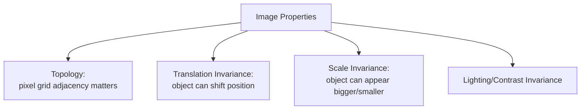
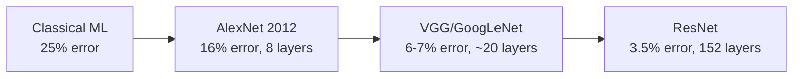
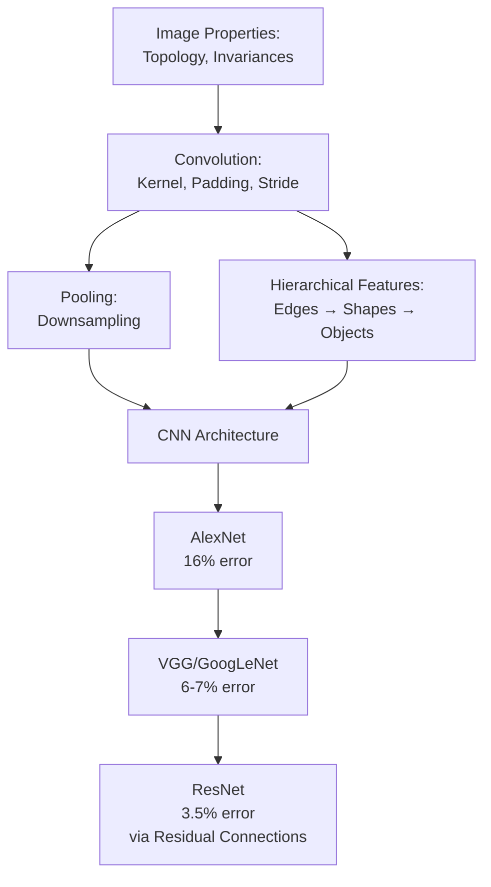

# Lecture 25: DL Applications Computer Vision Part 1

**Course**: AI for Industrial Cyber-Physical Systems (AI4ICPS) — IIT Kharagpur  
**Duration**: 1:09:30  
**Source**: ai4icps-upskilling.in  

---

## Overview

This lecture builds the **Convolutional Neural Network (CNN)** from first principles by starting with the special properties of image data (topology, translation/scale invariance), then derives *why* convolution — rather than full connectivity — is the natural architecture for images. It walks through kernels, padding, stride, pooling, and the PyTorch mechanics of a CNN, then surveys the historical arc of landmark architectures (AlexNet → VGG/GoogLeNet → ResNet) that drove the ImageNet accuracy revolution from 2012–2017.

---

## 1. Why Images Need a Special Architecture `[0:00 – 8:45]`

Image data has structural properties that generic (tabular) data lacks — and neural network design must respect them.

### 1.1 Topology `[1:56 – 5:57]`
Pixels live on a **grid**; which pixel is *near* which other pixel carries meaning. This spatial adjacency is called **topology**.

> **Jargon**: *Topology (of an image)* — The neighborhood structure of pixels arranged in a 2D grid. A pixel typically has **4 neighbors** (up/down/left/right) or **8 neighbors** (adding the 4 diagonals).

### 1.2 Translation & Scale Invariance `[5:57 – 8:45]`
The same object (e.g., a can of soda) can appear shifted (**translation**) or resized (**scale**) across different images/frames, yet a human still recognizes it as the same object. A good vision model must be robust to these transformations — plus variations in **lighting/contrast**.



> **Jargon**: *Translation Invariance* — A model's ability to recognize the same pattern regardless of *where* it appears in the image. This is the property CNNs exploit by reusing the same kernel across every spatial location.

### 1.3 Computer Vision, Defined `[8:45 – 10:03]`
> **Jargon**: *Computer Vision* — The AI subfield focused on enabling machines to interpret and understand visual information (e.g., "this image contains a coke can lying on grass").

Two broad engineering tasks: (1) design neural network **models** for a given application, and (2) create suitable **datasets/algorithms**. This lecture focuses on (1).

---

## 2. From Feed-Forward to Convolutional Layers `[10:38 – 18:10]`

### 2.1 The Problem with Full Connectivity `[10:38 – 13:00]`
In a **feed-forward** network, every neuron in one layer connects to every neuron in the next — ignoring topology entirely. In a **CNN**, layers stay arranged in the same grid/topographic format, and connections are **not** fully connected — they follow a **convolution operation** instead.

### 2.2 The Convolution Operation `[13:00 – 18:10]`

A **kernel** (a.k.a. **filter**) is a small grid of learnable weights (e.g., 3×3). It is **overlaid** on a patch of the input; elementwise multiplication + summation produces a single output value, placed at the position corresponding to the input patch's **center pixel**.

$$\text{output}(\text{center pixel}) = \sum_{p \in \text{kernel}} W_p \cdot \text{pixel}_p$$

```python
# Pseudocode: convolution at one position
output_value = sum(kernel[i][j] * input_patch[i][j] for i in range(k) for j in range(k))
# repeat by sliding the kernel across every valid position in the input
```

> *Reads as*: "Multiply each kernel weight by the pixel value directly beneath it, sum everything up, and place that single number at the center of wherever the kernel currently sits. Slide the kernel across the whole image, repeating this at every position."

> *Example*: If a 3×3 kernel = `[[-1,0,1],[-1,0,1],[-1,0,1]]` overlaid on a patch with a bright-to-dark left-to-right transition, the weighted sum will be large — this specific kernel is a **vertical edge detector**.

The region of the input a kernel touches at one time is called the **receptive field**.

> **Jargon**: *Receptive Field* — The patch of the input image that a single kernel application "sees" at once. Larger receptive fields capture more context per output pixel.

**Classic hand-designed kernels** (used long before CNNs, in traditional image processing):

| Kernel | Effect | Why |
|---|---|---|
| Gaussian blur (weight 1 on neighbors, 4 on center) | Smooths / blurs edges | Averages a pixel with its neighbors, diluting sharp transitions |
| Sharpening (high center weight, negative neighbor weights) | Sharpens edges | Amplifies the difference between center and surrounding pixels |
| Vertical/horizontal line detectors | Detects lines in that orientation | Weighted to respond strongly to intensity gradients in one direction |
| Corner detector | Detects corners | Responds to intensity change in multiple directions simultaneously |

**Key insight for CNNs**: instead of hand-picking these kernel values, **let the network learn them** — via backpropagation, kernels automatically specialize into whatever features (edges, textures, shapes...) are most useful for the task.

---

## 3. Why Convolution Works So Well for Images `[21:52 – 33:09]`

### 3.1 Hierarchical Feature Building `[21:52 – 24:32]`

```mermaid
flowchart LR
    A[Raw Pixels] --> B[Layer 1:<br/>Edges]
    B --> C[Layer 2:<br/>Shapes / Textures<br/>circles, fur pattern]
    C --> D[Layer 3+:<br/>Object Parts<br/>eyes, nose]
    D --> E[Final Layers:<br/>Whole Object<br/>"cat"]
```

Each convolutional layer combines outputs of the previous layer into increasingly abstract, higher-level visual features — early layers detect edges, middle layers combine edges into shapes/textures, later layers assemble shapes into recognizable object parts.

### 3.2 Parameter Efficiency via Weight Sharing `[24:32 – 33:09]`
Because the **same kernel** is reused at every position (exploiting translation invariance), the number of learnable parameters stays tiny regardless of image size.

> *Example*: A 200×200 image has 40,000 pixels. A fully-connected layer mapping 40,000 inputs → 40,000 outputs needs $40{,}000 \times 40{,}000 = 1.6$ **billion** weights — computationally infeasible. A convolutional layer using a 7×7 kernel across 3 input channels and 10 output channels needs only $7 \times 7 \times 3 \times 10 = 1{,}470$ weights — a reduction of roughly 6 orders of magnitude.

```python
# Pseudocode: parameter count comparison
ff_weights = input_pixels * output_pixels                 # e.g. 40000 * 40000 = 1.6B
conv_weights = kernel_h * kernel_w * in_channels * out_channels  # e.g. 7*7*3*10 = 1470
```

> *Reads as*: "Fully-connected cost scales with image area *squared*; convolutional cost scales only with kernel size × channels — completely independent of image size."

---

## 4. Specifying a Convolutional Layer `[28:02 – 41:32]`

Three hyperparameters define a conv layer: **kernel size**, **padding**, and **stride**.

### 4.1 Padding `[29:14 – 33:09]`
Without padding, pixels near the border can never be a kernel's *center* pixel, so the output shrinks (e.g., a 5×5 input with a 3×3 kernel yields a 3×3 output). **Zero-padding** adds a border of zero-valued pixels so the output preserves the input size.

$$\text{padding } p = \frac{k-1}{2} \quad \text{(for odd kernel size } k\text{)}$$

> *Reads as*: "For an odd-sized kernel of width $k$, pad $\frac{k-1}{2}$ pixels of zeros on every side to keep output size equal to input size." This is *why* odd kernel sizes (3×3, 5×5, 7×7) are conventional — they have a well-defined single center pixel.

### 4.2 Stride `[33:09 – 37:11]`
**Stride** controls how many pixels the kernel moves between applications. Stride 1 = move one pixel at a time (dense); stride 2 = skip every other position (coarser, faster, smaller output).

$$\text{output size} = \left\lfloor \frac{n + 2p - f}{s} \right\rfloor + 1$$

```python
# Pseudocode: output size formula
output_size = (input_size + 2*padding - kernel_size) // stride + 1
```

> *Reads as*: "Take the padded input size, subtract the kernel size, divide by the stride, add 1." If this doesn't come out to a whole number, that stride/padding/kernel combination is invalid for this input size.

| Symbol | Meaning |
|---|---|
| $n$ | Input size (height or width) |
| $f$ | Kernel/filter size |
| $p$ | Padding (pixels added per side) |
| $s$ | Stride |

> *Example*: $n=7$, $f=3$, $s=1$, $p=0$: output $= (7-3)/1 + 1 = 5$. With $s=2$: output $= (7-3)/2+1 = 3$. With $s=3$: $(7-3)/3 = 1.33$ — **invalid**, stride must be chosen so the division is exact.

### 4.3 Channels & Filters `[38:56 – 41:32]`
A real image has **3 channels** (R, G, B). A convolutional layer's filter has matching **depth** (must equal input channel count); using **multiple filters** produces multiple output channels, each specializing in detecting a different feature (e.g., horizontal edges, vertical edges, texture).

> *Example*: A `5×5×3` filter (5×5 spatial, 3 input channels) applied to a `32×32×3` image (no padding) yields a `28×28×1` output per filter. Using 6 such filters yields a `28×28×6` output volume.

---

## 5. Pooling Layers `[41:32 – 48:09]`

Pooling **shrinks** spatial size **without learnable parameters** — typically **max pooling**: slide a small window (e.g., 2×2, stride 2) and keep only the maximum value in each window.


> **Jargon**: *Max Pooling* — Downsampling by keeping the strongest activation in each local window, discarding the rest. Reduces computation and parameter count in later fully-connected layers while retaining the most salient signal.

> *Example*: 3 rounds of pooling that each shrink an axis by 1/3 will shrink a 255×255 feature map to roughly 10×10 — feeding a much smaller, cheaper fully-connected layer (e.g., 100×5 = 500 weights instead of millions).

**Typical CNN block**: **Convolution → ReLU → Pooling**, repeated (a "CCP block"), followed by one or more fully-connected layers for the final classification.

```python
# Pseudocode: PyTorch-style forward pass (CCP block x N + FC)
def forward(x):
    x = relu(conv1(x))
    x = relu(conv2(x))
    x = pool(x)          # one CCP block
    # ... repeat for more blocks ...
    x = flatten(x)
    return fc(x)          # final classification layer
```

---

## 6. The ImageNet Era: AlexNet → VGG/GoogLeNet → ResNet `[50:44 – 1:09:20]`

### 6.1 The ImageNet Challenge `[50:44 – 52:24]`
A yearly competition (**ImageNet Large Scale Visual Recognition Challenge**, ~2010s) requiring classification into **1,000 object categories**. Best pre-deep-learning (classical ML) approach: **25% error rate**.

### 6.2 The Three Big Leaps `[52:24 – 53:27]`

| Year / Model | Error Rate | Key Innovation |
|---|---|---|
| Pre-2012 (classical ML) | 25% | Hand-engineered features |
| 2012 — **AlexNet** | 16% | First deep CNN to win ImageNet; ReLU, dropout, data augmentation |
| ~2014 — **VGGNet / GoogLeNet** | 6–7% | Deeper networks (19–22 layers); smaller, stacked 3×3 filters |
| 2015 — **ResNet** | ~3.5% | Residual/skip connections enable very deep networks (152 layers) — **better than human error (~5%)** |



### 6.3 AlexNet `[54:20 – 57:53]`
Architecture: **[Conv → MaxPool → Norm] × 2 → [Conv × 3] → MaxPool → FC × 3**. About 100–120 million parameters — most from the three fully-connected layers at the end (not very parameter-efficient by modern standards). Only ~8 layers deep.

### 6.4 VGGNet: Smaller Filters, Stacked Deeper `[57:53 – 1:04:02]`

**Core innovation**: use only small **3×3** filters (stride 1, padding 1) stacked in sequence, rather than large filters like 11×11 or 7×7.

> **Jargon**: *Receptive Field (stacking effect)* — Stacking multiple small kernels achieves the *same* effective receptive field as one large kernel, but with far fewer parameters.

$$\text{stacking } N \text{ layers of } 3\times3 \text{ kernels} \Rightarrow \text{effective receptive field} = 2N + 1$$

> *Example*: Two stacked 3×3 conv layers ⇒ effective receptive field 5×5. Three stacked 3×3 layers ⇒ effective receptive field 7×7.

**Parameter comparison** (with $c$ input channels):

| Approach | Parameters | Receptive Field |
|---|---|---|
| One 7×7 filter | $49c^2$ | 7×7 |
| Three stacked 3×3 filters | $27c^2$ (3 × $9c^2$) | 7×7 (equivalent) |

> *Reads as*: "You get the same field of view with roughly half the parameters by stacking several small filters instead of using one big one — plus more non-linear activations (ReLU) squeezed in between, giving the network more expressive power for free."

GoogLeNet extended this further with the **Inception module**, using *different-sized* filters within the same layer (rather than VGG's uniform 3×3 everywhere) for even better parameter efficiency.

### 6.5 The Vanishing Gradient Wall `[1:04:55 – 1:06:53]`

Pushing depth beyond ~20 layers hit the **vanishing gradient problem**: gradients computed during backpropagation shrink as they flow back through many layers, making early layers train extremely slowly.

> **Jargon**: *Vanishing Gradient Problem* — In very deep networks, gradients can shrink toward zero as they propagate backward through many layers (especially through saturating activations), so early layers barely update. A 56-layer plain network can train *slower* than a 20-layer one, even though it has more theoretical capacity.

### 6.6 ResNet's Fix: Learn the Residual `[1:06:53 – 1:09:20]`

Instead of a layer learning the full mapping $h(x)$, it learns the **residual** $f(x) = h(x) - x$, and the layer's actual output is computed as $f(x) + x$ via a **skip/shortcut connection**.

$$\text{output} = f(x) + x$$

```mermaid
flowchart LR
    X[Input x] --> F[Conv Block<br/>learns f(x)]
    X -->|skip connection| Add[+]
    F --> Add
    Add --> Y[Output = f(x) + x]
```

> *Reads as*: "Instead of forcing a layer to reinvent the whole transformation from scratch, let it just learn the *adjustment* needed on top of the input — and add the original input back in via a shortcut wire." This keeps gradients flowing cleanly all the way back to early layers, since the shortcut path has a "gradient highway" with no vanishing effect.

> **Jargon**: *Residual / Skip Connection* — A direct wire that adds a layer/block's input to its output, letting the network learn small corrections (residuals) rather than entire transformations — the key trick enabling networks with 100+ layers to train successfully.

This innovation let ResNet scale to **152 layers**, achieving ~97–98% accuracy on ImageNet (equivalent to the ~3.5% error rate noted above) — surpassing human-level performance on this benchmark.

---

## Quick Reference: Key Jargon Glossary

| Term | One-Line Definition |
|---|---|
| Topology (image) | Grid-based neighborhood structure of pixels |
| Translation/Scale Invariance | Recognizing an object regardless of its position/size in the frame |
| Kernel / Filter | Small grid of learnable weights that slides over an image to detect a pattern |
| Receptive Field | The input region a kernel "sees" in one application |
| Padding | Zero-value border added to preserve output spatial size |
| Stride | Step size the kernel moves between applications |
| Max Pooling | Downsampling by keeping the max value in each local window |
| AlexNet | 2012 CNN that halved ImageNet error rate via deep learning |
| VGGNet | Stacked small (3×3) filters for parameter-efficient deep networks |
| Vanishing Gradient Problem | Gradients shrink across many layers, stalling training of early layers |
| Residual / Skip Connection | Shortcut adding a block's input to its output; core ResNet trick |

---

## Summary



**Key Takeaway**: CNNs exist because they encode the structural properties of images — topology and translation invariance — directly into the architecture, making them dramatically more parameter-efficient than fully-connected networks; the ImageNet era's progression (AlexNet → VGG/GoogLeNet → ResNet) shows how progressively smarter architectural tricks (small stacked filters, residual connections) unlocked ever-deeper, ever-more-accurate vision models.

---

*Notes generated from SRT transcript with timestamps. whisper.cpp (small model, Metal GPU). Enhanced with AI expert annotations.*
