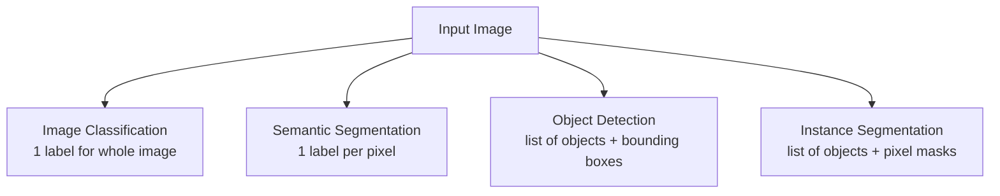
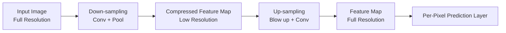
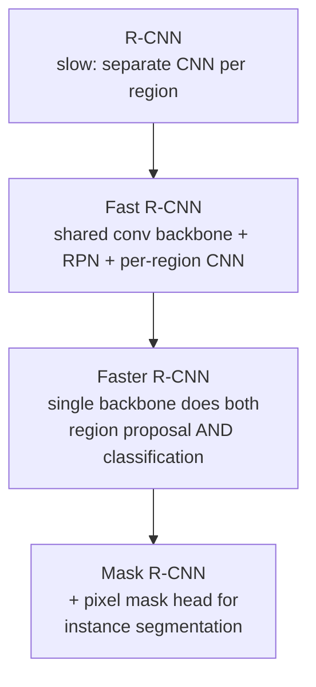
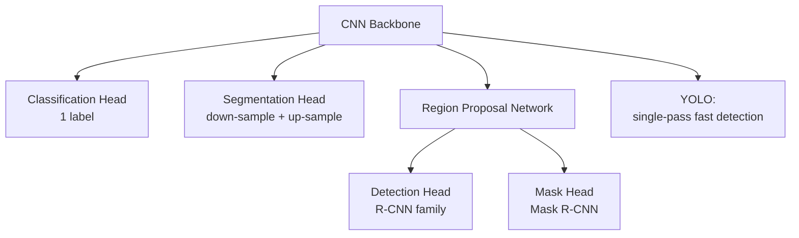

# Lecture 26: DL Applications Computer Vision Part 2

**Course**: AI for Industrial Cyber-Physical Systems (AI4ICPS) — IIT Kharagpur  
**Duration**: 0:29:08  
**Source**: ai4icps-upskilling.in  

---

## Overview

Continuing directly from Part 1's CNN foundations, this lecture surveys the four core computer-vision **tasks** — image classification, semantic segmentation, object detection, and instance segmentation — and shows how CNN architecture must be adapted for each. It builds up the region-proposal-based detection pipeline (R-CNN → Fast R-CNN → Faster R-CNN → Mask R-CNN) and contrasts it with the faster, slightly-less-accurate YOLO family, closing with a hands-on Q&A about kernel design.

---

## 1. The Four Core Computer Vision Tasks `[0:00 – 6:07]`

### 1.1 Image Classification `[0:00 – 1:43]`
Input image → CNN → a single class label (out of, say, 1,000 possible classes). This is the task the ImageNet challenge (covered in Part 1) directly measures.

### 1.2 Semantic Segmentation `[1:57 – 4:14]`
Instead of one label for the whole image, produce an **output image of the same size** where **every pixel** gets its own class label (sky, grass, cat, trees, etc.).

> **Jargon**: *Semantic Segmentation* — Pixel-wise classification: the output is a same-sized map where each pixel is tagged with the category of the object it belongs to. Crucial for autonomous driving, where you need to know *which region* of the scene is road, pedestrian, or obstacle.

### 1.3 Object Detection `[4:14 – 5:20]`
When an image has **multiple** objects of interest, the task is to (a) identify **what** each object is, and (b) draw a **bounding box** around each — output is a *list* of (label, bounding box) pairs.

### 1.4 Instance Segmentation `[5:20 – 6:07]`
A more precise version of object detection: instead of a rectangular bounding box, output the **exact pixels** belonging to each individual object instance. Solving instance segmentation implicitly solves object detection too.

| Task | Output | Granularity |
|---|---|---|
| Classification | 1 label | Whole image |
| Semantic Segmentation | Label map (same size as input) | Per-pixel, no instance distinction |
| Object Detection | List of (label, bounding box) | Per-object, box-level |
| Instance Segmentation | List of (label, pixel mask) | Per-object, pixel-level |

---

## 2. Semantic Segmentation with CNNs `[6:33 – 13:26]`

### 2.1 The Naive Patch-Based Approach `[6:33 – 9:49]`
For every pixel, extract a surrounding **patch**, run it through a CNN, and predict that pixel's label.

**Two problems**:
1. **Unknown patch size** — too small a patch lacks the context needed to tell, e.g., "this pixel is part of a cow" vs. background.
2. **Wasteful recomputation** — neighboring patches heavily overlap, so running a full CNN per pixel repeats almost identical computation.

> *Reads as*: "Running an entire CNN independently for every single pixel's patch is like re-reading the whole page just to understand one word — most of the reading is duplicated work."

### 2.2 The Efficient Solution: Shared Backbone `[9:49 – 11:09]`
Run the **entire image** through the convolutional layers *once* (skip the final fully-connected layer), producing one shared feature map — then apply a lightweight, per-pixel classification only on top of that shared computation.

**Remaining problem**: standard classification CNNs aggressively shrink spatial size (e.g., 250×250 → 10×10) via strided convolutions/pooling — leaving too little spatial resolution to label every original pixel.

### 2.3 Down-Sampling + Up-Sampling (U-Net-style) `[11:09 – 13:26]`

> **Jargon**: *Up-Sampling* — The inverse of pooling: enlarge each pixel into multiple pixels (e.g., 1→4), then apply convolution to smooth/refine the enlarged result. This restores full spatial resolution after down-sampling has compressed it.

This down-sample-then-up-sample pattern is the backbone of the well-known **U-Net** architecture — trading some computational overhead for the ability to output pixel-accurate segmentation maps at the original image resolution.

---

## 3. Object Detection with CNNs `[13:26 – 22:56]`

### 3.1 The Naive Bounding-Box Sliding Window `[14:53 – 18:02]`

Represent a candidate box by $(x, y, \text{height}, \text{width})$ — $(x,y)$ is the top-left corner. For every candidate box: crop that patch, classify it (including a **"no object"** option for background boxes).

**Multi-task loss**: predict both **class label** (classification) and a **bounding-box correction** (regression) simultaneously.

$$\mathcal{L}_{\text{total}} = \mathcal{L}_{\text{classification}} + \mathcal{L}_{\text{bbox regression}}$$

> **Math Note**: Class label prediction is **classification** (discrete categories); bounding box prediction is **regression** (continuous numbers: $x, y, h, w$). A detection model's loss combines both.

**Problems**: (1) the number of possible bounding boxes at every position/size is enormous; (2) object sizes vary hugely within one image (e.g., a big duck vs. many small ducklings), so no single box size works for everything.

### 3.2 Region Proposal Networks (RPN) `[18:02 – 19:52]`

Instead of exhaustively checking every possible box, train a **fast**, lightweight network to quickly filter which regions are *likely* to contain any object at all (regardless of class) — reducing millions of candidate boxes down to, say, the top ~2,000 **region proposals**.

> **Jargon**: *Region Proposal Network (RPN)* — A network trained on a binary "object vs. non-object" signal to rapidly shortlist candidate bounding boxes, avoiding the need to classify every conceivable box position/size in the image.

### 3.3 The R-CNN Family `[19:52 – 23:19]`

| Model | Key Idea | Trade-off |
|---|---|---|
| **(Slow) R-CNN** | Run a *separate* full CNN per region proposal | Very slow — massive redundant computation |
| **Fast R-CNN** | Shared convolutional backbone + RPN + smaller per-region CNN for classification/bbox | Faster, but RPN is still a separate stage |
| **Faster R-CNN** | Same backbone computes region proposals *and* classification/bbox jointly (**Region of Interest / RoI pooling**) | Faster still, end-to-end trainable |
| **Mask R-CNN** | Adds an extra mask-prediction head on top of RoI pooling | State-of-the-art accuracy for detection + instance segmentation, but relatively slow |

> **Jargon**: *RoI Pooling (Region of Interest Pooling)* — A layer that extracts a fixed-size feature representation from a variable-sized region proposal, so downstream classification/regression layers can process regions of any original size/shape consistently.

### 3.4 YOLO: Speed over Marginal Accuracy `[23:49 – 24:03]`

**YOLO** ("You Only Look Once") networks are a separate detection family: **slightly less accurate** than Mask R-CNN, but **much faster** — making them the go-to choice when real-time inference matters (e.g., robotics, video streams).

| Family | Accuracy | Speed | Best For |
|---|---|---|---|
| Mask R-CNN | Highest (state-of-the-art) | Slower | Offline / accuracy-critical tasks |
| YOLO | Slightly lower | Much faster | Real-time detection |

---

## 4. Q&A Highlights `[24:36 – end]`

| Question | Key Answer |
|---|---|
| How do I pick a kernel size for my own task? | You typically don't hand-design values — just pick the *size* (e.g., 3×3) and let training learn the weights. Start from a proven backbone (VGG, ResNet, U-Net) and fine-tune rather than designing from scratch. |
| How many conv layers/channels should I use? | Follow VGG's convention: stack several 3×3 layers to reach your desired receptive field; output channel count is a free design choice (tens, e.g., 20–30, depending on how many distinct features you want to detect). |
| What is the "center pixel" in a kernel calculation? | It's the position in the receptive field where the convolution's single computed output value gets placed in the output feature map. |

---

## Quick Reference: Key Jargon Glossary

| Term | One-Line Definition |
|---|---|
| Image Classification | Assigning a single label to an entire image |
| Semantic Segmentation | Assigning a class label to every pixel in an image |
| Object Detection | Localizing multiple objects with bounding boxes + labels |
| Instance Segmentation | Object detection with pixel-exact masks instead of boxes |
| Up-Sampling | Enlarging a compressed feature map back toward original resolution |
| Region Proposal Network (RPN) | Fast network that shortlists candidate object regions |
| RoI Pooling | Extracts a fixed-size feature vector from a variable-sized region proposal |
| R-CNN / Fast / Faster / Mask R-CNN | Progressive family of region-based object detectors, each faster/more integrated than the last |
| YOLO | Fast, single-pass object detection family, trading a little accuracy for speed |

---

## Summary

**Key Takeaway**: The same convolutional backbone that powers image classification can be repurposed for pixel-level segmentation (via down-sampling + up-sampling) and multi-object detection (via region proposals + classification/regression heads) — the R-CNN lineage progressively fused these stages into one network for speed, while YOLO takes a different, single-pass route that trades a bit of accuracy for real-time performance.

---

*Notes generated from SRT transcript with timestamps. whisper.cpp (small model, Metal GPU). Enhanced with AI expert annotations.*
