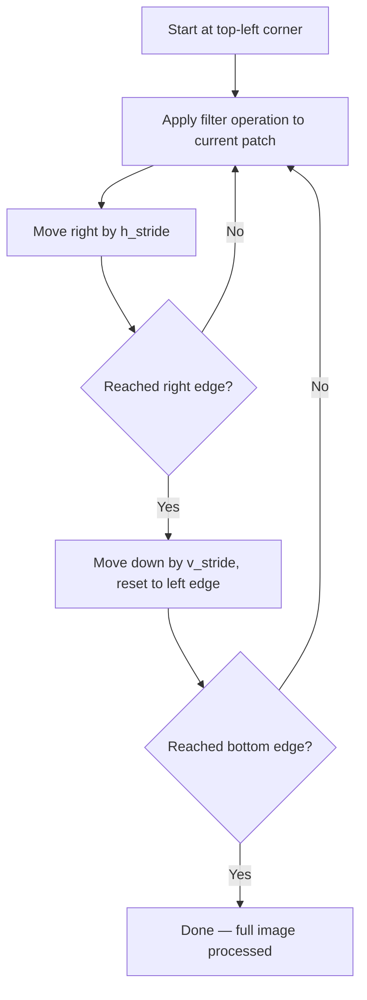
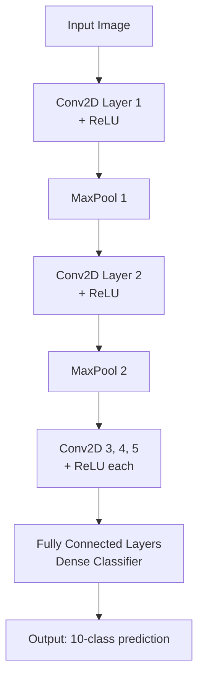
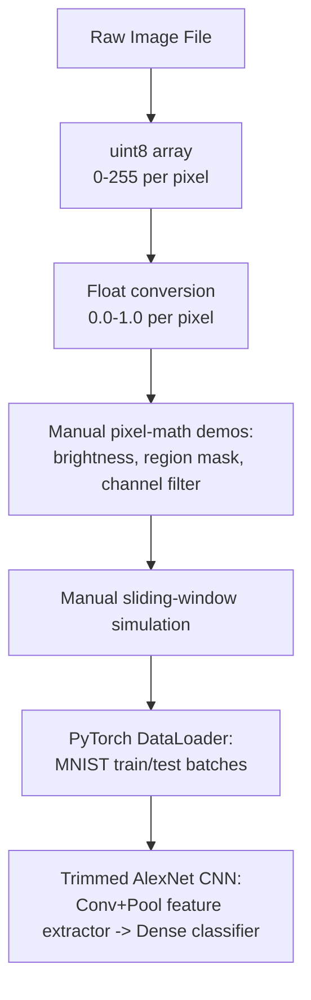

# Lecture 27: Hands-on DL Computer Vision Part 1

**Course**: AI for Industrial Cyber-Physical Systems (AI4ICPS) — IIT Kharagpur  
**Duration**: 1:00:21  
**Source**: ai4icps-upskilling.in  

---

## Overview

A hands-on lab session bridging computer-vision theory to working PyTorch code. Starting from "what actually *is* an image in memory," the session builds intuition through live image manipulation (brightness scaling, region masking, color-channel filters, and a manual sliding-window filter simulation) before constructing an **AlexNet-style CNN** from scratch for **MNIST digit classification**, walking layer-by-layer through `nn.Conv2d`, `nn.MaxPool2d`, and the feature-extractor → classifier split.

---

## 1. Housekeeping: Assignment Grading Notes `[0:00 – 3:11]`

Programming assignments are auto-graded against a **hidden test-case set** (not the sample cases shown in the assignment PDF); for compute-heavy ML/DL assignments, only a single test case may be used per submission, so **any failure risks a score of 0**. Test cases are shared transparently after grading.

---

## 2. The Roadmap: MNIST Classification Pipeline `[3:11 – 5:34]`


> **Jargon**: *MNIST* — A classic benchmark dataset of 28×28 grayscale handwritten digit images (0–9), widely used to sanity-check new vision models.

**Key point emphasized**: in a CNN, the feature extractor and the classifier are trained **jointly** (shared weights, one end-to-end backpropagation pass) — unlike classical ML, where feature engineering and classification are two separate, disconnected stages.

---

## 3. Images as Data: A First-Principles Walkthrough `[5:34 – 23:54]`

### 3.1 Loading & Inspecting an Image `[8:26 – 12:04]`

Using the **scikit-image** library (`skimage`, image-processing extension of scikit-learn):

```python
from skimage import io
my_image = io.imread(location)
print(my_image.dtype)   # uint8
print(my_image.shape)   # (height, width, channels) e.g. (622, 1001, 3)
```

> *Reads as*: "Read the image file into a NumPy-like array. Its data type `uint8` means every pixel is an unsigned 8-bit integer — capable of representing $2^8 = 256$ distinct values, i.e. 0–255."

| Dimension | Meaning |
|---|---|
| Height | Number of pixel rows |
| Width | Number of pixel columns |
| Channels | 3 for RGB color images; 1 for grayscale |

> **Jargon**: *`uint8`* — "Unsigned 8-bit integer": a data type storing whole numbers from 0 to 255 using 8 bits, with no sign bit (can't be negative). The natural storage format for raw pixel intensities.

### 3.2 Converting to Float for Math `[13:54 – 19:24]`

Integer pixel values are awkward for mathematical operations (e.g. gradients, normalization). Convert to floating point, rescaled to $[0, 1]$:

```python
from skimage import img_as_float
my_float_image = img_as_float(my_image)
print(my_float_image.min(), my_float_image.max())   # 0.0, 1.0
```

> *Reads as*: "Same image, same visual content — just represented with real numbers between 0 and 1 instead of integers between 0 and 255. This makes downstream math (scaling, normalization, gradients) far more natural."

### 3.3 Simple Pixel-Math: Brightness Scaling `[19:24 – 21:19]`

```python
my_dark_image = my_float_image.copy()
my_dark_image = 0.5 * my_dark_image     # every pixel value halved
```

> *Example*: A pixel valued `1.0` (pure white) becomes `0.5` (mid-gray) — multiplying every pixel by a constant $< 1$ uniformly darkens the image.

### 3.4 Filters as "Selective Pass-Through" `[21:19 – 23:54]`

> **Jargon**: *Filter (intuitive definition)* — Something that lets through what you want and blocks what you don't. Just like sunglasses block UV/bright light selectively, an image filter selectively passes or blocks pixel information — this is the intuition CNN kernels formalize mathematically.

**Region-masking demo**: overwrite a rectangular sub-region of the image (indexed via `image[200:500, :]`-style slicing across height/width, all channels) with a darkened version of itself — creates a visible rectangular "shadow" patch, illustrating a crude spatial filter.

**Channel-specific filtering demo**: apply the darkening operation to only **one color channel** (e.g. channel index 2) instead of all three (0=R, 1=G, 2=B) — this selectively removes/reduces one color, producing a **color tint** effect (e.g., white → yellow, blue → green), demonstrating how per-channel operations change perceived color.

---

## 4. Simulating a Sliding Convolutional Filter `[23:54 – 36:40]`

Before touching any deep learning library, the lecture manually simulates what a **convolution** does by sliding a fixed-size window across an image and repeatedly darkening each patch — visually building intuition for kernel/stride mechanics that PyTorch's `Conv2d` performs automatically and efficiently.

```python
import time
h, w, d = my_float_image.shape
filter_size = 100      # square filter, 100x100
h_stride = 50          # vertical step size
v_stride = 50          # horizontal step size

for i in range(0, h, v_stride):          # vertical movement (top -> bottom)
    for j in range(0, w, h_stride):      # horizontal movement (left -> right)
        sliding_filter_image[i:i+filter_size, j:j+filter_size] *= 0.5
        plt.imshow(sliding_filter_image)
        time.sleep(1)                     # pause to visualize each step
```

> *Reads as*: "For each vertical position `i` and horizontal position `j`, darken the `filter_size × filter_size` patch starting at that corner. Move `h_stride` pixels right each inner-loop step; once a row is exhausted, drop down `v_stride` pixels and restart from the left." This is exactly the sliding, striding behavior of a convolutional kernel — just applied here as a simple "multiply by 0.5" operation instead of a learned weighted sum.



> **Math Note**: In a real CNN, "multiply by 0.5" would be replaced by a learned weighted sum over the patch (the actual convolution operation) — but the **traversal pattern** (nested loop over height then width, stepping by stride) is identical to what's implemented here manually.

Regions visited multiple times by overlapping strides appear progressively darker in the demo — visually confirming how **overlapping receptive fields** accumulate effects.

---

## 5. Building an AlexNet-Style CNN in PyTorch `[36:40 – 1:00:21]`

### 5.1 Setup `[38:36 – 39:57]`

```python
import torch
torch.manual_seed(42)   # freeze all random number generation for reproducibility
```

> **Jargon**: *Random Seed* — A fixed starting value for a pseudo-random number generator. Setting it ensures identical results across runs — critical for debugging and fair comparison of experiments, since weight initialization, shuffling, and dropout all involve randomness.

Data loading uses `torchvision.datasets` (`dset.MNIST(root=data_path, train=True/False, transform=trans, download=True)`) with a **normalizing transform**, and `batch_size = 16`.

> **Jargon**: *Batch Size* — The number of training examples processed together in one forward/backward pass. Larger batches use more memory but can train more stably/faster per-epoch; smaller batches fit constrained hardware. It's a hardware/accuracy trade-off tuned per system.

### 5.2 Viewing the Raw Data `[44:33 – 48:31]`

`full_train_set[i]` returns a tuple `(image_tensor, class_label)`. MNIST images are **single-channel grayscale** (pixel values 0=black to 1=white after transform), best visualized with `plt.imshow(img, cmap='gray')`.

### 5.3 `DataLoader`: From Raw Data to Trainable Batches `[48:32 – 50:39]`

```python
from torch.utils.data import DataLoader
train_loader = DataLoader(full_train_set, batch_size=16, shuffle=False)
test_loader  = DataLoader(full_test_set,  batch_size=16, shuffle=False)
```

> **Jargon**: *DataLoader* — A PyTorch utility that wraps a raw dataset object and automatically handles batching, (optional) shuffling, and iteration — so training code can simply loop over batches without manual indexing logic.

### 5.4 AlexNet Architecture Anatomy `[50:39 – 1:00:21]`



**Convolutional layer spec** example (layer 1): 96 filters, 11×11 kernel size, stride 4, no padding, applied to a 227×227×3 input.

**Output size formula** (recap from theory lecture):

$$\text{output size} = \left\lfloor \frac{W - F + 2P}{S} \right\rfloor$$

```python
# Pseudocode
output_size = (input_size - filter_size + 2*padding) // stride
```

| Symbol | Meaning |
|---|---|
| $W$ | Input width/height |
| $F$ | Filter (kernel) size |
| $P$ | Padding |
| $S$ | Stride |

**Design principle from the AlexNet paper**: stacking more convolutional layers (increasing *depth*) yields richer features and generally better performance — this is why AlexNet uses a specific depth pattern (`Conv → Pool → Norm` blocks, then several stacked `Conv` layers before the final pooling and dense layers).

**Feature/channel growth through the network**: each convolutional layer's **filter count** becomes the next layer's **input channel count** — e.g., layer 1 outputs 96 channels; layer 2 (given 96 input channels) can output 256 channels; and so on. Spatial resolution shrinks (via stride/pooling) while channel depth grows — a classic CNN trade-off: less "where," more "what."

> **Jargon**: *Feature Map Ordering Convention* — Two common tensor layout conventions exist: `channels × height × width` (used by PyTorch/this model) vs. `height × width × channels` (used by some other frameworks/diagrams). Always check which convention a given codebase/paper uses.

The final architecture used in this lab is a **trimmed-down AlexNet**: because MNIST images (28×28) are far smaller than the original AlexNet's expected 227×227 input, the lecturer **removes the first couple of convolutional/pooling layers** (whose purpose was reducing a *large* image down) and starts directly from a layer sized appropriately for the smaller MNIST input — while preserving AlexNet's core design principle (stacked depth for richer features).

This session ends at the point of laying out the model class (`nn.Module` subclass, `features` = conv/pool stack, `classifier` = dense layers, `forward()` chaining them) — training and evaluation are covered in Part 2.

---

## Quick Reference: Key Jargon Glossary

| Term | One-Line Definition |
|---|---|
| MNIST | Benchmark dataset of 28×28 grayscale handwritten digit images (0–9) |
| `uint8` | Unsigned 8-bit integer pixel format, values 0–255 |
| Random Seed | Fixed RNG starting value ensuring reproducible experiment results |
| Batch Size | Number of samples processed together per training step |
| DataLoader | PyTorch utility that batches/iterates a dataset automatically |
| Filter (intuitive) | Something that selectively passes wanted signal, blocks the rest |
| Sliding Window | Repeated application of a fixed-size operation across shifting image patches |
| Feature Map Ordering | Convention for arranging channels vs. height/width in a tensor |

---

## Summary



**Key Takeaway**: Before trusting any deep learning library, it pays to manually see *what an image actually is* (a `uint8`/float array), *how filters conceptually work* (selective pass-through), and *how sliding-window traversal works* (nested loops over stride) — this hands-on grounding makes the subsequent PyTorch `Conv2d`/`MaxPool2d`/`DataLoader` abstractions feel like natural shortcuts rather than black boxes.

---

*Notes generated from SRT transcript with timestamps. whisper.cpp (small model, Metal GPU). Enhanced with AI expert annotations.*
