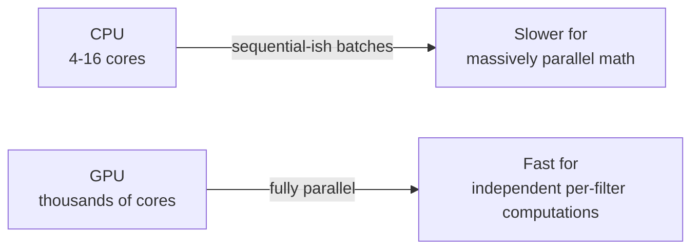
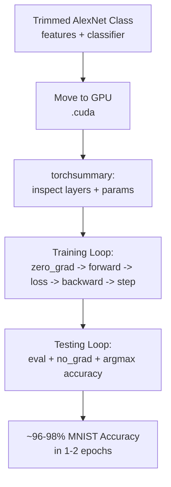

# Lecture 28: Hands-on DL Computer Vision Part 2

**Course**: AI for Industrial Cyber-Physical Systems (AI4ICPS) — IIT Kharagpur  
**Duration**: 0:43:47  
**Source**: ai4icps-upskilling.in  

---

## Overview

Direct continuation of Part 1's hands-on lab: this session finishes building the trimmed AlexNet class in PyTorch layer-by-layer (`nn.Module`, `features`, `classifier`, `forward()`), moves the model to GPU, inspects it with `torchsummary`, and then implements and runs the full **training and evaluation loop** — covering optimizers, loss functions, epochs, dropout, and GPU-accelerated batch processing — ending with a Q&A that clarifies tensor layout conventions and design choices.

---

## 1. Completing the AlexNet Model Class `[0:00 – 20:55]`

### 1.1 Sizing the Input Correctly `[0:08 – 5:42]`

Original AlexNet expects a **227×227** input; MNIST images are only **28×28**. Rather than distorting/padding MNIST images to fit the original spec, the lecturer builds a **trimmed AlexNet**, starting the convolutional stack from a layer already sized to accept the actual (small) input:

```python
# First retained conv layer: matches MNIST's 27x27-ish scale after preprocessing
nn.Conv2d(in_channels=1, out_channels=256, kernel_size=5, stride=1, padding=2)
nn.ReLU(inplace=True)
```

> **Jargon**: *`inplace=True`* — Tells PyTorch to overwrite the existing tensor in memory rather than allocate a new one for the activation's output. Saves memory; behavior is otherwise identical.

| Parameter | Value | Meaning |
|---|---|---|
| `in_channels` | 1 | Grayscale MNIST has a single channel |
| `out_channels` | 256 | Number of learnable filters/kernels in this layer |
| `kernel_size` | 5 | 5×5 square filter |
| `stride` | 1 | Move 1 pixel per step |
| `padding` | 2 | Preserves spatial size for a 5×5 kernel |

### 1.2 The `nn.Module` Class Structure `[3:37 – 6:34]`

```python
class AlexNet(nn.Module):
    def __init__(self, num_classes=10):
        super().__init__()
        self.features = nn.Sequential(
            nn.Conv2d(1, 256, kernel_size=5, stride=1, padding=2),
            nn.ReLU(inplace=True),
            nn.MaxPool2d(kernel_size=3, stride=2),
            # ... additional Conv2D+ReLU+MaxPool blocks ...
        )
        self.classifier = nn.Sequential(
            nn.Dropout(),
            nn.Linear(256 * 13 * 13, 2048),
            nn.ReLU(inplace=True),
            nn.Dropout(),
            nn.Linear(2048, 1024),
            nn.Linear(1024, num_classes),
        )

    def forward(self, x):
        x = self.features(x)
        x = x.view(x.size(0), -1)     # flatten to a single feature vector per sample
        x = self.classifier(x)
        return x
```

> *Reads as*: "`features` extracts spatial patterns via convolution+pooling; `forward()` then flattens the resulting 3D feature map into a flat vector (`.view(...)`) so it can be consumed by the fully-connected `classifier`, which reduces it step-by-step down to a 10-dimensional class score vector."

> **Jargon**: *`x.view(...)` (Flatten)* — Reshapes a multi-dimensional tensor (e.g., `256 × 13 × 13`) into a 1D vector (e.g., `43264` elements) without changing the underlying data — required because `nn.Linear` layers expect flat vectors, not spatial grids.

### 1.3 Why Dropout? `[16:43 – 18:29]`

```python
nn.Dropout()   # default p=0.5: randomly zero out 50% of activations during training
```

> **Jargon**: *Dropout* — A regularization technique that randomly disables (zeroes out) a fraction of neurons during each training step, forcing the network to not over-rely on any single neuron/feature. Prevents **overfitting**, especially important here since MNIST is being trained with a relatively small amount of data/short training in this lab.

> **Math Note**: The original AlexNet paper's exact use of dropout in every position is not critical to remember precisely — what matters is the *general principle*: add dropout when training a capacity-rich model on comparatively little data, to keep it generalizable rather than memorizing.

### 1.4 Layer-by-Layer Channel/Resolution Tracking `[11:37 – 20:55]`

| Layer | Output Channels | Spatial Resolution | Notes |
|---|---|---|---|
| Conv1 + ReLU | 256 | 27×27 | First retained conv layer |
| MaxPool1 | 256 | 13×13 | Halves resolution, no learnable params |
| Conv2 + ReLU | 384 | 13×13 | Channel count grows (more filters) |
| Conv3 + ReLU | 384 | 13×13 | Depth maintained |
| Conv4 + ReLU | 256 | 13×13 | Channel count reduced before flattening |
| Flatten | — | $256 \times 13 \times 13 = 43{,}264$ | Reshaped to 1D |
| Linear | 2048 | — | First dense layer |
| Linear | 1024 | — | |
| Linear (output) | 10 | — | One score per MNIST digit class |

> *Reads as*: "As you go deeper, the number of *filters* (channels) tends to grow — capturing richer, more abstract features — while the *spatial resolution* shrinks via pooling, since exact pixel position matters less once you have detected high-level features."

---

## 2. Moving to GPU & Inspecting the Model `[6:34 – 11:37]`

```python
if torch.cuda.is_available():
    model = model.cuda()

from torchsummary import summary
summary(model, input_size=(1, 28, 28))
```

> **Jargon**: *CUDA* — NVIDIA's parallel computing platform; `torch.cuda.is_available()` checks whether a compatible GPU is present. `.cuda()` moves a model/tensor's data onto GPU memory for accelerated computation.

### 2.1 CPU vs. GPU: Why It Matters for Deep Learning `[6:56 – 10:11]`



> **Jargon**: *GPU (Graphics Processing Unit)* — A processor with thousands of small cores optimized for performing the *same* operation across many data points simultaneously. Since computing each convolutional filter's output is independent of other filters, GPUs can compute them all **in parallel**, making them far faster than CPUs (which have only a handful of cores) for deep learning workloads.

`torchsummary.summary()` prints each layer's name, output shape, and **parameter count** — useful for sanity-checking model size and understanding where most trainable weights live (in this lab, adding just one more conv layer jumped the parameter count from ~6,000 to ~900,000 — illustrating how quickly depth increases model size).

---

## 3. Training the Model `[23:54 – 38:06]`

### 3.1 Hyperparameters `[23:54 – 26:21]`

| Hyperparameter | Value Used | Role |
|---|---|---|
| Epochs | 2 | Number of full passes over the training data |
| Optimizer | SGD (Stochastic Gradient Descent) | Algorithm that updates weights to reduce loss |
| Learning Rate | (tuned, dataset-dependent) | Step size for each weight update |

> **Jargon**: *Epoch* — One complete pass through the entire training dataset. More epochs generally improve fit but risk overfitting — always monitor the loss curve rather than blindly maximizing epoch count.

```python
optimizer = optim.SGD(model.parameters(), lr=learning_rate)
for epoch in range(num_epochs):
    train(model, optimizer, train_loader, epoch)
    test(model, test_loader)
```

### 3.2 Inside the `train()` Function `[28:05 – 33:08]`

```python
def train(model, optimizer, train_loader, epoch):
    model.train()                                  # sets model to training mode (enables dropout)
    for batch_id, (data, target) in enumerate(train_loader):
        if torch.cuda.is_available():
            data, target = data.cuda(), target.cuda()

        optimizer.zero_grad()                       # reset gradients to 0 before this step
        output = model(data)                         # forward pass -> 10-dim score vector
        loss = F.cross_entropy(output, target)        # compare prediction to true label
        loss.backward()                               # backpropagate: compute gradients
        optimizer.step()                              # update weights using those gradients

        if batch_id % log_interval == 0:
            print(f"Epoch {epoch}, Batch {batch_id}, Loss {loss.item()}")
```

> *Reads as*: "For every batch: clear old gradients, run the batch through the model to get predictions, measure how wrong those predictions are (cross-entropy loss), propagate that error backward through every layer to compute each weight's gradient, then nudge every weight slightly in the direction that reduces the loss."

> **Jargon**: *`optimizer.zero_grad()`* — PyTorch accumulates gradients by default; without resetting them to zero before each batch, gradients from previous batches would incorrectly add up.

> **Jargon**: *Cross-Entropy Loss* — The standard loss function for classification tasks; measures the difference between the model's predicted class-probability distribution and the true (one-hot) label. Lower value = better prediction.

$$\mathcal{L}_{\text{CE}} = -\sum_{c=1}^{10} y_c \log(\hat{y}_c)$$

> *Reads as*: "For the one true class $c$ (where $y_c = 1$), the loss is just $-\log(\hat{y}_c)$ — if the model assigns high probability to the correct class, $\hat{y}_c$ is close to 1 and $-\log(\hat{y}_c)$ is close to 0 (low loss); if it assigns low probability, the loss shoots up."

> **Jargon**: *`loss.backward()`* — Triggers PyTorch's **autograd** engine to compute the gradient of the loss with respect to every trainable parameter, using the chain rule (backpropagation), by walking backward through the computation graph built during the forward pass.

### 3.3 Inside the `test()` Function `[33:08 – 36:34]`

```python
def test(model, test_loader):
    model.eval()                        # sets model to evaluation mode (disables dropout)
    test_loss, correct = 0, 0
    with torch.no_grad():               # disable gradient tracking - saves memory & compute
        for data, target in test_loader:
            if torch.cuda.is_available():
                data, target = data.cuda(), target.cuda()
            output = model(data)
            test_loss += F.cross_entropy(output, target, reduction='sum').item()
            prediction = output.argmax(dim=1)                # class with highest score
            correct += prediction.eq(target.view_as(prediction)).sum().item()
    accuracy = 100.0 * correct / len(test_loader.dataset)
    print(f"Test loss: {test_loss}, Accuracy: {accuracy}%")
    return accuracy
```

> **Jargon**: *`model.eval()` vs. `model.train()`* — Switches layers like `Dropout` and `BatchNorm` between their training behavior (random dropping / batch-statistics updates) and inference behavior (fully active, using learned running statistics). Always call `.eval()` before testing/inference.

> **Jargon**: *`torch.no_grad()`* — A context manager that disables gradient computation. Since testing doesn't need to update weights, skipping gradient tracking saves memory and speeds up the forward pass.

> *Reads as*: "For each test batch, get the model's output scores, pick the class with the highest score (`argmax`) as the prediction, and check whether it matches the true label — tally up correct predictions across the whole test set for the final accuracy percentage."

### 3.4 Results `[36:34 – 40:12]`

Training this trimmed AlexNet on MNIST achieved **~96% accuracy after epoch 1** and **~98% accuracy after epoch 2** — the lecturer notes that **without dropout**, a model this well-suited to a relatively simple dataset like MNIST would likely **overfit** rapidly given enough epochs.

---

## 4. Q&A Highlights `[40:12 – end]`

| Question | Key Answer |
|---|---|
| What's the "third parameter after height, width" in some diagrams? | It's the **channel** count. Different frameworks/diagrams use either `(channels, height, width)` or `(height, width, channels)` ordering — this model follows the `(channels, height, width)` PyTorch convention. |
| Why start the model from the *4th* convolutional layer of original AlexNet? | Original AlexNet's early layers assume a 227×227 input; MNIST's 28×28 images are far smaller, so using those early layers would require awkward padding and add unnecessary size. Starting from a layer already scaled for MNIST keeps the model both **correctly sized** and **lighter weight**, while preserving AlexNet's core "stack convolutional depth for better features" design principle. |

---

## Quick Reference: Key Jargon Glossary

| Term | One-Line Definition |
|---|---|
| `inplace=True` | Overwrites tensor in-place to save memory during activation |
| Flatten (`.view()`) | Reshapes a multi-dimensional feature map into a 1D vector |
| Dropout | Randomly disables neurons during training to reduce overfitting |
| CUDA | NVIDIA's GPU parallel-computing platform used by PyTorch |
| Epoch | One full pass through the entire training dataset |
| `optimizer.zero_grad()` | Resets accumulated gradients before a new batch |
| Cross-Entropy Loss | Standard classification loss measuring prediction-vs-truth mismatch |
| `loss.backward()` | Triggers backpropagation to compute all parameter gradients |
| `model.eval()` / `model.train()` | Switches Dropout/BatchNorm between inference and training behavior |
| `torch.no_grad()` | Disables gradient tracking to save memory during inference |

---

## Summary



**Key Takeaway**: Implementing a CNN training pipeline in PyTorch boils down to a small, repeatable pattern — build a `features` + `classifier` module, move data/model to GPU, and loop `zero_grad → forward → loss.backward() → optimizer.step()` per batch, with `model.train()`/`model.eval()` and `torch.no_grad()` correctly toggled between training and testing — and even a heavily trimmed AlexNet reaches ~98% accuracy on MNIST within just two epochs.

---

*Notes generated from SRT transcript with timestamps. whisper.cpp (small model, Metal GPU). Enhanced with AI expert annotations.*
