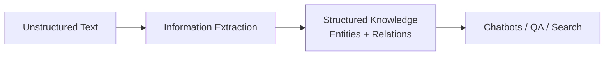
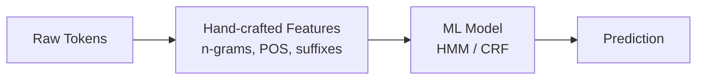
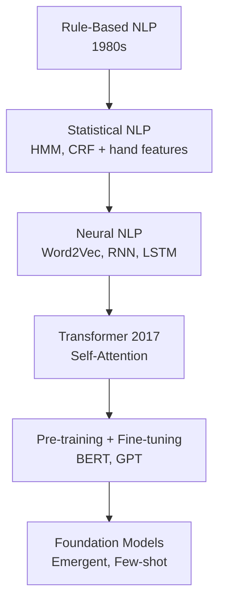
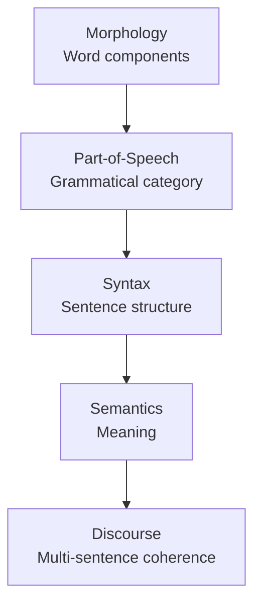
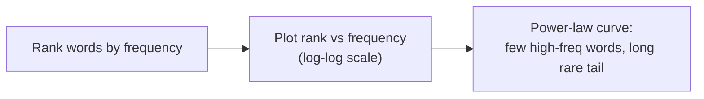
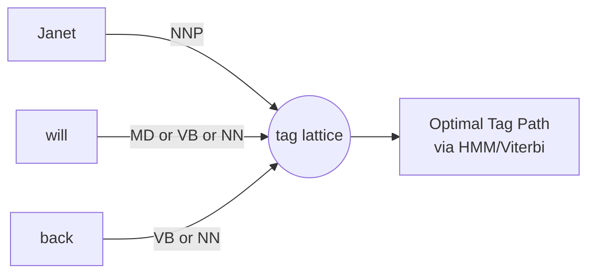
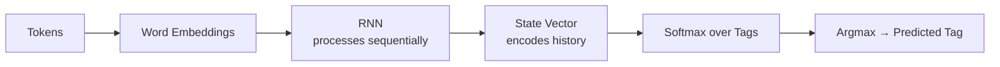
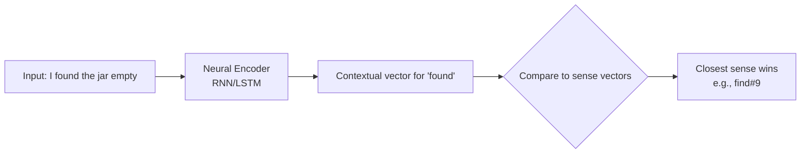
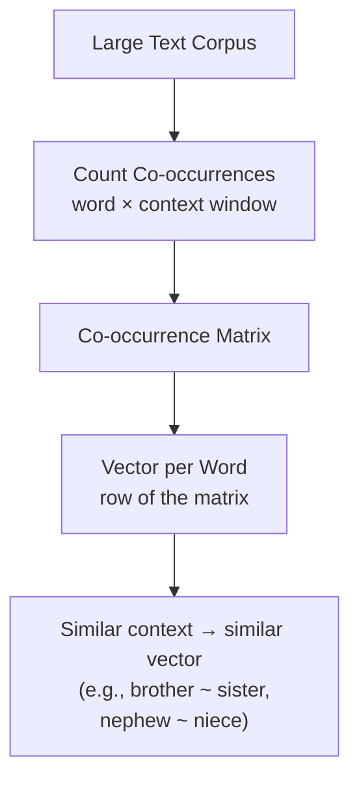
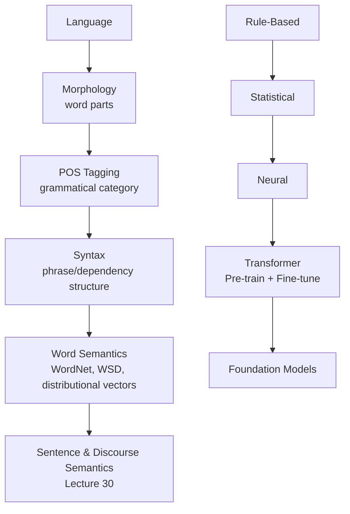

# Lecture 29: Introduction to NLP Part1

**Course**: AI for Industrial Cyber-Physical Systems (AI4ICPS) — IIT Kharagpur  
**Duration**: 1:06:15  
**Source**: ai4icps-upskilling.in  

---

## Overview

Dr. Plaban Kumar Bhowmick (Dept. of AI, IIT Kharagpur) opens the NLP module with a tour of why language is hard for machines, the three historical "waves" of NLP (rule-based → statistical → neural), and the linguistic levels (morphology → syntax → semantics → discourse) that any NLP pipeline must eventually address. The lecture closes with word-level semantics — knowledge-based similarity (WordNet), word-sense disambiguation, and distributional/vector representations — setting up the transition into word embeddings.

---

## 1. Motivating Applications `[5:13 – 15:00]`

Real-world systems that make NLP tangible:

| Application | What It Does |
|---|---|
| Chatbots (Siri, Google Assistant) | Dialogic Q&A that feels increasingly human |
| Machine Translation | Cross-lingual communication (e.g., Bengali ↔ English) |
| Grammar/Autocomplete (Gmail) | Detects missing attachments, grammar errors |
| Sentiment/Opinion Mining | Tracks public opinion over time (e.g., product reviews) |
| Information Extraction | Unstructured text → structured data (Wikipedia infobox, knowledge graph) |
| Summarization | Long article/review → short digest |
| Question Answering | Precise answers instead of full documents (e.g., ChatGPT) |

> **Jargon**: *Information Extraction* — Automatically converting free-flowing prose into structured records (entities + relations), e.g., turning a Wikipedia paragraph about Einstein into a birthdate/nationality/field table. This structured form is far easier for downstream programs (like a chatbot) to query.



---

## 2. Three Waves of NLP `[14:51 – 20:42]`

### 2.1 Rule-Based NLP `[14:51 – 16:11]`

Hand-written linguistic rules encode grammar directly.

> *Example*: For POS tagging, a rule might say "a verb is usually followed by a noun." For machine translation, a word-for-word dictionary lookup ("direct translation") or a rule that maps the source grammatical structure to a target grammatical structure.

**Limitation**: Rules are written per-task **and** per-language → not transferable, not scalable. Popular in the 1980s.

### 2.2 Statistical NLP `[16:11 – 18:03]`

Machine learning models (probabilistic language models, Hidden Markov Models, Conditional Random Fields) replace hand rules, but still require **manually engineered features**.



> **Jargon**: *Hidden Markov Model (HMM)* — A probabilistic model where the true "state" (e.g., a POS tag) is hidden and only its noisy manifestation (the word) is observed. Widely used for sequence-labeling tasks before neural nets took over.

> **Jargon**: *Conditional Random Field (CRF)* — A discriminative graphical model that predicts a whole label sequence jointly (instead of one label at a time), capturing dependencies between neighboring labels.

**Limitation**: No more hand-written rules, but feature extraction is still **language- and task-specific**.

### 2.3 Neural NLP `[18:03 – 19:31]`

Neural networks (Word2Vec, GRU, RNN, LSTM) **automatically learn features** from raw tokens — no manual feature engineering.

**Limitation**: Still largely **task-specific** — a new architecture/training run is needed per task (sentiment analysis ≠ grammaticality checking).

### 2.4 The Transformer Moment `[19:16 – 20:42]`

2017: the **Transformer** architecture, built on **self-attention** (every word attends to every other word in the sentence), becomes the universal backbone for essentially all subsequent large models.



> **Jargon**: *Self-Attention* — A mechanism where each token computes a weighted combination of all other tokens in the sequence, with weights learned based on relevance. This lets the model directly model long-range dependencies (unlike RNNs, which process token-by-token).

---

## 3. Pre-training → Fine-tuning → Foundation Models `[20:03 – 24:24]`

### 3.1 Supervised Transformers (early approach) `[20:03 – 20:50]`

Even Transformers were initially trained **per-task**, needing a fresh labeled dataset and training run for every new task.

### 3.2 Pre-training `[20:50 – 22:15]`

Train on **huge unlabeled text** with a **self-supervised** objective: predict the next token given previous tokens (or similar). No manual annotation needed → scales to internet-size corpora.

> *Reads as*: "Don't tell the model whether a sentence is grammatical or positive/negative — just make it really good at guessing the next word. That skill turns out to generalize to almost everything."

### 3.3 Fine-tuning `[22:15 – 22:39]`

Take the generic pre-trained model, adapt it to a specific downstream task using a **small** labeled dataset.

**Philosophy**: *pre-train once, fine-tune multiple times.* Landmark architectures: **BERT**, **GPT**.

### 3.4 Foundation Models & Emergent Behavior `[23:03 – 24:13]`

At sufficient scale, models solve tasks they were **never explicitly trained for** — this is called **emergent behavior**. This unlocks:

- **In-context learning**: model infers the task from a few examples in the prompt.
- **Prompt engineering**: crafting the prompt to encode user intent.

> **Jargon**: *Emergent Behavior* — Capabilities that appear only above a certain model/data scale and were not directly optimized for — e.g., a model trained only to predict next tokens spontaneously becoming able to do arithmetic or translation.

| Paradigm | Feature Engineering | Task Coupling | Data Needs |
|---|---|---|---|
| Rule-Based | Manual rules | Per task + language | None (rules) |
| Statistical | Manual features | Per task + language | Labeled corpus |
| Neural (pre-Transformer) | Learned | Per task | Labeled corpus |
| Pre-trained + Fine-tuned | Learned | Pre-train once, fine-tune per task | Huge unlabeled + small labeled |
| Foundation Models | Learned | Zero/few-shot, no task coupling | Massive unlabeled |

---

## 4. Linguistic Levels & Corresponding Technologies `[18:16 – 32:18]`

Understanding language is built up in layers — each layer's output feeds the next.



| Linguistic Level | Question Asked | Technology |
|---|---|---|
| Morphology | What are a word's meaningful sub-parts? | Morphological Analyzer |
| Part-of-Speech (POS) | What grammatical category does a word belong to? | POS Tagger |
| Syntax | How do words combine into a valid sentence? | Parsing |
| Semantics | What does a word/sentence *mean*? | WSD, Semantic Role Labeling |
| Discourse | How do sentences cohere into a larger text? | Discourse Segmentation, Coreference Resolution |

**NLP as a whole** = **Core technologies** (language modeling, POS tagging, NER, parsing) + **Applications** (translation, dialogue, summarization, QA) built on top of them.

---

## 5. Challenges in NLP `[32:13 – 44:07]`

### 5.1 Ambiguity `[32:18 – 34:37]`

The same string can have multiple valid interpretations.

> *Example*: "I made her duck" could mean: (a) I cooked waterfowl for her, (b) I cooked waterfowl she owns, (c) I created a toy duck for her, or (d) I caused her to quickly lower her head. **Context** resolves it — in a cricket commentary, "duck" (a batsman's zero score) is the likely reading.

**Attachment ambiguity** — a modifier can attach to different parts of a sentence:

> *Example*: "The spy saw the policeman with binoculars" — *binoculars* could belong to the spy or the policeman (genuinely ambiguous). Contrast: "The bird watcher saw the bird with binoculars" — only one reading makes sense (birds don't own binoculars), so ambiguity is resolved by **world knowledge**.

> **Jargon**: *Ambiguity* — Multiple plausible interpretations for the same linguistic input; resolving it typically requires context, world knowledge, or statistical likelihood.

### 5.2 Sparsity (Zipf's Law) `[35:20 – 36:44]`

A small number of words are extremely frequent; the vast majority are rare.



> **Jargon**: *Zipf's Law / Sparsity* — Word frequency is inversely proportional to rank: the most common word occurs roughly twice as often as the second most common, etc. Consequence: most words in any corpus are rare, so models struggle to learn good representations for them (the "long tail" problem).

### 5.3 Expressional Variation `[37:17 – 38:09]`

The same meaning, many surface forms:

> *Example*: "She gave the book to Tom" ≈ "She gave Tom the book." "Some kids pop by" ≈ "Few children visit." "Is that window still open?" can pragmatically mean "please close the door."

### 5.4 Compositionality `[38:09 – 39:15]`

| Combination | Compositional? | Meaning |
|---|---|---|
| tooth + brush → toothbrush | Yes | A brush *for* teeth — meaning derives from parts |
| butter + fly → butterfly | No | Nothing to do with butter — meaning is idiosyncratic |

> **Jargon**: *Compositionality* — The principle that the meaning of a whole should be derivable from the meaning of its parts. Idioms and certain compounds violate this, making them hard for models to generalize to.

---

## 6. Probabilistic Language Models `[39:15 – 43:56]`

### 6.1 Next-Token Prediction `[39:15 – 40:23]`

Given a prefix, assign probabilities to candidate next tokens.

> *Example*: Given "I would like to have a ___", intuitively P(cup) > P(haircut) > P(word) — the model should learn this ranking from data.

### 6.2 Joint Probability via Chain Rule `[40:37 – 41:13]`

$$P(w_1, w_2, \ldots, w_n) = \prod_{i=1}^{n} P(w_i \mid w_1, \ldots, w_{i-1})$$

```python
# Pseudocode: chain rule decomposition
# P("the dog barks") = P("the") * P("dog" | "the") * P("barks" | "the dog")
```

> *Reads as*: "The probability of an entire sentence is the product of each word's probability given everything that came before it."

### 6.3 The Data-Sparsity Problem `[41:18 – 42:28]`

Estimating $P(w_i \mid w_1 \ldots w_{i-1})$ by raw counting requires the **exact prefix** to have occurred many times in the corpus — but long sequences are rare (often count = 1 or 0).

```python
# Maximum Likelihood Estimate (MLE) via counting
P_word_given_prefix = count(prefix + word) / count(prefix)
```

### 6.4 Markov Approximation → n-gram Models `[42:36 – 43:56]`

**Fix**: Assume a word depends only on the last **k** words (not the whole history).

$$P(w_i \mid w_1, \ldots, w_{i-1}) \approx P(w_i \mid w_{i-k}, \ldots, w_{i-1})$$

| k (context size) | Model Name |
|---|---|
| 1 | Bigram |
| 2 | Trigram |
| n-1 | n-gram |

```python
# Bigram model: only look one word back
P_word_given_prev = count(w_prev, w_curr) / count(w_prev)
```

> **Jargon**: *Markov Assumption* — The (usually false but useful) simplification that the future depends only on a fixed, small window of the past, not the entire history. Trades accuracy for tractable estimation.

> **Jargon**: *n-gram* — A contiguous sequence of *n* tokens used as the unit of context in a probabilistic language model. Larger *n* captures more context but suffers more from data sparsity.

---

## 7. From Counting to Vectors: Distributed Word Representations `[43:56 – 46:30]`

### 7.1 The Co-occurrence Insight `[44:07 – 45:16]`

Words that tend to **co-occur** in similar contexts should have **similar vector representations** — and similarity translates naturally into a **dot product**.

> *Example*: "banking" and "crisis" often appear together → their vectors should point in similar directions → high dot product.

$$P(\text{word occurs in context} \mid \text{context word}) \propto \mathbf{v}_{word} \cdot \mathbf{v}_{context}$$

### 7.2 Emergent Vector Geometry `[45:40 – 46:16]`

Trained word vectors exhibit striking **linear relationships**:

> *Example*: vector("driver") − vector("drive") ≈ vector("swimmer") − vector("swim") — i.e., the "agent-of-verb" relationship is encoded as a consistent direction in vector space, regardless of the specific verb.

> **Jargon**: *Word Embedding* — A dense, low-dimensional (e.g., 100–300 dim) real-valued vector representing a word, learned so that semantically/contextually similar words end up nearby in the vector space. Forms the input layer of virtually all modern neural NLP models.

---

## 8. Morphology & POS Tagging `[46:30 – 52:08]`

### 8.1 Morphological Analysis `[46:30 – 46:58]`

Words decompose into **morphemes** — minimal meaningful units.

> *Example*: "misunderstandings" = *mis* (prefix) + *understand* (root) + *ing* + *s* (plural suffix).

> **Jargon**: *Morpheme* — The smallest unit of language that carries meaning; can be a root, prefix, or suffix. Morphological analysis reduces surface word forms to root + grammatical markers.

### 8.2 POS Tagging `[46:58 – 48:55]`

Assign each token a grammatical category (noun, verb, adjective, determiner, ...), typically using a **standardized tag set** (e.g., **Penn Treebank tag set**).

> *Example*: "The grand jury commented ..." → The/DT grand/JJ jury/NN commented/VBD ...

**Classical approach**: HMM-based tagging — model the likely tag sequence as a path through a **lattice** of possible tag assignments per word, then find the optimal path.



### 8.3 Neural POS Tagging `[48:55 – 50:04]`



> *Reads as*: "Convert each word to a vector, feed the sequence through an RNN that builds up a running 'memory' of what it's seen so far, then at each step predict the most likely tag via softmax."

---

## 9. Named Entity Recognition (NER) `[50:04 – 52:08]`

Identify spans of text that refer to entities: **person, organization, location**, etc.

> *Example*: "**Michael Dell** [PERSON] is the CEO of **Dell Computer Corporation** [ORG] and lives in **Austin, Texas** [LOCATION]."

**Domain-specific entities**: In a car-ad classified listing, tags differ entirely — *make*, *model*, *year*, *mileage*, *price* — showing that entity types are **application-specific**.

### BIO Tagging Scheme

| Tag | Meaning |
|---|---|
| B | **B**eginning of a named entity |
| I | **I**nside (continuation of) a named entity |
| O | **O**utside any named entity |

> *Example*: "Michael/B Dell/I is/O the/O CEO/O of/O Dell/B Computer/I Corporation/I ..."

> **Jargon**: *BIO Tagging* — A token-labeling scheme for span extraction tasks (like NER) that marks the Beginning, Inside, and Outside of each entity span, turning span detection into a per-token classification problem.

---

## 10. Syntactic Analysis `[52:18 – 54:23]`

### 10.1 Phrase-Structure Grammar `[52:30 – 53:26]`

Sentences decompose recursively into phrases:

```
Sentence → NounPhrase + VerbPhrase
NounPhrase → Determiner + Noun
VerbPhrase → Verb + Adverb + PrepositionalPhrase
```

This yields a **tree-like** structure.

### 10.2 Dependency Grammar `[53:26 – 54:02]`

Instead of nested phrases, model direct **head → dependent** relations (subject, object, modifier) as a **directed graph**.

| Aspect | Phrase-Structure Grammar | Dependency Grammar |
|---|---|---|
| Structure | Tree (nested constituents) | Graph (head-dependent edges) |
| Output | Constituency parse | Dependency parse |
| Relations Encoded | Phrase membership | subject, object, modifier, etc. |

> **Jargon**: *Dependency Parsing* — Syntactic analysis that connects each word to its grammatical "head" via a labeled, directed edge (e.g., *nsubj*, *dobj*), producing a graph rather than a nested tree.

---

## 11. Word-Level Semantics `[54:17 – 1:06:02]`

### 11.1 Two Levels of Semantic Analysis `[54:23 – 54:32]`

- **Word-level**: what does *this word* mean?
- **Sentence-level**: how do word meanings combine? (**Semantic Role Labeling** — covered in Lecture 30)

### 11.2 Knowledge-Based Approach: WordNet `[54:32 – 59:15]`

Encode word knowledge as a **taxonomy/graph** of concepts linked by relations like *is-a* (hyponymy) and *part-of* (meronymy).

> *Example*: wheeled vehicle → self-propelled vehicle → motor vehicle (an "is-a" chain).

**Word Sense**: The same word (e.g., *mouse*) maps to multiple senses (rodent, bruise, computer device) — WordNet groups words into **synsets** by sense.

**Semantic similarity via graph distance**: Two senses connected by a short path in the WordNet hierarchy are considered semantically close.

> *Example*: nickel → coin → dime is a short path (very similar), while nickel → ... → money is longer (less similar).

> **Jargon**: *WordNet* — A large lexical database that groups English words into sets of synonyms (*synsets*), each representing a distinct sense, and links synsets via semantic relations (is-a, part-of). A foundational resource for knowledge-based word-sense work.

> **Jargon**: *Synset* — A "synonym set": a group of words/phrases that WordNet considers interchangeable in a specific meaning (sense).

### 11.3 Word Sense Disambiguation (WSD) `[59:42 – 1:03:26]`

**Task**: Given a word in context, pick its correct sense from a fixed inventory.

> *Example*: "serve" has multiple senses — S1 (serve in office), S2 (provide food), S3 (sports serve), S4 (serve a purpose). "They rarely **serve** red meat" → disambiguates to S2 (provide).

**Neural approach**: Encode the sentence (RNN/LSTM), take the contextual vector for the target word, and compare it against each candidate sense's vector — pick the **closest** sense by similarity.



> **Jargon**: *Word Sense Disambiguation (WSD)* — Determining which meaning of a polysemous word is intended in a given context, essential for downstream tasks like translation and QA where a wrong sense leads to wrong output.

### 11.4 Distributional Hypothesis `[1:03:10 – 1:06:02]`

> "You shall know a word by the company it keeps." — J.R. Firth, 1957

Two words are semantically related if they **co-occur** with many of the same neighboring words.

> *Example*: *doctor* and *surgeon* co-occur with similar words (hospital, patient, operate) → close in vector space. *doctor* and *scalpel* also co-occur frequently (doctors use scalpels for surgery). *apricot* and *pineapple* share context words (fruit-related) → close vectors; *apricot* and *digital* share almost no context → distant vectors.



> **Math Note**: This co-occurrence-matrix idea is the direct ancestor of **Word2Vec** and **GloVe** — instead of storing the full sparse co-occurrence matrix, these methods learn a dense, low-dimensional embedding that implicitly captures the same co-occurrence statistics. (Continued in Lecture 30 / subsequent lectures.)

---

## Quick Reference: Key Jargon Glossary

| Term | One-Line Definition |
|---|---|
| Information Extraction | Converting unstructured text into structured entities/relations |
| Hidden Markov Model (HMM) | Sequence model where true states are hidden and inferred from observations |
| Conditional Random Field (CRF) | Discriminative model predicting a full label sequence jointly |
| Self-Attention | Mechanism letting each token weigh relevance of every other token |
| Emergent Behavior | Capabilities appearing only at large model/data scale, not directly trained for |
| Ambiguity | Multiple valid interpretations of the same linguistic input |
| Zipf's Law / Sparsity | Word frequency inversely proportional to rank; most words are rare |
| Compositionality | Meaning of a whole derivable from meaning of its parts |
| Markov Assumption | Simplification that the future depends only on a fixed recent window |
| n-gram | Contiguous sequence of n tokens used as a context unit |
| Word Embedding | Dense vector representation capturing word meaning/context |
| Morpheme | Smallest meaningful sub-word unit (root, prefix, suffix) |
| BIO Tagging | Per-token labeling scheme (Begin/Inside/Outside) for span extraction |
| Dependency Parsing | Graph-based syntax analysis linking heads to dependents |
| WordNet | Lexical database of synsets linked by semantic relations |
| Synset | Group of words sharing one specific sense/meaning |
| Word Sense Disambiguation (WSD) | Picking the correct meaning of a word given its context |
| Distributional Hypothesis | Words with similar contexts have similar meanings |

---

## Summary



**Key Takeaway**: NLP's history is a steady march toward *removing hand-engineering* — rules gave way to statistical features, features gave way to learned neural representations, and task-specific training gave way to pre-trained foundation models — while the underlying linguistic pipeline (morphology → syntax → semantics → discourse) still explains *what* any NLP system, classical or neural, ultimately has to solve.

---

*Notes generated from SRT transcript with timestamps. whisper.cpp (small model, Metal GPU). Enhanced with AI expert annotations.*
