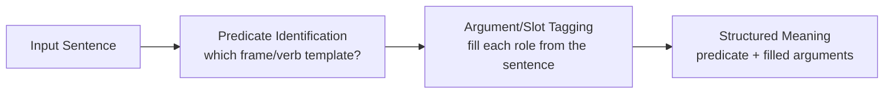
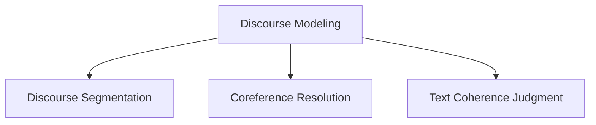
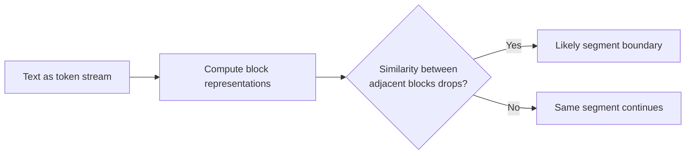
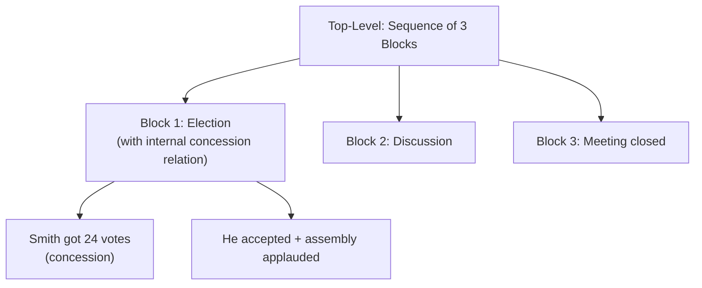
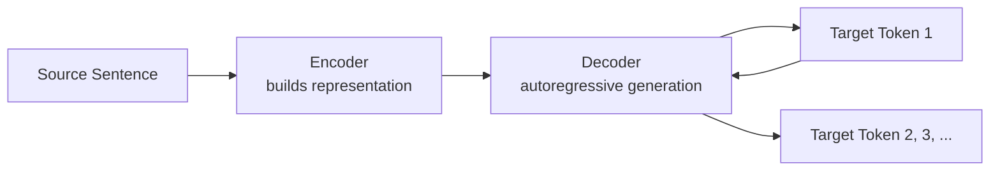
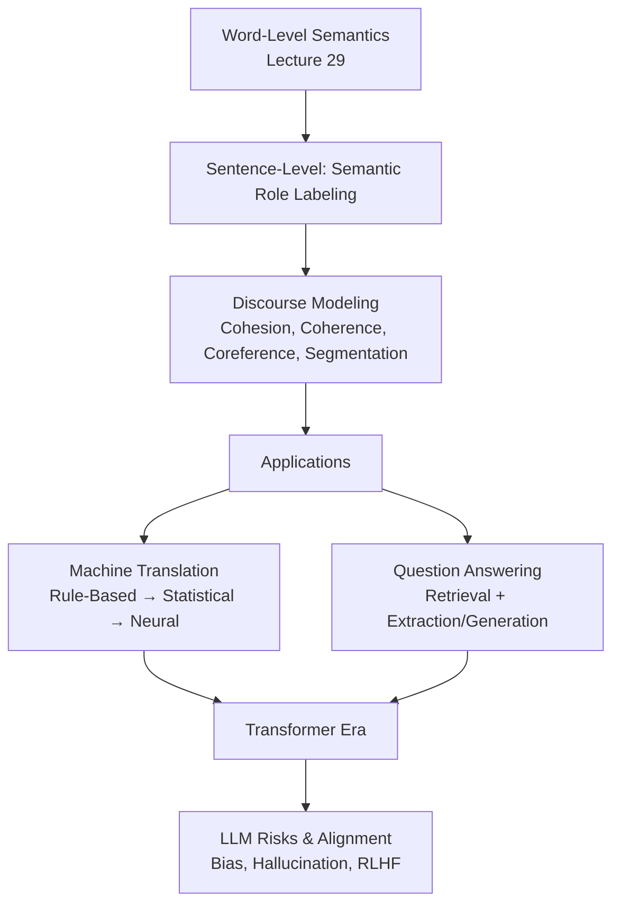

# Lecture 30: Introduction to NLP Part2

**Course**: AI for Industrial Cyber-Physical Systems (AI4ICPS) — IIT Kharagpur  
**Duration**: 44:28  
**Source**: ai4icps-upskilling.in  

---

## Overview

Continuing directly from Part 1, Dr. Bhowmick moves from word-level to sentence-level semantics (**semantic role labeling**), then to **discourse modeling** (cohesion, coherence, coreference, segmentation), and finally surveys **machine translation** paradigms and **question answering**, closing with a reflection on LLM risks (bias, hallucination, environmental cost) and a live Q&A.

---

## 1. Semantic Role Labeling (SRL) `[0:00 – 11:01]`

### 1.1 From Grammar to Meaning `[0:00 – 3:17]`

Grammatical **subject** is not always the semantic **agent** (the entity actually performing the action).

> *Example 1*: "Jyoti drove Jai from Kharagpur to Kolkata in her Kia Seltos."
> - Jyoti = **Agent** (performer of the action)
> - Jai = **Patient** (recipient/affected entity)
> - Kharagpur = **Source**, Kolkata = **Destination**
> - Kia Seltos = **Instrument**

> *Example 2*: "The stone clogged the rain pipe."
> - "Stone" is the grammatical *subject*, but semantically it's the **Instrument**, not the Agent (a stone can't intentionally act).
> - "Rain pipe" = **Patient**.

**Key takeaway**: grammatical category (subject/object) ≠ semantic role (agent/patient/instrument). These are called **semantic roles** because they assign *meaning* to how each phrase relates to the main verb.

> **Jargon**: *Semantic Role* — The functional relationship a phrase has with the main verb of a sentence (agent, patient, instrument, source, destination, etc.), independent of its grammatical role (subject/object).

### 1.2 Predicate-Argument Structure `[3:17 – 5:07]`

Each verb has a set of **relevant** roles — not every verb takes every role.

> *Example*: For the verb *sell* — relevant roles are *seller*, *thing sold*, *buyer*, *price paid*, *beneficiary*. For the verb *cut* — "seller" and "thing sold" make no sense as roles.

Resources like **PropBank**, **VerbNet**, and **FrameNet** catalog these verb-specific role sets.

| Resource | Approach |
|---|---|
| PropBank | Generic numbered arguments: Arg0, Arg1, Arg2, ... |
| VerbNet | Verb classes grouped by shared syntactic/semantic behavior |
| FrameNet | Semantic **frames** — named templates with role "slots" |

> **Jargon**: *Predicate-Argument Structure* — A representation of a sentence as a predicate (usually the verb) plus its arguments (semantic roles), e.g., *sell(seller=Al Brownstein, thing\_sold=it, price=$60/bottle)*.

### 1.3 PropBank-Style Tagging `[5:07 – 7:57]`

> *Example*: "**Al Brownstein** [Arg0/seller] sold **it** [Arg1/thing sold] for **$60 a bottle** [price paid]."

Not every sentence fills every possible argument slot — only the ones present in the sentence get tagged.

**Task pipeline**:
1. Identify which predicate template applies (e.g., *sell*, not *cut*).
2. Tag each phrase in the sentence with its argument role.

### 1.4 FrameNet-Style Tagging `[7:57 – 10:03]`

Frames give role names richer semantic labels than generic Arg0/Arg1.

> *Example*: "Creeping in the shadow, I reached a point when I could look straight to the uncurtained window."
> - *creeping* → frame **Self-motion**, Mover = "I"
> - *reached* → frame **Path-shape**, Goal = "a point when I could look..."
> - *look* → frame **Perception**, Agent = "I", Direction = "straight to the uncurtained window"

> **Jargon**: *Frame (FrameNet)* — A semantic template describing a type of event/situation (e.g., "Commerce\_sell") with named slots (seller, buyer, goods) that get filled by phrases in a sentence. Named "frame" because it frames a coherent conceptual scenario.



---

## 2. Discourse Modeling `[11:01 – 32:59]`

### 2.1 What is Discourse? `[11:11 – 12:48]`

Language is not confined to isolated sentences — it forms a **coherent, structured group of sentences**.

| Discourse Type | Description |
|---|---|
| Monologic | One-way: a single speaker/writer, a passive hearer/reader |
| Dialogic | Two-way: speaker/hearer roles alternate (conversations, chatbots) |

### 2.2 Cohesion vs. Coherence `[13:02 – 15:55]`

This is the most important conceptual distinction in the lecture.

| Property | Cohesion | Coherence |
|---|---|---|
| Type | **Grammatical** property | **Extra-grammatical** (pragmatic) property |
| Defined by | Explicit linguistic devices linking sentences | Whether a reader can understand the writer's intent |
| Example | "I lost my keys. **It** has been kept in my office." (pronoun *it* refers back) | "John hid Bill's car keys. **He was drunk.**" (2nd sentence implies *why* — no explicit link, but it's understandable as a cause) |

**Cohesion devices**:
- **Reference**: pronouns/demonstratives pointing back ("it", "this", "those").
- **Ellipsis**: omitting repeated material — "10 students passed and another 10 failed" (elided "students").
- **Substitution**: "This bulb is broken. Give me a new **one**." (*one* substitutes for *bulb*).

> **Jargon**: *Cohesion* — Grammatical "glue" (pronouns, ellipsis, substitution) that explicitly links sentences together at the surface level.

> **Jargon**: *Coherence* — The reader's ability to construct a sensible, unified interpretation across sentences, even without explicit grammatical links — relies on world knowledge and inference.

> *Example (non-coherent but grammatical)*: "John hid Bill's car keys. He likes spinach." — Perfectly grammatical, zero coherence: no inferable connection between the sentences.

### 2.3 Three Discourse Tasks `[15:55 – 32:59]`



#### 2.3.1 Discourse Segmentation `[15:55 – 18:22]` / `[18:22 – 23:20]`

Split a long text into high-level structural blocks.

> *Example*: A research paper segments into Abstract → Introduction → Related Work → Methodology → ...

**Modeling idea**: A topic shift correlates with a **vocabulary shift**. Represent each block (e.g., paragraph) as a vector; a **dip in similarity** between consecutive block representations signals a likely segment boundary.



#### 2.3.2 Coreference Resolution `[16:20 – 23:20]`

Find all phrases (**referring expressions**) that point to the **same real-world entity** (the **referent**).

> *Example*: "**Victoria Chain**, ..., **her**, ..., **the 37-year-old**, ..., **she**..." — all four expressions are **anaphoric**, referring back to the same person, Victoria Chain.

> **Jargon**: *Anaphora / Anaphoric Expression* — A word or phrase (pronoun, definite noun phrase, etc.) whose interpretation depends on an earlier expression (the antecedent) in the discourse.

**Hierarchical discourse structure** — a worked example:

> *Text*: "Yesterday the delegates chose their new representative. Even though Smith received only 24 votes, he accepted the election with a short speech. Then the assembly applauded for three minutes. Due to the upcoming caucus meeting, the subsequent discussion was very short. Nonetheless, the most pressing questions could be resolved. The meeting was closed at 7pm."

This isn't a flat sequence — it nests:
- Top level: **3 blocks** in sequence (delegate election details → discussion → closing).
- Within block 1: a **concession** relation ("even though only 24 votes" *concedes against* "he accepted... applauded").



> **Jargon**: *Discourse Structure* — The (often hierarchical, not merely sequential) organization of relations — sequence, elaboration, concession, cause — that connects sentences/clauses into a coherent whole.

#### 2.3.3 Judging Text Coherence `[17:07 – 17:18]`

Given a pair (or set) of sentences, decide how well they "bind" together.

> *Example*: "John hid Bill's car keys. He was drunk." → **coherent** (implicit causal link). "John hid Bill's car keys. He likes spinach." → **not coherent**, despite both being grammatically valid.

---

## 3. Machine Translation `[23:33 – 32:23]`

### 3.1 Why MT is Hard `[23:39 – 25:24]`

| Challenge | Example |
|---|---|
| Lexical ambiguity | "bank" → *nadi ka kinara* (riverbank) or financial bank, depending on context |
| Phrasal verb ambiguity | "brought up" → *paalan-poshan karna* (raise a child) vs. *upar lana* (bring upstairs) vs. *mudda uthaana* (raise an issue) |
| Structural ambiguity | "Flying planes can be dangerous" → two valid Hindi translations depending on parse (planes that fly vs. the act of flying planes) |

### 3.2 Rule-Based MT `[25:24 – 27:01]`

Translate the **grammatical structure** of the source into the structure of the target using **transfer rules**.

> *Example*: English "There was a lion in the jungle" → abstract form "A lion was in the jungle" → apply a transfer rule that moves the prepositional phrase "in the jungle" to the front (as Hindi syntax requires) → "*Jungle mein ek sher tha*."

**Limitation**: Transfer rules are **language-pair specific** — a new rule set is needed for every language pair, so this doesn't scale.

### 3.3 Statistical MT: Noisy Channel Model `[27:01 – 30:03]`

**Metaphor**: An English sentence *E* was "spoken," then passed through a **noisy channel** that corrupts it into the observed French sentence *F*. Translation = **decode** the most likely *E* given the observed *F*.

$$\hat{E} = \arg\max_E P(E) \cdot P(F \mid E)$$

```python
# Pseudocode: noisy-channel decoding
best_E = argmax(
    language_model_prob(E) * translation_model_prob(F, given=E)
    for E in candidate_english_sentences
)
```

> *Reads as*: "Pick the English sentence that is both (a) a plausible English sentence on its own (language model) AND (b) likely to have produced the observed French sentence when 'corrupted' (translation/channel model)."

Trained using a **parallel corpus**: large collections of sentence pairs (same meaning, two languages).

> **Jargon**: *Parallel Corpus* — A dataset of sentence-aligned translations across two (or more) languages, used to train statistical or neural MT systems.

> **Jargon**: *Noisy Channel Model* — A probabilistic framework borrowed from information theory: model translation as "recovering" a clean signal (source sentence) after it passed through a noisy channel (translation process) into the observed target sentence.

### 3.4 Neural Machine Translation `[30:03 – 31:56]`

**Encoder-decoder** architecture:



The decoder starts with a special **start symbol**, and at each step conditions on (a) the encoder's representation and (b) the **previously generated token** to produce the next target token — a sequential, autoregressive process. (Full Transformer/attention details deferred to later lectures.)

| MT Paradigm | Mechanism | Scalability |
|---|---|---|
| Rule-Based | Hand-written transfer rules | Poor — per language pair |
| Statistical | Noisy channel + parallel corpus | Moderate — needs aligned data |
| Neural | Encoder-decoder, learned end-to-end | Good — data-hungry but general |

---

## 4. Question Answering `[32:00 – 32:59]`

**Pipeline**: query → **retriever** fetches relevant documents → **answer extraction/generation**.

Two approaches:
1. **Direct LLM prompting**: feed retrieved docs + query + prompt directly to an LLM, which generates the answer.
2. **Extractive QA (BERT-style)**: feed query + retrieved docs to a BERT-like model, which selects a document and marks the **span of tokens** that answers the question.

> **Jargon**: *Retriever* — A component (often based on keyword search or vector similarity) that narrows a large document collection down to the few most relevant candidates before deeper (and more expensive) processing.

---

## 5. The Transformer Era & LLM Concerns `[32:59 – 36:24]`

### 5.1 Recap of the Transformer's Reach `[32:59 – 34:00]`

Transformer (2017) underlies **BERT**, **T5**, and decoder-only models like **GPT** — effectively all current foundation models.

### 5.2 Affordances of LLMs `[34:00 – 34:41]`

- Use released pretrained models + **fine-tune** with small task-specific data.
- **Few-shot learning**: provide a handful of examples in the prompt; the model infers the task without any weight updates.

### 5.3 Risks `[34:49 – 35:44]`

| Risk | Description |
|---|---|
| Bias & Toxicity | Models can reproduce/amplify harmful stereotypes from training data |
| Incorrect Information | Hallucination — confidently wrong answers |
| Privacy | Training data may leak sensitive information |
| Environmental Cost | Training/serving huge models consumes massive energy |

**Mitigations**: smaller, efficient models where possible; **model alignment** (e.g., RLHF) to reduce bias/toxicity/hallucination.

> **Jargon**: *Model Alignment* — Techniques (e.g., Reinforcement Learning with Human Feedback, RLHF) that steer a model's outputs toward human preferences/values, reducing harmful or undesired behavior.

### 5.4 Historical Perspective: ELIZA `[36:24 – 36:56]`

**ELIZA** (MIT, 1960s) simulated a psychotherapist via simple **pattern matching**, yet users perceived deep understanding. The lecturer draws a direct parallel to today's LLMs: impressive surface behavior can be mistaken for genuine understanding — **AGI is still far off**, and current capabilities should be assessed "with a pinch of salt."

> **Jargon**: *ELIZA* — An early (1966) natural-language program that used simple keyword/pattern rules to simulate conversation (specifically, a Rogerian psychotherapist), often cited as the origin of the "illusion of understanding" phenomenon in AI.

---

## 6. Q&A Highlights `[37:24 – 44:28]`

| Question | Key Answer |
|---|---|
| Extracting thermoelectric property values from literature? | Fine-tune a domain-pretrained BERT (e.g., "SciBERT"-style embeddings) as an NER-like span-tagging task, or prompt an LLM with in-context examples. |
| Are semantic word relations static or updated at runtime? | Knowledge-based (WordNet) relations are **fixed** at resource-creation time. Distributional/contextual embeddings (e.g., BERT) are **dynamic** — a word's vector changes with context at inference time. |
| Do NLP systems train on generated output later? | Not directly on raw generations, but via **RLHF**: human feedback on generated outputs is used to align the model's future behavior. |
| How do punctuation marks help resolve ambiguity? | Punctuation provides clues about phrase/sentence boundaries; classical grammars used punctuation explicitly in rules, while modern embedding-based models treat punctuation as tokens that help demarcate spans implicitly. |

---

## Quick Reference: Key Jargon Glossary

| Term | One-Line Definition |
|---|---|
| Semantic Role | Functional relation of a phrase to the verb (agent, patient, instrument...) |
| Predicate-Argument Structure | Verb + its role-filled arguments, e.g., sell(seller, thing_sold, price) |
| Frame (FrameNet) | Named semantic template with role "slots" for an event type |
| Cohesion | Grammatical devices (pronouns, ellipsis) linking sentences |
| Coherence | Reader's ability to make sense of a text beyond grammar |
| Anaphora | Expression whose meaning depends on an earlier referent |
| Discourse Structure | Hierarchical/sequential relations organizing sentences into a text |
| Parallel Corpus | Aligned sentence pairs across two languages, used to train MT |
| Noisy Channel Model | Probabilistic framework treating translation as signal recovery |
| Retriever | Component that narrows documents to relevant candidates for QA |
| Model Alignment | Techniques (e.g., RLHF) steering model output to human preferences |
| ELIZA | Early pattern-matching chatbot; origin of "illusion of understanding" |

---

## Summary



**Key Takeaway**: True language understanding requires climbing from word meaning to sentence meaning (semantic roles) to multi-sentence meaning (discourse coherence) — and every major NLP application (translation, QA, dialogue) is ultimately a specific configuration of this same layered pipeline, now increasingly handled end-to-end by Transformer-based foundation models, whose power comes with real risks that require deliberate alignment.

---

*Notes generated from SRT transcript with timestamps. whisper.cpp (small model, Metal GPU). Enhanced with AI expert annotations.*
