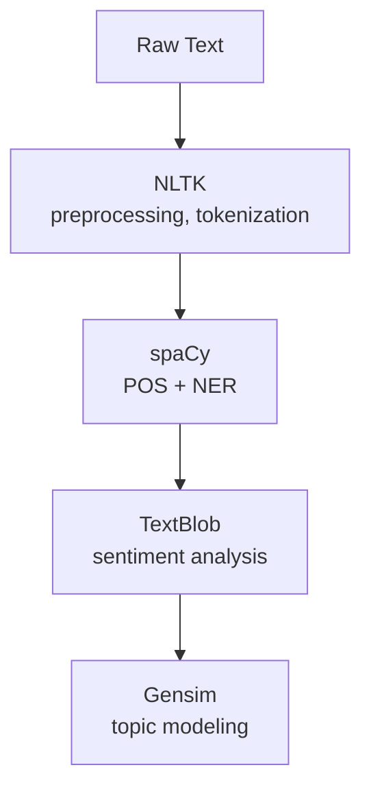
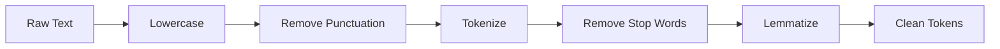
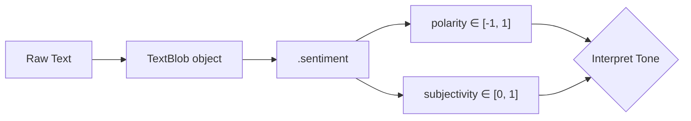
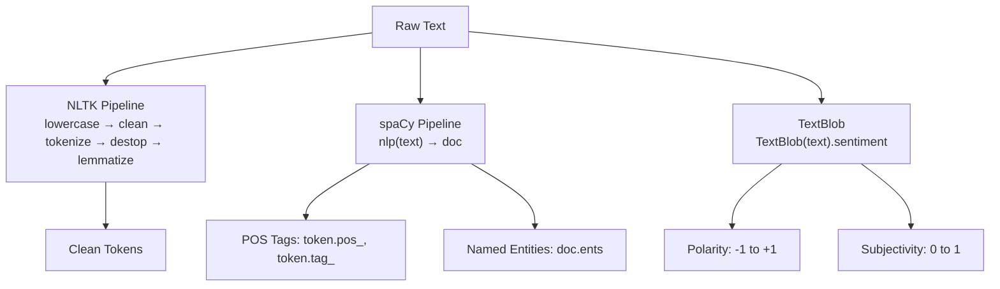

# Lecture 31: Hands on NLP Part1

**Course**: AI for Industrial Cyber-Physical Systems (AI4ICPS) — IIT Kharagpur  
**Duration**: 58:41  
**Source**: ai4icps-upskilling.in  

---

## Overview

Mr. Shubhasachi Mukhopadhyay (Research Scholar, Center for Computational and Data Sciences, IIT Kharagpur) runs the first hands-on NLP lab in Google Colab. The session covers the four core Python NLP libraries (NLTK, spaCy, TextBlob, Gensim), builds a text-cleaning pipeline from scratch with NLTK, then demonstrates POS tagging and Named Entity Recognition with spaCy, and closes with sentiment analysis using TextBlob.

---

## 1. NLP Landscape & Tooling `[3:40 – 8:35]`

### 1.1 NLU vs. NLG `[3:55 – 4:43]`

| Branch | Focus | Example Tasks |
|---|---|---|
| **NLU** (Natural Language Understanding) | Interpreting/understanding human language | Sentiment analysis, information extraction, speech recognition, text classification |
| **NLG** (Natural Language Generation) | Producing human-readable text from structured data | Translation, summarization, dialogue generation |

> **Jargon**: *NLU vs. NLG* — NLU is the "reading comprehension" half of NLP (input → meaning); NLG is the "writing" half (meaning/data → text). Most end-to-end applications (chatbots, translators) combine both.

**Applications**: virtual assistants/chatbots, topic modeling, sentiment analysis, question-answering search engines.

### 1.2 Four Core Python Libraries `[5:23 – 8:35]`

| Library | Strength | Key Uses |
|---|---|---|
| **NLTK** (Natural Language Toolkit) | Comprehensive, foundational | Stemming, tokenization, lemmatization, POS tagging |
| **spaCy** *(capital C — case-sensitive!)* | High-performance, production-grade | POS tagging, NER, tokenization |
| **TextBlob** | User-friendly, built on NLTK + Pattern | Sentiment analysis, noun-phrase extraction, POS tagging |
| **Gensim** | Topic modeling | LDA, Doc2Vec, Word2Vec, text similarity |

> **Jargon**: *Gensim* — A Python library specializing in unsupervised topic modeling and document similarity, notably implementing **Latent Dirichlet Allocation (LDA)** and word/document embedding algorithms (Word2Vec, Doc2Vec).



---

## 2. Text Preprocessing Pipeline `[8:38 – 30:50]`

### 2.1 The Five Standard Steps `[9:05 – 10:13]`

Just as in classical ML, garbage-in preprocessing yields garbage-out models — text cleaning is the foundation of every downstream NLP task.

| Step | What It Does | Example |
|---|---|---|
| 1. Lowercasing | Normalize case | "Running" → "running" |
| 2. Remove punctuation/special chars | Strip non-word noise | "Hello!!" → "Hello" |
| 3. Tokenization | Split text into individual words | "I love programming" → ["I", "love", "programming"] |
| 4. Stop-word removal | Filter common, low-information words | "the", "is", "a" removed |
| 5. Lemmatization | Reduce word to its base/dictionary form | "running" → "run", "keeping" → "keep" |



> **Jargon**: *Tokenization* — Splitting a string of text into discrete units (usually words or subwords) that downstream models can operate on.

> **Jargon**: *Stop Words* — Extremely frequent function words (the, is, and, a...) that carry little topical/semantic content and are often removed to reduce noise and dimensionality.

> **Jargon**: *Lemmatization* — Reducing a word to its dictionary base form (lemma) using linguistic knowledge (e.g., "better" → "good", "running" → "run"), as opposed to **stemming**, which crudely chops suffixes without guaranteeing a real word.

### 2.2 Setup: Imports & Resource Downloads `[11:03 – 16:48]`

```python
import re
import nltk
from nltk.corpus import stopwords
from nltk.tokenize import word_tokenize
from nltk.stem import WordNetLemmatizer

# One-time resource downloads
nltk.download('punkt')      # sentence/word tokenizer models
nltk.download('stopwords')  # English stop-word list
nltk.download('wordnet')    # lexical database used for lemmatization
nltk.download('punkt_tab')  # supporting tokenizer data
```

> *Reads as*: "Import the regex module (for cleaning), NLTK's stop-word corpus, its tokenizer, and its WordNet-based lemmatizer, then download the pretrained resources each of these depends on."

### 2.3 Building the `preprocess_text` Function `[19:16 – 25:00]`

```python
def preprocess_text(text):
    # Step 1: lowercase
    text = text.lower()

    # Step 2: remove punctuation and special characters
    # \w = word character, \s = whitespace character
    text = re.sub(r'[^\w\s]', '', text)

    # Step 3: tokenize into individual words
    tokens = word_tokenize(text)

    # Step 4: remove stop words
    stop_words = set(stopwords.words('english'))
    tokens = [word for word in tokens if word not in stop_words]

    # Step 5: lemmatize each remaining token
    lemmatizer = WordNetLemmatizer()
    tokens = [lemmatizer.lemmatize(word) for word in tokens]

    return tokens
```

> *Reads as*: "Take raw text, lowercase it, strip anything that isn't a letter/digit/whitespace, split into words, throw away the boring function words, and reduce whatever's left to its dictionary form."

### 2.4 Running the Pipeline `[28:13 – 30:34]`

```python
text = "This is an Example sentence to demonstrate text preprocessing! We'll clean and tokenize it."
clean_tokens = preprocess_text(text)
print(clean_tokens)
```

```
['example', 'sentence', 'demonstrate', 'text', 'preprocessing', 'well', 'clean', 'tokenize']
```

> *Example*: Notice "This", "is", "an", "to", "and", "it" all vanish (stop words), capitalization is gone, the exclamation mark is stripped, and the contraction "We'll" becomes the token "well" after punctuation removal — a subtle but common preprocessing artifact worth watching for.

**Why this matters**: this exact pipeline (lowercase → clean → tokenize → de-stop → lemmatize) is the standard first stage before sentiment analysis, text classification, or virtually any downstream NLP model.

---

## 3. Part-of-Speech Tagging & Named Entity Recognition (Concepts) `[32:08 – 39:03]`

### 3.1 POS Tagging Tag Set `[32:35 – 38:00]`

> *Example sentence*: "The quick brown fox jumps over the lazy dog."

| Word | Tag | Meaning |
|---|---|---|
| The | DT | Determiner |
| quick | JJ | Adjective |
| brown | JJ | Adjective |
| fox | NN | Noun (singular) |
| jumps | VBZ | Verb, 3rd person singular present |
| over | IN | Preposition |
| lazy | JJ | Adjective |
| dog | NN | Noun (singular) |

**Other common tags**:

| Category | Tag | Examples |
|---|---|---|
| Personal pronoun | PRP | I, you, he, she, it, we, they |
| Possessive pronoun | PRP$ | my, your, his, her, its, our, their |
| Cardinal number | CD | 1, 2, 42, 100 |
| Adverb | RB | quickly, very, well |
| Comparative adverb | RBR | faster, better, smarter |
| Superlative adverb | RBS | fastest, best, smartest |
| Punctuation (period) | . | full stop |

> **Jargon**: *Penn Treebank Tag Set* — The de facto standard set of POS tag abbreviations (DT, JJ, NN, VBZ, IN, ...) used across most English NLP tools, including NLTK and spaCy.

### 3.2 Named Entity Recognition (NER) Concept `[38:00 – 39:03]`

> *Example sentence*: "Barack Obama visited the Eiffel Tower in Paris last summer."

| Entity | Type |
|---|---|
| Barack Obama | PERSON |
| Eiffel Tower | LOC (location) |
| Paris | LOC (location) |

> **Jargon**: *Named Entity Recognition (NER)* — Identifying and classifying spans of text into predefined categories such as person, organization, location, date, and money.

---

## 4. spaCy: POS Tagging & NER in Practice `[39:03 – 47:36]`

### 4.1 Loading the Model `[39:03 – 40:03]`

```python
import spacy

# "en_core_web_sm" = small/lightweight English model,
# includes tokenization, POS tagging, and NER
nlp = spacy.load("en_core_web_sm")

text = "Apple is looking at buying UK startup for 1 billion USD. Steve Jobs founded Apple in 1976."
doc = nlp(text)
```

### 4.2 Extracting POS Tags `[40:03 – 41:39]`

```python
print("POS Tagging:")
for token in doc:
    print(token.text, token.pos_, token.tag_)
```

```
Apple    PROPN  NNP
is       AUX    VBZ
looking  VERB   VBG
at       ADP    IN
buying   VERB   VBG
UK       PROPN  NNP
startup  NOUN   NN
for      ADP    IN
1        NUM    CD
billion  NUM    CD
USD      PROPN  NNP
...
Steve    PROPN  NNP
Jobs     PROPN  NNP
founded  VERB   VBD
Apple    PROPN  NNP
in       ADP    IN
1976     NUM    CD
```

> *Reads as*: "For each token, print the surface text, spaCy's coarse-grained POS category (`.pos_`, e.g., VERB, NOUN), and the fine-grained Penn-Treebank-style tag (`.tag_`, e.g., VBG, CD)."

### 4.3 Extracting Named Entities `[41:39 – 46:00]`

```python
print("Named Entities:")
for ent in doc.ents:
    print(ent.text, ent.label_, spacy.explain(ent.label_))
```

```
Apple       ORG    Companies, agencies, institutions, etc.
UK          GPE    Countries, cities, states
1 billion USD  MONEY  Monetary values, including unit
Steve Jobs  PERSON People, including fictional
Apple       ORG    Companies, agencies, institutions, etc.
1976        DATE   Absolute or relative dates or periods
```

> *Reads as*: "For each detected entity span, print its text, its entity label, and a human-readable explanation of what that label means." Note "Apple" appears **twice** because it occurs twice in the source text — NER operates per-mention, not per-unique-entity.

```mermaid
flowchart LR
    A["Raw Text:<br/>'Apple is looking at buying...'"] --> B[spaCy Pipeline<br/>nlp(text)]
    B --> C[Doc Object]
    C --> D["POS: token.pos_ / token.tag_"]
    C --> E["NER: doc.ents → ent.text, ent.label_"]
```

> **Jargon**: *spaCy `Doc` Object* — The container spaCy returns after processing text; it holds tokens (each annotated with POS, dependency, etc.) and `.ents` (the detected named entity spans) in one structured object.

---

## 5. TextBlob: Sentiment Analysis `[48:34 – 58:01]`

### 5.1 Polarity & Subjectivity Concepts `[50:33 – 52:11]`

| Metric | Range | Meaning |
|---|---|---|
| **Polarity** | −1 to +1 | −1 = negative, 0 = neutral, +1 = positive |
| **Subjectivity** | 0 to 1 | 0 = objective (fact), 1 = subjective (opinion) |

> *Example*: "The sun rises in the east" → subjectivity ≈ 0 (objective fact). "Sachin Tendulkar is my favorite cricketer" → subjectivity ≈ 1 (personal opinion — others may disagree).

> **Jargon**: *Polarity* — A continuous score representing how positive or negative a piece of text's sentiment is.

> **Jargon**: *Subjectivity* — A continuous score representing whether text expresses a personal opinion/bias (high) versus a verifiable fact (low).

### 5.2 Code: Computing Sentiment `[49:29 – 52:31]`

```python
from textblob import TextBlob

text = "I absolutely love this product! It is fantastic and works like a charm."
blob = TextBlob(text)
sentiment = blob.sentiment

print("Polarity:", sentiment.polarity)         # -1 (neg) to +1 (pos)
print("Subjectivity:", sentiment.subjectivity)  # 0 (objective) to 1 (subjective)
```

```
Polarity: 0.5125
Subjectivity: 0.75
```

### 5.3 Interpreting the Output `[55:50 – 57:22]`

$$\text{Polarity} = 0.5125 \implies \text{moderately positive (favorable but not overly enthusiastic)}$$

$$\text{Subjectivity} = 0.75 \implies \text{strongly opinion-driven, not purely factual}$$

> *Reads as*: "A polarity just above the midpoint of the positive range signals genuine but measured positivity — not gushing praise. A subjectivity well above 0.5 tells us this is someone's personal reaction, not a neutral factual statement."



---

## Quick Reference: Key Jargon Glossary

| Term | One-Line Definition |
|---|---|
| NLU / NLG | Understanding language (input→meaning) vs. Generating language (meaning→text) |
| Gensim | Python library for topic modeling (LDA) and embeddings (Word2Vec/Doc2Vec) |
| Tokenization | Splitting text into discrete word/subword units |
| Stop Words | High-frequency, low-information function words often filtered out |
| Lemmatization | Reducing a word to its dictionary base form using linguistic rules |
| Penn Treebank Tag Set | Standard abbreviations (DT, JJ, NN, VBZ...) for POS tags |
| Named Entity Recognition (NER) | Detecting and classifying entity spans (person, org, location, date...) |
| spaCy Doc Object | Structured container of tokens + entities returned by spaCy's pipeline |
| Polarity | Sentiment score from negative (−1) to positive (+1) |
| Subjectivity | Score from objective/factual (0) to subjective/opinionated (1) |

---

## Summary



**Key Takeaway**: A handful of well-chosen Python libraries (NLTK, spaCy, TextBlob, Gensim) let you go from raw, messy text to clean tokens, grammatical structure (POS), extracted entities (NER), and sentiment scores in just a few lines of code — this pipeline is the practical backbone underneath almost every real-world NLP application.

---

*Notes generated from SRT transcript with timestamps. whisper.cpp (small model, Metal GPU). Enhanced with AI expert annotations.*
