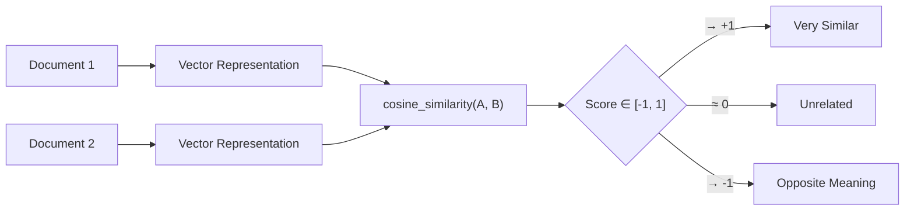
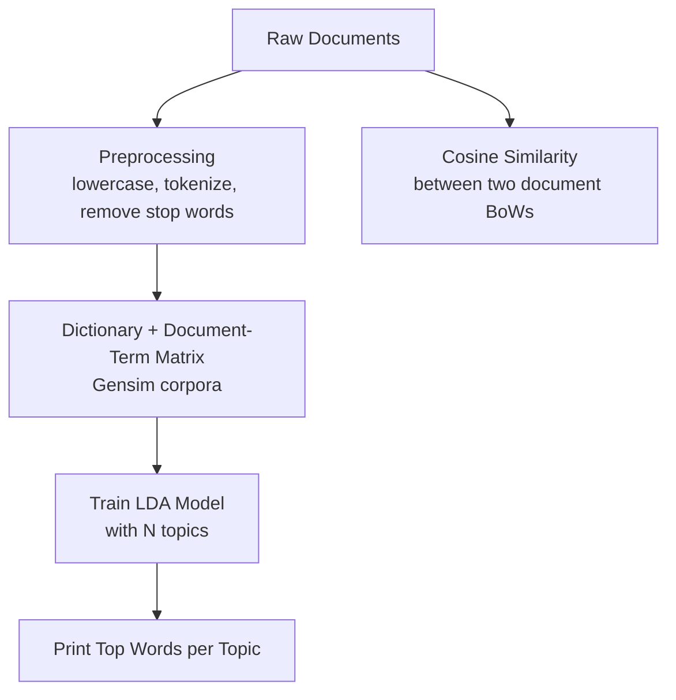
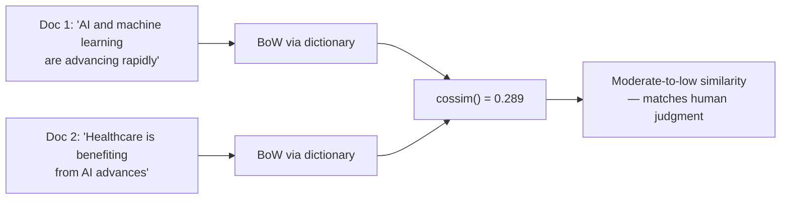
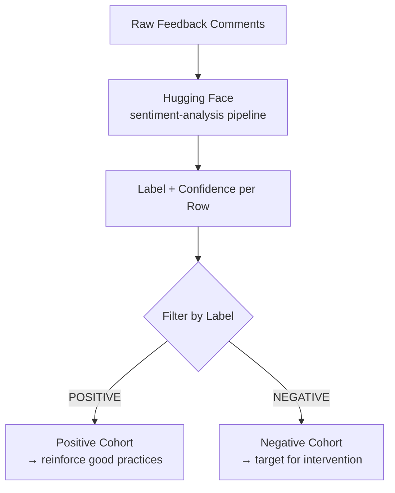
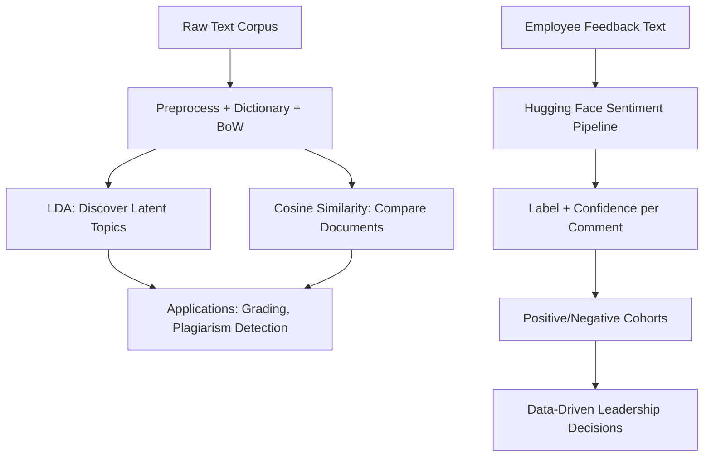

# Lecture 32: Hands on NLP Part2

**Course**: AI for Industrial Cyber-Physical Systems (AI4ICPS) — IIT Kharagpur  
**Duration**: 51:20  
**Source**: ai4icps-upskilling.in  

---

## Overview

Continuing the hands-on lab, Mr. Mukhopadhyay demonstrates **topic modeling** and **document similarity** with Gensim's LDA and cosine similarity, then pivots to a real-world **business application**: using a Hugging Face Transformers sentiment-analysis pipeline to analyze employee feedback and support leadership decision-making.

---

## 1. Topic Modeling & Document Clustering: Concepts `[0:11 – 4:56]`

| Concept | Definition |
|---|---|
| **Topic Modeling** | Identifying the underlying themes/topics within a collection of documents |
| **Document Clustering** | Grouping documents that share similar themes/context |
| **LDA (Latent Dirichlet Allocation)** | A generative statistical model that discovers topics in a document collection, assuming each document is a *mixture* of topics, and each topic is a *distribution over words* |
| **Cosine Similarity** | Measures how similar two documents are based on the **angle** between their vector representations |

> **Jargon**: *Latent Dirichlet Allocation (LDA)* — A generative probabilistic model where each document is assumed to be generated by picking a mixture of latent (hidden) topics, and each topic is itself a probability distribution over vocabulary words. "Latent" = the topics themselves are never directly observed, only inferred from word co-occurrence patterns.

### Cosine Similarity Range

| Value | Interpretation |
|---|---|
| **+1** | Documents point in identical direction → completely similar |
| **0** | No directional relationship → completely different / unrelated |
| **−1** | Vectors point in opposite directions → opposite meaning |

$$\text{cosine\_similarity}(\mathbf{A}, \mathbf{B}) = \frac{\mathbf{A} \cdot \mathbf{B}}{\|\mathbf{A}\| \, \|\mathbf{B}\|}$$

> *Reads as*: "Take the dot product of the two document vectors, then divide by the product of their magnitudes — this normalizes out document length and leaves only the *direction* (topical content), captured as the cosine of the angle between them."



---

## 2. LDA Pipeline `[1:26 – 22:13]`

### 2.1 Pipeline Overview `[1:26 – 2:01]`



### 2.2 Setup `[5:03 – 7:14]`

```python
# IMPORTANT: Runtime → Restart Session before running pip install gensim
!pip install gensim

from gensim import corpora
from gensim.models import LdaModel
from nltk.corpus import stopwords
from nltk.tokenize import word_tokenize
import nltk

nltk.download('punkt_tab')
nltk.download('stopwords')
```

> **Jargon**: *Runtime Restart* — In Colab, some packages (like `gensim`) require a fresh Python process to register newly installed native extensions; restarting the runtime avoids stale-import errors.

### 2.3 Sample Documents `[7:14 – 7:55]`

```python
documents = [
    "Artificial intelligence is transforming the technology industry.",
    "Machine learning and AI are shaping the future of automation.",
    "Deep learning algorithms are a subset of machine learning.",
    "Quantum computing will revolutionize industries like AI.",
    "Healthcare is benefiting from AI and machine learning advances."
]
```

### 2.4 Preprocessing & Document-Term Matrix `[7:55 – 9:20]`

```python
stop_words = set(stopwords.words('english'))

def preprocess(doc):
    tokens = word_tokenize(doc.lower())
    return [word for word in tokens if word.isalpha() and word not in stop_words]

preprocessed_docs = [preprocess(doc) for doc in documents]

# Dictionary: maps each unique word <-> an integer ID
dictionary = corpora.Dictionary(preprocessed_docs)

# Document-Term Matrix: Bag-of-Words representation per document
doc_term_matrix = [dictionary.doc2bow(doc) for doc in preprocessed_docs]
```

> **Jargon**: *Dictionary (Gensim)* — A bidirectional mapping between vocabulary words and integer IDs, built once from the corpus and reused to vectorize any document consistently.

> **Jargon**: *Bag-of-Words (BoW)* — A representation that records only *word counts* per document, discarding word order — e.g., `[(word_id_3, 2), (word_id_7, 1)]` means word #3 appears twice, word #7 once.

### 2.5 Training the LDA Model `[9:20 – 9:55]`

```python
lda_model = LdaModel(
    doc_term_matrix,
    num_topics=2,       # how many latent topics to discover
    id2word=dictionary,
    passes=15           # more passes → better-converged topics
)

topics = lda_model.print_topics(num_words=5)  # top 5 words per topic
for topic in topics:
    print(topic)
```

> *Reads as*: "Ask LDA to explain this 5-document corpus using exactly 2 hidden topics, refine the topic-word distributions over 15 passes through the data, then show me each topic's 5 highest-weighted words."

### 2.6 Interpreting the Discovered Topics `[17:24 – 20:28]`

```
Topic ID 0: 0.112*"ai" + 0.065*"industries" + 0.065*"quantum" + 0.065*"revolutionize" + 0.065*"technology"
Topic ID 1: 0.129*"learning" + 0.092*"machine" + 0.053*"subset" + 0.053*"deep" + 0.053*"algorithm"
```

| Topic | Dominant Word | Weight | Theme |
|---|---|---|---|
| Topic ID 0 | "ai" | 0.112 (highest) | AI/technology/quantum-computing cluster |
| Topic ID 1 | "learning" | 0.129 (highest) | Machine/deep-learning cluster |

> *Reads as*: "In Topic 0, the word 'ai' contributes more to defining this topic than any other word (weight 0.112); in Topic 1, 'learning' dominates (weight 0.129) with 'machine' as a close second (0.092)." The weight of each word is its probability under that topic's word distribution — words with equal weight (e.g., 0.065, 0.065, 0.065) are equally characteristic of the topic.

> **Jargon**: *Topic-Word Weight* — In LDA output, the coefficient before each word is $P(\text{word} \mid \text{topic})$ — the probability of that word being generated if you were sampling from this particular topic.

### 2.7 Document Similarity via Cosine Similarity `[9:55 – 21:23]`

```python
from gensim import matutils

doc1 = "AI and machine learning are advancing rapidly"
doc2 = "Healthcare is benefiting from AI advances"

doc1_bow = dictionary.doc2bow(preprocess(doc1))
doc2_bow = dictionary.doc2bow(preprocess(doc2))

similarity = matutils.cossim(doc1_bow, doc2_bow)
print("Cosine Similarity:", similarity)
```

```
Cosine Similarity: 0.289
```

> *Reads as*: "Convert both new sentences into the same bag-of-words vocabulary space as the trained dictionary, then compute the angle-based similarity between them."

> **Math Note**: 0.289 is well below the midpoint, indicating **moderate-to-low similarity**. Manually inspecting the two sentences confirms this: they only overlap on the concept "AI" — "machine learning are advancing rapidly" vs. "healthcare... advances" share little vocabulary beyond that, so the model's quantitative score matches human intuition.



### 2.8 Real-World Applications `[13:23 – 18:36]`

| Application | How Similarity/Topic Modeling Helps |
|---|---|
| **Automatic answer-script evaluation** | Compare a student's written answer against a faculty-provided model answer via text similarity → auto-grade at scale, removing human grading variance and speeding up result delivery |
| **Plagiarism detection** | Compare a manuscript against a corpus of published papers; high similarity flags potential copying |
| **Explanation generation in healthcare AI** | After an image-based diagnosis, an LLM/LangChain pipeline generates a natural-language explanation of the disease grade and precautions for the patient |

---

## 3. Business Application: Sentiment-Driven Leadership Decisions `[25:34 – 51:05]`

This section builds a mini pipeline using **Hugging Face Transformers** to help a leadership team gauge team sentiment from feedback comments.

### 3.1 Install Required Libraries `[25:56 – 26:49]`

```python
!pip install transformers   # Hugging Face Transformers
!pip install torch          # PyTorch backend
!pip install pandas         # Data analysis / manipulation
```

### 3.2 Load a Pretrained Sentiment Model `[28:50 – 29:21]`

```python
from transformers import pipeline

# Loads a pretrained sentiment-analysis pipeline from Hugging Face's model hub
sentiment_analysis = pipeline("sentiment-analysis")
```

> **Jargon**: *Pipeline (Hugging Face)* — A high-level wrapper that bundles a pretrained model + tokenizer + post-processing into a single callable object, so a complex Transformer model can be used with one line of code.

### 3.3 Prepare Feedback Data `[31:23 – 34:09]`

```python
import pandas as pd

data = {
    "employee": ["Amurto", "Sangita", "Faiz", "Khudiram"],
    "feedback": [
        "I love the new project management tool.",
        "The recent changes in the workflow are confusing.",
        "Great team collaboration on the last project.",
        "I am not happy with the current work environment."
    ]
}

df = pd.DataFrame(data)
```

> *Reads as*: "Build a dictionary of two parallel lists (employee names, feedback strings), then convert it into a tabular DataFrame where each row pairs one employee with their feedback."

### 3.4 Analyze Sentiment per Feedback `[36:01 – 39:44]`

```python
def analyze_sentiment(feedback):
    result = sentiment_analysis(feedback)[0]   # [0] = most relevant/top result
    return result['label'], result['score']

df['sentiment'], df['confidence'] = zip(*df['feedback'].apply(analyze_sentiment))
print(df)
```

```
  employee                                       feedback sentiment  confidence
0   Amurto        I love the new project management tool.  POSITIVE    0.998483
1  Sangita  The recent changes in the workflow are confusing.  NEGATIVE    0.999406
2     Faiz     Great team collaboration on the last project.  POSITIVE    0.998871
3 Khudiram  I am not happy with the current work environment.  NEGATIVE    0.997720
```

> *Reads as*: "For each feedback string, run it through the sentiment pipeline, take the top prediction, and split the result into a `sentiment` label and a `confidence` score, writing both back as new DataFrame columns in one line via `zip`."

### 3.5 Interpreting Confidence Scores `[39:00 – 39:39]`

$$\text{Confidence} \in [0, 1]$$

| Confidence Range | Interpretation |
|---|---|
| ≈ 0 | Model has almost no confidence in its prediction |
| ≈ 0.5 | Model is essentially guessing |
| ≈ 1 (e.g., 0.95+) | Model is highly confident, regardless of whether the predicted label is positive or negative |

> **Jargon**: *Confidence Score* — The probability the model assigns to its *chosen* label (not necessarily "positive" — it's the probability of whichever label won). A confidence of 0.99 on a NEGATIVE prediction means the model is 99% sure the sentiment is negative, not that the sentiment is 99% positive.

> *Example*: All four feedback comments in this demo score above ~0.99 confidence — the model is very sure of each classification, whether positive or negative, showing the sentence-level sentiment signal is unambiguous.

### 3.6 Splitting into Positive/Negative Cohorts `[42:22 – 47:26]`

```python
positive_feedback = df[df['sentiment'] == 'POSITIVE']
negative_feedback = df[df['sentiment'] == 'NEGATIVE']

print(positive_feedback)
print(negative_feedback)
```

```
Positive:
  employee                                     feedback sentiment  confidence
0   Amurto      I love the new project management tool.  POSITIVE    0.998483
2     Faiz  Great team collaboration on the last project.  POSITIVE    0.998871

Negative:
  employee                                           feedback sentiment  confidence
1  Sangita  The recent changes in the workflow are confusing.  NEGATIVE    0.999406
3 Khudiram  I am not happy with the current work environment.  NEGATIVE    0.997720
```

> *Reads as*: "Filter the DataFrame down to just the rows where sentiment equals 'POSITIVE' (or 'NEGATIVE') — pandas boolean indexing lets leadership instantly see which employees are happy vs. which need attention."



**Business value**: This turns unstructured feedback text into an actionable, quantified signal — leadership can triage which team members/issues need immediate follow-up, at a scale no manual review process could match.

---

## Quick Reference: Key Jargon Glossary

| Term | One-Line Definition |
|---|---|
| Latent Dirichlet Allocation (LDA) | Generative model discovering hidden topics as word/document distributions |
| Cosine Similarity | Angle-based similarity between two vectors, ranging −1 to +1 |
| Dictionary (Gensim) | Bidirectional word ↔ integer-ID mapping built from a corpus |
| Bag-of-Words (BoW) | Word-count vector representation ignoring word order |
| Topic-Word Weight | P(word \| topic) — how characteristic a word is of a discovered topic |
| Pipeline (Hugging Face) | One-line wrapper bundling a pretrained model + tokenizer + post-processing |
| Confidence Score | Probability assigned to the model's chosen prediction label |

---

## Summary



**Key Takeaway**: Gensim's LDA and cosine similarity turn a raw document collection into interpretable topics and quantified similarity scores, while a pretrained Transformer sentiment pipeline turns free-text feedback into structured, confidence-scored signals — together showing how a handful of library calls can convert unstructured text into decision-ready business intelligence.

---

*Notes generated from SRT transcript with timestamps. whisper.cpp (small model, Metal GPU). Enhanced with AI expert annotations.*
