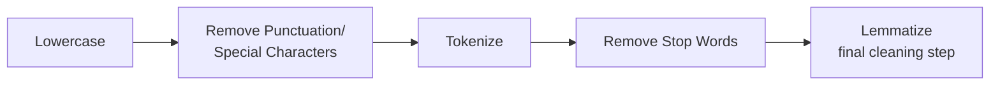
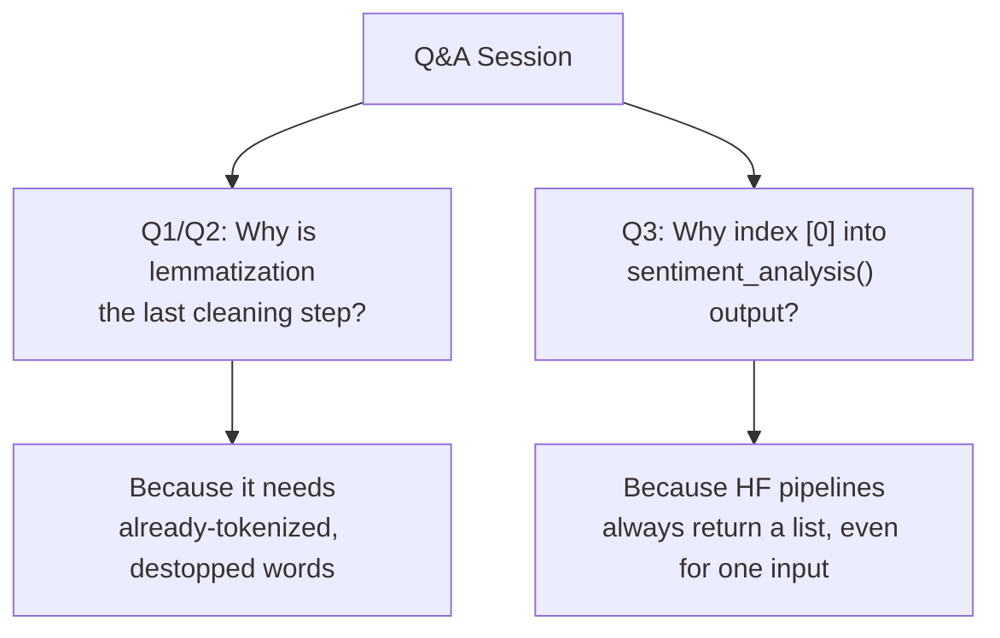

# Lecture 33: Hands on NLP Part3

**Course**: AI for Industrial Cyber-Physical Systems (AI4ICPS) — IIT Kharagpur  
**Duration**: 3:01  
**Source**: ai4icps-upskilling.in  

---

## Overview

A brief Q&A wrap-up to the two-part NLP hands-on lab. Mr. Mukhopadhyay answers two closely related audience questions — why lemmatization is treated as the final text-cleaning step, and why sentiment-analysis code always indexes into result `[0]` — before closing out the session.

---

## 1. Why Is Lemmatization Part of Text Cleaning? `[0:00 – 0:55]`

**Question**: Why is lemmatization applied *after* the earlier cleaning steps, rather than being treated as something separate from "text cleaning"?

**Answer**: Lemmatization is simply the **final stage** of the same sequential cleaning pipeline covered in Lecture 31 — it doesn't stand apart conceptually, it's just applied last because it needs already-tokenized, already-de-stopped words to work on.



> *Reads as*: "You can't lemmatize a whole raw sentence meaningfully — you first need individual, cleaned word tokens. Once you have those, reducing each one to its root form (running → run, skipping → skip) is the natural last step of cleaning, not a separate downstream task."

> *Example*: "running" → root form "run"; "skipping" → root form "skip." Each of these transformations only makes sense once the token has already been isolated from punctuation and surrounding stop words.

> **Jargon**: *Text Cleaning Pipeline* — The ordered sequence (lowercase → remove punctuation → tokenize → remove stop words → lemmatize) that converts raw, noisy text into a normalized list of meaningful root-form tokens ready for feature extraction or modeling. Order matters: each step depends on the output of the previous one.

---

## 2. Why Index `[0]` Into the Sentiment Analysis Result? `[0:59 – 2:12]`

**Question** (asked twice, in slightly different phrasing): In the code

```python
result = sentiment_analysis(feedback)[0]
```

why do we take index `[0]` of the output?

**Answer**: The Hugging Face `pipeline("sentiment-analysis")` call returns a **list** of prediction dictionaries (one entry per input text passed in, or one ranked entry per label in some configurations). Index `0` retrieves the **top / most significant** result — the model's primary prediction — which is what the rest of the code (extracting `label` and `score`) operates on.

```python
# sentiment_analysis(feedback) returns something shaped like:
# [{'label': 'POSITIVE', 'score': 0.9985}]
#
# Index [0] pulls out that single dictionary so we can then do:
result = sentiment_analysis(feedback)[0]
label = result['label']
score = result['score']
```

> *Reads as*: "The pipeline hands back a list — even for a single input — because Hugging Face pipelines are built to process batches. Since we're only passing one piece of feedback at a time, that list always has exactly one element, and `[0]` unwraps it into a plain dictionary we can read `label` and `score` from."

> **Jargon**: *Result Indexing in HF Pipelines* — Hugging Face `pipeline()` calls are batch-oriented by design: output is always a list, even for a single input, so calling code must index into it (commonly `[0]`) to access the prediction for that single item.

> **Math Note**: This is not about picking the "best of several candidate sentiments" — it's simply *unwrapping* the single-element list returned by the pipeline for one input string. The confidence/label pair inside is already the model's top (and typically only, for this pipeline) prediction.

---

## 3. Closing Remarks `[2:26 – 3:01]`

The instructor thanks the TCS iON moderation team and the back-end CET (Centre for Educational Technology) team supporting the cohort, and signs off the NLP hands-on module.

---

## Quick Reference: Key Jargon Glossary

| Term | One-Line Definition |
|---|---|
| Text Cleaning Pipeline | Ordered sequence: lowercase → remove punctuation → tokenize → remove stop words → lemmatize |
| Result Indexing in HF Pipelines | Hugging Face pipelines return batch-shaped lists; `[0]` unwraps the single result for one input |

---

## Summary



**Key Takeaway**: Two small implementation details — the strict order of the text-cleaning pipeline and the batch-list output convention of Hugging Face pipelines — are common sources of confusion for NLP beginners, and understanding *why* the code is structured this way (not just that it works) is what turns copy-pasted notebook cells into transferable skills.

---

*Notes generated from SRT transcript with timestamps. whisper.cpp (small model, Metal GPU). Enhanced with AI expert annotations.*
