# Lecture 34: Advanced DL Transformers BERT

**Course**: AI for Industrial Cyber-Physical Systems (AI4ICPS) — IIT Kharagpur  
**Duration**: 1:43:14  
**Source**: ai4icps-upskilling.in  

---

## Overview

This lecture builds the Transformer architecture from first principles — starting with the intuition of attention, working through the query/key/value math with worked numeric examples, assembling a full encoder/decoder block (residuals, layer norm, positional encoding), and finishing with how BERT pre-trains an encoder using masked language modeling and fine-tunes it for downstream NLP tasks.

---

## 1. NLP Landscape & Historical Context `[0:00 – 9:58]`

### 1.1 What NLP Tries to Do `[0:39 – 3:47]`

NLP has three broad task paradigms:

| Paradigm | Description | Example |
|----------|-------------|---------|
| Classification | Text → one label from a fixed set | Sentiment analysis, topic grouping |
| Sequence Labeling | Text → one label *per token* | POS tagging, NER |
| Text Generation | Text → new text | Translation, summarization, chatbots |

> **Jargon**: *Sequence Labeling* — Assigning a tag to every token in a sequence rather than one tag for the whole sequence (e.g., tagging each word in "I went to the market" with its part of speech).

### 1.2 A Brief History of NLP Methods `[3:47 – 9:58]`

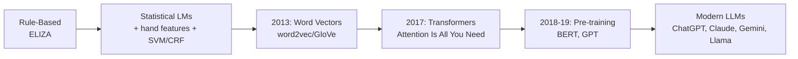

> **Jargon**: *GPT* — **G**enerative **P**re-trained **T**ransformer. The name literally encodes the three big ideas of this lecture: it *generates* text, it is *pre-trained* on huge unlabeled corpora, and it is built on the *Transformer* architecture.

Before 2017, NLP relied on **Recurrent Neural Networks (RNNs)**: feed word embeddings one at a time, carry a hidden state forward. The core limitation — hidden state $h_t$ can only be computed *after* $h_{t-1}$ — makes RNNs inherently **sequential** and hard to parallelize on modern hardware.

Transformers (2017, "Attention Is All You Need" — Google Brain / U. Toronto) remove this dependency, and paired with large-scale **pre-training**, became the backbone of essentially every modern foundation model (GPT-family, Claude, Gemini, Llama, and beyond — even for proteins, images, and audio).

---

## 2. Attention: The Core Intuition `[9:58 – 22:16]`

### 2.1 Attention as Weighted Averaging `[10:05 – 11:52]`

Given a set of value vectors $v_1, \dots, v_n$ and a **query**, attention computes a *weighted average* of the values, where the weights depend on the query. Change the query → get a different weighted combination. Crucially, $n$ can be arbitrary (5, 20, 100 values) yet the output is always a fixed-size vector.

> **Jargon**: *Attention* — A mechanism that produces a query-dependent, weighted summary of a set of values. Unlike a plain average, it lets the model selectively emphasize the most relevant pieces of information.

### 2.2 Why Not RNNs? The Parallelism Problem `[11:52 – 13:23]`

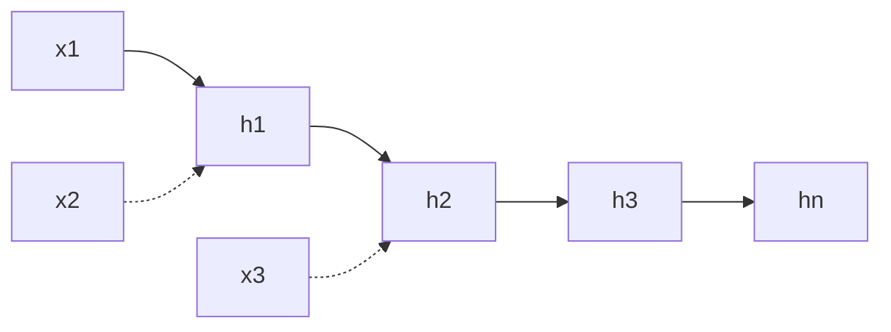

In an RNN, $h_2$ cannot be computed without $h_1$ — strictly sequential. Deep learning thrives on **parallel** computation (GPUs), so Transformers were designed to let every position's representation be computed independently and simultaneously.

### 2.3 Encoder–Decoder Framing `[13:23 – 15:24]`

The original Transformer paper frames it as an **encoder–decoder**:

- **Encoder**: produces a rich contextual representation of the input sequence.
- **Decoder**: consumes that representation and generates output tokens one at a time (**auto-regressive generation**).

> **Jargon**: *Auto-regressive Generation* — Generating a sequence one token at a time, where each new token is conditioned on all previously generated tokens.

The original paper stacked **6 encoder layers + 6 decoder layers**; later models use encoder-only (BERT) or decoder-only (GPT) stacks.

### 2.4 Contextual Representations — Why We Need Attention `[17:54 – 19:54]`

> *Example*: "The chicken didn't cross the street/road because **it** was too tired / too wide."
> Depending on the completion, "it" should refer to the *chicken* (tired) or the *road* (wide). The word "it" alone carries no meaning — its representation must be built by selectively pulling context from the rest of the sentence. This selective, context-dependent aggregation is exactly what **self-attention** does.

### 2.5 Query, Key, Value — The Search Engine Analogy `[19:54 – 22:16]`

Think of searching YouTube: you type a **query**; each video has metadata (**key**, e.g., title/description) and content (**value**). The query is matched against *keys*, and whichever key scores highest determines how much of its corresponding *value* gets retrieved.

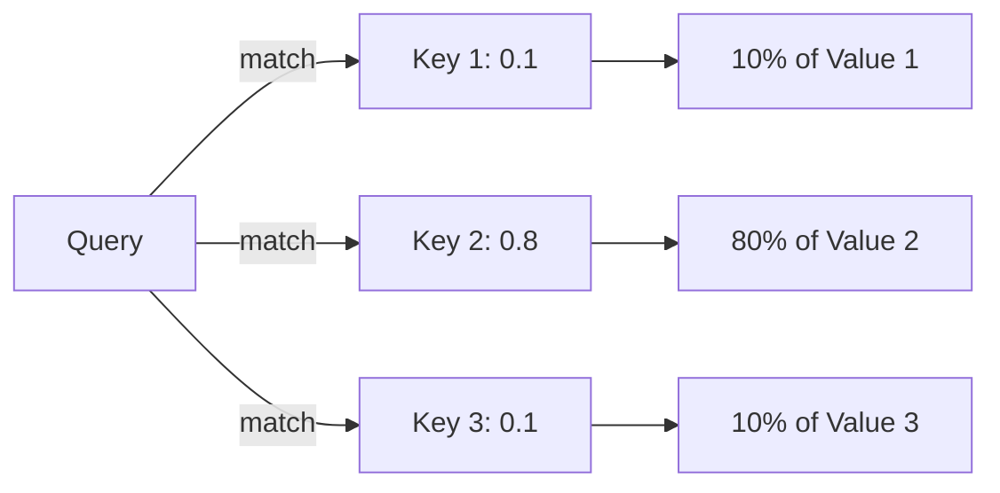

> **Jargon**: *Query, Key, Value (Q, K, V)* — Three vectors derived from each token. The Query asks "what am I looking for?", the Key answers "what do I contain?", and the Value is "what do I actually offer once selected." Similarity between Query and Key determines how much of the Value gets used.

---

## 3. Self-Attention: The Math `[22:16 – 35:38]`

### 3.1 Getting Q, K, V from Embeddings `[22:16 – 24:11]`

We only start with a token embedding $x_i \in \mathbb{R}^{1 \times D}$ (e.g., $D=512$). Three **learnable projection matrices** convert it into query, key, and value:

$$q_i = x_i W_Q, \quad k_i = x_i W_K, \quad v_i = x_i W_V$$

where $W_Q, W_K, W_V \in \mathbb{R}^{D \times d_k}$ (e.g., $512 \times 64$). The *same* matrices are applied to every word in the sequence — they don't change per token.

### 3.2 The Attention Score Formula `[24:11 – 25:12]`

$$\text{Attention}(x_i, x_j) = \frac{q_i \cdot k_j}{\sqrt{d_k}}, \qquad \alpha_{ij} = \text{softmax}_j\left(\frac{q_i \cdot k_j}{\sqrt{d_k}}\right), \qquad \text{output}_i = \sum_j \alpha_{ij} v_j$$

```python
# Pseudocode: self-attention for one query position i
scores = [dot(q[i], k[j]) / sqrt(d_k) for j in range(n)]
alpha = softmax(scores)                     # convert to probability weights
output_i = sum(alpha[j] * v[j] for j in range(n))
```

> *Reads as*: "Compare my query against everyone's key (scaled dot product), turn those comparison scores into a probability distribution with softmax, then blend everyone's value according to that distribution."

> **Math Note**: *Why divide by $\sqrt{d_k}$?* If $q$ and $k$ components are mean-0, variance-1 and independent, $\text{Var}(q \cdot k) = d_k$ (sum of $d_k$ independent unit-variance terms). Dividing by $\sqrt{d_k}$ brings the variance back to 1, keeping softmax inputs well-scaled (otherwise large dot products saturate softmax into a near one-hot distribution and gradients vanish).

### 3.3 Worked Example: "flying arrow" `[30:50 – 35:22]`

Toy 6-dim embeddings, where $Q$/$K$/$V$ are simply the 1st/2nd/3rd pairs of dimensions:

| Word | q | k | v |
|------|---|---|---|
| flying | (0, 1) | (1, 1) | (1, 0) |
| arrow | (1, 1) | (0, -1) | (-1, 0) |

To get attention output for "flying" ($d_k = 2$):

$$q_1 \cdot k_1 = 0(1) + 1(1) = 1, \quad \frac{1}{\sqrt{2}} \approx 0.7$$
$$q_1 \cdot k_2 = 0(0) + 1(-1) = -1, \quad \frac{-1}{\sqrt{2}} \approx -0.7$$

Softmax over $[0.7, -0.7]$ gives weights $[x_1, 1-x_1]$. Final output = $x_1 \cdot v_1 + (1-x_1) \cdot v_2$ — a blend of both words' values, weighted toward whichever key matched the query better.

> *Reads as*: "flying" looks at both "flying" and "arrow", scores their keys against its own query, converts scores to weights via softmax, then mixes their value vectors accordingly.

### 3.4 Why This Parallelizes `[28:48 – 29:35]`

Computing the output for word $i$ only needs $q_i$ and *all* $k_j, v_j$ — there's no dependency on the output of any other word. Every position's self-attention can therefore be computed **simultaneously**, unlike RNN hidden states.

---

## 4. Multi-Head Attention `[35:38 – 44:00]`

### 4.1 Why Multiple Heads? `[35:57 – 39:24]`

A single $(W_Q, W_K, W_V)$ triple forces the model into **one** way of relating words. Real language needs several simultaneous relationships — e.g., one head tracking nearby neighbors, another tracking syntactic subject/object links, another tracking rare/distant words. **Multi-head attention** runs $H$ independent attention computations in parallel, each with its own projection matrices.

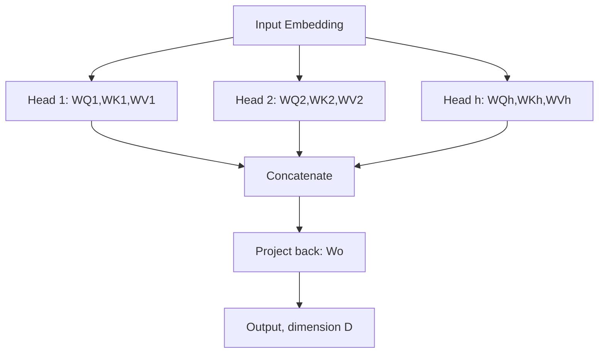

> **Jargon**: *Multi-Head Attention* — Running several attention "heads" in parallel, each learning to focus on a different relational pattern (position, syntax, coreference, etc.), then combining their outputs.

### 4.2 Concatenation & Output Projection `[37:04 – 39:24]`

Each head outputs a $d_v$-dimensional vector. Concatenating $H$ heads gives $H \cdot d_v$ dimensions, which is then projected back to model dimension $D$ via $W_O \in \mathbb{R}^{H d_v \times D}$:

$$\text{MultiHead}(X) = \text{Concat}(\text{head}_1, \dots, \text{head}_H) \, W_O$$

In the original paper: $D = 512$, $H = 8$ heads, $d_q = d_k = d_v = 64$ (so $H \times d_v = 512 = D$, keeping dimensions consistent across layers).

### 4.3 Parameter Counting `[39:24 – 41:00]`

| Component | Shape | Parameters |
|-----------|-------|-----------|
| $W_Q, W_K, W_V$ per head | $D \times D/H$ each | $3 \times D \times D/H$ per head |
| All $H$ heads | — | $3D^2$ total |
| $W_O$ | $H \cdot d_v \times D = D \times D$ | $D^2$ |
| **Total self-attention** | — | $\mathbf{4D^2}$ |

For $D = 512$: $4 \times 512^2 \approx 1$ million parameters — just for self-attention in one layer.

---

## 5. Feed-Forward Network `[44:00 – 46:05]`

Self-attention is purely **linear re-averaging** of value vectors — no non-linearity is introduced yet. Every encoder layer therefore applies a position-wise feed-forward network (FFN) after attention:

$$\text{FFN}(x) = W_2 \cdot \text{ReLU}(W_1 x)$$

```python
# Pseudocode
hidden = relu(x @ W1)     # up-project D -> 4D
output = hidden @ W2      # down-project 4D -> D
```

| Matrix | Shape | Parameters |
|--------|-------|-----------|
| $W_1$ | $D \times 4D$ | $4D^2$ |
| $W_2$ | $4D \times D$ | $4D^2$ |
| **Total FFN** | — | $\mathbf{8D^2}$ |

**Per encoder layer total: $4D^2 + 8D^2 = 12D^2$ parameters** ≈ 3 million at $D=512$.

---

## 6. Stabilizing Deep Transformers `[46:05 – 53:14]`

### 6.1 Residual (Skip) Connections `[46:33 – 48:23]`

$$x_{\text{out}} = \text{SubLayer}(x_{\text{in}}) + x_{\text{in}}$$

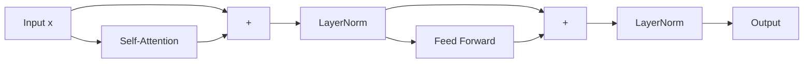

> **Jargon**: *Residual/Skip Connection* — Adding a layer's input back to its output. Prevents the network from "forgetting" the original signal as it gets transformed through many layers, and helps gradients flow in very deep networks (the same trick used in ResNets for CNNs).

### 6.2 Layer Normalization `[48:23 – 50:39]`

Because residual additions keep accumulating, the mean/variance of activations would keep drifting. **Layer normalization** re-centers each vector to mean 0, std 1:

$$\hat{x} = \frac{x - \mu}{\sigma + \epsilon}$$

> *Example*: values $[1, 3, 5]$ → mean $\mu = 3$, std $\sigma \approx 1.63$ → normalized ≈ $[-1.22, 0, 1.22]$.

> **Jargon**: *$\epsilon$ (epsilon)* — A tiny constant added to the denominator purely to avoid division by zero when all values in a vector happen to be identical (std = 0).

### 6.3 Scaled Dot-Product Attention Recap `[50:39 – 53:14]`

Already covered in §3.2 — dividing by $\sqrt{d_k}$ keeps the variance of $q \cdot k$ at 1, so softmax doesn't saturate.

---

## 7. The Complete Encoder Block `[53:14 – 55:16]`

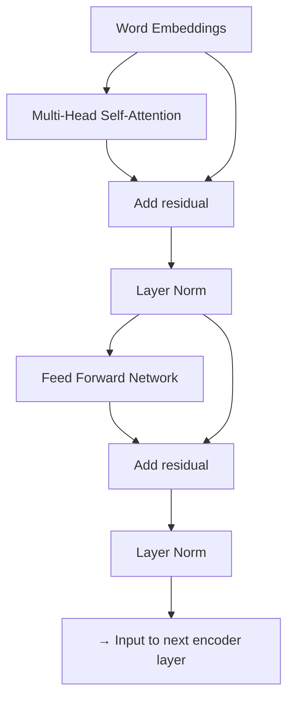

Stack this block $L$ times (6 in the original paper); output of layer $\ell$ feeds directly as input to layer $\ell+1$, always at the same model dimension $D$.

---

## 8. Positional Encoding `[55:16 – 1:00:20]`

### 8.1 The Problem: Attention Is Order-Blind `[54:44 – 55:26]`

Self-attention as defined so far gives the **same** representation regardless of word order — "the beetle drove off" and "drove off the beetle" would produce identical per-word outputs. We need to explicitly inject position information.

### 8.2 Sinusoidal Position Embeddings `[55:26 – 58:47]`

The original paper adds a fixed vector per position, built from sine/cosine waves of different frequencies — one distinct wave per embedding dimension, sampled at each position index:

```python
# Pseudocode (conceptual)
PE[pos, 2i]   = sin(pos / 10000**(2*i/D))
PE[pos, 2i+1] = cos(pos / 10000**(2*i/D))
```

> **Jargon**: *Sinusoidal Positional Encoding* — A fixed (non-learned), deterministic scheme where each dimension of the position vector follows a sine or cosine wave of a different period. This gives every position a unique, smoothly-varying "fingerprint" without needing extra trainable parameters.

### 8.3 Learned Position Embeddings `[58:47 – 59:49]`

Alternative: treat position embeddings as a learnable matrix ($\text{max\_positions} \times D$, e.g., $500 \times 512$), trained jointly with the rest of the model — this is what BERT and GPT actually use.

### 8.4 Combining with Word Embeddings `[59:49 – 1:00:20]`

$$\text{input}_i = \text{WordEmbedding}(x_i) + \text{PositionEmbedding}(i)$$

Applied only at the very first layer's input — the position signal then propagates through subsequent layers via the residual connections.

---

## 9. The Decoder: What's Different `[1:00:20 – 1:09:46]`

### 9.1 Encoder Parameter Recap `[1:01:13 – 1:02:11]`

Each encoder layer costs $12D^2$ parameters (§4.3, §5). Full encoder: $12D^2 \times L$. Original 6-layer, $D=512$ encoder ≈ **18M parameters**.

### 9.2 Three Sub-Layers in a Decoder Layer `[1:02:11 – 1:02:57]`

| Sub-layer | Purpose |
|-----------|---------|
| Masked Self-Attention | Attend to previously generated tokens only |
| Encoder–Decoder (Cross) Attention | Attend to the encoder's output representations |
| Feed-Forward Network | Same as encoder |

### 9.3 Teacher Forcing & Causal Masking `[1:02:57 – 1:06:10]`

At training time, we know the entire target sequence in advance (**teacher forcing** — feed the ground-truth previous token as input rather than the model's own prediction), which lets us compute all decoder positions **in parallel** just like the encoder. But this creates a leakage problem: if position $t$ can see position $t{+}1$, predicting $t{+}1$ becomes trivial.

**Fix**: mask out all "future" positions by setting their attention scores to $-\infty$ before softmax (so their weight becomes 0) — an upper-triangular mask.

> **Jargon**: *Teacher Forcing* — During training, feeding the *true* previous token as the decoder's input at each step (instead of its own, possibly wrong, prediction), so the whole sequence's losses can be computed in one parallel pass.

> **Jargon**: *Causal (Masked) Attention* — Self-attention restricted so a token can only attend to itself and earlier tokens, never future ones. Essential for autoregressive generation and for training decoders in parallel without leaking future information.

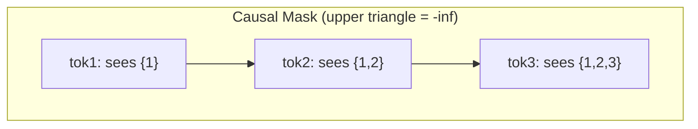

### 9.4 Encoder–Decoder Cross-Attention `[1:06:10 – 1:07:54]`

Same attention formula, but now: **Query** comes from the decoder's current representation, while **Key** and **Value** come from the encoder's final output. This is how the decoder "looks back" at the source sequence.

### 9.5 Computing the Decoder Loss `[1:07:54 – 1:09:46]`

$$\text{output}_i \in \mathbb{R}^D \;\xrightarrow{\;\text{project to vocab}\;}\; \text{logits} \in \mathbb{R}^{|V|} \;\xrightarrow{\;\text{softmax}\;}\; P(\text{token}) \;\xrightarrow{}\; \mathcal{L} = -\log P(\text{ground-truth token})$$

```python
# Pseudocode
logits = decoder_output @ E.T          # D -> vocab size |V|
probs  = softmax(logits)
loss   = -log(probs[ground_truth_token_id])
```

---

## 10. Transformer as a Language Model `[1:09:46 – 1:15:06]`

### 10.1 Weight Tying `[1:10:48 – 1:12:26]`

The embedding matrix $E \in \mathbb{R}^{D \times |V|}$ converts one-hot vocabulary vectors into dense embeddings at the *input*. The same matrix (transposed, $E^T$) can be reused to project the final hidden state back into vocabulary logits at the *output* — halving the number of unique parameters needed for input/output embeddings.

> **Jargon**: *Weight Tying* — Sharing the same embedding matrix between a model's input token-embedding layer and its output vocabulary-projection layer, reducing parameters while often improving performance.

### 10.2 Parameter Counts by Architecture `[1:13:17 – 1:15:00]`

| Architecture | Per-layer parameters | Used by |
|--------------|----------------------|---------|
| Encoder-only | $12D^2$ (self-attn $4D^2$ + FFN $8D^2$) | BERT |
| Decoder-only | $12D^2$ (masked self-attn $4D^2$ + FFN $8D^2$) | GPT, Llama, Mistral, Claude |
| Encoder-Decoder | $12D^2 + 16D^2 = 28D^2$ (adds cross-attn $4D^2$ per side) | T5, BART |

---

## 11. Why Pre-Training? `[1:15:06 – 1:23:41]`

### 11.1 The Scalability Problem `[1:15:06 – 1:18:01]`

Training from random initialization for *every* task, domain, and language independently requires massive labeled datasets per combination (e.g., ~100M parallel sentences per language pair for translation) — completely infeasible to scale.

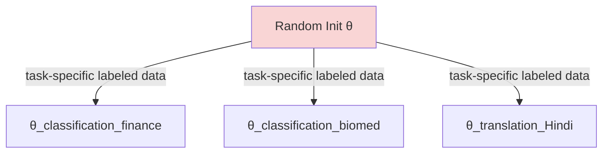

### 11.2 The Pre-Train → Fine-Tune Paradigm `[1:18:01 – 1:23:00]`

Instead: pre-train once on **unlabeled** text using a self-supervised objective (like next-word prediction), which requires no human annotation, then fine-tune the resulting weights on small labeled datasets per task.

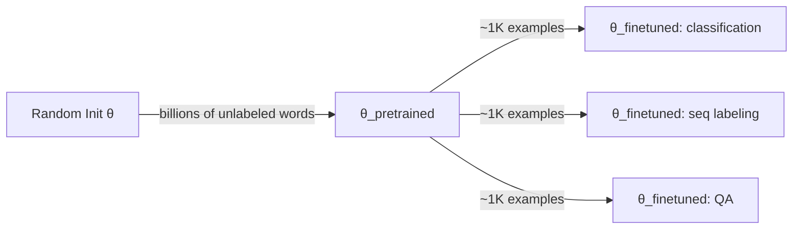

> **Jargon**: *Pre-training* — Training a model on a large generic (unlabeled) corpus with a self-supervised objective, so it acquires broad linguistic/world knowledge before being specialized.

> **Jargon**: *Fine-tuning* — Continuing to train a pre-trained model's weights (often plus a small new output head) on a much smaller, task-specific labeled dataset.

### 11.3 What Does Next-Word Prediction Teach a Model? `[1:20:00 – 1:21:47]`

Just from predicting the next word over huge corpora, a model implicitly learns:

- Grammar/morphology (dog → dog**s**)
- Comparatives/superlatives (big → enormous, needing world scale knowledge)
- World knowledge & factual recall (authorship, entities)
- Coreference & pronoun resolution
- Arithmetic ($\sqrt{4} = 2$)
- **Societal biases present in the training text** (e.g., pronoun-gender associations)

> **Jargon**: *Self-Supervised Learning* — Creating "labels" automatically from the raw data itself (e.g., the next word in a sentence *is* the label), avoiding the need for human annotation.

### 11.4 Three Pre-Training Architecture Families `[1:23:41 – 1:24:35]`

| Family | Attention type | Pre-training objective | Examples |
|--------|----------------|------------------------|----------|
| Encoder-only | Bidirectional | Masked Language Modeling | BERT |
| Decoder-only | Causal (masked/unidirectional) | Next-token prediction | GPT, Llama, Mistral, Claude |
| Encoder-Decoder | Bidirectional (enc) + Causal (dec) | Span corruption / seq-to-seq | T5, BART |

### 11.5 Which Is Easiest to Pre-Train? `[1:24:35 – 1:25:50]`

**Decoders** are simplest: next-word prediction is a natural, always-available objective — every token contributes to the loss. **Encoders** see full bidirectional context, so trivially predicting "the next word" is meaningless (the model already sees it) — a different trick is needed.

---

## 12. BERT: Masked Language Modeling `[1:25:50 – 1:30:13]`

### 12.1 The Masking Trick `[1:25:50 – 1:28:15]`

Take a sentence, e.g. "I **went** to the **store**." Replace some tokens with a special `[MASK]` placeholder: "I `[MASK]` to the `[MASK]`." Feed this into the encoder, and at each masked position, predict what the original word must have been — using bidirectional context from both sides.

> **Jargon**: *Masked Language Model (MLM)* — A pre-training objective where some input tokens are hidden (masked) and the model must predict the original token using both left and right context. This is BERT's core innovation, enabling bidirectional pre-training of an encoder.

### 12.2 The 80/10/10 Recipe `[1:28:15 – 1:29:20]`

To avoid the model only producing good representations at `[MASK]` positions (a mismatch with real inference, which has no masks), BERT selects 15% of tokens and:

| Sub-case | % of selected tokens | Action |
|----------|----------------------|--------|
| Replace with `[MASK]` | 80% (= 12% overall) | Predict the true word |
| Replace with random word | 10% (= 1.5% overall) | Predict the true word |
| Leave unchanged | 10% (= 1.5% overall) | Still predict the (same) true word |

Loss is computed only over these selected 15% of positions.

### 12.3 BERT Model Specs `[1:29:20 – 1:30:13]`

| Model | Layers | Model Dim | Heads | Parameters |
|-------|--------|-----------|-------|-----------|
| BERT-Base | 12 | 768 | 12 | 110M |
| BERT-Large | 24 | 1024 | 16 | 340M |

- Vocabulary: 30,000 sub-word units via **byte-pair encoding** — splits rare/long words into smaller reusable pieces.
- Training data: BooksCorpus + English Wikipedia (~3.3B words).
- Training cost: ~4 days on 64 TPU chips — but done **once**, then fine-tuned thousands of times by the community.

> **Jargon**: *Byte-Pair Encoding (BPE) / Sub-word Tokenization* — Breaking words into frequent sub-word pieces (e.g., "unhappiness" → "un" + "happi" + "ness") so a small, fixed vocabulary can still represent any word, including rare or unseen ones.

---

## 13. Fine-Tuning BERT for Downstream Tasks `[1:30:13 – 1:35:59]`

### 13.1 The `[CLS]` Token `[1:30:13 – 1:32:01]`

BERT prepends a special `[CLS]` token to every input. After passing through all layers, the `[CLS]` token's final 768-dim representation is used as a summary of the whole sequence for classification.

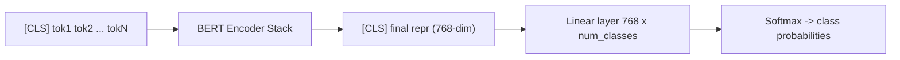

### 13.2 Task-Specific Input/Output Patterns `[1:32:01 – 1:34:19]`

| Task | Input format | Prediction |
|------|--------------|-----------|
| Single-sentence classification | `[CLS]` + sentence | Class from `[CLS]` representation |
| Sentence-pair classification | `[CLS]` sent1 `[SEP]` sent2 | Class from `[CLS]` representation |
| Question Answering | `[CLS]` question `[SEP]` paragraph | Start/end span in paragraph |
| Sequence Labeling (NER/POS) | `[CLS]` + sentence | One label per token |

> *Reads as*: "Fine-tuning only needs a small additional linear layer (e.g., $768 \times 3$ for a 3-class problem) on top of the frozen or lightly-updated pre-trained BERT — because BERT already knows language, you only need a small labeled dataset."

### 13.3 GLUE Benchmark Results `[1:35:06 – 1:35:59]`

BERT-Base and BERT-Large outperformed all prior architectures across the GLUE benchmark suite (linguistic acceptability, sentiment, paraphrase detection, sentence similarity, entailment, and more) using the *same* pre-trained backbone for every task — this generality is what made BERT so influential.

---

## 14. Pre-Training Encoder-Decoder & Decoder-Only Models `[1:35:59 – 1:39:31]`

### 14.1 T5: Span Corruption `[1:35:59 – 1:37:39]`

T5 (Text-to-Text Transfer Transformer) corrupts spans of the input with sentinel tokens and trains the decoder to fill them in:

> *Example*: Original: "Thank you for inviting me to your party last week."
> Input: "Thank you for inviting me to your `X` `Y` week."
> Target: "`X` party last `Y`"

Because every task becomes "text in → text out," T5 can be fine-tuned for translation, similarity scoring (even generating a number like "3.8"), summarization, and more — all as sequence-to-sequence problems.

### 14.2 Decoder-Only (GPT) Recap `[1:37:39 – 1:39:31]`

Simplest of all three: just keep predicting the next word via teacher forcing, computing loss on **100%** of tokens (unlike BERT's 15%). GPT's parameter count is close to BERT's, with the small difference coming from a slightly larger vocabulary (~10K more tokens × 768 ≈ 7M extra parameters).

---

## Quick Reference: Key Jargon Glossary

| Term | One-Line Definition |
|------|---------------------|
| Attention | Query-dependent weighted average over a set of values |
| Query / Key / Value | Three projections of a token used to compute and apply attention (search-engine analogy) |
| Self-Attention | Attention where queries, keys, and values all come from the same sequence |
| Multi-Head Attention | Several attention computations run in parallel with independent projections, then concatenated |
| Scaled Dot-Product | Dividing $q \cdot k$ by $\sqrt{d_k}$ to keep softmax inputs well-scaled |
| Residual Connection | Adding a sub-layer's input back to its output to preserve signal through depth |
| Layer Normalization | Re-centering activations to mean 0, std 1 after each residual addition |
| Positional Encoding | Fixed or learned vectors added to embeddings to inject word-order information |
| Causal (Masked) Attention | Restricting attention to current + past tokens only, for autoregressive decoding |
| Teacher Forcing | Feeding ground-truth previous tokens during training to parallelize decoder computation |
| Encoder-Decoder (Cross) Attention | Attention where the query comes from the decoder and key/value come from the encoder |
| Weight Tying | Sharing the embedding matrix between input embedding and output vocabulary projection |
| Pre-training | Self-supervised training on large unlabeled corpora before task-specific fine-tuning |
| Fine-tuning | Adapting a pre-trained model to a specific task with a small labeled dataset |
| Masked Language Model (MLM) | BERT's pre-training objective: predict randomly masked tokens from bidirectional context |
| Byte-Pair Encoding (BPE) | Sub-word tokenization scheme balancing vocabulary size and coverage |
| `[CLS]` Token | Special token whose final representation summarizes the whole input for classification |

---

## Summary

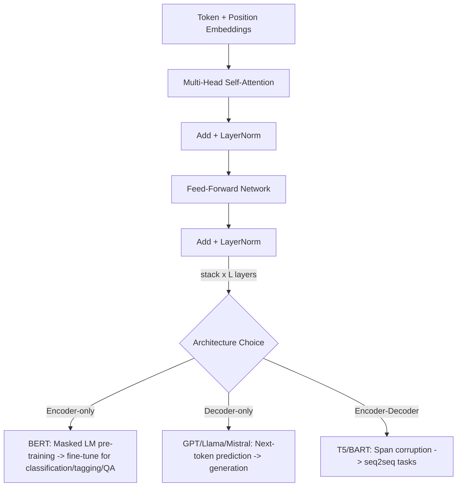

**Key Takeaway**: The Transformer replaces sequential RNN computation with parallelizable attention over query/key/value projections, and — combined with self-supervised pre-training on massive unlabeled text — lets one general-purpose model (BERT, GPT, T5, or their descendants) be adapted cheaply to virtually any downstream NLP task.

---

*Notes generated from SRT transcript with timestamps. whisper.cpp (small model, Metal GPU). Enhanced with AI expert annotations.*
