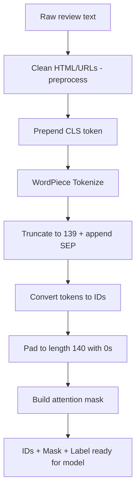
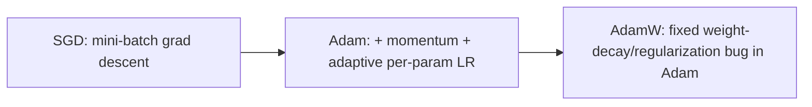
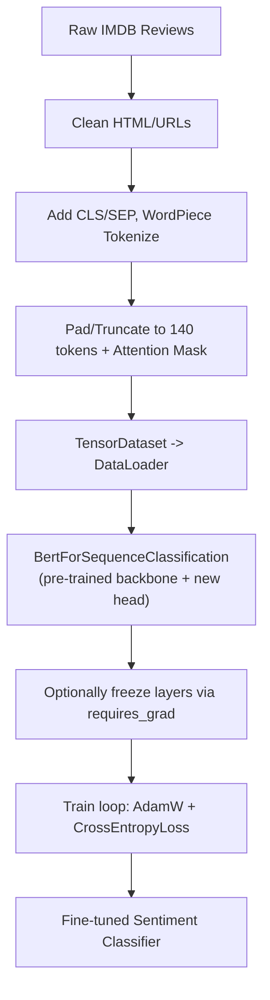

# Lecture 35: Advanced DL Lab Transformers BERT

**Course**: AI for Industrial Cyber-Physical Systems (AI4ICPS) — IIT Kharagpur  
**Duration**: 1:18:11  
**Source**: ai4icps-upskilling.in  

---

## Overview

This hands-on lab walks through fine-tuning BERT (via HuggingFace's `transformers` library) for binary sentiment classification on the IMDB movie review dataset — covering data preprocessing, sub-word tokenization, padding/attention masks, PyTorch `Dataset`/`DataLoader` construction, three ways to instantiate a BERT model, layer freezing, and the AdamW training loop.

---

## 1. Setup & Libraries `[0:00 – 3:52]`

### 1.1 Key Libraries `[0:32 – 2:53]`

| Library | Purpose |
|---------|---------|
| `transformers` (HuggingFace) | Pre-trained transformer models + tokenizers |
| `torchmetrics` | Ready-made accuracy/precision/recall/F1 metrics |
| `datasets` (HuggingFace) | Download standard NLP datasets (e.g. IMDB) |
| `tqdm` | Progress bars for loops / training |
| `pandas`, `numpy`, `re` | Data wrangling & regex-based cleaning |

> **Jargon**: *HuggingFace Transformers* — An open-source library providing a unified interface to load thousands of pre-trained transformer models and their matching tokenizers, so you rarely need to implement architectures from scratch.

### 1.2 Device Selection `[3:11 – 3:52]`

```python
device = torch.device("cuda" if torch.cuda.is_available() else "cpu")
```

> *Reads as*: "Use the GPU if one is available, otherwise fall back to CPU." Always prefer this conditional form over hardcoding `"cuda"` or `"cpu"` — it makes code portable across machines.

---

## 2. Data Preprocessing Pipeline `[3:52 – 30:33]`

### 2.1 The Task: IMDB Sentiment Classification `[5:24 – 8:14]`

25,000 IMDB movie reviews, each labeled **positive** or **negative**. Goal: fine-tune BERT to automatically predict sentiment from review text — valuable because manually tagging large review volumes doesn't scale, and reviews carry richer signal than star ratings alone.

> **Jargon**: *Garbage In, Garbage Out (GIGO)* — A foundational data science principle: model quality is bounded by data quality. Preprocessing/cleaning effort typically matters more than model architecture choice.

### 2.2 Text Cleaning (`preprocess` function) `[8:14 – 10:31]`

Raw IMDB text is scraped from a website, so it's full of HTML artifacts.

```python
import re

def preprocess(x):
    x = re.sub(r'https?', ' ', x)      # remove http/https fragments
    x = re.sub(r'<.*?>', ' ', x)        # remove HTML tags like <br />
    x = x.strip()                        # trim leading/trailing whitespace
    return x
```

> *Reads as*: "Strip out URL fragments and anything inside angle brackets (HTML tags), then trim excess whitespace." `<br />` tags are HTML's line-break marker — the equivalent of `\n` on a web page.

### 2.3 Tokenization: Words vs. Characters vs. Sub-words `[16:18 – 21:37]`

| Granularity | Vocabulary Size | Sequence Length | Trade-off |
|-------------|------------------|-----------------|-----------|
| Word-level | Huge (~100K+) | Short | Huge embedding table; can't handle unseen words |
| Character-level | Tiny (~50) | Very long | Loses word-level semantics; long sequences hurt attention |
| **Sub-word (BPE/WordPiece)** | Moderate (~30K) | Moderate | Best of both — rare/unseen words decompose into known pieces |

> **Jargon**: *Sub-word Tokenization* — Splitting words into frequent, reusable fragments (e.g., "going" → "go" + "##ing"). BERT uses **WordPiece**, marking continuation fragments with a `##` prefix so the model knows they attach to the previous token rather than starting a new word.


> *Example*: Tokenizing "I rented and I am curious yellow from my video store" with BERT's `bert-base-uncased` tokenizer: common words like "I" and "rented" stay whole, but rarer words fragment into `##`-prefixed pieces — keeping the vocabulary at just ~30,000 sub-words while still covering arbitrary English text.

### 2.4 `[CLS]` and `[SEP]` Special Tokens `[14:12 – 27:02]`

| Token | Role |
|-------|------|
| `[CLS]` | Prepended to every input; its final hidden vector is trained to summarize the whole sequence for classification |
| `[SEP]` | Marks the end of a sentence (or the boundary between two sentences, for pair tasks) |

```python
sentences = "[CLS] " + df["text"]   # prepend CLS to every review
```

### 2.5 Fixed-Length Sequences: Truncation & Padding `[23:46 – 26:41]`

GPUs require uniformly-shaped tensors, but reviews vary wildly in length. The lab fixes `max_length = 140` sub-word tokens:

```python
MAX_LEN = 140
tokens = tokenizer.tokenize(sentence)[:MAX_LEN - 1] + ["[SEP]"]   # truncate + append SEP
ids = tokenizer.convert_tokens_to_ids(tokens)
ids = ids + [0] * (MAX_LEN - len(ids))                             # pad with 0s
```

> **Jargon**: *Padding* — Filling shorter sequences with a reserved "no-op" token (ID `0`) so every sequence in a batch has identical length, enabling efficient batched GPU computation.

> **Math Note**: Truncating to the first 140 tokens is a pragmatic but lossy choice — many reviews open with unrelated preamble ("I rented this movie..."), so the *real* sentiment signal may sit in the middle or end. A smarter strategy (e.g. sampling from the middle, or using a sliding window) could reduce noise.

### 2.6 Attention Masks `[29:36 – 30:33]`

Padding tokens (ID `0`) carry no real information, so we must tell self-attention to ignore them:

```python
attention_mask = [1 if token_id != 0 else 0 for token_id in ids]
```

> **Jargon**: *Attention Mask* — A binary vector marking which tokens are "real" (`1`) vs. padding (`0`). Passed alongside token IDs so self-attention assigns zero weight to padded positions (effectively via a $-\infty$ score before softmax, same causal-masking trick used in decoders).



---

## 3. Dataset & DataLoader `[48:08 – 53:08]`

### 3.1 `TensorDataset` and `DataLoader` `[48:23 – 50:09]`

```python
from torch.utils.data import TensorDataset, DataLoader

train_dataset = TensorDataset(
    torch.tensor(train_ids), torch.tensor(train_masks), torch.tensor(train_labels)
)
train_loader = DataLoader(train_dataset, batch_size=32, shuffle=True, num_workers=4)
```

> **Jargon**: *Dataset vs. DataLoader* — A `Dataset` is an **iterator** that fetches one sample at a time; a `DataLoader` wraps it to fetch samples in parallel (via `num_workers`) and assemble them into batches. Setting `num_workers=4` spins up 4 parallel data-fetching processes instead of sequential single-sample loading — directly speeding up training throughput.

| Parameter | Meaning |
|-----------|---------|
| `batch_size` | Number of samples per gradient update |
| `shuffle` | Randomize sample order each epoch (`True` for training, `False` for eval) |
| `num_workers` | Parallel worker processes for data loading (default `0` = sequential) |

---

## 4. Loading the BERT Model `[53:08 – 1:05:04]`

### 4.1 Three Ways to Instantiate BERT `[53:33 – 58:58]`

| Method | Weights | Use case |
|--------|---------|----------|
| `BertConfig()` only | Random init | Train architecture from scratch on your own huge corpus |
| `BertModel.from_pretrained(...)` | Pre-trained | Use BERT as a frozen/fine-tunable feature extractor |
| `BertForSequenceClassification.from_pretrained(...)` | Pre-trained + new head | Pre-trained BERT + an added classification layer, ready to fine-tune |

```python
from transformers import BertConfig, BertForSequenceClassification

config = BertConfig.from_pretrained("bert-base-uncased")   # inspect/architecture metadata
model = BertForSequenceClassification.from_pretrained(
    "bert-base-uncased", num_labels=2
).to(device)
```

> **Jargon**: *Config Object* — A JSON-serializable object holding every architectural hyperparameter (hidden size, number of layers, number of attention heads, dropout rates, activation function, vocab size, etc.). HuggingFace makes these **read-only at runtime** — to actually change dimensions you must build a *new* config and re-instantiate the model.

Key config values seen for `bert-base-uncased`:

| Field | Value | Meaning |
|-------|-------|---------|
| `vocab_size` | 30,522 | Sub-word vocabulary size |
| `hidden_size` | 768 | Model/embedding dimension |
| `max_position_embeddings` | 512 | Max sequence length supported |
| `hidden_act` | GELU | Feed-forward activation function |
| `attention_probs_dropout_prob` | 0.1 | Dropout applied to attention weights |

### 4.2 The BERT Pooler & Classification Head `[59:43 – 1:01:13]`


- **BERT Pooler**: takes only the `[CLS]` token's final 768-dim representation, passes it through a `768×768` linear layer, then `tanh` (squashing to $[-1, 1]$).
- **Classifier head**: another linear layer, `768 × num_labels` (here `768 × 2`), producing raw logits.
- Prediction rule: whichever output index has the highest value is the predicted class.

> **Jargon**: *BERT Pooler* — A small extra transformation ($768 \times 768$ linear + tanh) applied specifically to the `[CLS]` token's representation before classification, distinct from the raw `[CLS]` embedding output by the encoder stack.

### 4.3 Swapping the Classification Head `[1:01:13 – 1:02:33]`

```python
model.classifier = torch.nn.Linear(768, 10)   # e.g., switch to a 10-class problem
```

Directly replacing `model.classifier` lets you repurpose the same pre-trained backbone for a different number of output classes.

### 4.4 Selective Layer Freezing `[1:02:33 – 1:04:35]`

To fine-tune only specific layers (e.g. the classifier + last two encoder layers) and freeze the rest:

```python
for name, param in model.named_parameters():
    if "classifier" in name or "encoder.layer.9" in name or "encoder.layer.10" in name:
        param.requires_grad = True
    else:
        param.requires_grad = False

trainable_params = sum(p.numel() for p in model.parameters() if p.requires_grad)
```

> **Jargon**: *`requires_grad`* — A PyTorch tensor flag controlling whether gradients are computed/accumulated for that parameter during backpropagation. Setting it to `False` "freezes" a layer — its weights stay fixed while gradients still flow *through* it to earlier layers if needed.

> *Reads as*: "Only update the classifier head and encoder layers 9–10; leave everything else (embeddings + layers 0–8) untouched during training." This is a common strategy to fine-tune faster and avoid catastrophic forgetting of general language knowledge in the earlier layers.

---

## 5. Training Loop `[1:05:04 – 1:13:20]`

### 5.1 Optimizer Choice: AdamW `[1:05:31 – 1:07:24]`



> **Jargon**: *AdamW* — Adam optimizer with a corrected ("decoupled") weight-decay formulation. Empirically the de-facto standard optimizer for training transformers; use small learning rates (much smaller than the 0.01–0.1 range typical for plain SGD).

### 5.2 Loss & Metrics `[1:07:55 – 1:08:23]`

```python
from torch.nn import CrossEntropyLoss
from torchmetrics.classification import BinaryAccuracy

criterion = CrossEntropyLoss()
accuracy = BinaryAccuracy().to(device)
```

> **Jargon**: *Logits* — The raw, un-normalized output scores from the final linear layer, *before* softmax. `CrossEntropyLoss` in PyTorch expects raw logits (it applies `log_softmax` internally) — never feed it already-softmaxed probabilities.

### 5.3 The Epoch Loop `[1:08:50 – 1:12:39]`

```python
for epoch in range(num_epochs):
    model.train()                                   # enable dropout / grad updates
    for ids, masks, labels in train_loader:
        ids, masks, labels = ids.to(device), masks.to(device), labels.to(device)
        optimizer.zero_grad()
        outputs = model(ids, attention_mask=masks)
        loss = criterion(outputs.logits, labels)     # logits, not softmax probs
        loss.backward()
        optimizer.step()

    model.eval()                                      # disable dropout, no grad updates
    with torch.no_grad():
        for ids, masks, labels in val_loader:
            ids, masks, labels = ids.to(device), masks.to(device), labels.to(device)
            outputs = model(ids, attention_mask=masks)
            val_loss = criterion(outputs.logits, labels)
```

> **Jargon**: *`model.train()` vs. `model.eval()`* — Toggles layer behavior: in train mode, dropout randomly zeroes activations and batch-norm statistics update; in eval mode, both are frozen/deterministic. Always call `model.eval()` (and wrap in `torch.no_grad()`) before validation/inference.

| Step | Purpose |
|------|---------|
| `optimizer.zero_grad()` | Clear gradients from the previous batch |
| `.to(device)` | Move tensors from CPU to GPU (or vice versa) |
| `loss.backward()` | Backpropagate — compute gradients via the chain rule |
| `optimizer.step()` | Apply the gradient update to trainable parameters |

---

## 6. Live Q&A Highlights `[1:13:29 – 1:18:11]`

### 6.1 Is Decoder Inference Sequential? `[1:13:47 – 1:14:25]`

Yes — during autoregressive generation, the decoder's `forward()` pass runs token-by-token (each new token depends on previously generated ones), unlike training where teacher forcing allows full parallelism.

### 6.2 From `[CLS]` to Binary Output, Step by Step `[1:14:36 – 1:18:02]`

$$\underbrace{[CLS]\text{ embedding} \in \mathbb{R}^{768}}_{\text{from encoder stack}} \xrightarrow{\times W_{pool} (768\times768),\ \tanh} \mathbb{R}^{768} \xrightarrow{\times W_{cls} (768\times2)} \mathbb{R}^2 \xrightarrow{\text{softmax/argmax}} \text{class}$$

> *Example*: If the two output logits are $[0.9, 0.1]$ after softmax, index 0 wins → predicted class 0 (e.g., "negative"). If they were $[0.3, 0.7]$, index 1 wins → class 1 ("positive").

---

## Quick Reference: Key Jargon Glossary

| Term | One-Line Definition |
|------|---------------------|
| HuggingFace `transformers` | Library providing unified access to pre-trained transformer models and tokenizers |
| Sub-word Tokenization (WordPiece) | Splitting words into frequent reusable fragments to balance vocabulary size and coverage |
| `[CLS]` / `[SEP]` | Special tokens marking sequence start / sentence boundary, used for classification and QA |
| Padding | Filling shorter sequences with token ID 0 so batches have uniform length |
| Attention Mask | Binary vector telling self-attention which tokens are real vs. padding |
| `Dataset` / `DataLoader` | PyTorch abstractions for sample iteration and parallel batch construction |
| BERT Config | JSON object defining all architectural hyperparameters of a BERT model |
| BERT Pooler | Extra linear + tanh transform applied to the `[CLS]` embedding before classification |
| `requires_grad` | PyTorch flag controlling whether a parameter receives gradient updates (frozen vs. trainable) |
| AdamW | Adam optimizer with corrected weight-decay regularization; standard choice for transformers |
| Logits | Raw, pre-softmax output scores from a model's final linear layer |
| `model.train()` / `model.eval()` | Toggles dropout/batch-norm behavior for training vs. inference |

---

## Summary



**Key Takeaway**: Fine-tuning a pre-trained transformer for a real task is mostly a data-engineering problem — clean text, tokenize with the model's own sub-word vocabulary, pad/mask to fixed length, and let HuggingFace's `BertForSequenceClassification` handle attaching a small trainable head on top of a frozen-or-fine-tunable pre-trained backbone.

---

*Notes generated from SRT transcript with timestamps. whisper.cpp (small model, Metal GPU). Enhanced with AI expert annotations.*
