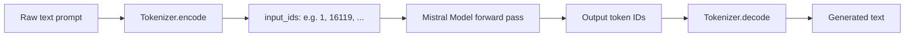
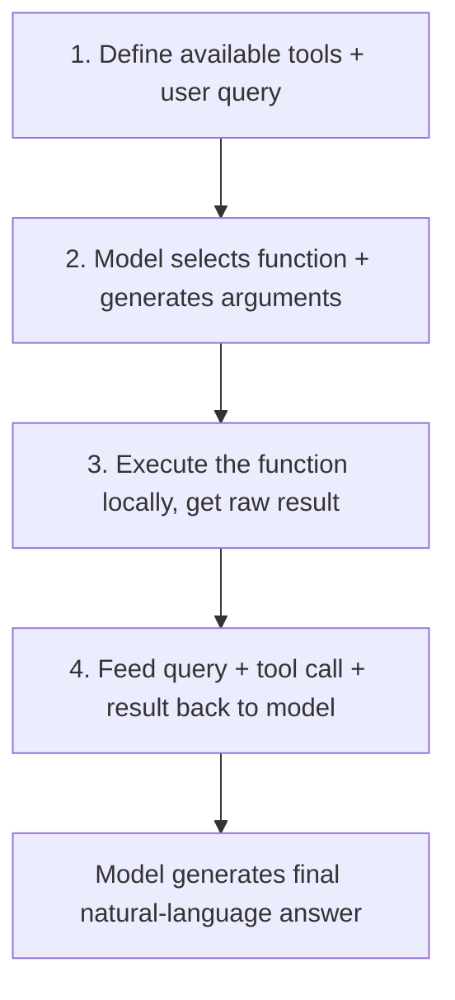
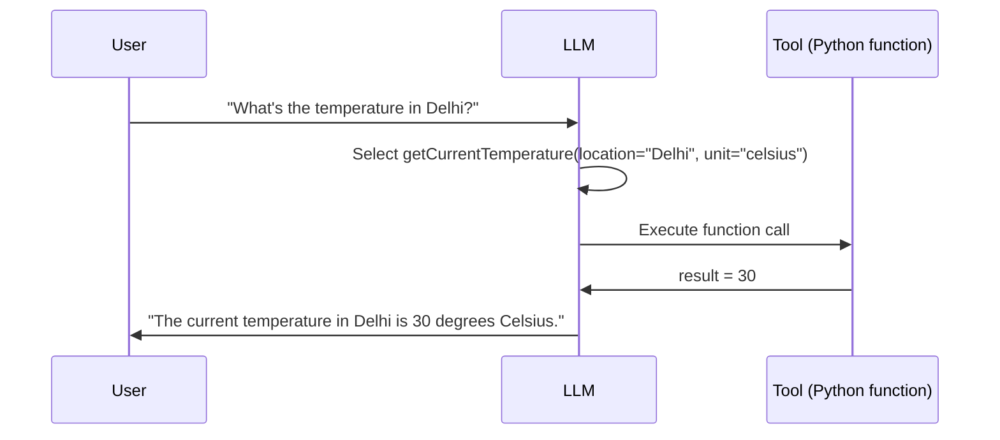
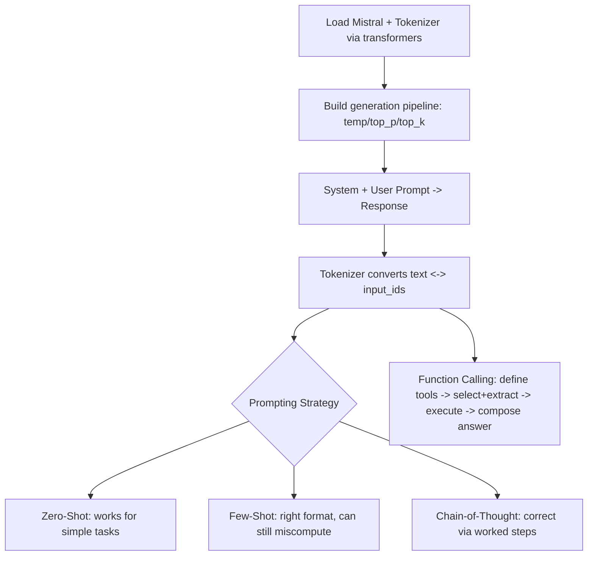

# Lecture 37: Prompting OpenSource LLMs Llama2 Mistral Part2

**Course**: AI for Industrial Cyber-Physical Systems (AI4ICPS) — IIT Kharagpur  
**Duration**: 0:13:17  
**Source**: ai4icps-upskilling.in  

---

## Overview

A short, code-first walkthrough that operationalizes Lecture 36's theory: loading Mistral via HuggingFace `transformers`, inspecting how the tokenizer converts prompts to token IDs, comparing zero-shot vs. few-shot vs. chain-of-thought on a math problem, and implementing function calling end-to-end with a live weather-query example.

---

## 1. Loading Mistral for Inference `[0:00 – 2:06]`

### 1.1 Setup `[0:26 – 1:33]`

```bash
pip install transformers accelerate torchvision
```

```python
from transformers import AutoModelForCausalLM, AutoTokenizer, pipeline

model_name = "mistralai/Mistral-7B-Instruct-v0.3"   # gated model - requires HF access approval
tokenizer = AutoTokenizer.from_pretrained(model_name)
model = AutoModelForCausalLM.from_pretrained(model_name, device_map="auto")
```

> **Jargon**: *Gated Model* — A model repository on HuggingFace Hub that requires explicitly requesting and being granted access (plus an authentication token) before you can download its weights — common for models with usage restrictions (e.g., Meta's Llama, Mistral's instruct variants).

> **Jargon**: *`device_map="auto"`* — Tells `transformers`/`accelerate` to automatically distribute model weights (as safetensors) across all available CPUs/GPUs, handling multi-GPU placement without manual intervention.

### 1.2 Building the Generation Pipeline `[1:33 – 2:06]`

```python
generator = pipeline(
    "text-generation",
    model=model,
    tokenizer=tokenizer,
    temperature=0.7,
    top_p=0.85,
    top_k=10,
    max_new_tokens=256,
)
```

| Parameter | Meaning |
|-----------|---------|
| `temperature` | Randomness of output (recap from Lecture 36) |
| `top_p` | Sample from tokens whose cumulative probability sums to 0.85 |
| `top_k` | Restrict sampling to top 10 candidate tokens |
| `max_new_tokens` | How many *additional* tokens to generate beyond the input prompt |

### 1.3 System + User Prompt → Response `[2:06 – 2:59]`

```python
messages = [
    {"role": "system", "content": "You are a helpful medical assistant chatbot. You provide accurate and informative responses to medical questions."},
    {"role": "user", "content": "What is the symptom of the flu?"}
]
output = generator(messages)
print(output[0]["generated_text"][-1]["content"])   # assistant's reply text
```

> *Reads as*: "The pipeline returns the full conversation history (system + user + assistant turns) as a list of role/content dictionaries; the assistant's answer lives in the last entry's `content` field." The model correctly responds with a description of flu symptoms (fever, cough, fatigue, etc.).

---

## 2. Tokenizer Deep Dive `[3:04 – 4:44]`

### 2.1 Input IDs and Attention Masks `[3:04 – 3:38]`

```python
encoded = tokenizer("This prompt engineering course is offered by AI for ICPS. Let's learn about tokenizer and tokens.", return_tensors="pt")
print(encoded["input_ids"])       # numbers the model actually sees
print(encoded["attention_mask"])  # 1s for real tokens
```

> *Reads as*: "The tokenizer never hands the model raw text — text is converted into a sequence of integer `input_ids`; the model processes only these numbers, produces new numbers as output, and the tokenizer decodes them back into readable text."



### 2.2 Token ID ↔ Text Mapping `[3:38 – 4:44]`

> *Example*: Token ID `1` → beginning-of-sentence marker; token ID `16119` → the sub-word `prompt`. This mapping is a fixed, one-to-one lookup baked into the model's vocabulary — the same for system-prompt tokens and user-prompt tokens alike.

---

## 3. Prompting Strategy Comparison: A Math Example `[4:49 – 6:45]`

### 3.1 Zero-Shot `[4:49 – 5:03]`

```python
messages = [
    {"role": "system", "content": "You are a math expert assistant."},
    {"role": "user", "content": "What is the result of 345 + 789?"}
]
# Output: 1134  (correct — simple arithmetic needs no examples)
```

### 3.2 Few-Shot `[5:03 – 6:00]`

```python
messages = [
    {"role": "system", "content": "You are a math expert assistant."},
    {"role": "user", "content": "Solve for x: 2x + 3 = 7"},
    {"role": "assistant", "content": "The result is x = 2."},
    {"role": "user", "content": "Solve for x: 3x - 5 = 10"},
    {"role": "assistant", "content": "The result is x = 5."},
    {"role": "user", "content": "Solve for x: 4x + 2 = 30"}   # new question
]
# Output: "The result is x = 6."  -- WRONG (correct answer: x = 7)
```

> *Reads as*: "Few-shot examples teach the model the *answer format* ('The result is x = ...') but provide no worked derivation — so on a problem requiring careful arithmetic, the model pattern-matches the style but still computes incorrectly." $4x + 2 = 30 \Rightarrow 4x = 28 \Rightarrow x = 7$, not 6.

### 3.3 Chain-of-Thought Fixes It `[6:00 – 6:45]`

```python
messages = [
    {"role": "system", "content": "You are a math expert assistant."},
    {"role": "user", "content": "Solve for x: 2x + 3 = 7"},
    {"role": "assistant", "content": "Subtract 3 from both sides: 2x = 4. Divide both sides by 2: x = 2."},
    {"role": "user", "content": "Solve for x: 4x + 2 = 30"}
]
# Output: "First subtract 2 from both sides, so it becomes 4x = 28. Now divide both sides by 4, so x = 7."  -- CORRECT
```

> **Jargon**: *Worked-Example Reasoning* — Providing the intermediate algebraic steps (not just the final answer) in few-shot examples teaches the model *the method*, not just the output pattern — directly resolving the failure mode seen with plain few-shot prompting.

| Prompting Style | Same Question (`4x + 2 = 30`) | Result |
|------------------|-------------------------------|--------|
| Few-Shot (answer only) | `x = 6` | Incorrect |
| Chain-of-Thought (worked steps) | `x = 7` | Correct |

---

## 4. Function Calling End-to-End `[6:47 – 13:17]`

### 4.1 The Four-Step Pipeline `[6:47 – 7:52]`



### 4.2 Step 1: Defining Tools `[7:57 – 8:45]`

```python
tools = [
    {
        "name": "getCurrentTemperature",
        "description": "Get the current temperature for a given location.",
        "parameters": {"location": "string", "unit": "string (celsius/fahrenheit)"}
    },
    {
        "name": "getCurrentWindSpeed",
        "description": "Get the current wind speed for a given location.",
        "parameters": {"location": "string"}
    }
]
```

> *Reads as*: "Each tool's name, description, and expected argument schema are given to the model as structured metadata — this is what lets the model later decide *which* function fits a user's question and *what* values to fill in."

### 4.3 Steps 1–2: Query → Function Selection & Argument Extraction `[8:45 – 10:22]`

```python
messages = [
    {"role": "system", "content": "You respond to weather queries. Reply with the unit used in the queried location."},
    {"role": "user", "content": "Hey, what's the temperature in Delhi right now?"}
]
inputs = tokenizer.apply_chat_template(
    messages, tools=tools, add_generation_prompt=True, return_dict=True, return_tensors="pt"
)
output = model.generate(**inputs)
response = tokenizer.decode(output[0])
```

Given "Delhi" as a location argument and two candidate functions, the model correctly selects `getCurrentTemperature` (not `getCurrentWindSpeed`, since the user asked about temperature) and extracts `location="Delhi", unit="celsius"`.

### 4.4 Step 3: Executing the Tool Locally `[10:22 – 12:09]`

Mistral requires a generated **tool call ID** to be appended alongside the function-call message before execution:

```python
import json, random

tool_call_id = str(random.randint(0, 1_000_000))
function_call = json.loads(response_string)   # parse model's string output into a dict

if function_call["name"] == "getCurrentTemperature":
    result = getCurrentTemperature(**function_call["arguments"])   # dummy or real API call
elif function_call["name"] == "getCurrentWindSpeed":
    result = getCurrentWindSpeed(**function_call["arguments"])
```

> **Jargon**: *Tool Call ID* — A unique identifier Mistral requires when reporting a function's result back into the conversation, linking the "assistant requested this call" message to the "here's the result" message — necessary bookkeeping for multi-turn tool-use conversations.

> *Reads as*: "The model's raw output is a JSON-formatted *string* naming the function and its arguments; your code must parse (`json.loads`) it into an actual dictionary before you can call the real Python function with those arguments."

### 4.5 Step 4: Feeding Results Back for the Final Answer `[12:09 – 13:17]`

```python
messages.append({"role": "assistant", "tool_calls": [{"id": tool_call_id, "function": function_call}]})
messages.append({"role": "tool", "tool_call_id": tool_call_id, "content": str(result)})

final_inputs = tokenizer.apply_chat_template(messages, tools=tools, return_tensors="pt")
final_output = model.generate(**final_inputs)
print(tokenizer.decode(final_output[0]))
# "The current temperature in Delhi is 30 degrees Celsius."
```

> *Reads as*: "Combine the original question, the model's tool-call decision, and the tool's execution result into one message history, then ask the model one more time to compose a natural-language answer from all of it."



The end user only ever sees the final natural-language answer — function selection, argument extraction, execution, and result-composition all happen transparently in the backend pipeline the developer built.

---

## Quick Reference: Key Jargon Glossary

| Term | One-Line Definition |
|------|---------------------|
| Gated Model | HuggingFace model requiring explicit access approval + auth token |
| `device_map="auto"` | Automatic multi-CPU/GPU weight placement via `accelerate` |
| `input_ids` / `attention_mask` | Tokenizer output: integer token sequence + real-vs-padding indicator |
| Worked-Example Reasoning | Showing derivation steps (not just answers) in few-shot examples |
| Tool Call ID | Unique identifier linking a model's function-call request to its result in conversation history |
| Function Calling Pipeline | Define tools → model selects + extracts args → execute → feed result back → final answer |

---

## Summary



**Key Takeaway**: Practical LLM engineering is mostly plumbing around HuggingFace `transformers` — configuring sampling parameters, structuring chat-template messages correctly, and (for function calling) faithfully round-tripping tool definitions, model-generated arguments, and execution results back into the conversation so the model can produce one clean, final answer.

---

*Notes generated from SRT transcript with timestamps. whisper.cpp (small model, Metal GPU). Enhanced with AI expert annotations.*
