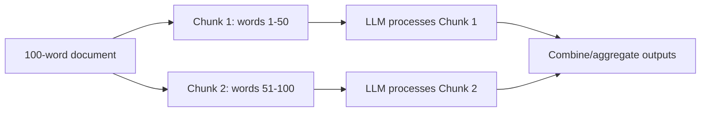
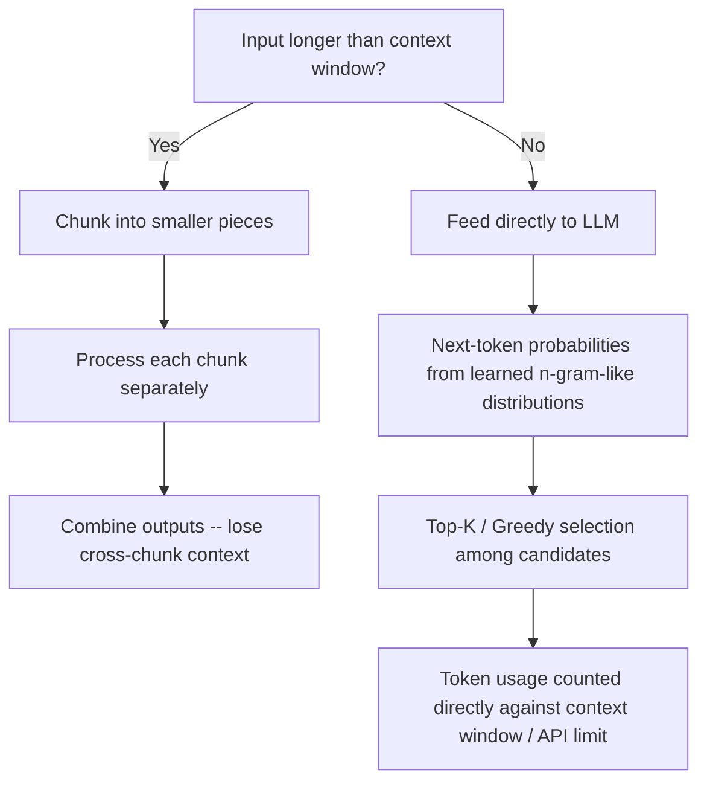

# Lecture 38: Prompting OpenSource LLMs Llama2 Mistral Part3

**Course**: AI for Industrial Cyber-Physical Systems (AI4ICPS) — IIT Kharagpur  
**Duration**: 0:03:25  
**Source**: ai4icps-upskilling.in  

---

## Overview

A brief Q&A coda closing out the Mistral prompting mini-series, addressing three practical audience questions: handling inputs that exceed the context window, where top-K sampling's likelihood weights come from, and whether token limits in commercial LLM APIs reflect memory usage or raw token counts.

---

## 1. Handling Inputs Larger Than the Context Window `[0:00 – 1:12]`

### 1.1 The Problem `[0:00 – 0:31]`

The **context window** caps how much text an LLM can process in one pass. If your context window is 50 words but your document is 100 words, the excess (the last 50 words) gets **truncated** — silently dropped from the model's view.

> **Jargon**: *Truncation* — When input text exceeds a model's context window, the overflow is simply cut off (usually from the end), meaning that content is never seen by the model at all.

### 1.2 The Fix: Chunking `[0:31 – 1:03]`

Split the oversized document into smaller **chunks** that each fit within the context window, process them separately, then combine the results.

> **Jargon**: *Chunking* — Splitting a document too large for the context window into smaller, independently-processable pieces (e.g., 50 words each), then merging the per-chunk outputs afterward.

**Trade-off**: Chunking loses **cross-chunk context** — the model processing Chunk 1 has no visibility into Chunk 2's content, and vice versa. Information or dependencies that span the chunk boundary are lost.

> *Reads as*: "If a fact needed to answer a question about the beginning of a document actually appears near the end, splitting the document into isolated chunks means the model answering from Chunk 1 alone will never see it." This is precisely why the field continually pushes toward **larger context windows** (recall Lecture 36: Mistral 7B went from 8K → 32K tokens across versions) — bigger windows reduce how often chunking is even necessary.

| Approach | Context Preserved? | When to Use |
|----------|---------------------|-------------|
| Fit whole document (large context window) | Full | Preferred whenever the model supports it |
| Chunking + combine | Partial (lost across chunk boundaries) | Necessary fallback for oversized documents on smaller-context models |

---

## 2. Where Do Top-K's Likelihood Weights Come From? `[1:12 – 2:17]`

### 2.1 N-gram Probability Foundations `[1:12 – 1:53]`

The "likelihood" underlying next-token sampling ultimately traces back to classical **n-gram language models** — statistical probability tables learned from large text corpora.

$$P(w_3 \mid w_1, w_2) = \frac{\text{count}(w_1, w_2, w_3)}{\text{count}(w_1, w_2)}$$

> *Reads as*: "A trigram model asks: given the previous two words, what's the probability of each possible third word? This probability is estimated by counting how often that exact three-word sequence appears in a large corpus, relative to how often the first two words appear together." Modern transformer LLMs generalize this idea far beyond fixed n-gram windows, but conceptually the next-token probability distribution serves the same purpose — it's the "likelihood" that top-K/top-P sampling operates on.

> **Jargon**: *N-gram Model* — A statistical language model that estimates the probability of a word based on the preceding $n-1$ words (bigram: 1 previous word, trigram: 2 previous words), learned by counting co-occurrence frequencies in a training corpus.

### 2.2 Tie-Breaking in Top-K `[1:53 – 2:17]`

**Question**: What if two candidate tokens have equal (or nearly equal) probability?

**Answer**: If truly tied, either can be selected. Otherwise, LLMs typically default to a **greedy strategy** — always picking the single highest-probability candidate within the top-K set.

> **Jargon**: *Greedy Decoding* — At each generation step, deterministically selecting the single most probable next token (as opposed to sampling stochastically from a distribution). Combined with top-K, greedy decoding picks the best candidate *among* the K allowed options.

---

## 3. Token Limits: Memory or Raw Count? `[2:17 – 3:25]`

### 3.1 Free vs. Paid API Tiers `[2:17 – 3:07]`

Commercial LLM providers (e.g., OpenAI) impose **token limits** that differ between free and paid tiers — and these limits are fundamentally tied to the model's **context window**, not to any notion of memory footprint per token.

| Tier | Token Limit Behavior |
|------|----------------------|
| Free | Fixed, smaller maximum document/context length; excess tokens truncated |
| Paid | Larger or tiered limits depending on plan; supports longer documents |

### 3.2 The Answer: Token Count, Not Memory `[3:07 – 3:25]`

**Question**: Do these limits account for the memory each token consumes, or just the raw number of tokens?

**Answer**: Purely the **number of tokens** fed as input — not memory usage. The billing/limiting mechanism counts tokens directly; it does not weight by how much compute or memory any individual token "costs."

> **Jargon**: *Token Limit* — A hard cap on the number of tokens (input + output combined, depending on the API) an LLM call may use, directly derived from the model's context window and/or the provider's pricing tier — measured strictly by token count, not memory consumption.

---

## Quick Reference: Key Jargon Glossary

| Term | One-Line Definition |
|------|---------------------|
| Truncation | Silently dropping input content that exceeds the context window |
| Chunking | Splitting an oversized document into smaller, separately-processed pieces |
| N-gram Model | Statistical model estimating next-word probability from preceding word counts |
| Greedy Decoding | Always selecting the single highest-probability next token |
| Token Limit | API-imposed cap on token count per request, tied to context window size |

---

## Summary

**Key Takeaway**: Context window limits are a hard constraint that forces trade-offs — chunking lets you fit oversized documents at the cost of cross-chunk context, next-token sampling is grounded in learned probability distributions with straightforward greedy tie-breaking, and API token limits are simple token counts rather than memory-weighted metrics.

---

*Notes generated from SRT transcript with timestamps. whisper.cpp (small model, Metal GPU). Enhanced with AI expert annotations.*
