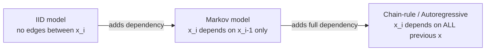
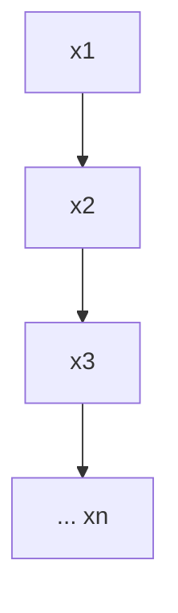
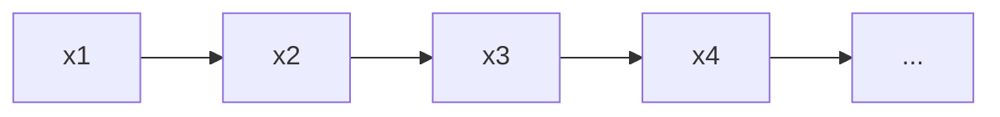
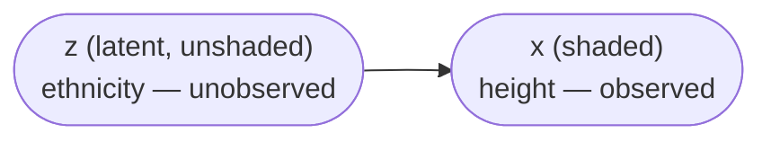
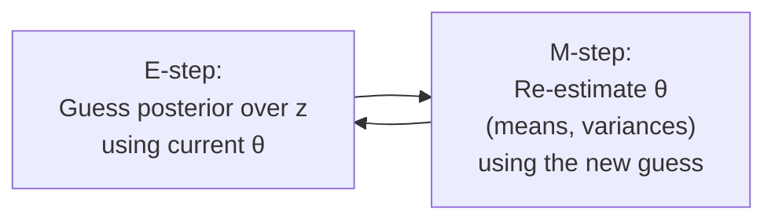
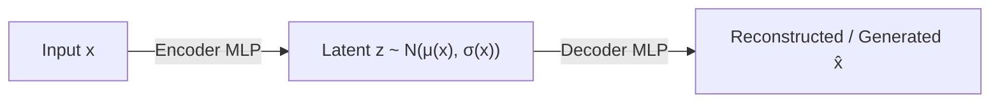
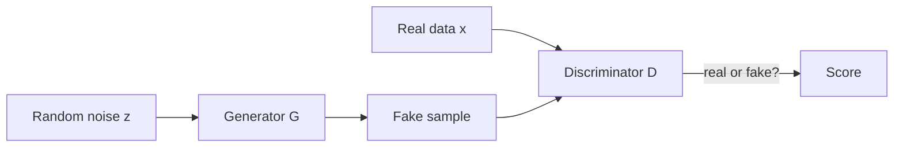
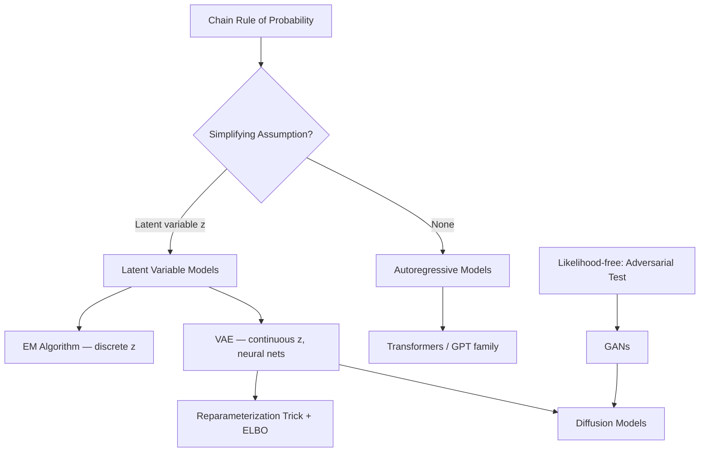

# Lecture 39: Foundations of Generative AI

**Course**: AI for Industrial Cyber-Physical Systems (AI4ICPS) — IIT Kharagpur  
**Duration**: 1:58:42  
**Source**: ai4icps-upskilling.in  

---

## Overview

This lecture builds generative AI from first principles: what actually separates a "generative" model from a "discriminative" one, how probability distributions are factorized and sampled, and how that theory culminates in three classical model families — autoregressive models, Variational Autoencoders (VAEs), and Generative Adversarial Networks (GANs). The instructor deliberately avoids hype, insisting that neural networks are an *implementation detail*, not a prerequisite, for generative modeling.

---

## 1. What Generative AI Actually Means `[8:15 – 19:40]`

### 1.1 The Real Definition (Not "Traditional AI") `[8:15 – 13:00]`

Most people wrongly claim non-generative AI is "traditional AI." The correct distinction is about **what is generated**:

| | Input | Output | Examples |
|---|---|---|---|
| **Discriminative / Prescriptive AI** | Data (complex object) | Label (simple object) | Classification, regression, clustering, anomaly detection |
| **Generative AI** | Label / prompt (simple object) or nothing | Data (complex object) | Image synthesis, text generation |

> **Jargon**: *Discriminative AI* — Any model whose output is a "simple" mathematical object (binary/categorical label, integer, real number). This has existed since the 19th century (e.g., linear regression) — it is **not** a modern or "traditional" concept, it is simply the *other half* of AI.

The distinction is about the **complexity of the output object**, not about the era the technique was invented in.

### 1.2 The Probabilistic Definition `[13:35 – 15:53]`

Data $\mathbf{x}$ is modeled as a random variable from an unknown distribution $P_\theta$. Generative AI has two jobs:

$$\hat\theta = \text{estimate}(\theta) \quad \text{from samples } x_1, x_2, \dots, x_n \sim P_\theta$$

```python
# Pseudocode: the generative modeling loop
samples = collect_data()                  # e.g. heights of people
theta_hat = estimate_parameters(samples)   # e.g. sample mean, sample variance
new_data = sample_from(distribution, theta_hat)  # generate synthetic data
```

> *Example*: Model people's heights as $\mathcal{N}(\mu, \sigma^2)$. Given real height samples, estimate $\hat\mu, \hat\sigma$. Now you can generate synthetic — but plausible — heights forever, without ever repeating a real person's exact height.

> **Jargon**: *IID (Independent and Identically Distributed)* — Every sample comes from the *same* distribution (identical), and knowing one sample tells you nothing about the next (independent). Many real sequences (temperature, language, video) violate this.

---

## 2. Factorizing Joint Distributions `[32:00 – 43:10]`

Generating a complex object (e.g. $n$ words, $n$ pixels) means modeling a huge joint distribution $P(x_1, x_2, \dots, x_n)$. The chain rule of probability always lets us factorize it exactly:

$$P(x_1,\dots,x_n) = P(x_1)\, P(x_2|x_1)\, P(x_3|x_1,x_2) \cdots P(x_n|x_1,\dots,x_{n-1})$$

> *Reads as*: "The probability of the whole sequence equals the probability of the first element, times the probability of the second given the first, times the probability of the third given the first two, and so on."

The problem: the last term needs a *different* distribution for every combination of $x_1 \ldots x_{n-1}$ — for binary variables that's $2^{n-1}$ distributions to store. **This is intractable**, so every generative model is really a strategy for approximating this factorization cheaply.

| Assumption | Rule | Parameter count | Realism |
|---|---|---|---|
| **IID** | $P(x_i\|x_{<i}) \approx P(x_i)$ | Linear, $O(n)$ | Usually false |
| **Markov (order-1)** | $P(x_i\|x_{<i}) \approx P(x_i\|x_{i-1})$ | Linear, $O(n)$ | Approximate |
| **No assumption (chain rule)** | $P(x_i\|x_1,\dots,x_{i-1})$ | Exponential | Exact but infeasible to store |



> **Jargon**: *Conditional Independence* — NOT the same as independence. The Markov assumption says $x_i \perp x_{<i-1} \mid x_{i-1}$ (independent *given* the previous value), whereas IID says $x_i \perp x_j$ unconditionally for all $i \ne j$. The word "conditional" is doing real work here.

### 2.1 Three Equivalent Notations `[38:14 – 43:10]`

Every generative model can be written three interchangeable ways — recognizing all three is essential for reading papers:

1. **Factorization**: $P(x_1,\dots,x_n) = \prod_i P(x_i \mid \text{parents}(x_i))$
2. **Graphical model**: nodes = variables, missing edges = conditional independence, boxed "plate" with $n$ = a for-loop repeated $n$ times
3. **Probabilistic program**: a program with a `sample()` operator that returns a different output every run


*Above: graphical model for a first-order Markov chain — each node only points to the next.*

> **Math Note**: A "plate" notation — a circled variable inside a box labeled *n* — is shorthand for "unroll this structure *n* times." It's a visual for-loop.

---

## 3. Bayes' Rule: Inverting a Generative Model `[43:15 – 49:00]`

**Googly question**: *Can a generative model solve a non-generative (discriminative) task?* Yes — via **Bayes' rule**, arguably the single most important equation in AI:

$$P(y \mid x) = \frac{P(x \mid y)\, P(y)}{P(x)}, \qquad P(x) = \sum_y P(y)\,P(x \mid y)$$

> *Reads as*: "If I have a model of *effects given causes* — $P(x|y)$ — I can invert it into *causes given effects* using the prior $P(y)$ and normalizing."

> *Example*: A generative model of spam vs. non-spam emails specifies $P(\text{words} \mid \text{spam})$ and $P(\text{words} \mid \text{non-spam})$. To *classify* a new email (a discriminative task), apply Bayes' rule to invert it into $P(\text{spam} \mid \text{words})$.

> **Jargon**: *Bayes' Rule* — Converts a "forward" conditional probability into a "backward" one. Named after Thomas Bayes; the instructor jokes it deserves the fame of $E=mc^2$ within AI.

---

## 4. The Required Capabilities of a Generative Model `[49:00 – 53:24]`

A complete generative model class must support four operations:

| Capability | Question it answers | Example |
|---|---|---|
| **Sample** | "Give me a new synthetic data point" | Generate a new face image |
| **Density estimation / scoring** | "How likely is this specific data point under my model?" | Anomaly / fraud score |
| **Inference** | "Given the observed data, what is the hidden/latent cause?" | Given an email, infer its topic |
| **Learning (parameter estimation)** | "Given samples, estimate $\theta$" | Fit $\hat\mu, \hat\sigma$ from data |

Learning is typically done by minimizing **KL divergence** between the true data distribution and the model distribution — which is mathematically equivalent to **maximizing log-likelihood** of the data. This equivalence is *why* "maximize likelihood" is the default training objective across generative AI.

> **Jargon**: *KL Divergence* — A (non-symmetric) measure of how different two probability distributions are. Minimizing it between the real data distribution and your model's distribution is the theoretical justification for maximum-likelihood training.

---

## 5. Traditional vs. Deep Generative Models `[53:35 – 56:23]`

**Googly question**: *Can a "deep" model be non-neural?* Yes — "deep" refers to modeling *complex, compositional distributions*, not to neural networks specifically.

| | Traditional Generative Models | Deep (Neural) Generative Models |
|---|---|---|
| Conditional terms $P(x_i\|\ldots)$ modeled by | Standard distributions (Bernoulli, Gaussian, Poisson, categorical...) | Multi-layer neural networks |
| Expressive power | Limited to the shape of the chosen distribution | Universal approximators — arbitrary conditional shapes |
| Requires | Fewer resources | Scalable optimization + large data + GPUs |

> **Math Note**: A multi-layer neural network can approximate *any* function (and hence any conditional distribution) to arbitrary closeness — this universality is why swapping "standard distribution" → "neural network" inside the factorization is such a leap in power.

### 5.1 Building Complex Distributions from Simple Ones `[59:22 – 1:04:12]`

Two reusable tricks recur throughout generative AI:

1. **Transformation of a random variable**: sample $x \sim \text{simple}$, apply a deterministic function $y = f(x)$ → $y$ follows a new, more complex distribution. Computing the resulting density requires a **Jacobian** term, which is $O(n^3)$ for an $n\times n$ transform — expensive for high-dimensional data.
2. **Mixture models**: combine $k$ simple distributions with weights $\pi_1,\dots,\pi_k$ ($\sum \pi_i = 1$) to create multi-modal shapes a single Gaussian could never represent.

$$P(x) = \sum_{k} \pi_k \, \mathcal{N}(x; \mu_k, \sigma_k^2), \qquad \pi_k > 0,\ \textstyle\sum_k \pi_k = 1$$

> *Example*: Data with 3 peaks (e.g., heights across 3 ethnic groups) cannot be modeled by 1 Gaussian, but mixing 3 Gaussians with $\pi_1=0.5,\pi_2=0.25,\pi_3=0.25$ reproduces the 3-peaked shape exactly.

---

## 6. Autoregressive Models `[1:04:30 – 1:21:09]`

The simplest generative model — just the chain rule, with **no independence assumptions at all**.



### 6.1 Reducing Parameters with Neural Networks `[1:07:11 – 1:14:55]`

Instead of storing an exponential table, make each conditional's parameter a **function** of the history:

$$\rho_i = \sigma(w^T x_{<i} + b) \quad \text{(a perceptron — the Neural Autoregressive Density Estimator, NADE)}$$

Stacking deeper networks (MLPs) increases expressiveness; **Transformers** solve the "growing history" problem via **attention** — learning which past tokens matter most for predicting the next one, instead of treating all history equally.

| Model type | Architecture |
|---|---|
| Encoder-decoder autoregressive | T5, BART |
| Decoder-only autoregressive | GPT family, PaLM, LLaMA, Gemini |

### 6.2 Autoregressive Model Summary `[1:21:09]`

| ✅ Strengths | ❌ Weaknesses |
|---|---|
| No modeling assumptions (exact chain rule) | Requires an artificial *linear ordering* of variables (unnatural for images) |
| Efficient, parallelizable **scoring** | **Sampling is sequential** — must generate $x_1$ before $x_2$, etc. (slow) |
| Exact maximum-likelihood training | Cannot learn unsupervised latent representations |

### 6.3 Real-World Case Study: Natural-Language-to-Database Search `[1:15:10 – 1:21:06]`

A practical illustration of why autoregressive LLMs (e.g. GPT-4) struggle with private, structured data: an LLM can translate a natural-language product query into SQL/SPARQL, but (1) it was never trained on a company's proprietary product catalog, (2) the catalog constantly changes, (3) in-context learning can't fit millions of products into a prompt, and (4) LLMs almost never say "I don't know" — they will confidently return wrong results for products that don't exist. **Evaluating correctness of the generated query is one of the hardest open problems in generative AI.**

---

## 7. Latent Variable Models `[1:21:34 – 1:29:06]`

### 7.1 Motivation `[1:21:45 – 1:25:27]`

Real data often has **unrecorded explanatory variables**. Example: heights $x_i$ were recorded, but ethnicity $z_i$ (a strong correlate of height) was not.



> **Jargon**: *Latent Variable* — A hidden factor that explains structure in the data but was never labeled. Recovering it (without ever seeing ground-truth labels) is called *latent variable inference*.

This is exactly a **Gaussian Mixture Model (GMM)**: $k$ possible latent classes, each with its own Gaussian.

### 7.2 The EM Algorithm `[1:26:07 – 1:29:06]`

Directly computing $P(x)= \sum_z P(x,z)$ makes the log-likelihood **intractable** (a sum/integral trapped inside a $\log$). The **Expectation-Maximization (EM)** algorithm sidesteps this with a "guess and refine" loop:



> *Reads as*: "If I knew everyone's ethnicity, estimating each ethnicity's mean/variance height would be trivial (M-step). If I knew the means/variances, I could re-guess each person's most likely ethnicity (E-step). Neither is known — so alternate until convergence."

> **Jargon**: *EM Algorithm* — An iterative "lower-bound maximization" algorithm with provable convergence *to a local maximum* (not necessarily global). In practice it's run multiple times from different random starting points to avoid bad local maxima.

---

## 8. Variational Autoencoders (VAE) `[1:29:07 – 1:40:29]`

### 8.1 From Finite to Infinite Mixtures `[1:29:15 – 1:30:41]`

A GMM has $k$ discrete latent classes. What if $z$ is a **continuous, real-valued vector** instead? You get an *infinite* mixture of Gaussians — vastly more expressive:

$$z \sim \mathcal{N}(0, I), \qquad x \mid z \sim \mathcal{N}(\mu(z), \sigma(z))$$

### 8.2 The Intractability Problem & Variational Approximation `[1:31:01 – 1:34:16]`

Computing the true posterior $P(z|x)$ requires the same intractable denominator as before. The fix: approximate the true posterior $P$ with a simpler, tractable distribution $Q_\phi$ (the **variational distribution**), and instead of maximizing the exact log-likelihood, maximize a lower bound on it:

$$\log P(x) \;\ge\; \underbrace{\mathbb{E}_{Q_\phi(z|x)}\big[\log P(x|z)\big] - \text{KL}\big(Q_\phi(z|x) \,\|\, P(z)\big)}_{\text{ELBO (Evidence Lower BOund)}}$$

> **Jargon**: *ELBO (Evidence Lower Bound)* — A tractable *lower bound* on the true (intractable) log-likelihood, obtained via Jensen's inequality. The bound becomes tight (an equality) only when $Q_\phi$ exactly equals the true posterior.

### 8.3 The Reparameterization Trick `[1:35:57 – 1:36:59]`

Estimating gradients through a *random sample* $z$ has high variance (Monte-Carlo estimation). The fix: rewrite sampling as a **deterministic function of an independent noise variable**:

$$z = \mu + \sigma \odot \epsilon, \qquad \epsilon \sim \mathcal{N}(0, 1)$$

```python
# Reparameterization trick — makes z differentiable w.r.t. mu and sigma
epsilon = sample_standard_normal()
z = mu + sigma * epsilon    # gradients can now flow through mu, sigma
```

> *Reads as*: "Instead of sampling z directly (non-differentiable), sample fixed noise epsilon and transform it deterministically — now backpropagation works normally."

### 8.4 Where Neural Networks Enter `[1:37:22 – 1:38:44]`

Crucially, **everything above is defined without a single neural network**. Neural networks are plugged in twice, as an *enhancement*:

1. **Decoder**: MLPs model $\mu(z)$ and $\sigma(z)$ (turning latent $z$ into data $x$).
2. **Encoder ("recognition model")**: an MLP models $Q_\phi(z|x)$ directly — shared between training and inference ("amortized" variational inference).



### 8.5 VAE vs. Plain Autoencoder `[1:39:08 – 1:39:42]`

A standard autoencoder is fully **deterministic** (encoder and decoder), so it *cannot generate new samples* — only reconstruct inputs it has seen. A VAE's stochastic latent space is precisely what makes it a true generative model.

### 8.6 VAE Summary `[1:39:54 – 1:40:29]`

| ✅ Strengths | ❌ Weaknesses |
|---|---|
| Learns latent representations unsupervised | Only a *lower bound* on density, not exact |
| Efficient sampling | Learning/optimization is comparatively harder |
| Builds complex distributions from simple ones | Many variants needed (InfoVAE, VAE-RNN, ...) for specific needs |

> Note: DALL·E's original architecture used a VAE for the image component and a Transformer for text.

---

## 9. Generative Adversarial Networks (GAN) `[1:40:48 – 1:47:36]`

### 9.1 Motivation: Likelihood ≠ Quality `[1:40:54 – 1:41:33]`

High likelihood under a model does **not** guarantee visually/semantically good samples. GANs sidestep likelihood entirely, framing generation as a **hypothesis test**: "could these two sets of samples have come from the same distribution?"

### 9.2 The Minimax Game `[1:42:18 – 1:45:12]`

- **Discriminator** $D_\phi$: a classifier trying to tell real samples from generated ("fake") ones.
- **Generator** $G_\theta$: tries to produce samples that *fool* the discriminator.

$$\min_{\theta} \max_{\phi} \; \mathbb{E}_{x\sim P_{\text{data}}}[\log D_\phi(x)] + \mathbb{E}_{z\sim P(z)}[\log(1 - D_\phi(G_\theta(z)))]$$



> *Reads as*: "The discriminator wants to maximize its ability to spot fakes; the generator wants to minimize that same ability. Train both with gradient ascent (D) and gradient descent (G) alternately."

> **Jargon**: *Mode Collapse* — When the generator finds one "cheat" output that reliably fools the discriminator and stops exploring diversity, collapsing to a narrow region of the data distribution.

Again — **no neural network is required by the core GAN definition**. Neural nets are an optional but standard choice for $D_\phi$ and $G_\theta$ (e.g., convolutional nets for images / DCGAN, transformers for text).

### 9.3 GAN Summary `[1:47:09 – 1:47:36]`

| ✅ Strengths | ❌ Weaknesses |
|---|---|
| Likelihood-free — based on a full-sample statistical test | No density/likelihood score available |
| Was SOTA for image generation until ~2021 | Optimization (minimax) is notoriously unstable |
| Extremely fast sampling (single forward pass) | Learning latent representations is not straightforward |

---

## 10. Beyond GANs: A Fast Tour `[1:47:36 – 1:49:22]`

| Model | Core idea | Relation to what we covered |
|---|---|---|
| **Normalizing Flows** | Chain *many* deterministic reparameterization-style transforms | Repeated VAE-style transformation, but stacked many times |
| **Diffusion Models** | Chain many **stochastic** transformations (vs. deterministic in flows) | Powers modern DALL·E, Stable Diffusion |
| **Energy-Based Models** | Use *undirected* graphical models rather than directed ones | Different graph structure altogether |

> **Jargon**: *Diffusion Model* — Learns to reverse a gradual noising process; the key mathematical distinction from normalizing flows is that each step is *stochastic* rather than deterministic.

---

## 11. Evaluating Generative Models `[1:49:28 – 1:50:52]`

Evaluation is one of the field's hardest open problems because there's rarely a single "gold standard" output.

| Axis | Question | Tension |
|---|---|---|
| **Quality** | Are samples likely under the true data distribution? | — |
| **Diversity** | Do samples cover the *whole* distribution, not just one mode? | One perfect cat photo repeated forever ≠ good model |
| **Generalization** | Are outputs genuinely novel, not just memorized training data? | Too much generalization → "hallucination" |

No single metric captures all three simultaneously; rigorous evaluation ultimately needs **expensive, slow, and inconsistent human evaluation**.

---

## Quick Reference: Key Jargon Glossary

| Term | One-Line Definition |
|---|---|
| Discriminative AI | Model whose output is a simple object (label/number) |
| Generative AI | Model whose output is a complex object (image, text, etc.) |
| IID | Samples independent of each other and from the same distribution |
| Markov Assumption | Each variable depends only on the immediately preceding one(s) |
| Conditional Independence | Independence that only holds *given* some other variable |
| Bayes' Rule | Inverts $P(\text{effect}\|\text{cause})$ into $P(\text{cause}\|\text{effect})$ |
| KL Divergence | Measure of distance between two probability distributions |
| Latent Variable | Unobserved factor inferred from observed data |
| EM Algorithm | Iterative guess-and-refine method for latent variable models |
| ELBO | Tractable lower bound on log-likelihood, used to train VAEs |
| Reparameterization Trick | Rewrites random sampling as a deterministic function of fixed noise |
| Mode Collapse | GAN generator collapses to producing low-diversity outputs |
| Autoregressive Model | Generates sequence elements one at a time, conditioned on the past |
| Normalizing Flow | Chain of deterministic transforms turning simple → complex distributions |
| Diffusion Model | Chain of stochastic denoising transforms; powers modern image generators |

---

## Summary



**Key Takeaway**: Generative AI is fundamentally about modeling and sampling from complex probability distributions — every model family (autoregressive, VAE, GAN, diffusion) is a different engineering trade-off for making an otherwise-intractable factorization of the joint distribution tractable to learn and sample from; neural networks make these conditional terms dramatically more expressive, but the underlying probabilistic machinery predates and does not require them.

---

*Notes generated from SRT transcript with timestamps. whisper.cpp (small model, Metal GPU). Enhanced with AI expert annotations.*
