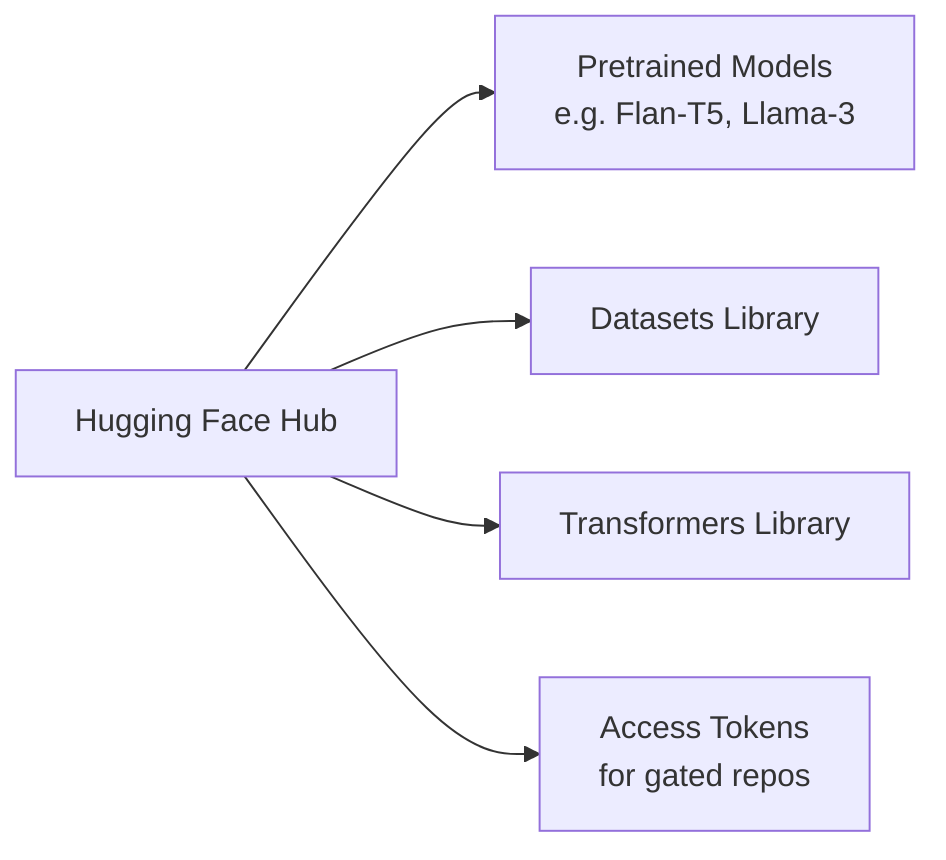
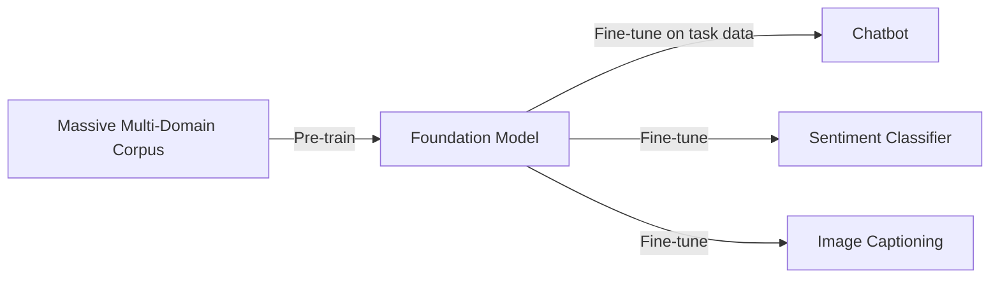
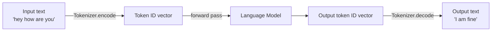
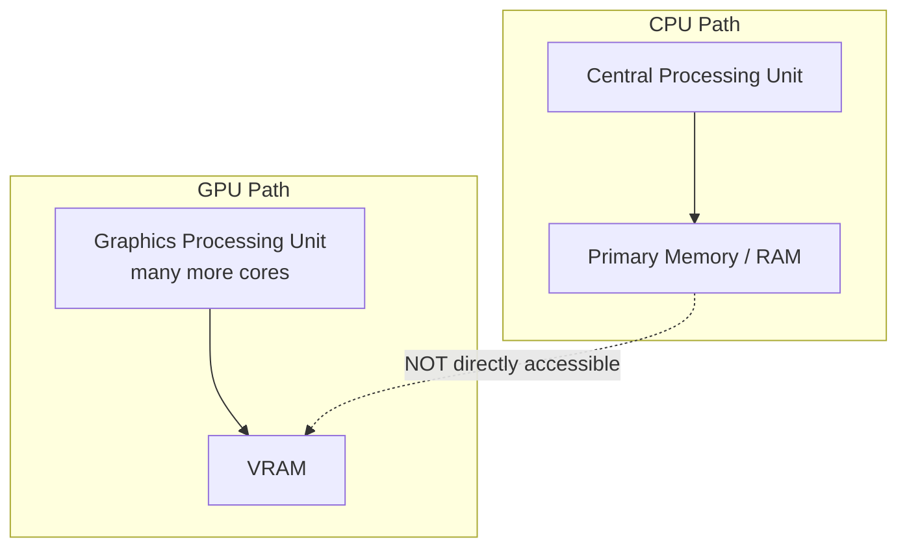
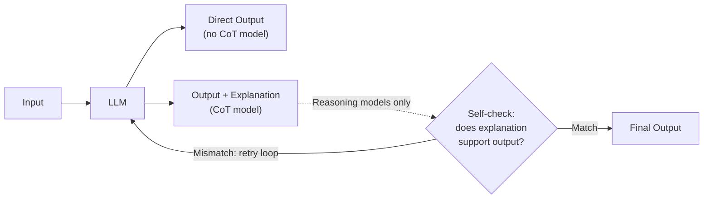
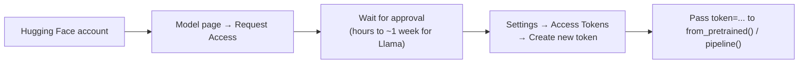
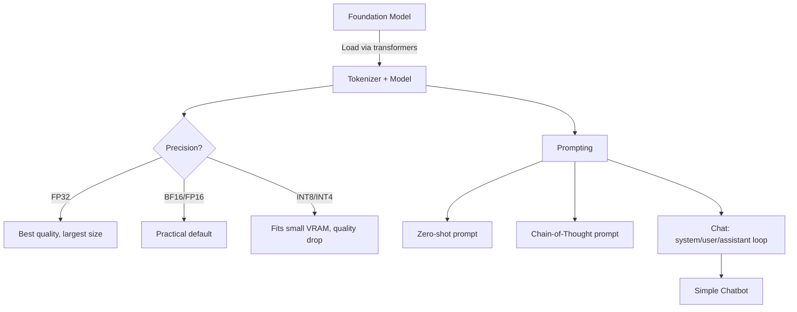

# Lecture 40: LLM Fine-Tuning & Agentic Workflows (Part 1)

**Course**: AI for Industrial Cyber-Physical Systems (AI4ICPS) — IIT Kharagpur  
**Duration**: 1:25:26  
**Source**: ai4icps-upskilling.in  

---

## Overview

This is a hands-on lab (Google Colab + Hugging Face) covering how to load, prompt, and reason about open-source LLMs from the ground up. It walks through the tokenizer → model → detokenizer pipeline, compares a small instruction-tuned model (Flan-T5) against a larger gated chat model (Llama-3-8B-Instruct), and explains the hardware/precision trade-offs (CPU vs. GPU, VRAM, quantization) that determine whether a model will even run on your machine.

---

## 1. Setup: Hugging Face & Course Infrastructure `[0:44 – 3:23]`

**Hugging Face** (`huggingface.co`) is the de-facto hub for open-source LLM infrastructure: pretrained model checkpoints, the `datasets` library, `transformers` library, hosted inference widgets, and **access tokens** for gated/restricted models.

> **Jargon**: *Hugging Face* — A platform + set of Python libraries (`transformers`, `datasets`, `evaluate`) that standardizes downloading, tokenizing, running, and fine-tuning virtually every open-source language/vision model.



---

## 2. Foundation Models vs. Fine-Tuned Models `[4:23 – 8:13]`

| Stage | What happens | Result |
|---|---|---|
| **Pre-training** | Huge multi-domain text corpus + massive compute | **Foundation model** ("vanilla" model) — broad but shallow per-domain knowledge |
| **Fine-tuning** | Take the foundation model + your own task-specific data, retrain (update weights) | **Fine-tuned model** — specialized (chatbot, sentiment classifier, image captioner, etc.) |



> **Jargon**: *Foundation Model* — A large, generally-capable model trained once on diverse data; the expensive "base" that businesses reuse and specialize rather than training from scratch.

Fine-tuning still requires meaningful (if smaller) compute — a recurring theme is that **resource constraints (GPU/VRAM) dictate what's practical**, hence the reliance on Google Colab's free-tier **T4 GPU** throughout this lab.

---

## 3. Prompting Fundamentals `[9:20 – 17:16]`

> **Jargon**: *Prompt* — The natural-language input text given to a model; it represents user intent and has no fixed required format.

### 3.1 The Tokenizer ↔ Model Pipeline `[21:00 – 24:03]`

Language models never see raw text — everything is converted to numeric vectors first.



> **Jargon**: *Tokenizer* — Converts natural language text into a sequence of integer IDs (and back). Each model ships with its **own** tokenizer trained alongside it — you must always pair a model with its matching tokenizer, never mix and match.

### 3.2 First Model: Flan-T5-XL `[11:29 – 21:00]`

- **Flan-T5-XL**: a 3-billion-parameter **sequence-to-sequence**, **instruction-tuned** model (fine-tuned with chain-of-thought examples across many tasks).
- Model family sizes: Small → Large → **XL (3B, used here)** → XXL (~12B).

> **Jargon**: *Parameters* — The learned numeric weights of a neural network; loosely "how big" a model is. More parameters generally → better performance, but at a steep compute/memory cost. Frontier models (GPT-3/4) are estimated in the hundreds of billions to over a trillion.

> **Jargon**: *Instruction-Tuned Model* — A base/foundation model that has been further fine-tuned to follow natural-language instructions (as opposed to just completing text). Almost every model you download from Hugging Face today is instruction-tuned, not raw.

```python
# Loading Flan-T5-XL with its matching tokenizer
from transformers import T5Tokenizer, T5ForConditionalGeneration

tokenizer = T5Tokenizer.from_pretrained("google/flan-t5-xl")
model = T5ForConditionalGeneration.from_pretrained("google/flan-t5-xl", device_map="auto")

input_text = "translate English to German: How old are you?"
input_ids = tokenizer(input_text, return_tensors="pt").input_ids
output_ids = model.generate(input_ids)
print(tokenizer.decode(output_ids[0]))
```

> *Reads as*: "Tokenize the prompt into IDs → feed IDs to the model's `generate()` → decode the output IDs back to text."

### 3.3 CPU vs. GPU: VRAM and the "Same Device" Error `[33:18 – 36:03]`



> **Jargon**: *device_map="auto"* — A `transformers` argument that automatically places model weights on the best available device (GPU if present). **Pitfall**: if the tokenizer's output tensors are quietly left on CPU while the model lives on GPU, you get `"Expected all tensors to be on the same device"` — the fix is moving all tensors to the same device explicitly.

A GPU has far more cores than a CPU, so for LLM inference, always prefer GPU when available.

---

## 4. LLMs Are Bad at Arithmetic (Unless Prompted Well) `[36:37 – 46:58]`

Asking Flan-T5-XL "What is the sum of 19 plus 5?" directly returned **14** (wrong) — LLMs are trained on text statistics, not symbolic math, so they don't "know" what `+` means.

Adding a **chain-of-thought (CoT) instruction** — *"provide a step-by-step explanation"* — corrected the output to 24 (with some noisy intermediate reasoning).

> **Jargon**: *Chain-of-Thought (CoT) Prompting* — Instructing a model to externalize its reasoning steps before answering. It doesn't guarantee correctness but empirically improves accuracy on multi-step problems by decomposing them.

### 4.1 CoT Models vs. Reasoning Models `[43:04 – 47:29]`



| | Chain-of-Thought (CoT) model | Reasoning model |
|---|---|---|
| Behavior | Generates output + a rationale, once | Generates, self-checks, and iterates before finalizing |
| Speed | Faster | Slower (multiple internal passes) |
| Reliability | Lower — no verification loop | Higher — verification loop built in |
| Examples | Flan-T5 (CoT fine-tuned) | OpenAI reasoning models, DeepSeek-R1 |

> **Jargon**: *Reasoning Model* — An LLM architecture/training regime that explicitly generates intermediate reasoning, checks it against the query, and loops until self-satisfied before emitting a final answer — trading latency for reliability.

---

## 5. Gated Models & Access Tokens `[47:30 – 55:04]`

Some model repositories (e.g., Meta's **Llama** family) are **gated**: you must request access and agree to usage terms before downloading.



> **Jargon**: *Gated Repository* — A model repo requiring explicit approval (and a personal access token) before it can be downloaded, typically used for models with usage restrictions (research-only, commercial licensing, etc.).

Models that **don't** require gating/tokens (useful when waiting for Llama approval): **Mistral**, **Zephyr**.

---

## 6. Precision & Quantization: Fitting Models Into Memory `[1:01:06 – 1:09:04]`

Each model parameter is stored as a floating-point number of some **bit-width (precision)**. Lower precision = smaller model = faster but lower quality.

$$\text{Model size (GB)} \approx \text{Parameter count} \times \frac{\text{bits per parameter}}{8 \times 10^9}$$

| Precision | Bits/param | Approx. size for 7B model | Quality impact |
|---|---|---|---|
| FP32 (default trained precision) | 32 | ~28 GB | Best (but rarely necessary) |
| **BF16 / FP16 (half precision)** | 16 | ~14 GB | Negligible quality loss — the practical default |
| **INT8 (quantized)** | 8 | ~7–8 GB | Noticeable quality drop |
| **INT4 (quantized)** | 4 | ~3.5–4 GB | Severe quality drop — avoid unless VRAM is very constrained |

```python
import torch
model = AutoModelForCausalLM.from_pretrained(
    "meta-llama/Meta-Llama-3-8B-Instruct",
    torch_dtype=torch.bfloat16,   # halves memory footprint vs. FP32
    device_map="auto",
    token=hf_access_token,
)
```

```python
from transformers import BitsAndBytesConfig
quant_config = BitsAndBytesConfig(load_in_8bit=True)   # further reduces to ~1/4 of FP32 size
```

> **Jargon**: *Quantization* — Reducing the numeric precision of model weights (e.g., 32-bit → 8-bit) to shrink memory footprint and speed up inference, at the cost of output quality. 16-bit is almost always safe; 4-bit is a last resort.

> **Math Note**: A model **cannot** be split so that its tokenizer runs on CPU while weights run on GPU (no direct CPU RAM ↔ GPU VRAM path) — the entire loaded model+tokenizer pair must live on one contiguous memory space per device.

---

## 7. The `pipeline` Abstraction & Chat Prompt Structure `[57:07 – 1:00:51]`

`pipeline` bundles a tokenizer + model into one callable object — no manual encode/decode needed for common tasks like `"text-generation"`.

```python
from transformers import pipeline

pipe = pipeline(
    task="text-generation",
    model="meta-llama/Meta-Llama-3-8B-Instruct",
    torch_dtype=torch.bfloat16,
    device_map="auto",
    token=hf_access_token,
)
```

### 7.1 The Three-Role Chat Format `[1:14:23 – 1:16:55]`

Modern chat models are trained on a structured 3-role conversation format:

| Role | Meaning |
|---|---|
| **system** | Sets the model's persona / behavior ("You are a friendly travel guide") |
| **user** | The human's message |
| **assistant** | The model's generated response |

```python
chat = [
    {"role": "system", "content": "You are a friendly travel guide."},
    {"role": "user", "content": "Hey, can you tell me fun things to do in New York?"},
]
response = pipe(chat, max_new_tokens=512)
reply = response[0]["generated_text"][-1]["content"]
```

> *Reads as*: "Package the conversation as a list of role-tagged messages; the pipeline appends the model's answer as a new `assistant` message, and you can keep appending `user` turns to continue the conversation."

### 7.2 Building a Minimal Chatbot Loop `[1:22:53 – 1:24:56]`

```python
chat = [{"role": "system", "content": "You are a friendly travel guide."}]

while True:
    user_input = input("You: ")
    if user_input.strip().lower() == "exit":
        break
    chat.append({"role": "user", "content": user_input})
    response = pipe(chat, max_new_tokens=512)
    reply = response[0]["generated_text"][-1]["content"]
    chat.append({"role": "assistant", "content": reply})
    print("Model:", reply)
```

> *Reads as*: "Keep looping: take user input, append it to the running chat history, generate a response conditioned on the *entire* history, append that response too — this growing history is what makes a chat model 'remember' earlier turns."

```mermaid
sequenceDiagram
    participant U as User
    participant C as Chat History (list)
    participant M as Model
    U->>C: append {role: user, content: "..."}
    C->>M: full chat history
    M->>C: append {role: assistant, content: "..."}
    C->>U: print latest assistant reply
    Note over U,C,M: Loop continues until user types "exit"
```

---

## Quick Reference: Key Jargon Glossary

| Term | One-Line Definition |
|---|---|
| Foundation Model | Large model pre-trained on broad, multi-domain data |
| Fine-Tuning | Retraining a foundation model on task-specific data |
| Tokenizer | Converts text ↔ integer token IDs; must match its model |
| Instruction-Tuned Model | Model fine-tuned to follow natural-language instructions |
| Chain-of-Thought (CoT) | Prompting technique asking the model to show its reasoning |
| Reasoning Model | LLM that self-checks/iterates before finalizing an answer |
| Gated Repository | Model requiring approval + access token before download |
| VRAM | GPU's dedicated memory, separate from CPU's system RAM |
| Quantization | Lowering weight precision (32→16→8→4 bit) to save memory |
| `device_map="auto"` | Automatically places model on best available device |
| `pipeline` | Hugging Face wrapper bundling tokenizer + model together |
| System/User/Assistant roles | The 3-part structure of a modern chat prompt |

---

## Summary



**Key Takeaway**: Working with LLMs in practice is as much about *engineering constraints* — matching tokenizers to models, managing CPU/GPU memory, choosing a precision level, and structuring prompts correctly — as it is about model architecture; a well-structured chain-of-thought or chat prompt can dramatically change output quality without changing the model at all.

---

*Notes generated from SRT transcript with timestamps. whisper.cpp (small model, Metal GPU). Enhanced with AI expert annotations.*
