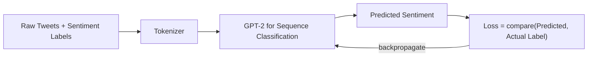
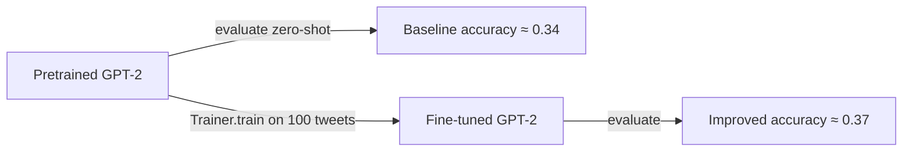
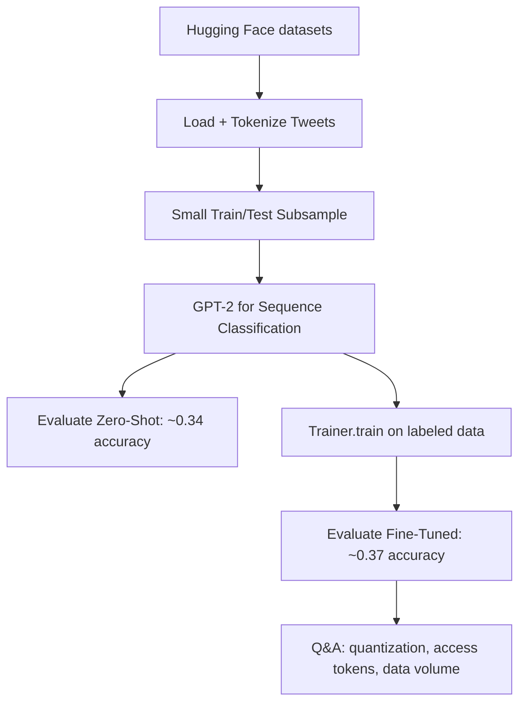

# Lecture 41: LLM Fine-Tuning & Agentic Workflows (Part 2)

**Course**: AI for Industrial Cyber-Physical Systems (AI4ICPS) — IIT Kharagpur  
**Duration**: 19:33  
**Source**: ai4icps-upskilling.in  

---

## Overview

The short continuation of the Part 1 lab: after covering zero-shot prompting and chat pipelines, this session walks through **actually fine-tuning GPT-2** on a sentiment-classification dataset using the Hugging Face `datasets` + `transformers` `Trainer` API, then closes with a rapid-fire Q&A on quantization trade-offs, gated-model access timelines, and how much data fine-tuning really needs.

---

## 1. The `datasets` Library `[0:34 – 2:34]`

> **Jargon**: *`datasets` (Hugging Face library)* — Provides direct, streaming access to thousands of public datasets, plus utilities to load and preprocess your own **local** data into the exact format models expect — removing most manual preprocessing.

```python
from datasets import load_dataset

dataset = load_dataset("mteb/tweet_sentiment_extraction")
df = dataset["train"]      # datasets expose named splits: train / test / validation
```

> *Reads as*: "Give `load_dataset` the name of a dataset hosted on the Hub, and it downloads + structures it into ready-to-use `train`/`test` splits — no manual file parsing needed."

This lecture fine-tunes **GPT-2** (a small, freely available model requiring no gated access) on the `mteb/tweet_sentiment_extraction` dataset — mapping tweets → sentiment labels.



---

## 2. Preparing the Model & Tokenizer `[8:30 – 9:23]`

```python
from transformers import GPT2Tokenizer, GPT2ForSequenceClassification

tokenizer = GPT2Tokenizer.from_pretrained("gpt2")
tokenizer.pad_token = tokenizer.eos_token   # GPT-2 has no pad token by default

def tokenize_fn(examples):
    return tokenizer(examples["text"], truncation=True, padding=True)

tokenized_dataset = dataset.map(tokenize_fn, batched=True)
```

> **Jargon**: *Padding Token* — A filler token used to make all sequences in a batch the same length. GPT-2's vocabulary has no dedicated pad token, so practitioners commonly reuse the *end-of-sequence* (`eos`) token for this purpose.

> **Math Note**: `dataset.map(..., batched=True)` runs tokenization in **batches** rather than one example at a time — batch size and other performance parameters are chosen automatically, giving a substantial speed-up over naive looping.

---

## 3. Train/Test Split & Subsampling `[10:26 – 12:23]`

```python
os.environ["WANDB_DISABLED"] = "true"   # silence experiment-tracking warnings/logging

split = tokenized_dataset["train"].train_test_split(seed=42)
small_train = split["train"].shuffle(seed=42).select(range(100))
small_test  = split["test"].shuffle(seed=42).select(range(100))
```

> *Reads as*: "Split the training data into a new train/test pair, shuffle deterministically (`seed=42` so results are reproducible), then keep only the first 100 rows of each for a quick, low-resource demo."

> **Jargon**: *Random Seed* — A fixed starting value for a pseudo-random number generator, ensuring the "random" shuffle/split is identical every run — essential for reproducible experiments and debugging.

> This 100-row subsample is deliberately tiny (for a free Colab T4 GPU); production fine-tuning would use far more data (the lecture mentions 1,000+ rows as a stronger, still-small, example).

---

## 4. Model, Metric, and Training Arguments `[12:23 – 14:31]`

```python
model = GPT2ForSequenceClassification.from_pretrained("gpt2", num_labels=3)  # e.g. neg/neutral/pos

import evaluate
accuracy_metric = evaluate.load("accuracy")

def compute_metrics(eval_pred):
    logits, labels = eval_pred
    predictions = logits.argmax(axis=-1)
    return accuracy_metric.compute(predictions=predictions, references=labels)
```

```python
from transformers import TrainingArguments, Trainer

training_args = TrainingArguments(
    output_dir="./results",
    per_device_train_batch_size=8,
    per_device_eval_batch_size=8,
    gradient_accumulation_steps=4,   # accumulate grads over 4 steps before an update
    report_to="none",                # disable external logging (e.g. WandB)
)

trainer = Trainer(
    model=model,
    args=training_args,
    train_dataset=small_train,
    eval_dataset=small_test,
    compute_metrics=compute_metrics,
)
```

| Parameter | Role |
|---|---|
| `output_dir` | Where checkpoints/logs are saved |
| `per_device_train/eval_batch_size` | How many examples processed at once per device |
| `gradient_accumulation_steps` | Simulates a larger effective batch size on limited GPU memory by summing gradients over N mini-batches before updating weights |
| `report_to="none"` | Skips third-party experiment trackers (kept simple for the lab) |

> **Jargon**: *Gradient Accumulation* — A technique to train with a large *effective* batch size on a GPU that can't fit it all in memory at once: run several small forward/backward passes, sum their gradients, and only then update the weights.

---

## 5. Evaluate Before & After Fine-Tuning `[14:31 – 17:33]`

```python
baseline = trainer.evaluate()          # accuracy ≈ 0.34 (barely better than random for 3 classes)
trainer.train()                        # fine-tune on the 100-row sample
after   = trainer.evaluate()           # accuracy ≈ 0.37 — a small but real improvement
```

> *Example*: With only 100 training examples, accuracy moved from **0.34 → 0.37**. Small, but directionally correct — the instructor notes that scaling to ~1,000 examples (at the cost of more training time on the free T4 GPU) would likely show a clearer improvement.

> **Jargon**: *Zero-Shot (Baseline) Evaluation* — Measuring a pretrained model's performance on a task **before** any task-specific fine-tuning, used as the reference point to prove that fine-tuning actually helped.



This mirrors real industry use cases: a company with its own labeled data (support tickets, product feedback, translations) can expect the **fine-tuned** model to outperform the **zero-shot base** model on their specific task.

---

## 6. Live Q&A: Practical LLM Engineering `[18:43 – 19:33]`

| Question | Answer |
|---|---|
| Does quantization hurt model quality? | Yes. 16-bit is nearly lossless in practice; 8-bit is usable for constrained VRAM; **4-bit is generally unusable** for serious tasks. |
| How long to get access to a gated model (e.g. Llama-3)? | Varies by model — sometimes hours, up to **~1 week** for Llama family models. |
| Any model with instant/no access-token requirement? | **Mistral** — same-day access. **Zephyr** — no access token needed at all; usable directly via `pipeline`. |
| How much data is "enough" to fine-tune? | No fixed rule — use **as much labeled data as you have and your compute budget allows**; more data + more GPU resources → better results, with no upper limit. |

---

## Quick Reference: Key Jargon Glossary

| Term | One-Line Definition |
|---|---|
| `datasets` library | Hugging Face tool for loading/preprocessing datasets uniformly |
| Padding Token | Filler token making all sequences in a batch equal length |
| Random Seed | Fixed value making "random" operations reproducible |
| `TrainingArguments` | Config object specifying batch size, output dir, logging, etc. |
| `Trainer` | Hugging Face class that runs the training/eval loop for you |
| Gradient Accumulation | Simulating a larger batch size under limited GPU memory |
| Zero-Shot Evaluation | Testing a model on a task with no task-specific fine-tuning |
| Quantization (8-bit / 4-bit) | Lower-precision weights; 4-bit is usually too degraded to use |

---

## Summary



**Key Takeaway**: Fine-tuning even a small open model on a tiny labeled dataset measurably improves task-specific accuracy over the zero-shot baseline — the Hugging Face `datasets` + `Trainer` stack turns what used to be a multi-week custom training pipeline into a few dozen lines of code, provided you're realistic about the GPU/VRAM budget you're working with.

---

*Notes generated from SRT transcript with timestamps. whisper.cpp (small model, Metal GPU). Enhanced with AI expert annotations.*
