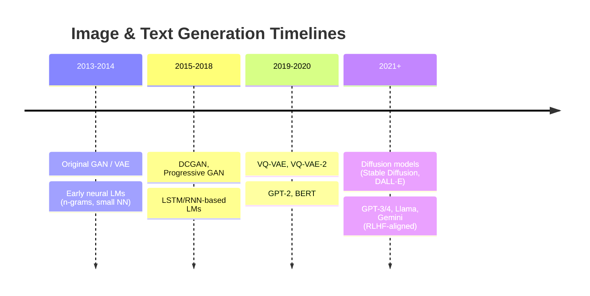
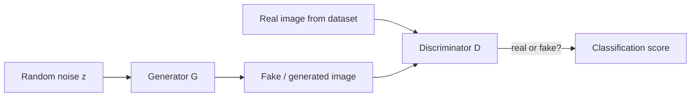
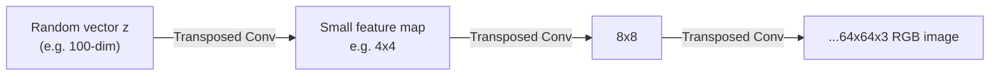
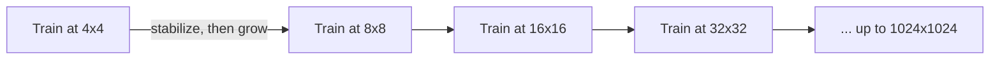
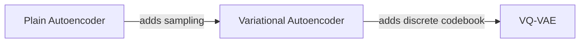
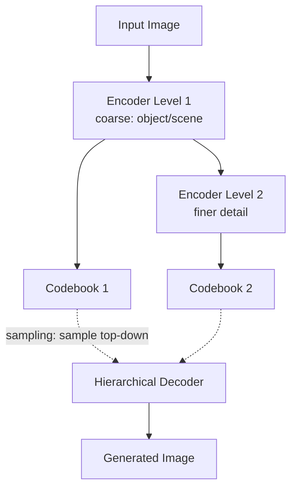
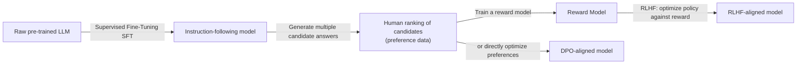
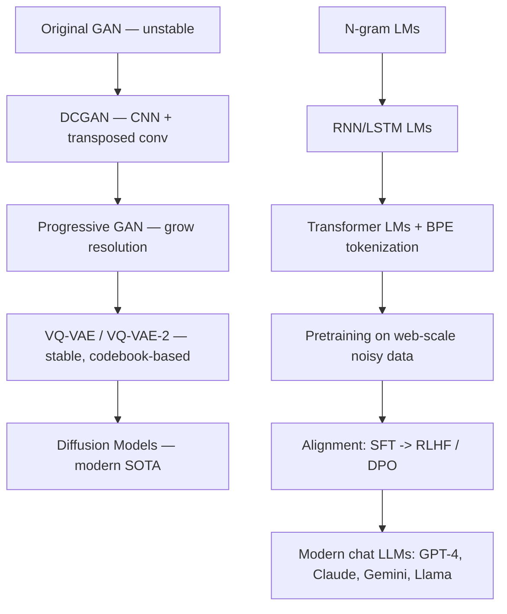

# Lecture 42: Application Lab — Computer Vision, GANs & VAEs (Part 1)

**Course**: AI for Industrial Cyber-Physical Systems (AI4ICPS) — IIT Kharagpur  
**Duration**: 1:14:30  
**Source**: ai4icps-upskilling.in  

---

## Overview

A practitioner-level history lesson on how image-generation models evolved from grainy, unstable early GANs (2014) to today's near-photorealistic systems, and how large language models evolved from n-gram statistics to instruction-following chat assistants. The lecture emphasizes *why* each architectural leap was necessary — instability, resolution limits, tokenization bottlenecks, evaluation gaps, and alignment failures — rather than just listing model names.

---

## 1. Two Parallel Revolutions `[2:00 – 6:44]`

Both image and text generation went through a similar arc: an unstable, low-quality original architecture (~2013–2014) → years of targeted engineering fixes → today's production-grade systems (Midjourney, GPT-4, Claude, Gemini, Llama). Despite the polish, the instructor stresses that **no current system is perfect** — reasoning, mathematical precision, and instruction-following remain open weaknesses.



---

## 2. The Original GAN: Recipe and Failure Modes `[6:50 – 13:33]`

### 2.1 Architecture `[6:50 – 9:16]`



$$\min_{\phi} \max_{\theta} \; \mathbb{E}_{x\sim p_{\text{data}}}[\log D_\theta(x)] + \mathbb{E}_{z\sim p(z)}[\log(1 - D_\theta(G_\phi(z)))]$$

> *Reads as*: "The discriminator's job is to maximize its ability to separate real from fake; the generator's job is to minimize that same score by producing convincing fakes. Both networks can be any architecture matching the input/output dimensions — the original paper used plain feed-forward nets."

### 2.2 Why the Original GAN Was Unstable `[10:35 – 12:32]`

| Failure Mode | Cause |
|---|---|
| **Oscillation** | If D isn't strong enough, G easily fools it; then D "catches up" and the cycle repeats without settling to a good solution |
| **Mode Collapse** | G finds one output (even pure noise) that reliably fools a weak D and stops exploring diversity |
| **Vanishing Gradients** | If D becomes too strong (perfectly separates real/fake), G receives no useful gradient signal at all |
| **Non-realistic fooling** | G can fool D with outputs that don't even look like real images |

> **Jargon**: *Mode Collapse* — The generator converges to producing only one (or very few) types of output because that output already fools the discriminator well enough — diversity in the underlying data distribution is never learned.

Output quality on complex datasets (e.g. CIFAR) was essentially unusable — "a heavy mixture of different pigments" with no recognizable objects.

---

## 3. DCGAN: CNNs + Transposed Convolutions `[13:33 – 20:14]`

### 3.1 Key Fix: Convolutional Generator & Discriminator `[13:33 – 14:36]`

**DCGAN** replaced the plain feed-forward $G$ and $D$ with **CNNs**, exploiting their inductive bias for local-then-global spatial feature extraction, removed fully-connected layers, and added batch normalization for training stability.

### 3.2 The Generator's Dimension Problem `[14:36 – 18:02]`

A discriminator naturally shrinks an image → a score (standard CNN classification). A generator must do the **opposite**: expand a small random vector → a full image. The solution: **transposed convolution** (a.k.a. "fractional striding") — the mathematical inverse of a strided convolution.

| Operation | Effect on spatial size |
|---|---|
| Convolution, stride 1 + padding | Same size |
| Convolution, stride 2 | Shrinks (e.g. 6×6 → 3×3) |
| **Transposed convolution** ("fractional stride") | Grows (e.g. 3×3 → 6×6) — achieved by inserting zero/interpolated gaps between pixels before convolving |

> **Jargon**: *Transposed Convolution (Fractional Striding)* — The inverse operation of a normal strided convolution: instead of skipping pixels while sliding a kernel (shrinking output), you insert spacing between input pixels first, so the kernel's output grows larger than its input. This is how a GAN generator turns a small noise vector into a full-resolution image.



Result: DCGAN produced recognizable multi-object scenes (windows, beds, furniture) — a clear jump over the original GAN, though still not fully photorealistic.

---

## 4. Progressive GAN: Growing Resolution Step-by-Step `[19:03 – 25:56]`

### 4.1 The Idea `[19:03 – 20:14]`

Instead of training a fixed network to jump straight to the target resolution (e.g. 64×64), **train progressively**: start at 4×4, let the network stabilize, then grow to 8×8, 16×16, 32×32, ... up to 1024×1024. This avoids forcing the network to learn all levels of detail simultaneously.



### 4.2 Smooth Layer Transition via Alpha Blending `[20:49 – 24:00]`

Naively bolting on a new, randomly-initialized layer would destroy already-learned weights. The fix: a blending parameter $\alpha$ that gradually shifts weight from a simple upsampled bypass path to the new higher-resolution path.

```python
# Pseudocode: progressive growing transition
low_res_upsampled = nearest_neighbor_upsample(current_output)   # cheap bypass path
high_res_output = new_higher_res_block(current_output)           # new trainable path

blended = (1 - alpha) * low_res_upsampled + alpha * high_res_output
# alpha starts at 0 (pure bypass) and is annealed to 1 (pure new block) during training
```

> *Reads as*: "At the start of growing a new resolution stage, mostly use a cheap interpolation of the old output (alpha≈0) so training doesn't collapse; slowly increase alpha so the new, more detailed layer takes over smoothly."

This directly fixed mode collapse: because complexity is learned incrementally rather than all at once, the network can represent multi-modal, richly detailed distributions instead of collapsing to noise.

**Result**: 1024×1024 photorealistic outputs — a huge jump from the previous 32×32/64×64 ceiling.

---

## 5. VQ-VAE and VQ-VAE-2: A Stabler Alternative `[25:56 – 38:02]`

GANs remained fundamentally unstable and required heavy re-tuning for every new domain (e.g. medical imaging). **VQ-VAE** (Vector-Quantized VAE) offered a much more stable two-generation-old alternative.

### 5.1 From Autoencoder → VAE → VQ-VAE `[26:05 – 30:23]`



| Step | What it adds | Why |
|---|---|---|
| Autoencoder | Encoder → bottleneck representation → Decoder | Learns compression, but is deterministic — **cannot generate new images** at inference |
| VAE | Learns a *distribution* over the latent space instead of a fixed point | Enables sampling new latents → new images |
| **VQ-VAE** | Replaces the continuous Gaussian latent with a discrete **codebook** of learned vectors | Escapes the single-mode limitation of a Gaussian prior; codebook entries are free to be learned, not constrained to any standard distribution shape |

> **Jargon**: *Codebook (Vector Quantization)* — A learned dictionary of embedding vectors. Instead of encoding an image into an arbitrary continuous vector, VQ-VAE snaps ("quantizes") it to the *nearest* vector in this dictionary — giving the model far more representational freedom than a single Gaussian.

### 5.2 The Three-Part VQ-VAE Loss `[29:14 – 32:04]`

$$\mathcal{L} = \underbrace{\|x - \hat{x}\|^2}_{\text{reconstruction}} + \underbrace{\|\text{sg}[z_e(x)] - e\|^2}_{\text{codebook loss}} + \underbrace{\beta\|z_e(x) - \text{sg}[e]\|^2}_{\text{commitment loss}}$$

| Term | Purpose |
|---|---|
| Reconstruction loss | Decoder must be able to rebuild a realistic image from a codebook vector |
| Codebook loss (`sg` = stop-gradient on encoder output) | Pulls codebook vectors toward the encoder's outputs |
| Commitment loss (`sg` = stop-gradient on codebook) | Pulls the encoder's outputs toward the nearest codebook vector, stabilizing training |

> *Reads as*: "Make sure the decoder can turn codes back into images (reconstruction); make the dictionary entries match what the encoder produces (codebook); and make the encoder commit to dictionary entries rather than drifting (commitment)."

> **Math Note**: *Stop-gradient (`sg[·]`)* — Treats its argument as a constant during backpropagation, so gradients only flow to *one side* of a comparison at a time — used here to stabilize the joint optimization of the encoder and the codebook.

Nearest-vector lookup in a codebook of (potentially) millions of entries is a fixed-time operation via optimized vector search — so scaling the codebook size increases model capacity without increasing inference latency.

### 5.3 VQ-VAE-2: Hierarchical Codebooks `[32:31 – 36:25]`

VQ-VAE-2 stacks **multiple levels of encoding**, each with its own codebook — a coarse, low-resolution "what is this scene/object" level, and progressively finer levels adding textures and details.



At sampling time, the encoder is discarded; a new model samples from the **highest-level** (coarsest) codebook first, then samples progressively finer levels conditioned on the coarser choice, before finally decoding to a full image. This hierarchical decomposition let VQ-VAE-2 capture far more visual complexity (background textures, fine detail) than a single-level VQ-VAE.

---

## 6. Evaluating Image-Generation Quality `[36:52 – 38:02]`

Standard error metrics (e.g. Mean Squared Error) work for *large* discrepancies but fail to capture subtle quality differences between very similar images. This motivated model-based metrics:

| Metric | What it captures |
|---|---|
| **FID (Fréchet Inception Distance)** | Statistical distance between real and generated image feature distributions |
| **Inception Score** | How confidently a pretrained classifier recognizes generated images, and how diverse the classifications are |

---

## 7. Language Generation: From N-Grams to Transformers `[38:56 – 45:00]`

### 7.1 Early Language Models `[40:05 – 41:49]`

- **1950s–1980s**: statistical **n-gram** models — hand-designed features, tabular (no neural network at all), fitting $P(\text{next word} \mid \text{last } n{-}1 \text{ words})$.
- Early neural LMs (MLP-based) still used a **fixed, short context window** — could not model long-range dependencies.

> **Jargon**: *N-gram Model* — Predicts the next word using only the previous $n{-}1$ words as context; simple and tabular, but cannot capture long-range dependencies and needs exponentially more storage as $n$ grows.

### 7.2 The Shift to (Near-)Infinite Context `[41:54 – 44:16]`

RNNs/LSTMs, and later **Transformers**, replaced the fixed-window approximation with the **exact chain rule of probability** — no artificial truncation of context:

$$P(w_1, \ldots, w_n) = \prod_{i=1}^n P(w_i \mid w_1, \ldots, w_{i-1})$$

Training objective — unchanged for a decade+ of architecture churn:

$$\mathcal{L} = -\log P(w_{\text{ground truth}} \mid \text{context}) \quad \text{("cross-entropy loss" / maximum likelihood)}$$

> **Math Note**: This is the same *maximum likelihood estimation* principle covered in Lecture 39's autoregressive models section — LLM pretraining is autoregressive generative modeling applied at massive scale.

---

## 8. Tokenization: Solving the Vocabulary Problem `[46:19 – 53:35]`

| Granularity | Pro | Con |
|---|---|---|
| **Whole words** | Short sequences | Unbounded vocabulary → many out-of-vocabulary (OOV) words |
| **Characters** | No OOV problem | Very long sequences → Transformers scale ~quadratically with sequence length, making this prohibitively slow |
| **Subwords / Byte-Pair Encoding (BPE)** | Best of both: common words stay whole, rare/novel words decompose into known pieces, worst case falls back to characters | Slightly more complex to build |

> **Jargon**: *Byte-Pair Encoding (BPE)* — Builds a vocabulary bottom-up: start from individual characters, repeatedly merge the most frequent adjacent pair into a new token, until reaching a target vocabulary size. Frequent whole words end up as single tokens; rare/novel words fall back to subword or character pieces — eliminating the out-of-vocabulary problem entirely.

```python
# Conceptual BPE vocabulary construction
vocab = set(all_characters_in_corpus)
while len(vocab) < target_vocab_size:
    most_frequent_pair = find_most_frequent_adjacent_pair(corpus, vocab)
    vocab.add(merge(most_frequent_pair))
```

Open challenges: choice of training corpus/languages biases which languages tokenize efficiently; vocabulary size trades off sequence length against handling of rare/technical tokens (code, math); and multi-modal tokenizers (image, speech) are an active research area.

---

## 9. Evaluating Language Models `[53:41 – 58:06]`

### 9.1 Perplexity's Limits `[53:41 – 55:58]`

$$\text{Perplexity} = 2^{\text{cross-entropy loss}}$$

Perplexity tracks training progress well but **stops correlating with downstream task quality** once models pass a certain capability threshold (observed clearly beyond GPT-2-era models) — two models with nearly identical perplexity can have dramatically different real-world usefulness.

> **Jargon**: *Perplexity* — An exponentiated cross-entropy loss; intuitively "how surprised the model is, on average, by the real next word." Useful for comparing training runs, but a poor proxy for actual task performance in modern, highly-capable models.

### 9.2 Leaderboard-Based, Human-Mediated Evaluation `[56:04 – 58:06]`

To evaluate real capability, hidden benchmark suites (reasoning, arithmetic, generation quality, etc.) collect **blind, anonymized human comparisons** between candidate model outputs — the human never knows which model produced which answer. A model can visibly improve on one axis (e.g., algebraic reasoning) while regressing on another (e.g., logical reasoning) — motivating today's active alignment research.

---

## 10. Pre-training Data: From Curated Corpora to Web-Scale Crawls `[58:06 – 1:02:12]`

| Era | Data Source | Volume | Cleanliness |
|---|---|---|---|
| BERT / GPT-2 era | Wikipedia, curated book corpora | ~billions of tokens | Clean |
| Modern LLMs | Raw web crawls | ~trillions of tokens | Noisy (HTML/JS remnants, PDF binary headers, code snippets) |

Heuristic filtering (blocklisting bad domains, etc.) works initially but doesn't scale — at trillion-token volumes, over-filtering discards too much data. The consequence of *under*-filtering: base models can output uncontrolled, structurally bizarre completions (HTML fragments, off-topic tangents) because *anything* seen during training has non-zero generation probability.

> *Example*: OpenAI reported that early GPT-3-class base models given the prompt "explain the moon landing to a 6-year-old" would sometimes generate a list of *further questions* instead of an actual explanation — technically plausible text, but not what a user wants.

---

## 11. Post-Training / Alignment `[1:02:12 – 1:09:45]`

Since exhaustively cleaning pre-training data doesn't scale, the field shifted to **fixing the model after pre-training** instead.



### 11.1 Supervised Fine-Tuning (SFT) `[1:03:10 – 1:04:08]`

Fine-tune the raw model on a curated set (tens/hundreds of thousands) of high-quality question–answer pairs. **Limitation**: a model with billions of parameters can simply *memorize* these examples rather than generalizing — and can't cover every possible domain/query type a user might ask.

### 11.2 RLHF (Reinforcement Learning from Human Feedback) `[1:04:21 – 1:07:22]`

1. Generate multiple candidate responses ($A, B, C, D, \ldots$) to the same prompt.
2. Humans **rank** the candidates by quality (preference data).
3. Train a **reward model** to predict this ranking from (prompt, response) pairs.
4. Fine-tune the LLM to maximize the reward model's score, regularized to stay close to the original model:

$$\max_\theta \; \mathbb{E}_{x, y\sim \pi_\theta}\big[R(x,y)\big] - \beta \cdot \text{KL}(\pi_\theta \,\|\, \pi_{\text{ref}})$$

> *Reads as*: "Push the model toward generating higher-reward responses, but penalize it (via the KL term) for straying too far from its original behavior — this prevents it from degenerating into gibberish that merely 'hacks' the reward model."

> **Jargon**: *Reward Model* — A learned scoring function trained on human preference rankings; used as a stand-in for "what humans would rate highly" so the LLM can be optimized against it without needing a human in the loop for every training step.

### 11.3 DPO (Direct Preference Optimization) `[1:07:22 – 1:09:45]`

RLHF's sampling loop is mathematically equivalent to optimizing a fixed loss directly on the preference data — **DPO** exploits this to skip the expensive RL sampling loop entirely:

$$\mathcal{L}_{\text{DPO}} = -\log \sigma\Big(\beta \log\frac{\pi_\theta(y_w|x)}{\pi_{\text{ref}}(y_w|x)} - \beta \log\frac{\pi_\theta(y_l|x)}{\pi_{\text{ref}}(y_l|x)}\Big)$$

> *Reads as*: "Increase the model's relative preference for the winning response $y_w$ over the losing response $y_l$, compared to how the reference model treated them — no reward model or RL sampling loop required."

> **Jargon**: *DPO (Direct Preference Optimization)* — A simplified alignment technique that reformulates RLHF's reward-maximization as a single supervised classification-style loss over preference pairs — faster and simpler to train than full RLHF, at the cost of losing RLHF's more flexible credit-assignment across multi-step reasoning.

---

## 12. Systems Engineering Behind Modern LLMs `[1:09:45 – 1:12:59]`

| Technique | Problem it solves |
|---|---|
| **Multi-GPU / multi-node parallelization** | Models like GPT-4 are too large to fit on even 4 GPUs — require thousands of GPUs networked together |
| **Model parallelism** | Splitting layers of one model across multiple GPUs, complicating the forward pass |
| **Mixed/low precision inference** | Quantizing to 4–8 bit integers so large models fit on a single consumer-grade GPU (e.g., Llama on a 16GB GPU) |
| **FlashAttention** | Optimized attention computation, now near-ubiquitous |
| **LoRA (Low-Rank Adaptation)** | Fine-tunes a small number of extra parameters instead of the whole model — practical when data is limited |
| **Distillation** | Compresses a large "teacher" model's capability into a smaller, cheaper "student" model |

---

## Quick Reference: Key Jargon Glossary

| Term | One-Line Definition |
|---|---|
| Mode Collapse | GAN generator produces low-diversity outputs that still fool the discriminator |
| Transposed Convolution | Inverse of strided convolution; expands rather than shrinks spatial size |
| Progressive GAN | Trains a GAN by growing image resolution step by step |
| Codebook (VQ-VAE) | Learned discrete dictionary of latent vectors, replacing a continuous Gaussian prior |
| Stop-Gradient | Treats a term as constant during backprop, updating only the other side |
| VQ-VAE-2 | Hierarchical VQ-VAE with multiple levels of codebooks for coarse-to-fine detail |
| FID / Inception Score | Model-based metrics for image-generation quality beyond pixel-wise error |
| N-gram Model | Predicts next word from a fixed-size window of previous words |
| Byte-Pair Encoding (BPE) | Subword tokenization eliminating out-of-vocabulary issues |
| Perplexity | Exponentiated cross-entropy; a training-quality metric, weak downstream-quality proxy |
| SFT | Fine-tuning on curated high-quality (prompt, response) pairs |
| RLHF | Aligning a model using a reward model trained on human preference rankings |
| DPO | Direct, sampling-free alternative to RLHF using preference pairs |
| LoRA | Efficient fine-tuning method updating only a small set of extra parameters |
| Distillation | Compressing a large model's behavior into a smaller model |

---

## Summary



**Key Takeaway**: Both image-generation and language-generation systems reached their current quality not through a single breakthrough, but through a long chain of targeted fixes — stabilizing training, scaling resolution/context, solving tokenization/vocabulary limits, and aligning raw statistical models to human preferences — and each of those fixes is a reusable engineering pattern applicable well beyond the specific model it was invented for.

---

*Notes generated from SRT transcript with timestamps. whisper.cpp (small model, Metal GPU). Enhanced with AI expert annotations.*
