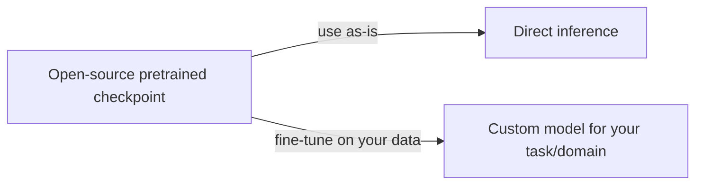
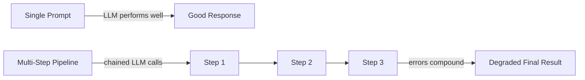
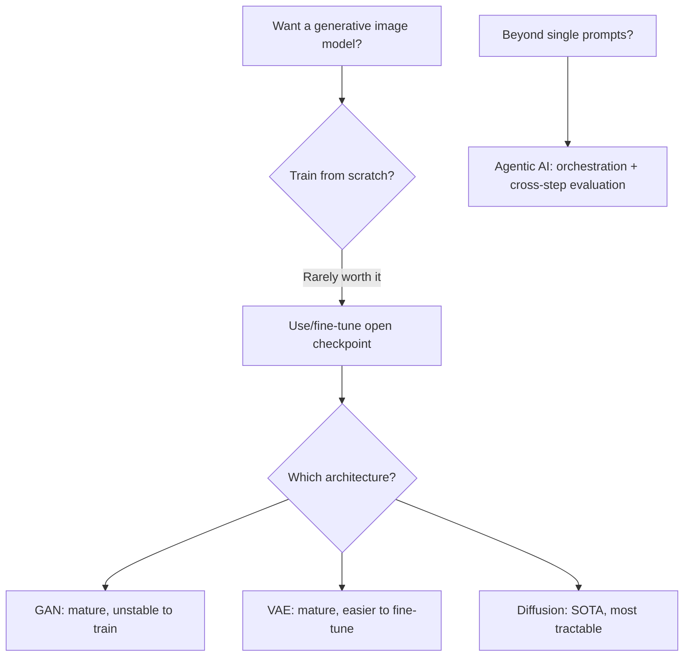

# Lecture 43: Application Lab — Computer Vision, GANs & VAEs (Part 2)

**Course**: AI for Industrial Cyber-Physical Systems (AI4ICPS) — IIT Kharagpur  
**Duration**: 4:31  
**Source**: ai4icps-upskilling.in  

---

## Overview

A short closing Q&A directly following Part 1's history of GANs, VAEs, and LLMs. The instructor gives practical guidance on building your own generative model, ranks GAN vs. VAE vs. diffusion models for real projects, and previews agentic AI as the "next hard problem" beyond single-prompt LLM performance.

---

## 1. Can You Build Your Own Generative Image Model? `[0:51 – 1:44]`

**Yes — but rarely from scratch.** Matching the quality of commercial systems like Midjourney requires extensive architecture tuning and enormous training data most practitioners don't have access to. The realistic path:

> **Jargon**: *Checkpoint* — A saved snapshot of a trained model's weights at a point in time; open-source "checkpoints" for GANs, VAEs, and diffusion models are freely downloadable and serve as a starting point for fine-tuning, avoiding training from scratch.

---

## 2. GAN vs. VAE vs. Diffusion — Which to Choose? `[1:44 – 2:54]`

| Model | Maturity today | Training stability | Best for |
|---|---|---|---|
| **GAN** | Many large-scale variants exist (e.g. NVIDIA's) | Least stable — prone to mode collapse, oscillation | Fast sampling once trained; use as a black box |
| **VAE** | Equally capable at scale | More stable, easier to fine-tune/train yourself | When you need to actually train/adapt the model |
| **Diffusion** | Newest, highest achievable fidelity, scales furthest | Most tractable to fine-tune among the three | State-of-the-art image quality; current default choice |

> *Reads as*: "If you just want to use a pretrained model as-is, GANs and VAEs are both mature and capable. If you plan to train or fine-tune it yourself, ranked easiest-to-hardest: **diffusion > VAE > GAN** — GANs are the least forgiving to work with directly."

---

## 3. Agentic AI: The Next Frontier `[3:02 – 4:19]`

**Agentic AI** development is fundamentally different from the evolution of LLMs themselves, and was intentionally out of scope for the course due to time constraints.

> **Jargon**: *Agentic AI* — Systems that use an LLM as one component within a larger pipeline of orchestrated steps (planning, tool use, self-evaluation) to solve multi-step tasks, rather than answering a single prompt in isolation.

### 3.1 Why Agentic Systems Are Hard `[3:40 – 4:07]`

An LLM can produce an excellent response to **one** well-formed prompt, but chaining multiple LLM calls together (as agentic pipelines require) causes performance to degrade — the model has no way to evaluate its own accuracy *across* steps, only within a single prompt/response exchange.

### 3.2 Open Research Questions `[3:29 – 4:07]`

- **Orchestration**: how do you sequence/coordinate the steps needed to solve a complex task?
- **Cross-step evaluation**: since a single LLM call can't judge multi-step correctness, systems need additional evaluation metrics injected *between* steps.
- **Multi-agent pipelines**: introducing multiple specialized agents, each responsible for part of the task, with evaluation built into the intermediate hand-offs.

> **Jargon**: *Orchestration (in agentic AI)* — The logic that decides which step/tool/agent runs next, in what order, and how outputs from one step feed into the next — the central design challenge of building reliable agentic systems.

---

## Quick Reference: Key Jargon Glossary

| Term | One-Line Definition |
|---|---|
| Checkpoint | A saved snapshot of pretrained model weights, reusable/fine-tunable |
| Agentic AI | LLM-based systems that orchestrate multi-step pipelines, not single prompts |
| Orchestration | Logic controlling step/tool/agent sequencing in an agentic pipeline |
| Cross-step Evaluation | Judging correctness across a multi-step pipeline, not just one prompt |

---

## Summary

**Key Takeaway**: For practical generative-image work, fine-tuning an existing open checkpoint (preferring diffusion or VAE architectures for trainability) beats training from scratch; and the next major challenge in applied generative AI isn't a single model's quality but **reliably orchestrating and evaluating multi-step agentic pipelines** built on top of these models.

---

*Notes generated from SRT transcript with timestamps. whisper.cpp (small model, Metal GPU). Enhanced with AI expert annotations.*
